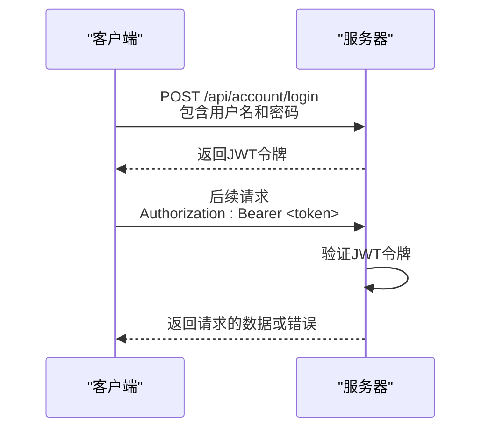

# API文档

<cite>
**本文档引用的文件**
- [account.controller.ts](file://agx-backend/src/modules/account/account.controller.ts)
- [market.controller.ts](file://agx-backend/src/modules/market/market.controller.ts)
- [admin.controller.ts](file://agx-backend/src/modules/admin/admin.controller.ts)
- [api-response.dto.ts](file://agx-backend/src/common/dto/api-response.dto.ts)
- [jwt-auth.guard.ts](file://agx-backend/src/modules/auth/jwt-auth.guard.ts)
- [index.js](file://agx-admin/src/api/agx/index.js)
- [login.js](file://agx-admin/src/api/login.js)
- [account.js](file://h5/src/api/account.js)
- [market.js](file://h5/src/api/market.js)
- [main.ts](file://agx-backend/src/main.ts)
</cite>

## 目录
1. [简介](#简介)
2. [认证机制](#认证机制)
3. [RESTful API](#restful-api)
   1. [账户服务](#账户服务)
   2. [行情服务](#行情服务)
   3. [管理服务](#管理服务)
4. [WebSocket API](#websocket-api)
5. [客户端实现指南](#客户端实现指南)
6. [错误码](#错误码)
7. [速率限制](#速率限制)
8. [版本控制](#版本控制)
9. [常见操作示例](#常见操作示例)

## 简介
本API文档全面覆盖agx-backend暴露的所有公共接口，为开发者提供完整的接口参考和使用指南。文档基于后端控制器（如account.controller.ts, market.controller.ts）和前端调用示例（agx-admin/src/api, h5/src/api）编写，确保信息的准确性和实用性。

**本文档引用的文件**
- [main.ts](file://agx-backend/src/main.ts#L1-L39)
- [account.controller.ts](file://agx-backend/src/modules/account/account.controller.ts#L1-L160)

## 认证机制
系统采用JWT（JSON Web Token）进行身份认证和授权。所有需要认证的API端点都要求在HTTP请求头中包含有效的JWT令牌。

### 认证流程
1. 用户通过`/api/account/login`端点进行登录，提供用户名和密码
2. 服务器验证凭据，成功后返回包含JWT令牌的响应
3. 客户端在后续请求中将JWT令牌放入`Authorization`头，格式为`Bearer <token>`
4. 服务器验证令牌的有效性，允许或拒绝访问

### 权限级别
系统定义了两种主要的权限级别：
- **用户权限**：普通用户权限，通过`JwtAuthGuard`守卫验证
- **管理员权限**：管理员专用权限，通过`AdminGuard`守卫验证，要求用户类型为"admin"



**图表来源**
- [account.controller.ts](file://agx-backend/src/modules/account/account.controller.ts#L25-L29)
- [jwt-auth.guard.ts](file://agx-backend/src/modules/auth/jwt-auth.guard.ts#L5-L38)

**本节来源**
- [account.controller.ts](file://agx-backend/src/modules/account/account.controller.ts#L25-L29)
- [jwt-auth.guard.ts](file://agx-backend/src/modules/auth/jwt-auth.guard.ts#L5-L38)

## RESTful API

### 账户服务
账户服务提供用户注册、登录、个人信息管理、资产操作等功能。

#### 用户注册
- **HTTP方法**: POST
- **URL路径**: `/api/account/register`
- **认证方式**: 无需认证
- **请求体**:
  ```json
  {
    "username": "string",
    "password": "string",
    "inviteCode": "string"
  }
  ```
- **响应格式**:
  ```json
  {
    "code": 0,
    "msg": "ok",
    "data": {
      "id": 1,
      "username": "string",
      "token": "string"
    }
  }
  ```

#### 用户登录
- **HTTP方法**: POST
- **URL路径**: `/api/account/login`
- **认证方式**: 无需认证
- **请求体**:
  ```json
  {
    "username": "string",
    "password": "string"
  }
  ```
- **响应格式**:
  ```json
  {
    "code": 0,
    "msg": "ok",
    "data": {
      "id": 1,
      "username": "string",
      "token": "string"
    }
  }
  ```

#### 获取用户信息
- **HTTP方法**: GET
- **URL路径**: `/api/account/profile`
- **认证方式**: JWT
- **响应格式**:
  ```json
  {
    "code": 0,
    "msg": "ok",
    "data": {
      "id": 1,
      "username": "string",
      "email": "string",
      "avatar": "string",
      "createdAt": "datetime"
    }
  }
  ```

#### 获取用户余额
- **HTTP方法**: GET
- **URL路径**: `/api/account/balance`
- **认证方式**: JWT
- **响应格式**:
  ```json
  {
    "code": 0,
    "msg": "ok",
    "data": [
      {
        "currency": "USDT",
        "balance": "100.00",
        "available": "90.00",
        "frozen": "10.00"
      }
    ]
  }
  ```

#### 修改密码
- **HTTP方法**: POST
- **URL路径**: `/api/account/password`
- **认证方式**: JWT
- **请求体**:
  ```json
  {
    "oldPassword": "string",
    "newPassword": "string"
  }
  ```
- **响应格式**:
  ```json
  {
    "code": 0,
    "msg": "ok",
    "data": null
  }
  ```

#### 提交KYC认证
- **HTTP方法**: POST
- **URL路径**: `/api/account/kyc`
- **认证方式**: JWT
- **请求体**:
  ```json
  {
    "realName": "string",
    "idCard": "string",
    "frontImage": "string",
    "backImage": "string"
  }
  ```
- **响应格式**:
  ```json
  {
    "code": 0,
    "msg": "ok",
    "data": null
  }
  ```

#### 获取充值地址
- **HTTP方法**: GET
- **URL路径**: `/api/account/deposit/address`
- **认证方式**: JWT
- **查询参数**: `coin` (币种代码)
- **响应格式**:
  ```json
  {
    "code": 0,
    "msg": "ok",
    "data": {
      "address": "string",
      "memo": "string"
    }
  }
  ```

#### 申请提现
- **HTTP方法**: POST
- **URL路径**: `/api/account/withdraw`
- **认证方式**: JWT
- **请求体**:
  ```json
  {
    "coin": "string",
    "amount": "string",
    "address": "string",
    "memo": "string"
  }
  ```
- **响应格式**:
  ```json
  {
    "code": 0,
    "msg": "ok",
    "data": {
      "id": 1,
      "status": "pending"
    }
  }
  ```

**本节来源**
- [account.controller.ts](file://agx-backend/src/modules/account/account.controller.ts#L16-L159)

### 行情服务
行情服务提供多资产行情数据，包括数字货币、股票、外汇等。

#### 获取行情列表
- **HTTP方法**: GET
- **URL路径**: `/api/market/tickers`
- **认证方式**: 无需认证
- **查询参数**:
  - `type`: 资产类型 (crypto, stock, forex, metal)
  - `tab`: 分类 (all, gainers, losers)
- **响应格式**:
  ```json
  {
    "code": 0,
    "msg": "ok",
    "data": {
      "list": [
        {
          "symbol": "BTCUSDT",
          "price": "45000.00",
          "change": "2.5",
          "volume": "1000000"
        }
      ]
    }
  }
  ```

#### 获取单个行情
- **HTTP方法**: GET
- **URL路径**: `/api/market/ticker/:symbol`
- **认证方式**: 无需认证
- **路径参数**: `symbol` (交易对符号)
- **响应格式**:
  ```json
  {
    "code": 0,
    "msg": "ok",
    "data": {
      "symbol": "BTCUSDT",
      "price": "45000.00",
      "open": "44000.00",
      "high": "46000.00",
      "low": "43000.00",
      "volume": "1000000"
    }
  }
  ```

#### 获取K线数据
- **HTTP方法**: GET
- **URL路径**: `/api/market/klines`
- **认证方式**: 无需认证
- **查询参数**:
  - `symbol`: 交易对符号
  - `interval`: 时间间隔 (1m, 5m, 1h, 1d)
  - `limit`: 数据条数 (默认100)
- **响应格式**:
  ```json
  {
    "code": 0,
    "msg": "ok",
    "data": {
      "klines": [
        {
          "time": "2023-01-01T00:00:00Z",
          "open": "44000.00",
          "high": "45000.00",
          "low": "43000.00",
          "close": "45000.00",
          "volume": "1000"
        }
      ]
    }
  }
  ```

#### 获取资产配置列表
- **HTTP方法**: GET
- **URL路径**: `/api/market/assets`
- **认证方式**: 无需认证
- **查询参数**: `type` (资产类型)
- **响应格式**:
  ```json
  {
    "code": 0,
    "msg": "ok",
    "data": {
      "list": [
        {
          "code": "BTC",
          "name": "比特币",
          "icon": "string"
        }
      ]
    }
  }
  ```

**本节来源**
- [market.controller.ts](file://agx-backend/src/modules/market/market.controller.ts#L16-L58)

### 管理服务
管理服务提供后台管理功能，仅限管理员访问。

#### 管理员登录
- **HTTP方法**: POST
- **URL路径**: `/api/admin/login`
- **认证方式**: 无需认证
- **请求体**:
  ```json
  {
    "username": "string",
    "password": "string"
  }
  ```
- **响应格式**:
  ```json
  {
    "code": 0,
    "msg": "ok",
    "data": {
      "id": 1,
      "username": "string",
      "token": "string"
    }
  }
  ```

#### 获取用户列表
- **HTTP方法**: GET
- **URL路径**: `/api/admin/user/list`
- **认证方式**: JWT (管理员)
- **查询参数**: 分页和筛选参数
- **响应格式**:
  ```json
  {
    "code": 0,
    "msg": "ok",
    "data": {
      "list": [
        {
          "id": 1,
          "username": "string",
          "email": "string",
          "status": "active",
          "createdAt": "datetime"
        }
      ],
      "total": 100
    }
  }
  ```

#### 更新用户状态
- **HTTP方法**: PUT
- **URL路径**: `/api/admin/user/:id/status`
- **认证方式**: JWT (管理员)
- **路径参数**: `id` (用户ID)
- **请求体**:
  ```json
  {
    "status": "active|disabled|banned"
  }
  ```
- **响应格式**:
  ```json
  {
    "code": 0,
    "msg": "ok",
    "data": null
  }
  ```

#### 获取币种列表
- **HTTP方法**: GET
- **URL路径**: `/api/admin/currency/list`
- **认证方式**: JWT (管理员)
- **查询参数**: 分页和筛选参数
- **响应格式**:
  ```json
  {
    "code": 0,
    "msg": "ok",
    "data": {
      "list": [
        {
          "id": 1,
          "code": "USDT",
          "name": "泰达币",
          "type": "crypto",
          "status": "active"
        }
      ],
      "total": 10
    }
  }
  ```

#### 新增币种
- **HTTP方法**: POST
- **URL路径**: `/api/admin/currency`
- **认证方式**: JWT (管理员)
- **请求体**:
  ```json
  {
    "code": "string",
    "name": "string",
    "type": "crypto|fiat",
    "icon": "string",
    "precision": 6
  }
  ```
- **响应格式**:
  ```json
  {
    "code": 0,
    "msg": "ok",
    "data": {
      "id": 1
    }
  }
  ```

#### 获取仪表盘统计
- **HTTP方法**: GET
- **URL路径**: `/api/admin/dashboard/stats`
- **认证方式**: JWT (管理员)
- **响应格式**:
  ```json
  {
    "code": 0,
    "msg": "ok",
    "data": {
      "totalUsers": 1000,
      "activeUsers": 800,
      "totalAssets": "1000000.00",
      "todayRecharge": "50000.00",
      "todayWithdraw": "30000.00"
    }
  }
  ```

**本节来源**
- [admin.controller.ts](file://agx-backend/src/modules/admin/admin.controller.ts#L40-L363)

## WebSocket API
系统提供WebSocket API用于实时数据推送，如市场行情更新。

### 连接URL
```
wss://your-domain.com/api/ws/market
```

### 消息格式
所有消息都采用JSON格式，包含`type`字段标识消息类型。

#### 订阅消息
客户端发送订阅消息以接收特定数据：
```json
{
  "type": "subscribe",
  "data": {
    "channel": "ticker",
    "symbol": "BTCUSDT"
  }
}
```

#### 取消订阅消息
客户端发送取消订阅消息以停止接收数据：
```json
{
  "type": "unsubscribe",
  "data": {
    "channel": "ticker",
    "symbol": "BTCUSDT"
  }
}
```

#### 服务器推送消息
服务器向客户端推送实时数据：
```json
{
  "type": "ticker",
  "data": {
    "symbol": "BTCUSDT",
    "price": "45000.00",
    "change": "2.5"
  }
}
```

### 事件类型
- `ticker`: 行情更新
- `kline`: K线数据更新
- `orderbook`: 订单簿更新
- `trade`: 成交记录更新

### 订阅/取消订阅机制
1. 客户端建立WebSocket连接
2. 发送`subscribe`消息指定要订阅的频道和参数
3. 服务器开始推送相关数据
4. 客户端发送`unsubscribe`消息停止接收数据
5. 服务器停止推送并释放资源

**本节来源**
- [main.ts](file://agx-backend/src/main.ts#L9-L14)
- [market.controller.ts](file://agx-backend/src/modules/market/market.controller.ts#L16-L58)

## 客户端实现指南
本节提供客户端实现的详细指南，包括不同平台的调用示例。

### agx-admin前端调用示例
```javascript
// 获取用户列表
import api from '@/api/agx/index.js'

api.getUserList({ page: 1, limit: 10 }).then(response => {
  console.log(response.data.list)
})

// 更新用户状态
api.updateUserStatus(1, { status: 'disabled' }).then(response => {
  console.log('用户状态已更新')
})
```

### h5移动端调用示例
```javascript
// 用户登录
import { accountApi } from '@/api/account.js'

accountApi.login({
  username: 'user123',
  password: 'password123'
}).then(response => {
  const { token } = response.data
  // 保存token用于后续请求
  localStorage.setItem('token', token)
})

// 获取行情数据
import { marketApi } from '@/api/market.js'

marketApi.getTickers({ type: 'crypto' }).then(response => {
  console.log(response.data.list)
})
```

### 通用请求配置
```javascript
// 请求拦截器
axios.interceptors.request.use(config => {
  const token = localStorage.getItem('token')
  if (token) {
    config.headers.Authorization = `Bearer ${token}`
  }
  return config
})

// 响应拦截器
axios.interceptors.response.use(
  response => response,
  error => {
    if (error.response?.status === 401) {
      // Token过期或无效，跳转到登录页
      localStorage.removeItem('token')
      window.location.href = '/login'
    }
    return Promise.reject(error)
  }
)
```

**本节来源**
- [index.js](file://agx-admin/src/api/agx/index.js#L1-L445)
- [account.js](file://h5/src/api/account.js#L1-L6)
- [market.js](file://h5/src/api/market.js#L1-L6)

## 错误码
系统使用统一的错误码机制，所有API响应都遵循相同的格式。

### 统一响应格式
```json
{
  "code": 0,
  "msg": "ok",
  "data": {}
}
```

### 错误码列表
| 错误码 | 说明 | HTTP状态码 |
|-------|------|----------|
| 0 | 成功 | 200 |
| 1001 | 参数错误 | 400 |
| 1002 | 未登录 | 401 |
| 1003 | Token过期 | 401 |
| 1004 | 无权限 | 403 |
| 2001 | 用户不存在 | 404 |
| 2002 | 密码错误 | 401 |
| 2003 | 账号已存在 | 409 |
| 2006 | 邀请码无效 | 400 |
| 5001 | 管理员不存在 | 404 |
| 5002 | 管理员密码错误 | 401 |
| 5003 | 币种代码已存在 | 409 |
| 5004 | 币种不存在 | 404 |

### 错误处理建议
1. 对于401错误（未登录或Token过期），应引导用户重新登录
2. 对于403错误（无权限），应提示用户权限不足
3. 对于400错误（参数错误），应检查请求参数是否正确
4. 对于其他错误，应记录日志并提示用户操作失败

**本节来源**
- [api-response.dto.ts](file://agx-backend/src/common/dto/api-response.dto.ts#L27-L67)

## 速率限制
为防止滥用和确保系统稳定性，API实施了速率限制策略。

### 限制规则
- **公共API**: 每分钟最多100次请求
- **认证API**: 每分钟最多200次请求
- **管理员API**: 每分钟最多50次请求

### 速率限制头
响应头中包含速率限制信息：
- `X-RateLimit-Limit`: 限制总数
- `X-RateLimit-Remaining`: 剩余请求数
- `X-RateLimit-Reset`: 重置时间（UTC秒）

### 超限处理
当请求超过限制时，服务器返回429状态码：
```json
{
  "code": 429,
  "msg": "请求过于频繁，请稍后再试",
  "data": null
}
```

客户端应实现退避重试机制：
```javascript
async function requestWithRetry(url, options, maxRetries = 3) {
  for (let i = 0; i < maxRetries; i++) {
    try {
      return await fetch(url, options)
    } catch (error) {
      if (error.response?.status === 429 && i < maxRetries - 1) {
        // 计算重试延迟
        const resetTime = error.response.headers.get('X-RateLimit-Reset')
        const delay = Math.max(1000, resetTime - Date.now() / 1000)
        await new Promise(resolve => setTimeout(resolve, delay))
        continue
      }
      throw error
    }
  }
}
```

**本节来源**
- [main.ts](file://agx-backend/src/main.ts#L9-L14)
- [account.controller.ts](file://agx-backend/src/modules/account/account.controller.ts#L16-L159)

## 版本控制
API采用URL路径进行版本控制，确保向后兼容性。

### 版本策略
- 当前版本: `v1`
- 版本路径: `/api/v1/...`
- 旧版本至少维护6个月
- 重大变更提前30天通知

### 版本迁移
```javascript
// v1版本（当前）
const API_BASE = '/api/v1'

// 将来可能的v2版本
// const API_BASE = '/api/v2'
```

### 弃用通知
在API文档中明确标注即将弃用的端点：
```typescript
/**
 * @deprecated 使用 /api/v1/account/profile 替代
 * @since v1.5.0
 * @will-remove v2.0.0
 */
@Get('user/info')
@UseGuards(JwtAuthGuard)
async getUserInfo(@CurrentUser('id') userId: number) {
  return this.accountService.getProfile(userId)
}
```

**本节来源**
- [account.controller.ts](file://agx-backend/src/modules/account/account.controller.ts#L8-L159)
- [market.controller.ts](file://agx-backend/src/modules/market/market.controller.ts#L8-L58)

## 常见操作示例
本节提供常见操作的完整示例，帮助开发者快速上手。

### 用户登录流程
```javascript
// 1. 用户登录
accountApi.login({
  username: 'user123',
  password: 'password123'
}).then(response => {
  // 2. 保存Token
  const { token } = response.data
  localStorage.setItem('token', token)
  
  // 3. 获取用户信息
  return accountApi.getProfile()
}).then(response => {
  const userInfo = response.data
  console.log('登录成功', userInfo)
}).catch(error => {
  console.error('登录失败', error)
})
```

### 查询用户资产
```javascript
// 需要先登录获取Token
accountApi.getBalance().then(response => {
  const balances = response.data
  balances.forEach(balance => {
    console.log(`${balance.currency}: ${balance.available}`)
  })
}).catch(error => {
  if (error.response?.status === 401) {
    // Token无效，需要重新登录
    window.location.href = '/login'
  }
})
```

### 下单交易
```javascript
// 1. 获取行情数据
marketApi.getTicker('BTCUSDT').then(response => {
  const ticker = response.data
  console.log(`当前价格: ${ticker.price}`)
  
  // 2. 下单（假设有一个交易API）
  return tradeApi.placeOrder({
    symbol: 'BTCUSDT',
    side: 'buy',
    amount: '0.01',
    price: ticker.price
  })
}).then(response => {
  console.log('订单已创建', response.data)
}).catch(error => {
  console.error('下单失败', error)
})
```

### 管理员审核提现
```javascript
// 1. 获取提现列表
adminApi.getWithdrawList({ status: 'pending' }).then(response => {
  const pendingWithdrawals = response.data.list
  
  // 2. 审核第一个提现请求
  return adminApi.reviewWithdraw(pendingWithdrawals[0].id, {
    status: 'approved',
    remark: '审核通过'
  })
}).then(response => {
  console.log('提现已审核', response.data)
}).catch(error => {
  console.error('审核失败', error)
})
```

**本节来源**
- [account.controller.ts](file://agx-backend/src/modules/account/account.controller.ts#L25-L29)
- [market.controller.ts](file://agx-backend/src/modules/market/market.controller.ts#L29-L33)
- [admin.controller.ts](file://agx-backend/src/modules/admin/admin.controller.ts#L240-L246)
- [login.js](file://agx-admin/src/api/login.js#L18-L23)