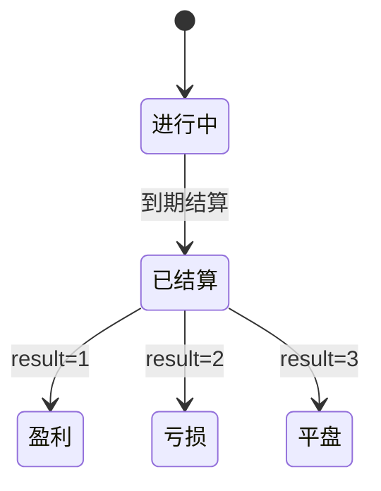
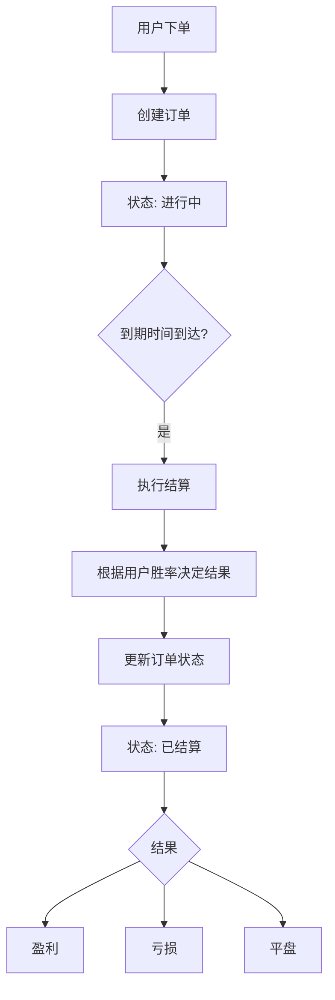
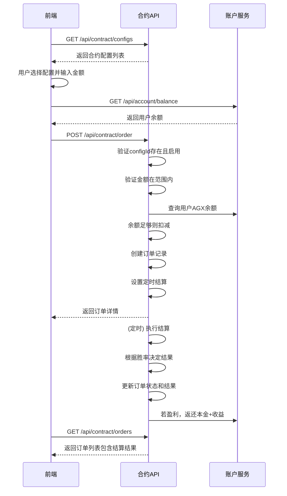
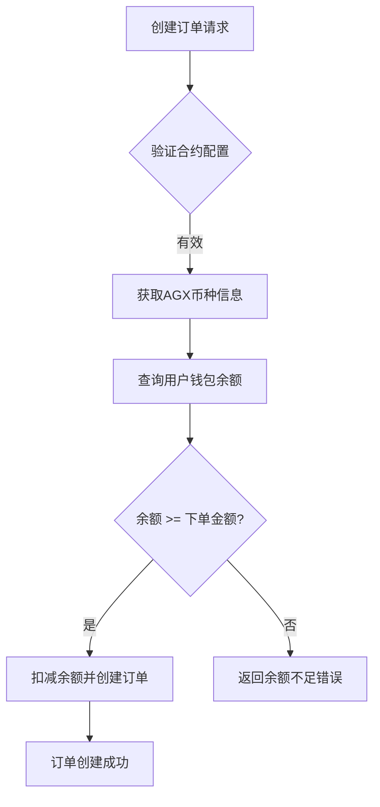

# 合约交易API

<cite>
**本文档引用文件**  
- [contract.controller.ts](file://agx-backend/src/modules/contract/contract.controller.ts)
- [contract.dto.ts](file://agx-backend/src/modules/contract/contract.dto.ts)
- [contract.service.ts](file://agx-backend/src/modules/contract/contract.service.ts)
- [contract-config.entity.ts](file://agx-backend/src/entities/contract-config.entity.ts)
- [contract-order.entity.ts](file://agx-backend/src/entities/contract-order.entity.ts)
- [account.service.ts](file://agx-backend/src/modules/account/account.service.ts)
- [wallet.entity.ts](file://agx-backend/src/entities/wallet.entity.ts)
- [coin.entity.ts](file://agx-backend/src/entities/coin.entity.ts)
</cite>

## 目录
1. [简介](#简介)
2. [核心端点](#核心端点)
3. [创建订单API详解](#创建订单api详解)
4. [订单状态流转](#订单状态流转)
5. [完整下单流程示例](#完整下单流程示例)
6. [与账户服务的集成](#与账户服务的集成)

## 简介

本API文档详细描述了秒合约交易功能的核心接口，包括获取合约配置列表、创建订单和查询用户订单三个主要端点。API基于NestJS框架实现，通过JWT进行用户认证，确保交易安全。系统支持多种交易对（如XAU/USD、XAG/USD），并根据用户胜率动态控制结算结果，实现公平的交易体验。

**Section sources**
- [contract.controller.ts](file://agx-backend/src/modules/contract/contract.controller.ts#L1-L44)

## 核心端点

### 获取合约配置列表 (/configs)

该端点返回所有启用状态的合约配置，供前端展示可交易的合约产品。

**请求方式**：`GET /api/contract/configs`

**请求头**：
```http
Authorization: Bearer <token>
```

**响应示例**：
```json
{
  "code": 0,
  "msg": "ok",
  "data": {
    "list": [
      {
        "id": 1,
        "symbol": "XAU/USD",
        "name": "黄金",
        "duration": 60,
        "durationText": "60秒",
        "profitRate": "0.85",
        "profitRatePercent": "85%",
        "minAmount": "10",
        "maxAmount": "1000"
      }
    ]
  }
}
```

**字段说明**：
| 字段 | 类型 | 说明 |
|------|------|------|
| id | number | 合约配置ID |
| symbol | string | 交易对代码 |
| name | string | 合约名称 |
| duration | number | 交易周期（秒） |
| durationText | string | 周期文本描述 |
| profitRate | string | 盈利收益率 |
| profitRatePercent | string | 盈利收益率百分比 |
| minAmount | string | 最小下单金额 |
| maxAmount | string | 最大下单金额 |

**Section sources**
- [contract.controller.ts](file://agx-backend/src/modules/contract/contract.controller.ts#L14-L17)
- [contract.service.ts](file://agx-backend/src/modules/contract/contract.service.ts#L39-L57)

### 创建订单 (/order)

该端点用于创建新的合约订单，执行下单操作。

**请求方式**：`POST /api/contract/order`

**请求头**：
```http
Authorization: Bearer <token>
```

**请求体**：见下一节详细说明

**响应示例**：
```json
{
  "code": 0,
  "msg": "ok",
  "data": {
    "orderId": 1001,
    "orderNo": "C20240115103000123456",
    "symbol": "XAU/USD",
    "direction": 1,
    "directionText": "看涨",
    "amount": "100",
    "openPrice": "2050.50",
    "duration": 60,
    "profitRate": "0.85",
    "openAt": "2024-01-15 10:30:00",
    "closeAt": "2024-01-15 10:31:00"
  }
}
```

**Section sources**
- [contract.controller.ts](file://agx-backend/src/modules/contract/contract.controller.ts#L22-L29)

### 查询用户订单 (/orders)

该端点返回当前用户的订单列表。

**请求方式**：`GET /api/contract/orders`

**请求头**：
```http
Authorization: Bearer <token>
```

**查询参数**：
| 参数 | 类型 | 说明 |
|------|------|------|
| status | number | 订单状态筛选（0:进行中，1:已结算） |

**响应示例**：
```json
{
  "code": 0,
  "msg": "ok",
  "data": {
    "list": [
      {
        "id": 1001,
        "orderNo": "C20240115103000123456",
        "symbol": "XAU/USD",
        "direction": 1,
        "directionText": "看涨",
        "amount": "100",
        "openPrice": "2050.50",
        "closePrice": "2055.20",
        "profitLoss": "85",
        "result": 1,
        "resultText": "盈",
        "status": 1,
        "openAt": "2024-01-15 10:30:00",
        "closeAt": "2024-01-15 10:31:00"
      }
    ]
  }
}
```

**Section sources**
- [contract.controller.ts](file://agx-backend/src/modules/contract/contract.controller.ts#L34-L42)
- [contract.service.ts](file://agx-backend/src/modules/contract/contract.service.ts#L236-L266)

## 创建订单API详解

### 请求体结构 (CreateOrderDto)

请求体必须符合`CreateOrderDto`定义，包含以下字段：

```typescript
export class CreateOrderDto {
  @IsNumber()
  @IsPositive()
  configId: number;

  @IsNumber()
  @IsPositive()
  amount: number;

  @IsNumber()
  @IsIn([1, 2])
  direction: number; // 1看涨 2看跌
}
```

### 字段详细说明

| 字段 | 类型 | 必填 | 取值范围 | 说明 |
|------|------|------|---------|------|
| configId | number | 是 | 正整数 | 合约配置ID，通过`/configs`接口获取 |
| amount | number | 是 | 正数 | 下单金额，必须在配置的最小和最大金额范围内 |
| direction | number | 是 | 1 或 2 | 交易方向：1表示看涨，2表示看跌 |

### 验证规则

1. **configId验证**：必须对应一个存在的、启用状态的合约配置
2. **amount验证**：必须大于等于`minAmount`且小于等于`maxAmount`
3. **direction验证**：只能是1（看涨）或2（看跌）
4. **余额验证**：用户AGX余额必须足够支付下单金额

### 错误响应

| 错误码 | 说明 | 示例 |
|--------|------|------|
| 4001 | 合约配置不存在 | `{"code": 4001, "msg": "合约配置不存在", "data": null}` |
| 4002 | 下单金额低于最小限制 | `{"code": 4002, "msg": "最小下单金额 10", "data": null}` |
| 4003 | 下单金额超过最大限制 | `{"code": 4003, "msg": "最大下单金额 1000", "data": null}` |
| 4005 | AGX余额不足 | `{"code": 4005, "msg": "AGX余额不足", "data": null}` |

**Section sources**
- [contract.dto.ts](file://agx-backend/src/modules/contract/contract.dto.ts#L3-L15)
- [contract.service.ts](file://agx-backend/src/modules/contract/contract.service.ts#L68-L100)

## 订单状态流转

### 订单状态定义

根据`contract-order.entity.ts`中的定义，订单状态流转如下：



**Diagram sources**
- [contract-order.entity.ts](file://agx-backend/src/entities/contract-order.entity.ts#L65-L67)

### 状态字段说明

| 数据库字段 | 值 | 说明 |
|-----------|----|------|
| status | 0 | 进行中（订单已创建，等待结算） |
| status | 1 | 已结算（订单已到期，结果已确定） |

| result | 值 | 说明 |
|-------|----|------|
| result | 1 | 盈利（用户预测正确，获得收益） |
| result | 2 | 亏损（用户预测错误，损失本金） |
| result | 3 | 平盘（特殊情况，本金返还） |

### 状态流转流程



**Diagram sources**
- [contract.service.ts](file://agx-backend/src/modules/contract/contract.service.ts#L164-L231)

### 结算逻辑

系统在订单创建时设置定时器，在合约到期后自动执行结算：

1. 获取用户历史胜率（默认50%）
2. 生成随机数，根据胜率决定结果
3. 计算盈亏金额（本金 × 盈利收益率）
4. 更新订单的结算价格、盈亏金额和结果
5. 若盈利，将本金和收益返还至用户钱包

## 完整下单流程示例

以下是一个从前端获取配置到提交订单再到查询结果的完整流程：



**Diagram sources**
- [contract.controller.ts](file://agx-backend/src/modules/contract/contract.controller.ts)
- [contract.service.ts](file://agx-backend/src/modules/contract/contract.service.ts)
- [account.service.ts](file://agx-backend/src/modules/account/account.service.ts)

## 与账户服务的集成

### 余额检查机制

在创建订单时，系统会与账户服务集成进行余额检查：



**Diagram sources**
- [contract.service.ts](file://agx-backend/src/modules/contract/contract.service.ts#L87-L100)
- [wallet.entity.ts](file://agx-backend/src/entities/wallet.entity.ts)

### 集成实现细节

1. **币种识别**：系统通过`coin.symbol = 'AGX'`识别交易币种
2. **钱包查询**：使用`walletRepo.findOne()`查询用户特定币种的钱包
3. **余额验证**：使用`decimal.js`进行精确的金额比较，避免浮点数精度问题
4. **事务处理**：余额扣减和订单创建在同一个数据库事务中执行，确保数据一致性

### 关键代码路径

- **余额查询**：`account.service.ts`中的`getBalance()`方法
- **钱包实体**：`wallet.entity.ts`定义了余额和冻结金额字段
- **币种实体**：`coin.entity.ts`定义了币种基本信息
- **余额扣减**：`contract.service.ts`中的事务处理逻辑

**Section sources**
- [contract.service.ts](file://agx-backend/src/modules/contract/contract.service.ts#L87-L113)
- [account.service.ts](file://agx-backend/src/modules/account/account.service.ts#L236-L252)
- [wallet.entity.ts](file://agx-backend/src/entities/wallet.entity.ts#L30-L34)
- [coin.entity.ts](file://agx-backend/src/entities/coin.entity.ts)