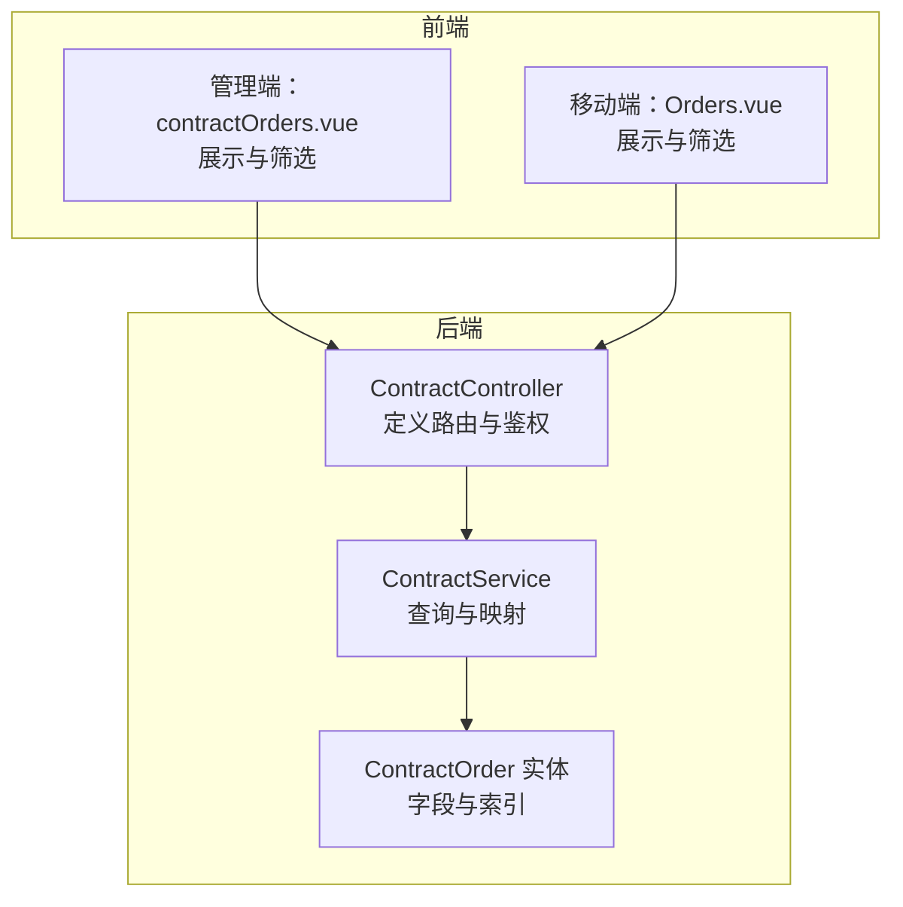
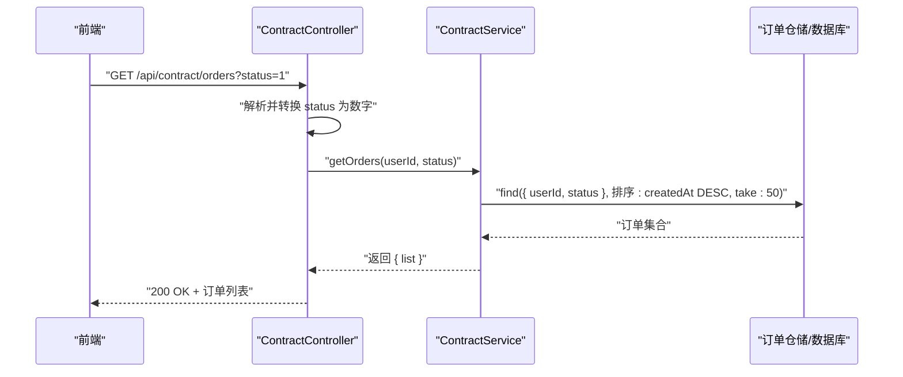
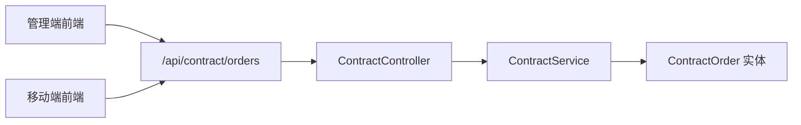

# 查询用户订单

<cite>
**本文引用的文件**
- [contract.controller.ts](file://agx-backend/src/modules/contract/contract.controller.ts)
- [contract.service.ts](file://agx-backend/src/modules/contract/contract.service.ts)
- [contract-order.entity.ts](file://agx-backend/src/entities/contract-order.entity.ts)
- [contractOrders.vue](file://agx-admin/src/views/agx/contractOrders.vue)
- [Orders.vue](file://h5/src/views/Orders.vue)
</cite>

## 目录
1. [简介](#简介)
2. [项目结构](#项目结构)
3. [核心组件](#核心组件)
4. [架构总览](#架构总览)
5. [详细组件分析](#详细组件分析)
6. [依赖关系分析](#依赖关系分析)
7. [性能考量](#性能考量)
8. [故障排查指南](#故障排查指南)
9. [结论](#结论)
10. [附录](#附录)

## 简介
本文件面向“查询用户订单”API，聚焦后端控制器与服务层实现，以及前端在个人中心与交易页面的应用。重点说明：
- 接口路径与方法：GET /api/contract/orders
- 认证机制：需要携带 JWT 令牌
- 查询参数：status（可选，数字，如 0 进行中、1 已结算）
- 返回结构：订单列表，包含 id、orderNo、symbol、direction、amount、profitLoss、result、status 等字段
- 字段语义与业务含义：status 与 result 的取值及含义
- 前端过滤策略：如何基于 status 参数进行本地过滤
- 在用户个人中心与交易页面中的应用场景

## 项目结构
围绕“查询用户订单”的端到端流程涉及以下模块与文件：
- 后端控制器：负责路由定义、参数解析与鉴权
- 后端服务：负责数据库查询、数据映射与返回结构组织
- 实体模型：定义订单表字段与索引
- 前端管理端：展示合约订单列表，支持按结果筛选
- 前端移动端：展示订单记录，支持状态筛选

图表来源
- [contract.controller.ts](file://agx-backend/src/modules/contract/contract.controller.ts#L1-L43)
- [contract.service.ts](file://agx-backend/src/modules/contract/contract.service.ts#L233-L266)
- [contract-order.entity.ts](file://agx-backend/src/entities/contract-order.entity.ts#L1-L81)
- [contractOrders.vue](file://agx-admin/src/views/agx/contractOrders.vue#L1-L124)
- [Orders.vue](file://h5/src/views/Orders.vue#L1-L120)

章节来源
- [contract.controller.ts](file://agx-backend/src/modules/contract/contract.controller.ts#L1-L43)
- [contract.service.ts](file://agx-backend/src/modules/contract/contract.service.ts#L233-L266)
- [contract-order.entity.ts](file://agx-backend/src/entities/contract-order.entity.ts#L1-L81)
- [contractOrders.vue](file://agx-admin/src/views/agx/contractOrders.vue#L1-L124)
- [Orders.vue](file://h5/src/views/Orders.vue#L1-L120)

## 核心组件
- 控制器层
  - 路由：GET /api/contract/orders
  - 鉴权：使用 JwtAuthGuard
  - 参数：@Query('status') 可选字符串
  - 处理：将 status 字符串通过 parseInt 转换为数字传入服务层
- 服务层
  - 查询：按 userId 与可选 status 过滤，按创建时间倒序，限制 50 条
  - 映射：返回 list，包含 id、orderNo、symbol、direction、amount、openPrice、closePrice、profitLoss、result、status、openAt、closeAt 等字段
- 实体层
  - 字段：id、orderNo、userId、symbol、duration、direction、amount、openPrice、closePrice、profitRate、profitLoss、result、status、openAt、closeAt、createdAt、updatedAt
  - 索引：idx_status、idx_user_id、idx_order_no

章节来源
- [contract.controller.ts](file://agx-backend/src/modules/contract/contract.controller.ts#L31-L42)
- [contract.service.ts](file://agx-backend/src/modules/contract/contract.service.ts#L233-L266)
- [contract-order.entity.ts](file://agx-backend/src/entities/contract-order.entity.ts#L1-L81)

## 架构总览
下图展示了“查询用户订单”的端到端调用序列，从前端发起请求到后端控制器、服务层与数据库实体的交互。

图表来源
- [contract.controller.ts](file://agx-backend/src/modules/contract/contract.controller.ts#L31-L42)
- [contract.service.ts](file://agx-backend/src/modules/contract/contract.service.ts#L233-L266)

## 详细组件分析

### 后端控制器：路由与鉴权
- 路由定义：@Get('orders') 绑定到 /api/contract/orders
- 鉴权：@UseGuards(JwtAuthGuard) 确保请求携带有效 JWT
- 参数解析：@Query('status') 接收可选字符串参数
- 类型转换：将 status 字符串通过 parseInt 转为数字，未提供则为 undefined

章节来源
- [contract.controller.ts](file://agx-backend/src/modules/contract/contract.controller.ts#L31-L42)

### 后端服务：查询与映射
- 查询条件：
  - 必填：userId（来自当前登录用户）
  - 可选：status（若提供则作为过滤条件）
- 排序与分页：
  - 按 createdAt 降序
  - 限制 50 条
- 返回结构：
  - list：数组，每项包含 id、orderNo、symbol、direction、amount、openPrice、closePrice、profitLoss、result、status、openAt、closeAt
  - 其中 resultText 为“盈/亏/平/进行中”，用于前端展示友好文本

章节来源
- [contract.service.ts](file://agx-backend/src/modules/contract/contract.service.ts#L233-L266)

### 数据模型：订单实体
- 关键字段与含义（节选）：
  - id：订单主键
  - orderNo：订单编号
  - symbol：交易对
  - direction：方向（1 看涨，2 看跌）
  - amount：下单金额
  - openPrice/closePrice：开仓/平仓价格
  - profitLoss：盈亏金额
  - result：结果（1 盈，2 亏，3 平）
  - status：状态（0 进行中，1 已结算）
  - openAt/closeAt/createdAt/updatedAt：时间戳
- 索引：
  - idx_status、idx_user_id、idx_order_no 提升查询性能

章节来源
- [contract-order.entity.ts](file://agx-backend/src/entities/contract-order.entity.ts#L1-L81)

### 前端应用：管理端与移动端
- 管理端（contractOrders.vue）
  - 展示合约订单列表，支持按 symbol、result（盈利/亏损）筛选
  - 分页加载，点击“设赢/设输”触发结算
- 移动端（Orders.vue）
  - 展示订单记录，支持类型与状态筛选
  - 通过 activeStatus 切换“全部/进行中/已完成/已取消”等状态

章节来源
- [contractOrders.vue](file://agx-admin/src/views/agx/contractOrders.vue#L1-L124)
- [Orders.vue](file://h5/src/views/Orders.vue#L1-L120)

## 依赖关系分析
- 控制器依赖服务层，服务层依赖实体与仓储
- 前端通过 HTTP 客户端调用后端接口，管理端与移动端分别消费相同接口

图表来源
- [contract.controller.ts](file://agx-backend/src/modules/contract/contract.controller.ts#L1-L43)
- [contract.service.ts](file://agx-backend/src/modules/contract/contract.service.ts#L233-L266)
- [contract-order.entity.ts](file://agx-backend/src/entities/contract-order.entity.ts#L1-L81)
- [contractOrders.vue](file://agx-admin/src/views/agx/contractOrders.vue#L1-L124)
- [Orders.vue](file://h5/src/views/Orders.vue#L1-L120)

## 性能考量
- 查询优化
  - 使用索引 idx_status、idx_user_id、idx_order_no，减少全表扫描
  - 限定 take=50，避免一次性返回过多数据
- 排序优化
  - 按 createdAt 降序，结合索引提升排序效率
- 前端分页
  - 建议前端也采用分页策略，避免一次性渲染大量订单

章节来源
- [contract-order.entity.ts](file://agx-backend/src/entities/contract-order.entity.ts#L1-L81)
- [contract.service.ts](file://agx-backend/src/modules/contract/contract.service.ts#L233-L266)

## 故障排查指南
- 401 未授权
  - 确认请求头携带有效的 Authorization: Bearer <token>
- 400 参数错误
  - status 必须为数字字符串；非数字将被转换为 NaN，服务层会忽略该过滤条件
- 无数据
  - 用户无对应订单或 status 过滤条件过于严格
- 结果不一致
  - result 与 status 含义不同：
    - status：订单生命周期状态（0 进行中，1 已结算）
    - result：最终盈亏结果（1 盈，2 亏，3 平）

章节来源
- [contract.controller.ts](file://agx-backend/src/modules/contract/contract.controller.ts#L31-L42)
- [contract.service.ts](file://agx-backend/src/modules/contract/contract.service.ts#L233-L266)

## 结论
- /api/contract/orders 是查询用户合约订单的核心接口，采用 JWT 鉴权，支持可选 status 过滤
- 返回结构清晰，包含订单关键字段，便于前端展示与筛选
- 前端可在个人中心与交易页面中复用该接口，实现订单查询与状态过滤
- 建议前后端保持对 status 与 result 的语义一致理解，避免混淆

## 附录

### 接口定义
- 方法：GET
- 路径：/api/contract/orders
- 认证：需要 JWT
- 查询参数：
  - status：可选，数字字符串
    - 0：进行中
    - 1：已结算
- 返回结构（list 中的单个订单对象）：
  - id：订单主键
  - orderNo：订单编号
  - symbol：交易对
  - direction：方向（1 看涨，2 看跌）
  - amount：下单金额
  - openPrice：开仓价
  - closePrice：平仓价
  - profitLoss：盈亏金额
  - result：结果（1 盈，2 亏，3 平）
  - status：状态（0 进行中，1 已结算）
  - openAt：开仓时间
  - closeAt：平仓时间

章节来源
- [contract.controller.ts](file://agx-backend/src/modules/contract/contract.controller.ts#L31-L42)
- [contract.service.ts](file://agx-backend/src/modules/contract/contract.service.ts#L233-L266)
- [contract-order.entity.ts](file://agx-backend/src/entities/contract-order.entity.ts#L1-L81)

### 前端过滤策略
- 管理端（contractOrders.vue）
  - 支持按 symbol、result（盈利/亏损）筛选，分页加载
- 移动端（Orders.vue）
  - 支持类型与状态筛选，通过 activeStatus 切换“全部/进行中/已完成/已取消”

章节来源
- [contractOrders.vue](file://agx-admin/src/views/agx/contractOrders.vue#L1-L124)
- [Orders.vue](file://h5/src/views/Orders.vue#L1-L120)

### 字段语义与业务含义
- status（生命周期状态）
  - 0：进行中
  - 1：已结算
- result（最终结果）
  - 1：盈
  - 2：亏
  - 3：平
- direction（方向）
  - 1：看涨
  - 2：看跌

章节来源
- [contract.service.ts](file://agx-backend/src/modules/contract/contract.service.ts#L233-L266)
- [contract-order.entity.ts](file://agx-backend/src/entities/contract-order.entity.ts#L1-L81)

### 示例响应（结构示意）
- list：数组，元素为订单对象
  - 示例字段：id、orderNo、symbol、direction、amount、openPrice、closePrice、profitLoss、result、status、openAt、closeAt
- 响应示例（示意性，非真实数据）
  - {
      "list": [
        {
          "id": 1001,
          "orderNo": "C202501010001",
          "symbol": "XAU/USD",
          "direction": 1,
          "amount": "100.00000000",
          "openPrice": "2050.00",
          "closePrice": "2052.50",
          "profitLoss": "85.00000000",
          "result": 1,
          "status": 1,
          "openAt": "2025-01-01 09:00:00",
          "closeAt": "2025-01-01 09:05:00"
        },
        {
          "id": 1002,
          "orderNo": "C202501010002",
          "symbol": "XAG/USD",
          "direction": 2,
          "amount": "200.00000000",
          "openPrice": "24.00",
          "closePrice": null,
          "profitLoss": null,
          "result": 0,
          "status": 0,
          "openAt": "2025-01-01 09:02:00",
          "closeAt": null
        }
      ]
    }

章节来源
- [contract.service.ts](file://agx-backend/src/modules/contract/contract.service.ts#L233-L266)