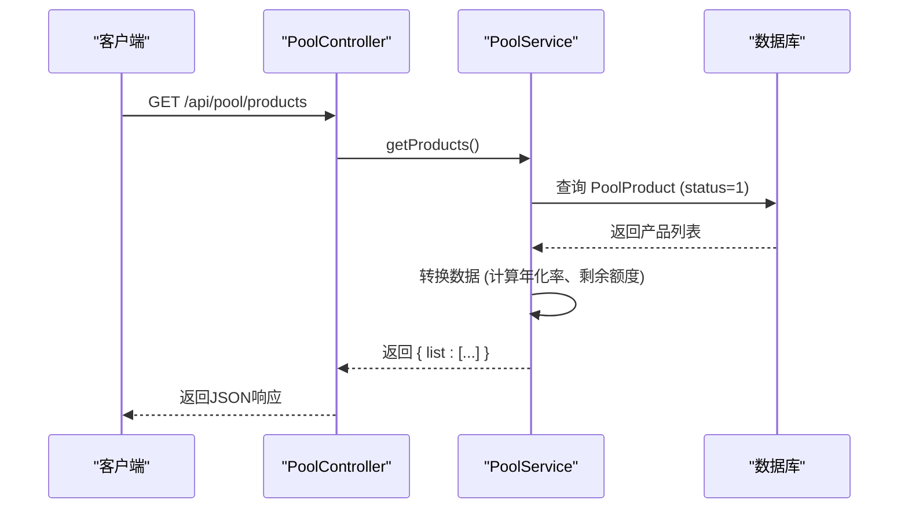

# 矿池产品管理

<cite>
**本文档引用的文件**
- [pool.controller.ts](file://agx-backend/src/modules/pool/pool.controller.ts)
- [pool.service.ts](file://agx-backend/src/modules/pool/pool.service.ts)
- [pool-product.entity.ts](file://agx-backend/src/entities/pool-product.entity.ts)
- [admin.controller.ts](file://agx-backend/src/modules/admin/admin.controller.ts)
- [admin.service.ts](file://agx-backend/src/modules/admin/admin.service.ts)
- [admin.dto.ts](file://agx-backend/src/modules/admin/admin.dto.ts)
</cite>

## 目录
1. [简介](#简介)
2. [核心实体与字段说明](#核心实体与字段说明)
3. [产品列表查询端点](#产品列表查询端点)
4. [产品状态管理与权限控制](#产品状态管理与权限控制)
5. [产品管理操作](#产品管理操作)
6. [响应示例](#响应示例)
7. [异常情况处理](#异常情况处理)

## 简介
本文档详细说明了矿池产品管理功能的实现，重点介绍 `GET /api/pool/products` 端点的实现逻辑。文档涵盖了 `PoolProduct` 实体的关键字段、产品状态（上架/下架）的业务逻辑、权限控制机制、数据查询过滤与分页，以及产品增删改查的操作流程。本功能旨在为开发者提供一个清晰的指南，以便于维护和扩展矿池产品系统。

## 核心实体与字段说明
`PoolProduct` 实体定义了矿池产品的所有核心属性，存储在 `agx_pool_product` 数据库表中。

**关键字段及其业务含义：**

- **id**: 产品的唯一标识符，由数据库自动生成。
- **name**: 产品名称，用于在前端展示。
- **coinId**: 投入币种的ID，关联到 `Coin` 实体，决定了用户使用何种代币进行投资。
- **type**: 产品类型，枚举值为 `flexible` (活期) 或 `fixed` (定期)。活期产品可随时赎回，定期产品有固定的锁定期。
- **lockDays**: 锁定期天数。对于活期产品，此值为0；对于定期产品，表示用户资金被锁定的天数。
- **dailyRate**: 日收益率，以小数形式存储（例如，0.001 表示 0.1%）。这是计算用户收益的核心参数。
- **minAmount**: 最低投资金额，用户申购该产品时必须达到的最小金额。
- **maxAmount**: 最高申购金额，用户单次申购的上限。此字段可为空，表示无上限。
- **totalQuota**: 总额度，该产品可被申购的总金额。此字段可为空，表示额度无限。
- **soldAmount**: 已售额度，记录当前已被用户申购的总金额，用于计算剩余额度。
- **isHot**: 是否热门，布尔值（1为是，0为否），用于在前端突出显示热门产品。
- **sortOrder**: 排序序号，数值越小越靠前，用于控制产品在列表中的显示顺序。
- **payCurrencies**: 支付币种，字符串，如 "USDT,CNY"，表示该产品支持哪些法币或稳定币进行支付。
- **status**: 产品状态，枚举值为 `1` (上架) 或 `0` (下架)。只有上架的产品才会对普通用户可见。

**Section sources**
- [pool-product.entity.ts](file://agx-backend/src/entities/pool-product.entity.ts#L1-L62)

## 产品列表查询端点
`GET /api/pool/products` 端点用于向普通用户返回所有可申购的矿池产品列表。

### 实现逻辑
该端点由 `pool.controller.ts` 中的 `getProducts` 方法处理，并调用 `pool.service.ts` 中的服务逻辑。

1.  **数据查询**: 服务层 (`pool.service.ts`) 使用 TypeORM 的 `find` 方法从数据库查询 `PoolProduct` 实体。
    -   **过滤条件**: `where: { status: 1 }`，确保只返回状态为“上架”的产品。
    -   **排序规则**: `order: { sortOrder: 'ASC', id: 'ASC' }`，首先按 `sortOrder` 升序排列，`sortOrder` 相同时按 `id` 升序排列。
2.  **数据转换**: 查询到的产品数据会经过一层转换，以适应前端展示需求。
    -   **年化收益率计算**: 服务端会根据 `dailyRate` 计算出年化收益率 (`annualRate`)，公式为 `dailyRate * 365 * 100%`，并保留两位小数后加上 `%` 符号。
    -   **剩余额度计算**: 如果产品设置了 `totalQuota`，则通过 `totalQuota - soldAmount` 计算出 `remainQuota`。
    -   **布尔值转换**: `isHot` 字段从数字 (1/0) 转换为布尔值 (true/false)。
3.  **响应结构**: 最终返回一个包含 `list` 数组的对象，数组中每个元素都是一个经过转换的产品信息。



**Diagram sources**
- [pool.controller.ts](file://agx-backend/src/modules/pool/pool.controller.ts#L14-L17)
- [pool.service.ts](file://agx-backend/src/modules/pool/pool.service.ts#L31-L52)

## 产品状态管理与权限控制
产品的上架和下架是通过修改 `status` 字段来实现的，这是一个关键的业务状态管理。

### 权限控制
-   **普通用户**: 只能访问 `GET /api/pool/products` 端点。该端点在查询时自动过滤 `status=1` 的产品，因此普通用户无法看到或操作已下架的产品。
-   **管理员**: 通过 `admin` 模块的专用接口来管理产品状态。这些接口受到 `AdminGuard` 保护，确保只有经过身份验证的管理员才能调用。

### 状态变更流程
管理员通过调用 `PUT /api/admin/pool/:id` 接口，并在请求体中传入 `status` 字段来变更产品状态。
-   将 `status` 设为 `1` 表示“上架”，产品将对所有用户可见。
-   将 `status` 设为 `0` 表示“下架”，产品将从用户端的产品列表中消失。

**Section sources**
- [pool-product.entity.ts](file://agx-backend/src/entities/pool-product.entity.ts#L52-L54)
- [admin.controller.ts](file://agx-backend/src/modules/admin/admin.controller.ts#L120-L127)
- [admin.dto.ts](file://agx-backend/src/modules/admin/admin.dto.ts#L212-L215)

## 产品管理操作
管理员可以通过 `admin` 模块的API对矿池产品进行全生命周期的管理。

### 添加新产品
-   **端点**: `POST /api/admin/pool`
-   **控制器**: `admin.controller.ts` 中的 `createPoolProduct` 方法。
-   **DTO**: `CreatePoolProductDto`，定义了创建产品所需的所有必填和可选字段。
-   **流程**: 管理员提交产品信息，服务层 (`admin.service.ts`) 验证数据后，将其持久化到数据库。

### 修改产品参数
-   **端点**: `PUT /api/admin/pool/:id`
-   **控制器**: `admin.controller.ts` 中的 `updatePoolProduct` 方法。
-   **DTO**: `UpdatePoolProductDto`，其中所有字段均为可选，允许管理员只更新需要修改的参数。
-   **流程**: 通过 `id` 找到目标产品，然后根据传入的DTO更新其属性。

### 处理产品上下架
-   **操作**: 通过调用 `PUT /api/admin/pool/:id` 接口，并在 `UpdatePoolProductDto` 中指定 `status` 字段的值来实现。
-   **流程**: 与修改其他参数相同，服务层会更新数据库中对应产品的 `status` 字段。

**Section sources**
- [admin.controller.ts](file://agx-backend/src/modules/admin/admin.controller.ts#L114-L132)
- [admin.service.ts](file://agx-backend/src/modules/admin/admin.service.ts#L331-L371)
- [admin.dto.ts](file://agx-backend/src/modules/admin/admin.dto.ts#L126-L216)

## 响应示例
### 产品列表响应
```json
{
  "list": [
    {
      "id": 1,
      "name": "活期理财",
      "type": "flexible",
      "lockDays": 0,
      "dailyRate": "0.001000",
      "annualRate": "36.50%",
      "minAmount": "10.00000000",
      "maxAmount": "10000.00000000",
      "totalQuota": "100000.00000000",
      "soldAmount": "25000.00000000",
      "remainQuota": "75000.00000000",
      "isHot": true
    },
    {
      "id": 2,
      "name": "90天定期",
      "type": "fixed",
      "lockDays": 90,
      "dailyRate": "0.001500",
      "annualRate": "54.75%",
      "minAmount": "100.00000000",
      "maxAmount": null,
      "totalQuota": null,
      "soldAmount": "5000.00000000",
      "remainQuota": null,
      "isHot": false
    }
  ]
}
```

## 异常情况处理
系统在关键操作中实现了完善的异常处理机制。

### 可能的异常情况
-   **产品不存在或已下架**: 当用户尝试申购一个 `id` 不存在或 `status` 为 `0` 的产品时，会抛出业务异常（错误码 3001）。
-   **参数校验失败**: 
    -   申购金额低于 `minAmount` (错误码 3002)。
    -   申购金额高于 `maxAmount` (错误码 3003)。
    -   申购金额超过 `totalQuota` 的剩余额度 (错误码 3004)。
    -   用户余额不足 (错误码 3005)。
    -   定期产品未到期尝试赎回 (错误码 3007)。
-   **产品重复**: 在创建新产品时，虽然DTO中没有直接的唯一性约束，但业务逻辑（如检查 `name` 或 `coinId` 组合）可能会在服务层进行检查，以防止创建重复的产品。具体的检查逻辑需在 `admin.service.ts` 的 `createPoolProduct` 方法中确认。

所有异常均通过 `BusinessException` 类抛出，并返回带有错误码和描述信息的JSON响应，便于前端进行错误提示。

**Section sources**
- [pool.service.ts](file://agx-backend/src/modules/pool/pool.service.ts#L113-L134)
- [pool.service.ts](file://agx-backend/src/modules/pool/pool.service.ts#L142-L144)
- [pool.service.ts](file://agx-backend/src/modules/pool/pool.service.ts#L210-L212)