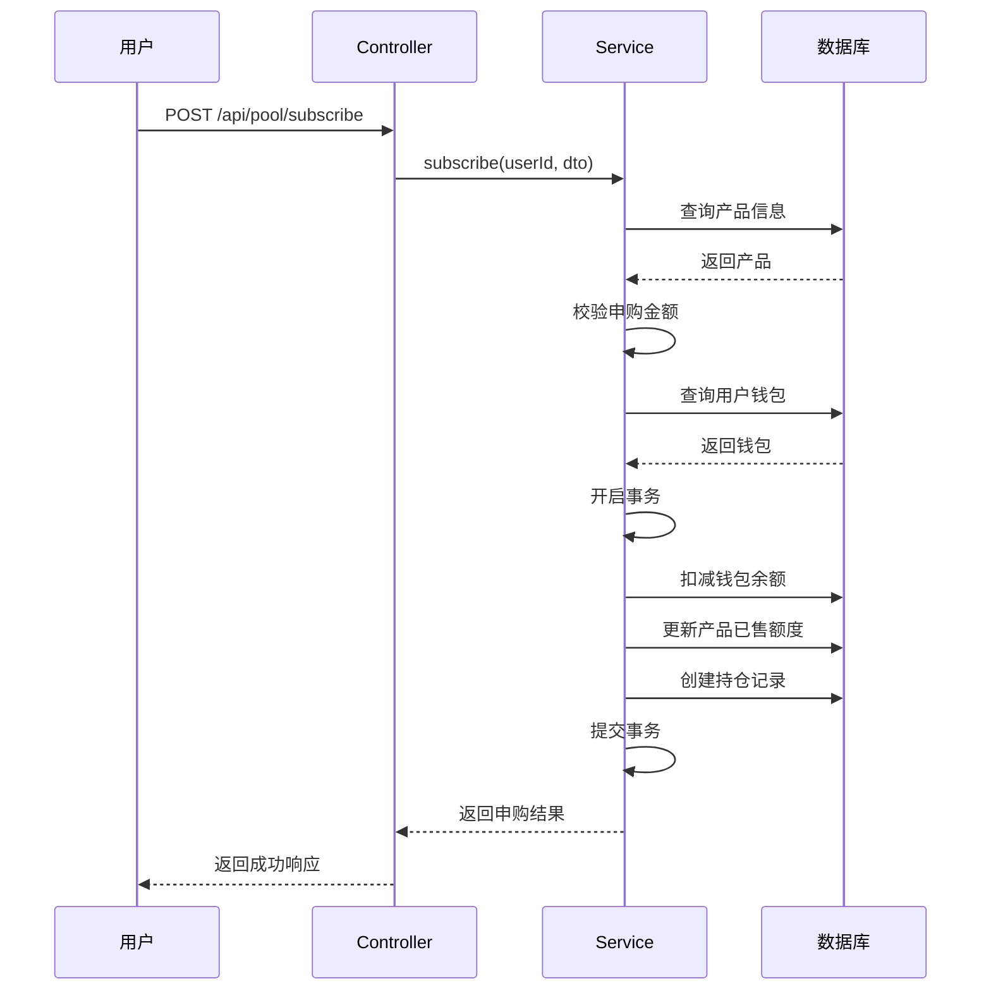

# 矿池投资API

<cite>
**本文档引用文件**  
- [pool.controller.ts](file://agx-backend/src/modules/pool/pool.controller.ts)
- [pool.service.ts](file://agx-backend/src/modules/pool/pool.service.ts)
- [pool.dto.ts](file://agx-backend/src/modules/pool/pool.dto.ts)
- [pool-product.entity.ts](file://agx-backend/src/entities/pool-product.entity.ts)
- [pool-holding.entity.ts](file://agx-backend/src/entities/pool-holding.entity.ts)
- [wallet.entity.ts](file://agx-backend/src/entities/wallet.entity.ts)
- [business.exception.ts](file://agx-backend/src/common/filters/business.exception.ts)
- [api-response.dto.ts](file://agx-backend/src/common/dto/api-response.dto.ts)
</cite>

## 目录
1. [简介](#简介)
2. [API端点](#api端点)
3. [产品信息字段说明](#产品信息字段说明)
4. [申购与赎回业务逻辑](#申购与赎回业务逻辑)
5. [数据结构定义](#数据结构定义)
6. [完整调用示例](#完整调用示例)
7. [错误码说明](#错误码说明)

## 简介
矿池投资API为用户提供数字资产的理财服务，支持查看产品、申购和赎回功能。用户可通过该API将持有的数字资产投入矿池获取收益。系统通过`pool.controller.ts`实现核心接口，结合`pool.service.ts`进行业务处理，确保资金安全与收益计算的准确性。

## API端点

### 获取产品列表
- **端点**: `GET /api/pool/products`
- **描述**: 获取所有上架状态的矿池产品列表
- **认证**: 无需登录
- **响应**: 返回产品列表及关键参数

### 查询用户持仓
- **端点**: `GET /api/pool/holdings`
- **描述**: 查询当前用户的矿池持仓信息
- **认证**: 需要JWT认证
- **响应**: 返回用户总持仓金额、总收益及持仓明细

### 申购矿池
- **端点**: `POST /api/pool/subscribe`
- **描述**: 申购指定矿池产品
- **认证**: 需要JWT认证
- **请求体**: `SubscribePoolDto`
- **响应**: 返回申购成功后的持仓信息及预计收益

### 赎回矿池
- **端点**: `POST /api/pool/redeem`
- **描述**: 赎回指定的矿池持仓
- **认证**: 需要JWT认证
- **请求体**: `RedeemPoolDto`
- **响应**: 返回赎回的本金、实际收益及总返还金额

**Section sources**
- [pool.controller.ts](file://agx-backend/src/modules/pool/pool.controller.ts#L7-L51)

## 产品信息字段说明

| 字段 | 类型 | 说明 |
|------|------|------|
| id | number | 产品ID |
| name | string | 产品名称 |
| type | string | 产品类型：`flexible`(活期) / `fixed`(定期) |
| lockDays | number | 锁定期天数，0表示活期 |
| dailyRate | string | 日收益率（小数形式） |
| annualRate | string | 年收益率（百分比形式） |
| minAmount | string | 最低申购金额 |
| maxAmount | string | 最高申购金额（可为空） |
| totalQuota | string | 总额度（可为空） |
| soldAmount | string | 已售额度 |
| remainQuota | string | 剩余额度（总额度减已售额度） |
| isHot | boolean | 是否为热门产品 |

**Section sources**
- [pool-product.entity.ts](file://agx-backend/src/entities/pool-product.entity.ts#L10-L61)
- [pool.service.ts](file://agx-backend/src/modules/pool/pool.service.ts#L38-L51)

## 申购与赎回业务逻辑

### 申购流程
1. **产品验证**: 检查产品是否存在且处于上架状态
2. **金额校验**: 
   - 不低于最低申购金额
   - 不超过最高申购金额
   - 不超过剩余额度
3. **余额检查**: 用户钱包余额是否充足
4. **事务处理**:
   - 扣减用户钱包余额
   - 更新产品已售额度
   - 创建持仓记录
   - 设置到期时间（定期产品）

### 赎回流程
1. **持仓验证**: 检查持仓是否存在且为当前用户
2. **赎回条件检查**:
   - 活期产品：随时可赎回
   - 定期产品：必须到期后才能赎回
3. **收益计算**: 根据持有天数重新计算实际收益
4. **事务处理**:
   - 将本金和收益返还至用户钱包
   - 更新持仓状态为已赎回
   - 更新产品已售额度



**Diagram sources**
- [pool.service.ts](file://agx-backend/src/modules/pool/pool.service.ts#L108-L187)
- [pool.controller.ts](file://agx-backend/src/modules/pool/pool.controller.ts#L31-L38)

## 数据结构定义

### SubscribePoolDto (申购数据传输对象)
```typescript
export class SubscribePoolDto {
  @IsNumber()
  @IsPositive()
  productId: number;  // 产品ID

  @IsNumber()
  @IsPositive()
  @Min(0.00000001)
  amount: number;     // 申购金额
}
```

### RedeemPoolDto (赎回数据传输对象)
```typescript
export class RedeemPoolDto {
  @IsNumber()
  @IsPositive()
  holdingId: number;  // 持仓ID
}
```

**Section sources**
- [pool.dto.ts](file://agx-backend/src/modules/pool/pool.dto.ts#L3-L18)

## 完整调用示例

### 场景：用户查看产品并成功申购
1. **获取产品列表**
```http
GET /api/pool/products
```
响应：
```json
{
  "code": 0,
  "msg": "ok",
  "data": {
    "list": [
      {
        "id": 1,
        "name": "活期理财",
        "type": "flexible",
        "lockDays": 0,
        "dailyRate": "0.0002",
        "annualRate": "7.30%",
        "minAmount": "10.00000000",
        "maxAmount": "10000.00000000",
        "totalQuota": "100000.00000000",
        "soldAmount": "50000.00000000",
        "remainQuota": "50000.00000000",
        "isHot": true
      }
    ]
  }
}
```

2. **申购产品**
```http
POST /api/pool/subscribe
Authorization: Bearer <token>
Content-Type: application/json

{
  "productId": 1,
  "amount": 100
}
```
响应：
```json
{
  "code": 0,
  "msg": "ok",
  "data": {
    "holdingId": 123,
    "amount": "100.00000000",
    "startAt": "2024-01-01 12:00:00",
    "endAt": null,
    "dailyIncome": "0.02000000",
    "annualIncome": "7.30000000"
  }
}
```

**Section sources**
- [pool.controller.ts](file://agx-backend/src/modules/pool/pool.controller.ts#L31-L38)
- [pool.service.ts](file://agx-backend/src/modules/pool/pool.service.ts#L108-L187)

## 错误码说明

| 错误码 | 错误信息 | 说明 |
|--------|---------|------|
| 3001 | 矿池产品不存在或已下架 | 指定的产品ID无效或已下架 |
| 3002 | 最低申购 {amount} | 申购金额低于产品最低要求 |
| 3003 | 最高申购 {amount} | 申购金额超过产品最高限制 |
| 3004 | 剩余额度不足，仅剩 {amount} | 申购金额超过产品剩余额度 |
| 3005 | 余额不足 | 用户钱包余额不足以完成申购 |
| 3006 | 持仓不存在 | 指定的持仓ID无效或不属于当前用户 |
| 3007 | 定期产品未到期，无法赎回 | 定期产品在锁定期无法赎回 |

这些错误码定义在`business.exception.ts`中，通过统一的API响应格式返回给前端。

**Section sources**
- [business.exception.ts](file://agx-backend/src/common/filters/business.exception.ts#L7-L60)
- [pool.service.ts](file://agx-backend/src/modules/pool/pool.service.ts#L114-L134)
- [api-response.dto.ts](file://agx-backend/src/common/dto/api-response.dto.ts#L27-L67)