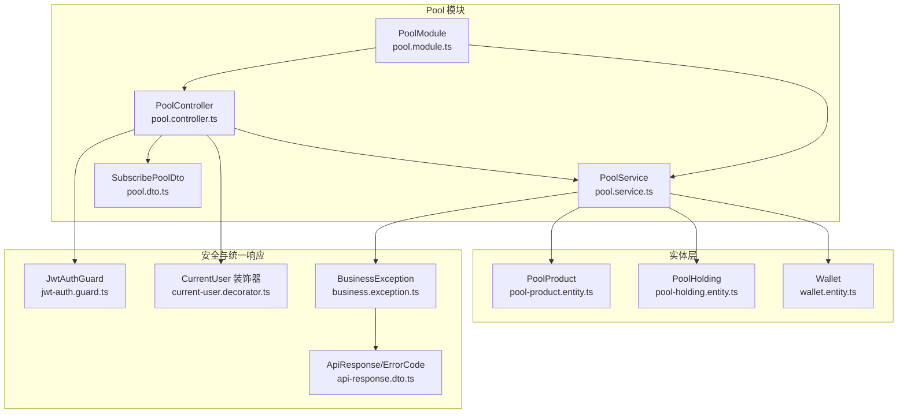
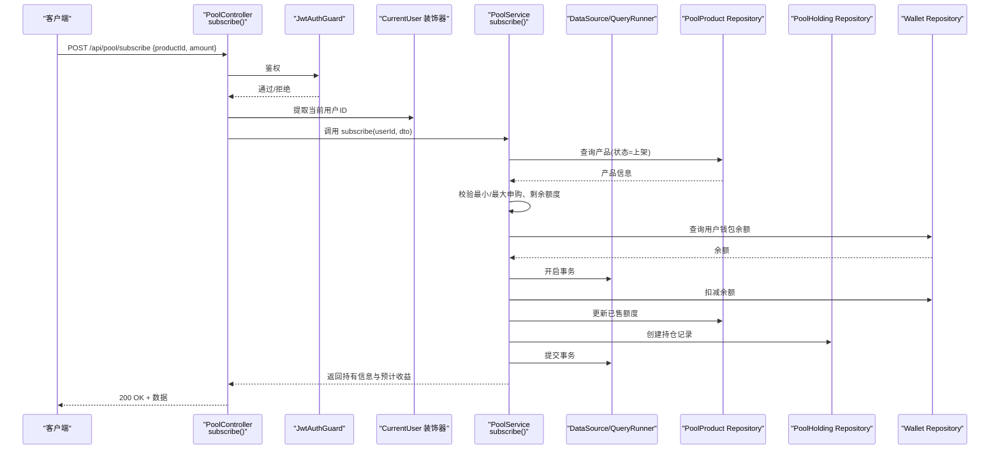
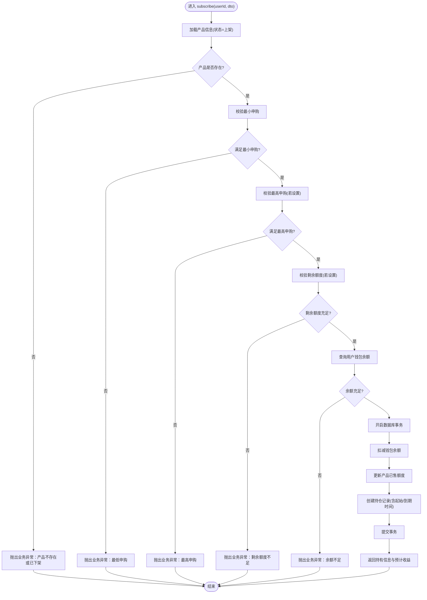
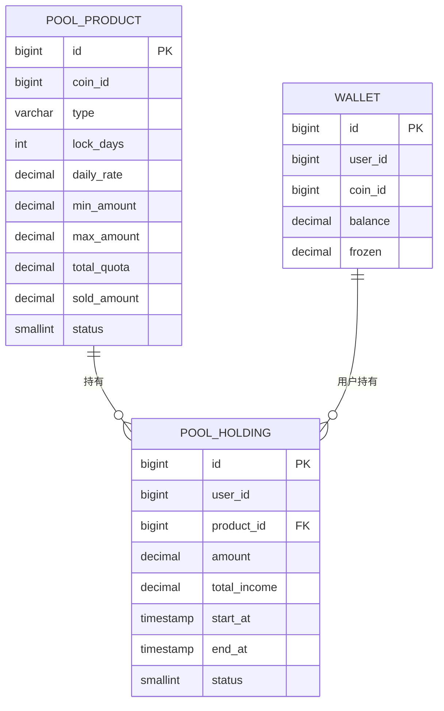
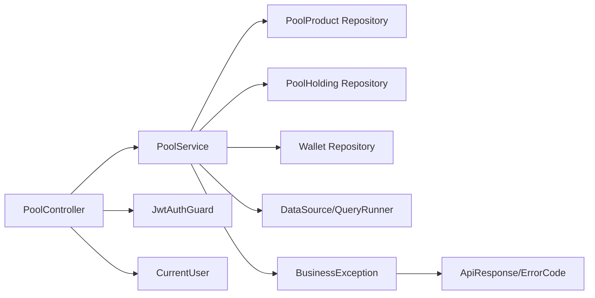

# 矿池申购功能

<cite>
**本文引用的文件**
- [pool.controller.ts](file://agx-backend/src/modules/pool/pool.controller.ts)
- [pool.dto.ts](file://agx-backend/src/modules/pool/pool.dto.ts)
- [pool.service.ts](file://agx-backend/src/modules/pool/pool.service.ts)
- [pool-product.entity.ts](file://agx-backend/src/entities/pool-product.entity.ts)
- [pool-holding.entity.ts](file://agx-backend/src/entities/pool-holding.entity.ts)
- [wallet.entity.ts](file://agx-backend/src/entities/wallet.entity.ts)
- [business.exception.ts](file://agx-backend/src/common/filters/business.exception.ts)
- [api-response.dto.ts](file://agx-backend/src/common/dto/api-response.dto.ts)
- [jwt-auth.guard.ts](file://agx-backend/src/modules/auth/jwt-auth.guard.ts)
- [current-user.decorator.ts](file://agx-backend/src/common/decorators/current-user.decorator.ts)
- [pool.module.ts](file://agx-backend/src/modules/pool/pool.module.ts)
</cite>

## 目录
1. [简介](#简介)
2. [项目结构](#项目结构)
3. [核心组件](#核心组件)
4. [架构总览](#架构总览)
5. [详细组件分析](#详细组件分析)
6. [依赖关系分析](#依赖关系分析)
7. [性能考虑](#性能考虑)
8. [故障排查指南](#故障排查指南)
9. [结论](#结论)
10. [附录](#附录)

## 简介
本文件面向开发者与产品人员，系统性梳理“矿池申购”功能的端到端实现，围绕 POST /api/pool/subscribe 接口展开，重点覆盖：
- 用户身份验证流程
- 产品状态与额度校验
- 申购金额与产品ID的校验规则
- 资金扣减与冻结策略
- 持仓记录创建与到期时间计算
- 成功后的返回结构与后续收益估算
- 常见错误码及解决方案

## 项目结构
矿池相关代码位于后端工程 agx-backend 的 modules/pool 目录，主要由控制器、服务层、DTO、实体与模块装配组成；同时通过 TypeORM 注入钱包、产品与持仓实体。

图表来源
- [pool.controller.ts](file://agx-backend/src/modules/pool/pool.controller.ts#L1-L52)
- [pool.service.ts](file://agx-backend/src/modules/pool/pool.service.ts#L1-L268)
- [pool.dto.ts](file://agx-backend/src/modules/pool/pool.dto.ts#L1-L19)
- [pool-product.entity.ts](file://agx-backend/src/entities/pool-product.entity.ts#L1-L62)
- [pool-holding.entity.ts](file://agx-backend/src/entities/pool-holding.entity.ts#L1-L60)
- [wallet.entity.ts](file://agx-backend/src/entities/wallet.entity.ts#L1-L42)
- [jwt-auth.guard.ts](file://agx-backend/src/modules/auth/jwt-auth.guard.ts#L1-L38)
- [current-user.decorator.ts](file://agx-backend/src/common/decorators/current-user.decorator.ts#L1-L17)
- [business.exception.ts](file://agx-backend/src/common/filters/business.exception.ts#L1-L60)
- [api-response.dto.ts](file://agx-backend/src/common/dto/api-response.dto.ts#L1-L68)
- [pool.module.ts](file://agx-backend/src/modules/pool/pool.module.ts#L1-L16)

章节来源
- [pool.controller.ts](file://agx-backend/src/modules/pool/pool.controller.ts#L1-L52)
- [pool.service.ts](file://agx-backend/src/modules/pool/pool.service.ts#L1-L268)
- [pool.dto.ts](file://agx-backend/src/modules/pool/pool.dto.ts#L1-L19)
- [pool.module.ts](file://agx-backend/src/modules/pool/pool.module.ts#L1-L16)

## 核心组件
- 控制器：负责接收请求、鉴权、调用服务层并返回结果。
- 服务层：实现业务逻辑，包含产品查询、额度校验、资金处理、持仓创建与事务控制。
- DTO：对请求体进行强类型与规则校验（如正数、最小值、最小申购金额等）。
- 实体：PoolProduct（产品）、PoolHolding（持仓）、Wallet（钱包）。
- 安全与响应：JwtAuthGuard 鉴权守卫、CurrentUser 装饰器、BusinessException 统一异常与 ApiResponse/ErrorCode 统一响应。

章节来源
- [pool.controller.ts](file://agx-backend/src/modules/pool/pool.controller.ts#L1-L52)
- [pool.service.ts](file://agx-backend/src/modules/pool/pool.service.ts#L105-L194)
- [pool.dto.ts](file://agx-backend/src/modules/pool/pool.dto.ts#L1-L19)
- [pool-product.entity.ts](file://agx-backend/src/entities/pool-product.entity.ts#L1-L62)
- [pool-holding.entity.ts](file://agx-backend/src/entities/pool-holding.entity.ts#L1-L60)
- [wallet.entity.ts](file://agx-backend/src/entities/wallet.entity.ts#L1-L42)
- [jwt-auth.guard.ts](file://agx-backend/src/modules/auth/jwt-auth.guard.ts#L1-L38)
- [current-user.decorator.ts](file://agx-backend/src/common/decorators/current-user.decorator.ts#L1-L17)
- [business.exception.ts](file://agx-backend/src/common/filters/business.exception.ts#L1-L60)
- [api-response.dto.ts](file://agx-backend/src/common/dto/api-response.dto.ts#L1-L68)

## 架构总览
POST /api/pool/subscribe 的端到端流程如下：

图表来源
- [pool.controller.ts](file://agx-backend/src/modules/pool/pool.controller.ts#L28-L38)
- [pool.service.ts](file://agx-backend/src/modules/pool/pool.service.ts#L108-L194)
- [pool-product.entity.ts](file://agx-backend/src/entities/pool-product.entity.ts#L1-L62)
- [pool-holding.entity.ts](file://agx-backend/src/entities/pool-holding.entity.ts#L1-L60)
- [wallet.entity.ts](file://agx-backend/src/entities/wallet.entity.ts#L1-L42)
- [jwt-auth.guard.ts](file://agx-backend/src/modules/auth/jwt-auth.guard.ts#L1-L38)
- [current-user.decorator.ts](file://agx-backend/src/common/decorators/current-user.decorator.ts#L1-L17)

## 详细组件分析

### 接口定义与路由
- 路径：/api/pool/subscribe
- 方法：POST
- 鉴权：使用 JwtAuthGuard，要求携带有效 JWT
- 请求体：SubscribePoolDto（productId、amount）
- 响应：业务成功时返回持有记录关键字段与预计日/年化收益

章节来源
- [pool.controller.ts](file://agx-backend/src/modules/pool/pool.controller.ts#L28-L38)
- [jwt-auth.guard.ts](file://agx-backend/src/modules/auth/jwt-auth.guard.ts#L1-L17)
- [current-user.decorator.ts](file://agx-backend/src/common/decorators/current-user.decorator.ts#L1-L17)

### SubscribePoolDto 字段校验规则
- productId
  - 类型：数字
  - 条件：必须为正数
  - 含义：目标矿池产品的唯一标识
- amount
  - 类型：数字
  - 条件：必须为正数，且最小值不小于 0.00000001
  - 含义：本次申购金额（以产品支付币种计）

章节来源
- [pool.dto.ts](file://agx-backend/src/modules/pool/pool.dto.ts#L1-L19)

### 业务流程与校验清单
- 产品有效性校验
  - 产品必须处于“上架”状态
  - 若不存在或已下架，抛出业务异常
- 申购金额范围校验
  - 不得低于产品最小申购金额
  - 若设置了最高申购金额，则不得高于该上限
- 额度校验
  - 若产品设置有总额度，需确保剩余额度足以容纳本次申购
- 资金可用性校验
  - 使用用户在对应币种的钱包余额进行比对
  - 余额不足将触发业务异常
- 事务与资金处理
  - 扣减用户钱包余额
  - 更新产品已售额度
  - 创建持仓记录（含起始时间、到期时间、状态等）
- 返回数据
  - 包含持有记录ID、申购金额、起始时间、到期时间、预计日/年化收益

章节来源
- [pool.service.ts](file://agx-backend/src/modules/pool/pool.service.ts#L108-L194)
- [pool-product.entity.ts](file://agx-backend/src/entities/pool-product.entity.ts#L1-L62)
- [wallet.entity.ts](file://agx-backend/src/entities/wallet.entity.ts#L1-L42)
- [pool-holding.entity.ts](file://agx-backend/src/entities/pool-holding.entity.ts#L1-L60)

### 关键算法与数据流（申购流程）

图表来源
- [pool.service.ts](file://agx-backend/src/modules/pool/pool.service.ts#L108-L194)

### 数据模型关系

图表来源
- [pool-product.entity.ts](file://agx-backend/src/entities/pool-product.entity.ts#L1-L62)
- [pool-holding.entity.ts](file://agx-backend/src/entities/pool-holding.entity.ts#L1-L60)
- [wallet.entity.ts](file://agx-backend/src/entities/wallet.entity.ts#L1-L42)

### 成功示例
- 请求
  - 方法：POST
  - 路径：/api/pool/subscribe
  - 请求体：{ productId: N, amount: X }
- 响应
  - 结构要点：holdingId、amount、startAt、endAt、dailyIncome、annualIncome
  - 说明：返回预计日/年化收益，便于用户预估回报

章节来源
- [pool.service.ts](file://agx-backend/src/modules/pool/pool.service.ts#L179-L188)

### 错误码与含义
- 3001：产品不存在或已下架
- 3002：最低申购金额不足
- 3003：超过最高申购金额
- 3004：剩余额度不足
- 3005：余额不足
- 其他通用错误码参考：
  - 1002：未登录
  - 1003：Token 过期
  - 1004：无权限

章节来源
- [pool.service.ts](file://agx-backend/src/modules/pool/pool.service.ts#L113-L144)
- [business.exception.ts](file://agx-backend/src/common/filters/business.exception.ts#L1-L60)
- [api-response.dto.ts](file://agx-backend/src/common/dto/api-response.dto.ts#L1-L68)

## 依赖关系分析
- 控制器依赖服务层与鉴权守卫
- 服务层依赖实体仓库与数据源事务
- DTO 作为输入契约，约束请求参数
- 异常与响应统一由 BusinessException 与 ApiResponse/ErrorCode 提供

图表来源
- [pool.controller.ts](file://agx-backend/src/modules/pool/pool.controller.ts#L1-L52)
- [pool.service.ts](file://agx-backend/src/modules/pool/pool.service.ts#L1-L268)
- [jwt-auth.guard.ts](file://agx-backend/src/modules/auth/jwt-auth.guard.ts#L1-L38)
- [current-user.decorator.ts](file://agx-backend/src/common/decorators/current-user.decorator.ts#L1-L17)
- [business.exception.ts](file://agx-backend/src/common/filters/business.exception.ts#L1-L60)
- [api-response.dto.ts](file://agx-backend/src/common/dto/api-response.dto.ts#L1-L68)

章节来源
- [pool.controller.ts](file://agx-backend/src/modules/pool/pool.controller.ts#L1-L52)
- [pool.service.ts](file://agx-backend/src/modules/pool/pool.service.ts#L1-L268)
- [pool.module.ts](file://agx-backend/src/modules/pool/pool.module.ts#L1-L16)

## 性能考虑
- 事务边界：所有写操作（扣款、额度更新、持仓创建）均在单事务内完成，保证一致性。
- 查询优化：产品查询按状态过滤，持仓查询按用户与状态过滤，建议在相关列建立索引（如 idx_status、idx_user_id、idx_product_id）。
- 数值精度：使用高精度十进制计算收益与余额，避免浮点误差。
- 并发控制：建议在钱包余额与产品额度更新处增加行级锁或乐观锁策略，防止超卖与透支。

[本节为通用建议，不直接分析具体文件]

## 故障排查指南
- 401 未登录/Token 过期
  - 现象：鉴权失败
  - 处理：重新登录获取有效 Token
- 400 参数错误
  - 现象：productId 或 amount 格式/取值不符合 DTO 规则
  - 处理：确认 productId 为正整数，amount 为正数且不小于最小值
- 400 产品不存在或已下架
  - 现象：产品状态非上架
  - 处理：联系运营确认产品状态
- 400 最低申购/最高申购
  - 现象：申购金额不在产品允许范围内
  - 处理：调整申购金额至允许区间
- 409 剩余额度不足
  - 现象：产品总额度已售罄
  - 处理：等待额度释放或选择其他产品
- 409 余额不足
  - 现象：钱包余额不足
  - 处理：充值后再试

章节来源
- [pool.dto.ts](file://agx-backend/src/modules/pool/pool.dto.ts#L1-L19)
- [pool.service.ts](file://agx-backend/src/modules/pool/pool.service.ts#L113-L144)
- [business.exception.ts](file://agx-backend/src/common/filters/business.exception.ts#L1-L60)
- [api-response.dto.ts](file://agx-backend/src/common/dto/api-response.dto.ts#L1-L68)

## 结论
POST /api/pool/subscribe 接口通过严格的参数校验、产品状态与额度检查、钱包余额核验以及数据库事务保障，实现了从用户申请到持仓创建的闭环。建议在生产环境中配合完善的监控与告警，持续关注交易成功率与延迟指标，并根据业务增长迭代额度与风控策略。

[本节为总结性内容，不直接分析具体文件]

## 附录

### SubscribePoolDto 字段说明
- productId：产品ID，必须为正数
- amount：申购金额，必须为正数且不小于最小值

章节来源
- [pool.dto.ts](file://agx-backend/src/modules/pool/pool.dto.ts#L1-L19)

### 关键实体字段要点
- PoolProduct
  - coinId：支付币种
  - type：产品类型（活期/定期）
  - lockDays：锁定天数（0 表示活期）
  - dailyRate：日收益率
  - minAmount/maxAmount：最小/最大申购
  - totalQuota/soldAmount：总额度与已售额度
- PoolHolding
  - amount：持仓数量
  - totalIncome：累计收益
  - startAt/endAt：起始/到期时间
  - status：状态（1 持仓中）
- Wallet
  - balance：可用余额
  - frozen：冻结余额

章节来源
- [pool-product.entity.ts](file://agx-backend/src/entities/pool-product.entity.ts#L1-L62)
- [pool-holding.entity.ts](file://agx-backend/src/entities/pool-holding.entity.ts#L1-L60)
- [wallet.entity.ts](file://agx-backend/src/entities/wallet.entity.ts#L1-L42)