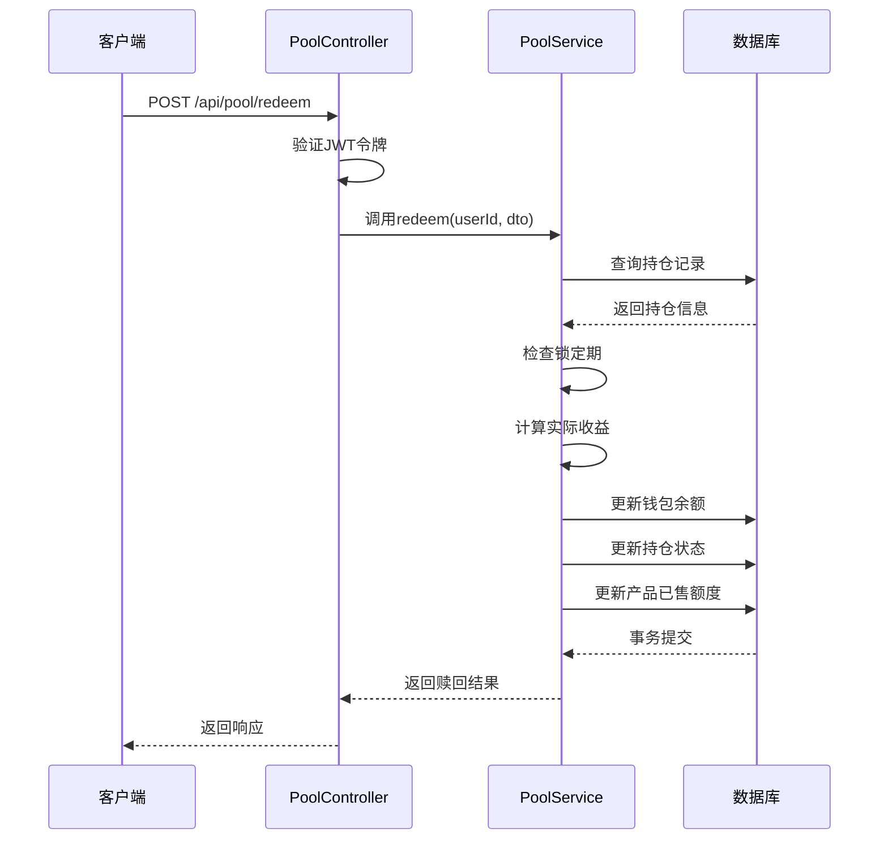
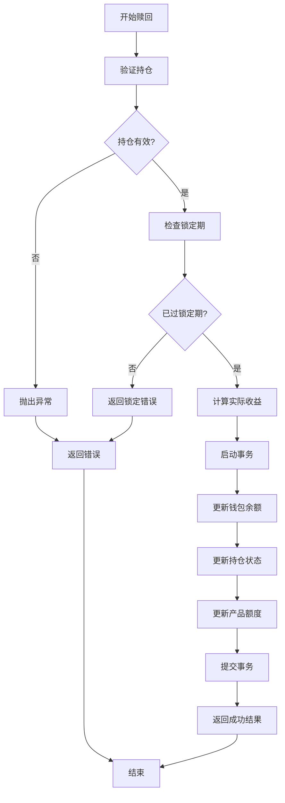
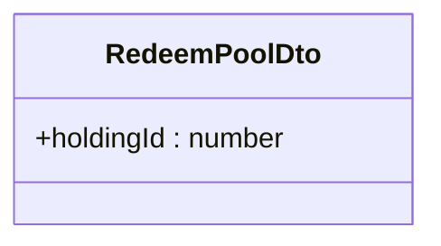
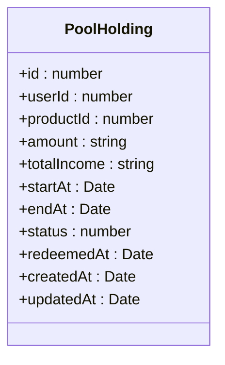
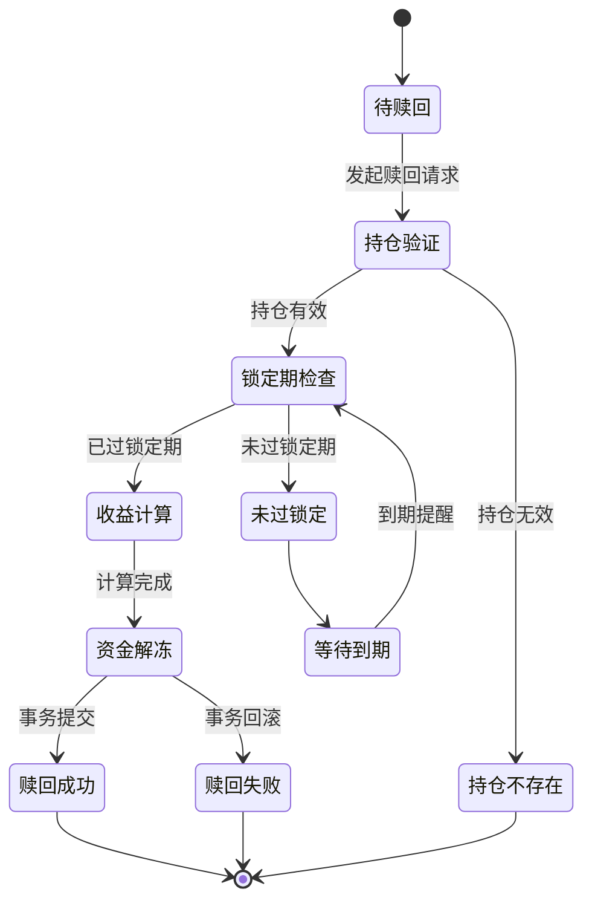

# 矿池赎回功能

<cite>
**本文档引用的文件**   
- [pool.controller.ts](file://agx-backend/src/modules/pool/pool.controller.ts)
- [pool.dto.ts](file://agx-backend/src/modules/pool/pool.dto.ts)
- [pool.service.ts](file://agx-backend/src/modules/pool/pool.service.ts)
- [pool-holding.entity.ts](file://agx-backend/src/entities/pool-holding.entity.ts)
- [pool-product.entity.ts](file://agx-backend/src/entities/pool-product.entity.ts)
- [business.exception.ts](file://agx-backend/src/common/filters/business.exception.ts)
- [api-response.dto.ts](file://agx-backend/src/common/dto/api-response.dto.ts)
</cite>

## 目录
1. [简介](#简介)
2. [核心组件](#核心组件)
3. [业务规则](#业务规则)
4. [数据模型](#数据模型)
5. [错误处理](#错误处理)
6. [请求示例](#请求示例)

## 简介
矿池赎回功能允许用户将其在矿池中的持仓进行赎回操作。该功能通过 `POST /api/pool/redeem` 接口实现，支持部分赎回和全额赎回两种模式。系统会根据持仓类型（活期或定期）执行相应的锁定期检查，并自动结算收益，最终将本金和收益返还至用户钱包。

**Section sources**
- [pool.controller.ts](file://agx-backend/src/modules/pool/pool.controller.ts#L40-L50)

## 核心组件

### 控制器层 (Controller)
`PoolController` 类中的 `redeem` 方法负责处理赎回请求。该方法使用 JWT 认证守卫确保只有登录用户才能发起赎回操作。控制器接收 `RedeemPoolDto` 数据传输对象作为请求体，并将业务逻辑委托给 `PoolService`。



**Diagram sources**
- [pool.controller.ts](file://agx-backend/src/modules/pool/pool.controller.ts#L40-L50)
- [pool.service.ts](file://agx-backend/src/modules/pool/pool.service.ts#L196-L267)

**Section sources**
- [pool.controller.ts](file://agx-backend/src/modules/pool/pool.controller.ts#L40-L50)
- [pool.service.ts](file://agx-backend/src/modules/pool/pool.service.ts#L196-L267)

## 业务规则

### 赎回流程
1. **持仓验证**：系统首先验证指定的持仓ID是否存在且属于当前用户。
2. **锁定期检查**：对于定期产品，检查是否已过锁定期；活期产品可随时赎回。
3. **收益计算**：根据实际持有天数重新计算收益，确保收益结算准确。
4. **资金解冻**：将本金和收益合并后返还至用户对应币种的钱包。
5. **状态更新**：更新持仓记录状态为已赎回，并记录赎回时间。

### 收益结算计算
系统使用以下公式计算实际收益：
```
实际收益 = 持仓数量 × 日收益率 × 实际持有天数
```
其中，实际持有天数是当前时间与开始计息时间之间的天数差。

### 资金解冻流程
赎回时，系统会启动数据库事务，确保以下操作的原子性：
- 更新用户钱包余额（增加本金+收益）
- 更新持仓记录状态为已赎回
- 更新矿池产品的已售额度（减少赎回金额）



**Diagram sources**
- [pool.service.ts](file://agx-backend/src/modules/pool/pool.service.ts#L196-L267)

**Section sources**
- [pool.service.ts](file://agx-backend/src/modules/pool/pool.service.ts#L196-L267)

## 数据模型

### RedeemPoolDto
该数据传输对象定义了赎回请求的参数结构：

| 字段 | 类型 | 约束条件 | 说明 |
|------|------|----------|------|
| holdingId | number | 必须为正数 | 持仓ID，标识要赎回的具体持仓记录 |



**Diagram sources**
- [pool.dto.ts](file://agx-backend/src/modules/pool/pool.dto.ts#L14-L18)

### PoolHolding 实体
该实体表示用户的矿池持仓记录，关键字段包括：

| 字段 | 类型 | 说明 |
|------|------|------|
| id | number | 持仓记录ID |
| userId | number | 用户ID |
| productId | number | 产品ID |
| amount | string | 持仓数量 |
| totalIncome | string | 累计收益 |
| startAt | Date | 开始计息时间 |
| endAt | Date | 到期时间 |
| status | number | 状态：0已赎回 1持仓中 |
| redeemedAt | Date | 赎回时间 |



**Diagram sources**
- [pool-holding.entity.ts](file://agx-backend/src/entities/pool-holding.entity.ts#L15-L59)

**Section sources**
- [pool.dto.ts](file://agx-backend/src/modules/pool/pool.dto.ts#L14-L18)
- [pool-holding.entity.ts](file://agx-backend/src/entities/pool-holding.entity.ts#L15-L59)

## 错误处理

### 赎回限制相关错误
系统在赎回过程中会抛出多种业务异常，主要错误码如下：

| 错误码 | 错误消息 | 触发条件 | HTTP状态码 |
|--------|----------|----------|-----------|
| 3006 | 持仓不存在 | 指定的holdingId不存在或不属于当前用户 | 200 |
| 3007 | 定期产品未到期，无法赎回 | 定期产品仍在锁定期 | 200 |

### 错误处理建议
1. **前端处理**：在用户界面显示友好的错误提示，避免直接暴露技术细节。
2. **重试机制**：对于可恢复的错误（如网络问题），实现自动重试逻辑。
3. **日志记录**：在服务端详细记录错误信息，便于问题排查。
4. **用户引导**：针对锁定错误，提示用户到期时间或推荐其他可赎回产品。



**Diagram sources**
- [business.exception.ts](file://agx-backend/src/common/filters/business.exception.ts#L7-L60)
- [pool.service.ts](file://agx-backend/src/modules/pool/pool.service.ts#L205-L212)

**Section sources**
- [business.exception.ts](file://agx-backend/src/common/filters/business.exception.ts#L7-L60)
- [api-response.dto.ts](file://agx-backend/src/common/dto/api-response.dto.ts#L27-L67)

## 请求示例

### 赎回请求
```json
POST /api/pool/redeem
Content-Type: application/json
Authorization: Bearer <token>

{
  "holdingId": 12345
}
```

### 成功响应
```json
{
  "code": 0,
  "msg": "ok",
  "data": {
    "returnAmount": "105.25000000",
    "principal": "100.00000000",
    "income": "5.25000000",
    "dailyIncome": "0.01000000",
    "annualIncome": "3.65000000"
  }
}
```

### 错误响应（未过锁定期）
```json
{
  "code": 3007,
  "msg": "定期产品未到期，无法赎回",
  "data": null
}
```

**Section sources**
- [pool.service.ts](file://agx-backend/src/modules/pool/pool.service.ts#L252-L258)
- [api-response.dto.ts](file://agx-backend/src/common/dto/api-response.dto.ts#L15-L21)