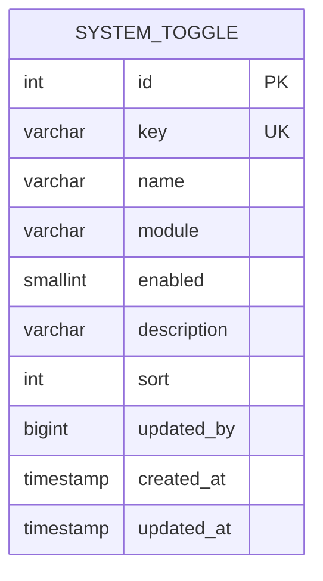
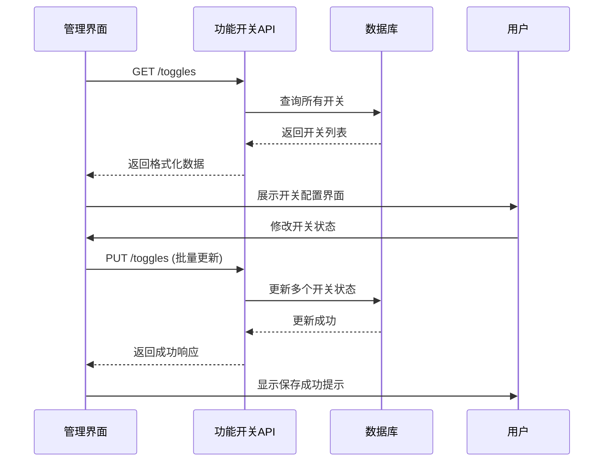
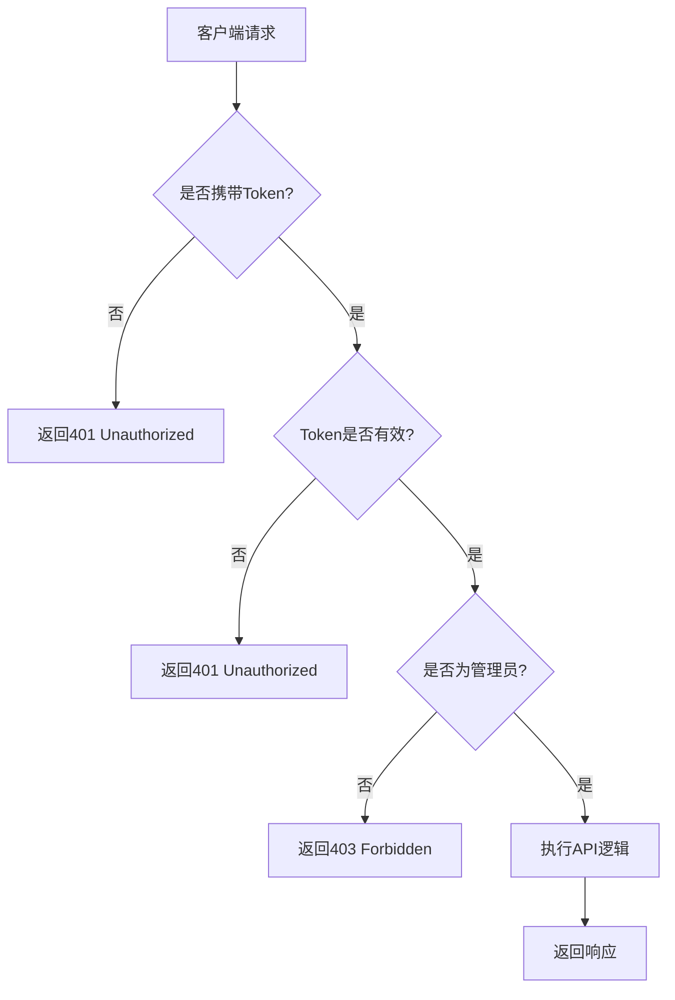

# 功能开关API

<cite>
**本文档引用文件**  
- [system.controller.ts](file://agx-backend/src/modules/system/system.controller.ts)
- [system.service.ts](file://agx-backend/src/modules/system/system.service.ts)
- [system-toggle.entity.ts](file://agx-backend/src/entities/system-toggle.entity.ts)
- [featureSwitch.vue](file://agx-admin/src/views/agx/featureSwitch.vue)
- [API_CONTRACT.md](file://agx-backend/API_CONTRACT.md)
</cite>

## 目录
1. [简介](#简介)
2. [核心功能概述](#核心功能概述)
3. [API端点详细说明](#api端点详细说明)
   - [GET /toggles - 获取功能开关列表](#get-toggles---获取功能开关列表)
   - [PUT /toggles/:key - 更新单个开关](#put-toggleskey---更新单个开关)
   - [PUT /toggles - 批量更新开关](#put-toggles---批量更新开关)
   - [POST /toggles - 创建新开关](#post-toggles---创建新开关)
   - [DELETE /toggles/:key - 删除开关](#delete-toggleskey---删除开关)
   - [POST /toggles/init - 初始化默认开关](#post-togglesinit---初始化默认开关)
4. [前端管理界面集成](#前端管理界面集成)
5. [安全与权限控制](#安全与权限控制)
6. [性能与查询优化](#性能与查询优化)
7. [使用场景与最佳实践](#使用场景与最佳实践)

## 简介
功能开关API提供了一套完整的系统级功能控制机制，允许系统管理员通过RESTful接口动态管理平台各项功能的启用与禁用状态。该系统基于NestJS框架实现，采用TypeORM进行数据库操作，支持模块化分组、批量操作和默认配置初始化。API设计遵循统一的响应格式，确保前后端交互的一致性和可预测性。

**本文档引用文件**  
- [API_CONTRACT.md](file://agx-backend/API_CONTRACT.md#L1-L461)

## 核心功能概述
功能开关系统通过`system-toggle`实体表存储所有开关配置，每个开关包含唯一键名、名称、所属模块、启用状态等属性。系统支持按模块过滤查询，便于前端分组展示。管理员可通过管理后台界面或直接调用API进行配置管理，所有变更实时生效。



**图表来源**  
- [system-toggle.entity.ts](file://agx-backend/src/entities/system-toggle.entity.ts#L16-L47)

**本节来源**  
- [system-toggle.entity.ts](file://agx-backend/src/entities/system-toggle.entity.ts#L1-L48)

## API端点详细说明

### GET /toggles - 获取功能开关列表
获取所有或指定模块的功能开关列表，支持模块过滤。

**HTTP方法**：`GET`  
**URL**：`/api/admin/system/toggles`  
**认证要求**：管理员权限（AdminGuard）  
**查询参数**：
| 参数 | 类型 | 必填 | 说明 |
|------|------|------|------|
| module | string | 否 | 模块名称过滤（如：social, trade, asset） |

**响应格式**：
```json
{
  "code": 0,
  "msg": "ok",
  "data": [
    {
      "id": 1,
      "key": "allow_post",
      "name": "允许发帖",
      "module": "social",
      "enabled": 1,
      "description": "是否允许用户发帖",
      "sort": 1,
      "updatedBy": 1,
      "createdAt": "2024-01-15 10:00:00",
      "updatedAt": "2024-01-15 10:00:00"
    }
  ]
}
```

**错误处理**：
- `401 Unauthorized`：未登录或Token无效
- `403 Forbidden`：非管理员账户访问

**本节来源**  
- [system.controller.ts](file://agx-backend/src/modules/system/system.controller.ts#L13-L16)
- [system.service.ts](file://agx-backend/src/modules/system/system.service.ts#L18-L21)

### PUT /toggles/:key - 更新单个开关
更新指定键名的功能开关状态。

**HTTP方法**：`PUT`  
**URL**：`/api/admin/system/toggles/:key`  
**认证要求**：管理员权限（AdminGuard）  
**URL参数**：
| 参数 | 类型 | 必填 | 说明 |
|------|------|------|------|
| key | string | 是 | 开关的唯一键名 |

**请求体**：
```json
{
  "enabled": 1
}
```

**响应格式**：
```json
{
  "code": 0,
  "msg": "ok",
  "data": {
    "success": true
  }
}
```

**错误处理**：
- `400 Bad Request`：参数格式错误
- `404 Not Found`：指定键名的开关不存在

**本节来源**  
- [system.controller.ts](file://agx-backend/src/modules/system/system.controller.ts#L18-L24)
- [system.service.ts](file://agx-backend/src/modules/system/system.service.ts#L23-L26)

### PUT /toggles - 批量更新开关
批量更新多个功能开关的状态，用于一次性配置多个功能。

**HTTP方法**：`PUT`  
**URL**：`/api/admin/system/toggles`  
**认证要求**：管理员权限（AdminGuard）  
**请求体**：
```json
{
  "toggles": [
    {
      "key": "allow_post",
      "enabled": 1
    },
    {
      "key": "allow_comment",
      "enabled": 0
    }
  ]
}
```

**响应格式**：
```json
{
  "code": 0,
  "msg": "ok",
  "data": {
    "success": true
  }
}
```

**使用场景**：系统维护后批量恢复功能，或根据运营策略一次性调整多个模块的可用性。

**本节来源**  
- [system.controller.ts](file://agx-backend/src/modules/system/system.controller.ts#L26-L29)
- [system.service.ts](file://agx-backend/src/modules/system/system.service.ts#L28-L33)

### POST /toggles - 创建新开关
创建一个新的功能开关配置。

**HTTP方法**：`POST`  
**URL**：`/api/admin/system/toggles`  
**认证要求**：管理员权限（AdminGuard）  
**请求体**：
```json
{
  "key": "new_feature",
  "name": "新功能",
  "module": "social",
  "enabled": 1,
  "description": "新上线的功能",
  "sort": 10
}
```

**响应格式**：
```json
{
  "code": 0,
  "msg": "ok",
  "data": {
    "id": 10,
    "key": "new_feature",
    "name": "新功能",
    "module": "social",
    "enabled": 1,
    "description": "新上线的功能",
    "sort": 10,
    "createdAt": "2024-01-15 10:00:00",
    "updatedAt": "2024-01-15 10:00:00"
  }
}
```

**本节来源**  
- [system.controller.ts](file://agx-backend/src/modules/system/system.controller.ts#L31-L34)
- [system.service.ts](file://agx-backend/src/modules/system/system.service.ts#L35-L38)

### DELETE /toggles/:key - 删除开关
删除指定键名的功能开关。

**HTTP方法**：`DELETE`  
**URL**：`/api/admin/system/toggles/:key`  
**认证要求**：管理员权限（AdminGuard）  
**URL参数**：
| 参数 | 类型 | 必填 | 说明 |
|------|------|------|------|
| key | string | 是 | 开关的唯一键名 |

**响应格式**：
```json
{
  "code": 0,
  "msg": "ok",
  "data": {
    "success": true
  }
}
```

**本节来源**  
- [system.controller.ts](file://agx-backend/src/modules/system/system.controller.ts#L36-L39)
- [system.service.ts](file://agx-backend/src/modules/system/system.service.ts#L40-L43)

### POST /toggles/init - 初始化默认开关
初始化系统默认的功能开关配置，用于系统首次部署或配置重置。

**HTTP方法**：`POST`  
**URL**：`/api/admin/system/toggles/init`  
**认证要求**：管理员权限（AdminGuard）  
**请求体**：无  
**响应格式**：
```json
{
  "code": 0,
  "msg": "ok",
  "data": {
    "success": true,
    "message": "默认开关初始化完成"
  }
}
```

**初始化内容**：
- **社交模块**：发帖、评论、点赞、加好友、私聊
- **交易模块**：现货交易、合约交易、黄金交易
- **资产模块**：充值、提现、划转

**本节来源**  
- [system.controller.ts](file://agx-backend/src/modules/system/system.controller.ts#L41-L44)
- [system.service.ts](file://agx-backend/src/modules/system/system.service.ts#L115-L141)

## 前端管理界面集成
功能开关管理界面通过`featureSwitch.vue`组件实现，采用卡片式布局分组展示各模块开关。界面通过调用后端API实现配置的读取和保存，提供直观的开关控件和保存按钮。



**图表来源**  
- [featureSwitch.vue](file://agx-admin/src/views/agx/featureSwitch.vue#L1-L120)
- [system.controller.ts](file://agx-backend/src/modules/system/system.controller.ts#L26-L29)

**本节来源**  
- [featureSwitch.vue](file://agx-admin/src/views/agx/featureSwitch.vue#L1-L120)

## 安全与权限控制
所有功能开关API端点均受管理员权限保护，通过`AdminGuard`守卫确保只有管理员账户才能访问。系统采用JWT认证机制，请求必须携带有效的管理员Token。



**安全要求**：
- 所有请求必须在`Authorization`头中携带Bearer Token
- 非管理员账户访问将返回403错误
- 敏感操作（如删除、初始化）需二次确认

**本节来源**  
- [jwt-auth.guard.ts](file://agx-backend/src/modules/auth/jwt-auth.guard.ts)
- [system.controller.ts](file://agx-backend/src/modules/system/system.controller.ts#L7)

## 性能与查询优化
系统通过数据库索引和查询优化确保功能开关API的高性能。`key`字段和`module`字段均建立了数据库索引，支持高效的精确查询和范围查询。

**数据库索引**：
- `idx_toggle_key`：`key`字段唯一索引，确保键名唯一性
- `idx_toggle_module`：`module`字段索引，优化模块过滤查询

**查询性能**：
- 单键查询：O(1) 时间复杂度
- 模块过滤查询：O(log n) 时间复杂度
- 全量查询：O(n) 时间复杂度，但数据量通常较小

**本节来源**  
- [system-toggle.entity.ts](file://agx-backend/src/entities/system-toggle.entity.ts#L20-L28)
- [system.service.ts](file://agx-backend/src/modules/system/system.service.ts#L19-L21)

## 使用场景与最佳实践

### 批量更新使用场景
当需要一次性调整多个相关功能的状态时，应使用批量更新API而非多次调用单个更新。例如，在系统维护期间，可以一次性关闭所有交易相关功能：

```json
{
  "toggles": [
    { "key": "allow_spot_trade", "enabled": 0 },
    { "key": "allow_contract_trade", "enabled": 0 },
    { "key": "allow_gold_trade", "enabled": 0 }
  ]
}
```

### 初始化默认开关使用场景
在以下情况下应调用初始化接口：
- 系统首次部署
- 数据库重置后
- 需要恢复默认配置时

初始化操作只会创建不存在的默认开关，不会覆盖现有配置，确保自定义配置的安全性。

**最佳实践**：
1. **命名规范**：开关键名采用小写字母和下划线，如`allow_post`
2. **模块划分**：合理划分模块，便于管理和前端展示
3. **描述说明**：为每个开关提供清晰的描述，便于其他管理员理解
4. **排序控制**：通过sort字段控制开关在管理界面的显示顺序

**本节来源**  
- [system.service.ts](file://agx-backend/src/modules/system/system.service.ts#L115-L141)
- [featureSwitch.vue](file://agx-admin/src/views/agx/featureSwitch.vue#L38-L95)