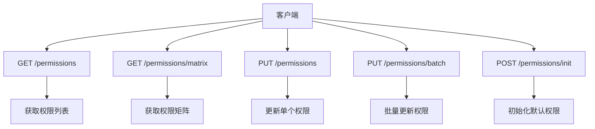
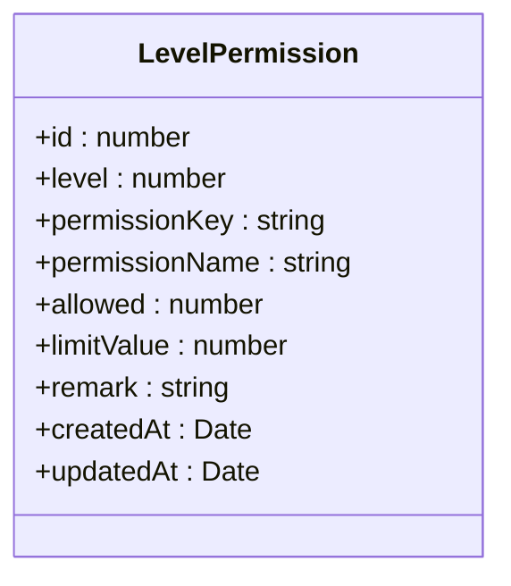
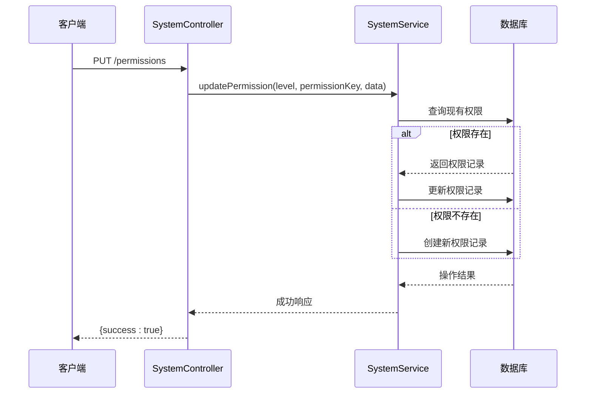
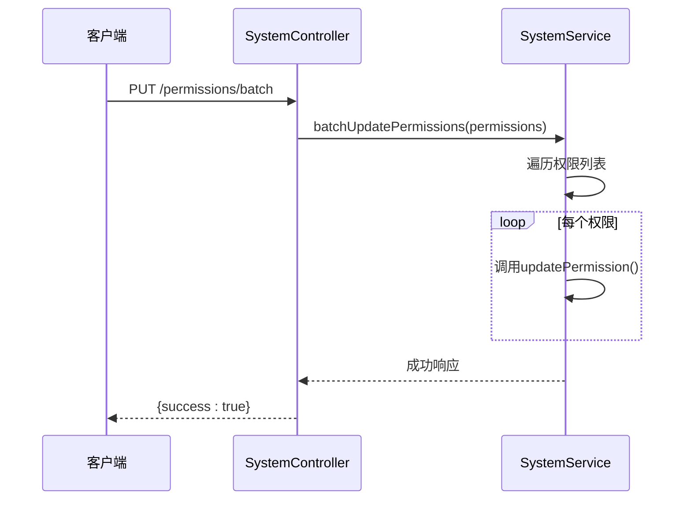
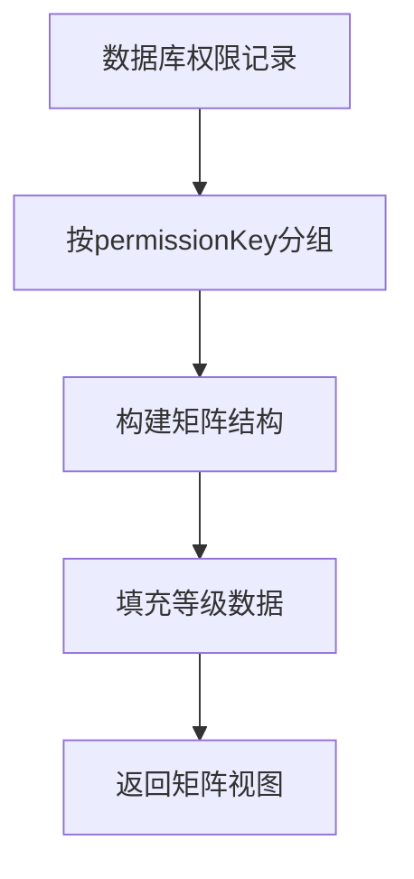
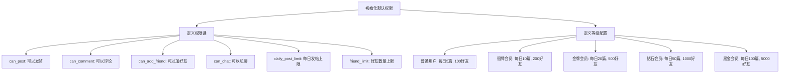
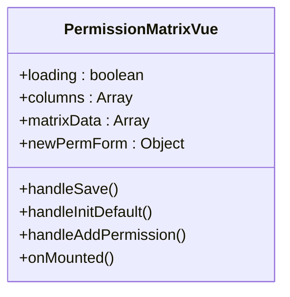
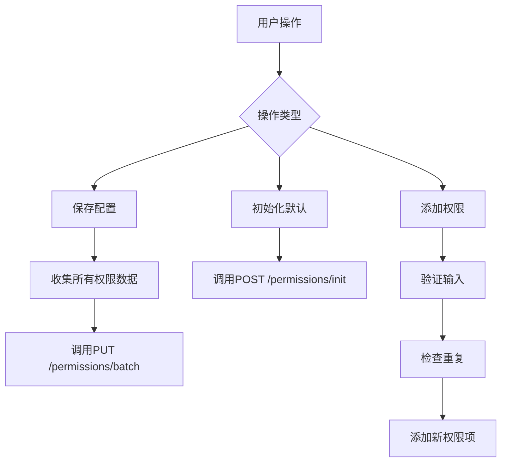
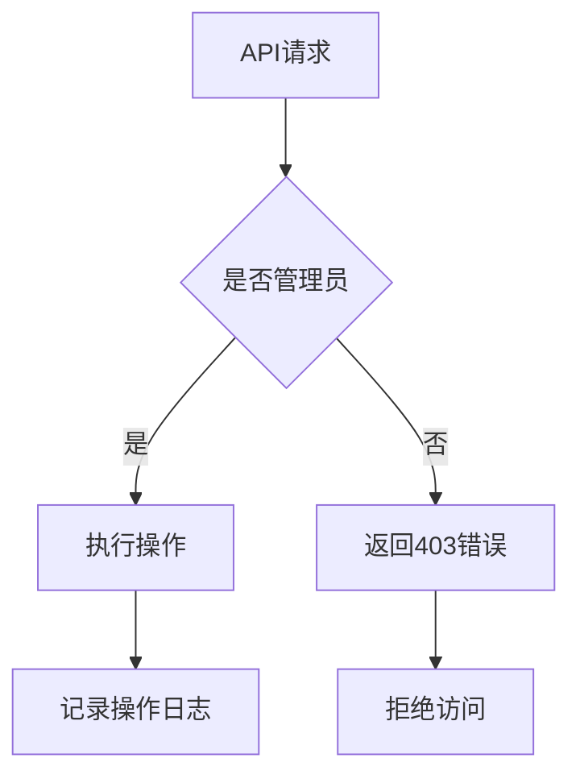

# 等级权限矩阵API

<cite>
**本文档引用的文件**  
- [system.controller.ts](file://agx-backend/src/modules/system/system.controller.ts)
- [system.service.ts](file://agx-backend/src/modules/system/system.service.ts)
- [level-permission.entity.ts](file://agx-backend/src/entities/level-permission.entity.ts)
- [permissionMatrix.vue](file://agx-admin/src/views/agx/permissionMatrix.vue)
</cite>

## 目录
1. [简介](#简介)
2. [核心端点](#核心端点)
3. [权限数据模型](#权限数据模型)
4. [单个更新与批量更新](#单个更新与批量更新)
5. [权限矩阵视图API](#权限矩阵视图api)
6. [初始化默认权限](#初始化默认权限)
7. [前端管理界面集成](#前端管理界面集成)
8. [安全性与访问控制](#安全性与访问控制)

## 简介

等级权限矩阵API是系统权限管理的核心组件，用于定义和管理不同用户等级的功能权限和使用限制。该API系统支持对用户权限的精细化控制，包括功能开关和数量限制，为系统管理员提供了强大的权限配置能力。

**Section sources**
- [system.controller.ts](file://agx-backend/src/modules/system/system.controller.ts#L46-L77)

## 核心端点

等级权限矩阵API提供了一组RESTful端点，用于权限的查询、更新和初始化操作。



**Diagram sources**
- [system.controller.ts](file://agx-backend/src/modules/system/system.controller.ts#L48-L76)

**Section sources**
- [system.controller.ts](file://agx-backend/src/modules/system/system.controller.ts#L48-L76)

## 权限数据模型

权限数据模型定义了权限配置的核心属性和业务含义。

### 数据结构



**Diagram sources**
- [level-permission.entity.ts](file://agx-backend/src/entities/level-permission.entity.ts#L16-L45)

### 字段说明

| 字段 | 类型 | 说明 |
|------|------|------|
| level | number | 用户等级：1=普通, 2=银牌, 3=金牌, 4=钻石, 5=黑金 |
| permissionKey | string | 权限键名，用于程序识别 |
| permissionName | string | 权限名称，用于界面显示 |
| allowed | number | 是否允许：0不允许 1允许 |
| limitValue | number | 限制值（如每日发帖数、好友上限等） |

**Section sources**
- [level-permission.entity.ts](file://agx-backend/src/entities/level-permission.entity.ts#L16-L45)

## 单个更新与批量更新

API提供了单个更新和批量更新两种方式，适用于不同的使用场景。

### 单个更新

单个更新用于修改特定等级的特定权限配置。



**Diagram sources**
- [system.controller.ts](file://agx-backend/src/modules/system/system.controller.ts#L58-L66)
- [system.service.ts](file://agx-backend/src/modules/system/system.service.ts#L90-L105)

### 批量更新

批量更新用于同时修改多个权限配置，提高操作效率。



**Diagram sources**
- [system.controller.ts](file://agx-backend/src/modules/system/system.controller.ts#L68-L71)
- [system.service.ts](file://agx-backend/src/modules/system/system.service.ts#L107-L112)

### 适用场景对比

| 场景 | 单个更新 | 批量更新 |
|------|----------|----------|
| 修改单个权限 | ✓ | |
| 批量修改多个权限 | | ✓ |
| 前端表单提交 | | ✓ |
| 精细控制 | ✓ | |
| 操作效率 | 低 | 高 |

**Section sources**
- [system.controller.ts](file://agx-backend/src/modules/system/system.controller.ts#L58-L71)
- [system.service.ts](file://agx-backend/src/modules/system/system.service.ts#L90-L112)

## 权限矩阵视图API

权限矩阵视图API提供了权限配置的二维矩阵表示，便于前端展示和操作。

### API用途

GET /permissions/matrix端点返回结构化的权限矩阵数据，将扁平化的权限记录转换为易于理解的矩阵格式。

### 数据结构

```json
{
  "levels": [
    { "level": 1, "name": "普通" },
    { "level": 2, "name": "银牌" },
    { "level": 3, "name": "金牌" },
    { "level": 4, "name": "钻石" },
    { "level": 5, "name": "黑金" }
  ],
  "permissions": [
    {
      "key": "can_post",
      "name": "可以发帖",
      "levels": [
        { "level": 1, "allowed": 1, "limitValue": null },
        { "level": 2, "allowed": 1, "limitValue": null },
        { "level": 3, "allowed": 1, "limitValue": null },
        { "level": 4, "allowed": 1, "limitValue": null },
        { "level": 5, "allowed": 1, "limitValue": null }
      ]
    }
  ]
}
```

### 转换逻辑



**Diagram sources**
- [system.service.ts](file://agx-backend/src/modules/system/system.service.ts#L51-L82)

**Section sources**
- [system.controller.ts](file://agx-backend/src/modules/system/system.controller.ts#L53-L56)
- [system.service.ts](file://agx-backend/src/modules/system/system.service.ts#L51-L82)

## 初始化默认权限

初始化API用于设置系统的默认权限配置，确保新部署的系统具有合理的初始权限设置。

### API使用

POST /permissions/init端点会检查并创建预定义的默认权限配置。

### 默认配置



**Diagram sources**
- [system.service.ts](file://agx-backend/src/modules/system/system.service.ts#L143-L185)

**Section sources**
- [system.controller.ts](file://agx-backend/src/modules/system/system.controller.ts#L73-L75)
- [system.service.ts](file://agx-backend/src/modules/system/system.service.ts#L143-L185)

## 前端管理界面集成

前端管理界面利用这些API构建了直观的权限配置界面。

### 界面组件



**Diagram sources**
- [permissionMatrix.vue](file://agx-admin/src/views/agx/permissionMatrix.vue#L69-L237)

### 操作流程



**Diagram sources**
- [permissionMatrix.vue](file://agx-admin/src/views/agx/permissionMatrix.vue#L181-L233)

**Section sources**
- [permissionMatrix.vue](file://agx-admin/src/views/agx/permissionMatrix.vue#L1-L253)

## 安全性与访问控制

所有权限管理API都受到严格的访问控制保护。

### 访问限制



### 安全措施

- 所有权限管理API仅允许管理员访问
- 每个操作都会记录到操作日志
- 使用参数验证防止非法输入
- 数据库操作使用参数化查询防止SQL注入

**Section sources**
- [system.controller.ts](file://agx-backend/src/modules/system/system.controller.ts#L7)
- [system.service.ts](file://agx-backend/src/modules/system/system.service.ts#L9-L15)