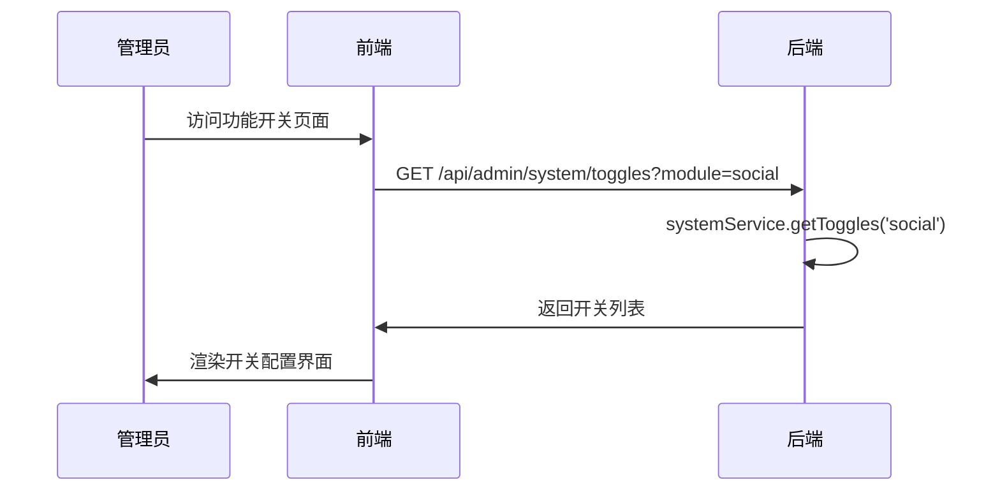
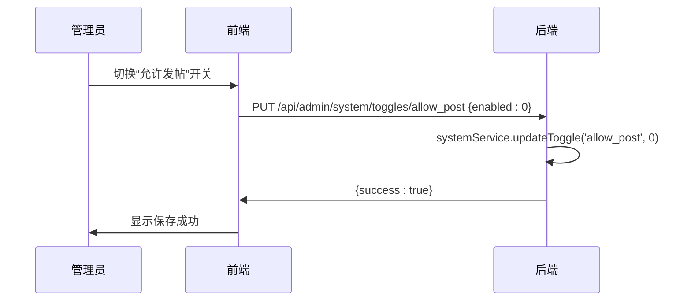
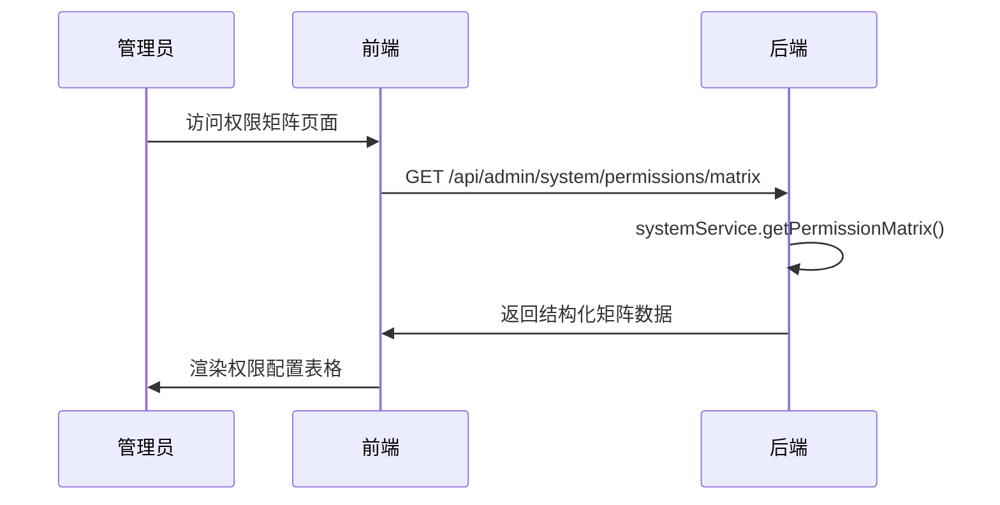
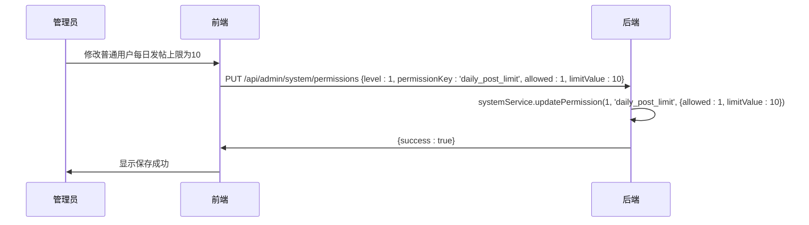
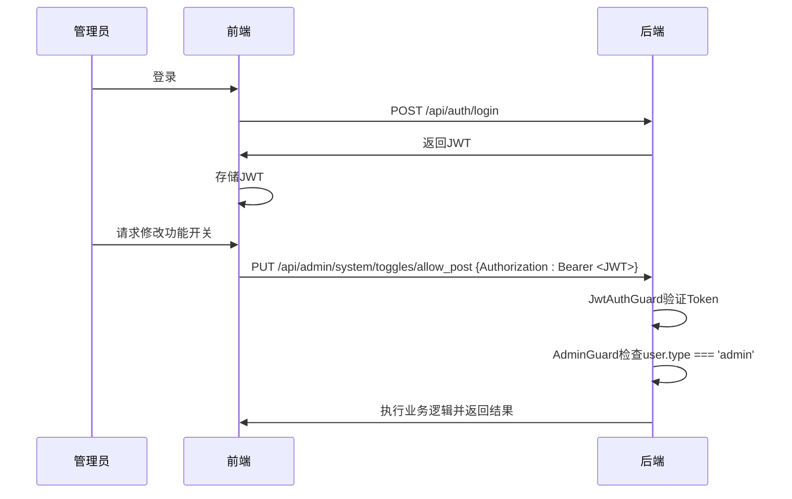

# 系统管理API

<cite>
**本文档引用的文件**
- [system.controller.ts](file://agx-backend/src/modules/system/system.controller.ts)
- [system.service.ts](file://agx-backend/src/modules/system/system.service.ts)
- [system-toggle.entity.ts](file://agx-backend/src/entities/system-toggle.entity.ts)
- [level-permission.entity.ts](file://agx-backend/src/entities/level-permission.entity.ts)
- [featureSwitch.vue](file://agx-admin/src/views/agx/featureSwitch.vue)
- [permissionMatrix.vue](file://agx-admin/src/views/agx/permissionMatrix.vue)
- [jwt-auth.guard.ts](file://agx-backend/src/modules/auth/jwt-auth.guard.ts)
</cite>

## 目录
1. [简介](#简介)
2. [功能开关API](#功能开关api)
3. [等级权限矩阵API](#等级权限矩阵api)
4. [安全机制](#安全机制)
5. [初始化API](#初始化api)
6. [管理后台集成示例](#管理后台集成示例)

## 简介
本文档详细说明了系统管理API，主要面向管理员用户。文档重点介绍两大核心功能：功能开关（toggles）和等级权限矩阵（permissions）。功能开关API允许管理员通过标准的HTTP方法（GET、PUT、POST、DELETE）对系统的各项功能进行精细化的开启和关闭控制。等级权限矩阵API则提供了对不同用户等级（如普通、银牌、金牌等）的功能权限和使用限制（如每日发帖数、好友上限）的配置能力。所有API均位于`/api/admin/system`命名空间下，并通过JWT认证和管理员守卫确保只有授权管理员才能访问。

**Section sources**
- [system.controller.ts](file://agx-backend/src/modules/system/system.controller.ts#L7-L77)

## 功能开关API
功能开关API用于动态控制前端和后端各项功能的启用状态。每个开关项由一个唯一的`key`标识，并归属于特定的`module`（如`social`、`trade`）。`enabled`字段的值为1表示开启，0表示关闭。

### 查询功能开关
使用`GET`方法获取所有或特定模块的功能开关列表。

- **端点**: `GET /api/admin/system/toggles`
- **查询参数**:
  - `module` (可选): 过滤指定模块的开关，例如 `module=social`
- **响应**: 返回一个`SystemToggle`对象数组。

**Diagram sources**
- [system.controller.ts](file://agx-backend/src/modules/system/system.controller.ts#L13-L16)
- [system.service.ts](file://agx-backend/src/modules/system/system.service.ts#L18-L21)
- [featureSwitch.vue](file://agx-admin/src/views/agx/featureSwitch.vue#L38-L95)

### 更新功能开关
使用`PUT`方法更新单个或多个开关项的状态。

- **更新单个开关**:
  - **端点**: `PUT /api/admin/system/toggles/:key`
  - **路径参数**: `key` (开关的唯一键名)
  - **请求体**: `{ "enabled": 1 }` 或 `{ "enabled": 0 }`
- **批量更新开关**:
  - **端点**: `PUT /api/admin/system/toggles`
  - **请求体**: `{ "toggles": [{ "key": "allow_post", "enabled": 1 }, ...] }`

**Diagram sources**
- [system.controller.ts](file://agx-backend/src/modules/system/system.controller.ts#L18-L29)
- [system.service.ts](file://agx-backend/src/modules/system/system.service.ts#L23-L33)
- [featureSwitch.vue](file://agx-admin/src/views/agx/featureSwitch.vue#L97-L102)

### 创建和删除功能开关
使用`POST`和`DELETE`方法管理开关项。

- **创建新开关**:
  - **端点**: `POST /api/admin/system/toggles`
  - **请求体**: 包含`key`, `name`, `module`, `enabled`等字段的`SystemToggle`对象。
- **删除开关**:
  - **端点**: `DELETE /api/admin/system/toggles/:key`
  - **路径参数**: `key` (要删除的开关键名)

**Section sources**
- [system.controller.ts](file://agx-backend/src/modules/system/system.controller.ts#L31-L39)
- [system.service.ts](file://agx-backend/src/modules/system/system.service.ts#L35-L43)
- [system-toggle.entity.ts](file://agx-backend/src/entities/system-toggle.entity.ts#L1-L48)

## 等级权限矩阵API
等级权限矩阵API用于管理不同用户等级的权限和限制。核心数据结构包含`level`（等级）、`permissionKey`（权限键）、`allowed`（是否允许）和`limitValue`（限制值）四个字段。

### 查询权限配置
提供两种查询方式：按等级查询和获取完整的矩阵视图。

- **按等级查询**:
  - **端点**: `GET /api/admin/system/permissions`
  - **查询参数**: `level` (可选，指定查询的等级)
  - **响应**: 返回该等级的所有`LevelPermission`记录。
- **获取权限矩阵**:
  - **端点**: `GET /api/admin/system/permissions/matrix`
  - **响应**: 返回一个结构化的矩阵对象，包含所有权限项及其在各个等级上的配置，便于前端表格渲染。

**Diagram sources**
- [system.controller.ts](file://agx-backend/src/modules/system/system.controller.ts#L48-L56)
- [system.service.ts](file://agx-backend/src/modules/system/system.service.ts#L46-L83)
- [permissionMatrix.vue](file://agx-admin/src/views/agx/permissionMatrix.vue#L84-L178)

### 更新权限配置
支持更新单个权限项或批量更新整个矩阵。

- **更新单个权限**:
  - **端点**: `PUT /api/admin/system/permissions`
  - **请求体**: `{ "level": 1, "permissionKey": "can_post", "allowed": 1, "limitValue": 5 }`
- **批量更新权限**:
  - **端点**: `PUT /api/admin/system/permissions/batch`
  - **请求体**: `{ "permissions": [{ "level": 1, "permissionKey": "can_post", "allowed": 1, "limitValue": 5 }, ...] }`

**Diagram sources**
- [system.controller.ts](file://agx-backend/src/modules/system/system.controller.ts#L58-L71)
- [system.service.ts](file://agx-backend/src/modules/system/system.service.ts#L90-L112)
- [permissionMatrix.vue](file://agx-admin/src/views/agx/permissionMatrix.vue#L181-L197)

## 安全机制
所有系统管理API均受到严格的安全保护，确保只有经过身份验证的管理员才能访问。

- **认证**: 使用JWT（JSON Web Token）进行认证。管理员在登录后会获得一个JWT，后续请求需在`Authorization`头中携带此Token。
- **授权**: 使用`AdminGuard`守卫进行授权。该守卫继承自`JwtAuthGuard`，并在`handleRequest`方法中检查用户类型。如果用户存在但`user.type`不为`admin`，则抛出“需要管理员权限”的异常。

**Section sources**
- [system.controller.ts](file://agx-backend/src/modules/system/system.controller.ts#L7)
- [jwt-auth.guard.ts](file://agx-backend/src/modules/auth/jwt-auth.guard.ts#L22-L37)
- [auth.module.ts](file://agx-backend/src/modules/auth/auth.module.ts#L1-L25)

## 初始化API
提供初始化API，用于在系统首次部署或配置丢失时恢复默认的开关和权限配置。

- **初始化默认开关**:
  - **端点**: `POST /api/admin/system/toggles/init`
  - **方法**: `POST`
  - **作用**: 检查数据库中是否存在预设的开关项（如`allow_post`, `allow_comment`等），如果不存在则创建它们。
- **初始化默认权限**:
  - **端点**: `POST /api/admin/system/permissions/init`
  - **方法**: `POST`
  - **作用**: 为预设的权限项（如`can_post`, `daily_post_limit`等）在各个等级上创建默认配置。

**Section sources**
- [system.controller.ts](file://agx-backend/src/modules/system/system.controller.ts#L41-L44)
- [system.controller.ts](file://agx-backend/src/modules/system/system.controller.ts#L73-L76)
- [system.service.ts](file://agx-backend/src/modules/system/system.service.ts#L115-L185)

## 管理后台集成示例
管理后台的`featureSwitch.vue`和`permissionMatrix.vue`页面直接使用了上述API来实现用户友好的配置界面。

- **功能开关界面** (`featureSwitch.vue`): 该页面将功能开关按模块分组（如交易、资产、社交），使用`a-switch`组件绑定`enabled`状态。当管理员点击“保存配置”时，前端会收集所有开关的状态，并通过`PUT /api/admin/system/toggles`批量更新API提交到后端。
- **权限矩阵界面** (`permissionMatrix.vue`): 该页面使用`a-table`组件渲染一个二维表格，行代表权限项，列代表用户等级。单元格内包含一个开关和一个可选的数字输入框（用于`limitValue`）。点击“保存配置”时，前端会遍历表格数据，构建权限数组，并通过`PUT /api/admin/system/permissions/batch`批量更新API提交。页面还提供了“初始化默认配置”按钮，用于调用`POST /api/admin/system/permissions/init` API。

**Section sources**
- [featureSwitch.vue](file://agx-admin/src/views/agx/featureSwitch.vue)
- [permissionMatrix.vue](file://agx-admin/src/views/agx/permissionMatrix.vue)