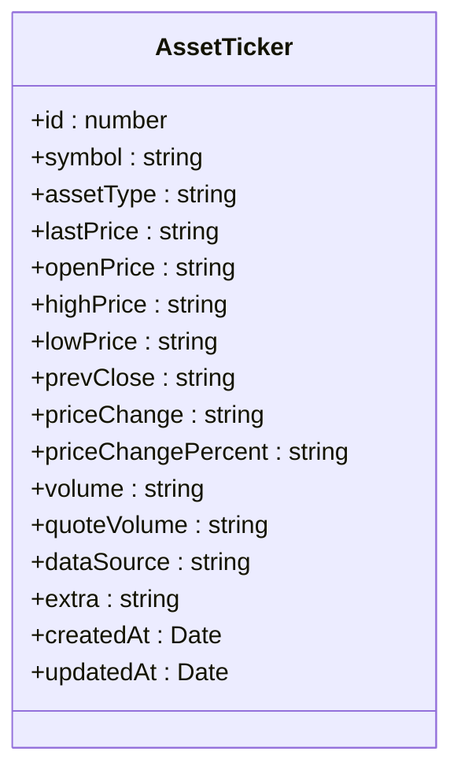
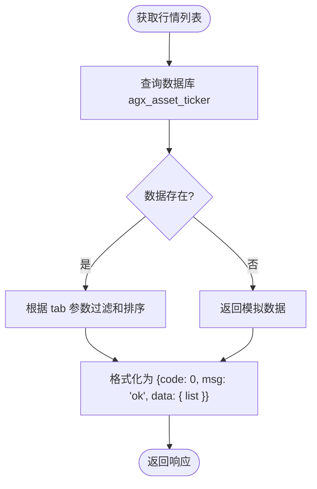

# 行情数据API

<cite>
**本文档引用的文件**
- [market.controller.ts](file://agx-backend/src/modules/market/market.controller.ts)
- [asset-ticker.entity.ts](file://agx-backend/src/entities/asset-ticker.entity.ts)
- [market.service.ts](file://agx-backend/src/modules/market/market.service.ts)
- [marketCrypto.vue](file://agx-admin/src/views/agx/marketCrypto.vue)
- [Orders.vue](file://h5/src/views/Orders.vue)
- [api.js](file://h5/src/utils/api.js)
</cite>

## 目录
1. [简介](#简介)
2. [API端点说明](#api端点说明)
3. [数据结构与实体](#数据结构与实体)
4. [数据获取与格式化流程](#数据获取与格式化流程)
5. [前端使用示例](#前端使用示例)
6. [错误处理](#错误处理)
7. [数据刷新频率与性能优化](#数据刷新频率与性能优化)
8. [总结](#总结)

## 简介

行情数据API为系统提供实时的资产行情信息，支持多种资产类型，包括加密货币、外汇、股票、债券、基金和贵金属等。该API通过`GET /api/market/tickers`和`GET /api/market/ticker/:symbol`两个核心端点，分别提供批量行情数据和单个资产的详细行情信息。数据来源于`asset-ticker.entity.ts`实体表，通过`market.service.ts`进行业务逻辑处理，并在前端管理后台和移动端应用中广泛使用。

**Section sources**
- [market.controller.ts](file://agx-backend/src/modules/market/market.controller.ts#L1-L59)
- [asset-ticker.entity.ts](file://agx-backend/src/entities/asset-ticker.entity.ts#L1-L66)

## API端点说明

### 获取所有交易对的最新行情数据 (GET /api/market/tickers)

此端点用于获取指定资产类型的行情列表。

**请求示例**
```
GET /api/market/tickers?type=crypto&tab=all
```

**查询参数**

| 参数 | 类型 | 必填 | 说明 |
|------|------|------|------|
| type | string | 否 | 资产类型，可选值：`crypto`（加密货币）、`forex`（外汇）、`stocks`（股票）、`bonds`（债券）、`metal`（贵金属）、`fund`（基金）。默认为`crypto`。 |
| tab | string | 否 | 子分类筛选，可选值：`all`（全部）、`hot`（热门）、`gainers`（涨幅榜）、`losers`（跌幅榜）、`volume`（成交量榜）。默认为`all`。 |

**响应结构**
```json
{
  "code": 0,
  "msg": "ok",
  "data": {
    "list": [
      {
        "symbol": "BTCUSDT",
        "assetType": "crypto",
        "lastPrice": "98062.63",
        "priceChange": "0",
        "priceChangePercent": "0.56",
        "volume": "12345678900",
        "quoteVolume": "0",
        "dataSource": null,
        "extra": null,
        "createdAt": "2025-04-05T08:00:00.000Z",
        "updatedAt": "2025-04-05T08:00:00.000Z"
      }
    ]
  }
}
```

### 获取单个交易对的详细信息 (GET /api/market/ticker/:symbol)

此端点用于获取指定交易对的详细行情信息。

**请求示例**
```
GET /api/market/ticker/BTCUSDT
```

**路径参数**

| 参数 | 类型 | 必填 | 说明 |
|------|------|------|------|
| symbol | string | 是 | 交易对符号，如 `BTCUSDT`。 |

**响应结构**
```json
{
  "code": 0,
  "msg": "ok",
  "data": {
    "symbol": "BTCUSDT",
    "assetType": "crypto",
    "lastPrice": "98062.63",
    "priceChange": "0",
    "priceChangePercent": "0.56",
    "volume": "12345678900",
    "quoteVolume": "0",
    "dataSource": null,
    "extra": null,
    "createdAt": "2025-04-05T08:00:00.000Z",
    "updatedAt": "2025-04-05T08:00:00.000Z"
  }
}
```

**Section sources**
- [market.controller.ts](file://agx-backend/src/modules/market/market.controller.ts#L16-L33)

## 数据结构与实体

行情数据的核心实体是`AssetTicker`，它定义了所有行情数据的字段。



**关键字段说明**

| 字段 | 类型 | 说明 |
|------|------|------|
| lastPrice | decimal(20,8) | 最新价格 |
| priceChange | decimal(20,8) | 价格变动（最新价 - 前收盘价） |
| priceChangePercent | decimal(10,4) | 价格变动百分比 |
| volume | decimal(30,8) | 24小时成交量 |
| quoteVolume | decimal(30,8) | 24小时成交额 |
| assetType | varchar(20) | 资产类型 |

**Diagram sources**
- [asset-ticker.entity.ts](file://agx-backend/src/entities/asset-ticker.entity.ts#L16-L64)

**Section sources**
- [asset-ticker.entity.ts](file://agx-backend/src/entities/asset-ticker.entity.ts#L1-L66)

## 数据获取与格式化流程

行情数据的获取和格式化由`MarketService`完成，其核心流程如下：

1.  **数据来源**：数据主要从`agx_asset_ticker`数据库表中读取。
2.  **查询构建**：`getTickers`方法使用`typeorm`的`createQueryBuilder`根据`assetType`参数构建查询。
3.  **缓存检查**：如果数据库中没有找到数据，服务会返回一个预定义的模拟（mock）数据集。
4.  **数据过滤与排序**：根据`tab`参数对数据进行过滤和排序：
    *   `gainers`：筛选涨幅大于0的资产，并按涨幅降序排列。
    *   `losers`：筛选跌幅小于0的资产，并按跌幅升序排列。
    *   `volume`：按24小时成交额降序排列。
5.  **返回结果**：最终结果被包装在标准的响应格式中返回。



**Diagram sources**
- [market.service.ts](file://agx-backend/src/modules/market/market.service.ts#L39-L65)

**Section sources**
- [market.service.ts](file://agx-backend/src/modules/market/market.service.ts#L1-L209)

## 前端使用示例

### 前端管理后台 (marketCrypto.vue)

在`agx-admin`的`marketCrypto.vue`页面中，管理员可以管理数字货币行情。该页面通过一个表格展示所有币种的行情信息，包括当前价格、24小时涨跌幅和24小时成交额。

**关键代码逻辑**：
- 使用`a-table`组件展示数据。
- `formatPrice`函数根据价格大小动态调整小数位数。
- `formatVolume`函数将大额成交量转换为K、M、B等单位。
- 通过`syncPrices`方法可以手动同步行情数据。

**Section sources**
- [marketCrypto.vue](file://agx-admin/src/views/agx/marketCrypto.vue#L1-L304)

### 移动端 (Orders.vue)

在H5移动端的`Orders.vue`页面中，订单列表会显示相关交易对的行情信息。例如，一个`BTC/USDT`的订单会显示该交易对的最新价格。

**API调用方式**：
前端通过`api.js`中定义的`market`模块调用API。

```javascript
// h5/src/utils/api.js
const api = {
  market: {
    getTickers: (type, tab) => apiClient.get('/api/market/tickers', { params: { type, tab } }),
    getTicker: (symbol) => apiClient.get(`/api/market/ticker/${symbol}`),
    // ...
  }
}
```

**使用示例**：
```javascript
import { marketApi } from '@/api/market.js'

// 获取BTC/USDT的行情
const response = await marketApi.getTicker('BTCUSDT')
if (response.success) {
  console.log('最新价格:', response.data.lastPrice)
}
```

**Section sources**
- [Orders.vue](file://h5/src/views/Orders.vue#L1-L420)
- [api.js](file://h5/src/utils/api.js#L104-L110)

## 错误处理

后端API采用统一的响应格式，通过`code`字段来标识状态。

| code | 说明 |
|------|------|
| 0 | 请求成功 |
| 1002 | 未登录，前端会自动跳转到登录页 |

前端`api.js`中的响应拦截器会处理这些状态：
- 当`code`为0时，返回`{ success: true, data: ... }`。
- 当`code`为1002时，清除本地token并重定向到登录页。
- 其他错误码会返回`{ success: false, message: ... }`。

**Section sources**
- [api.js](file://h5/src/utils/api.js#L27-L42)

## 数据刷新频率与性能优化

### 数据刷新频率
- **后端**：行情数据的更新频率取决于数据源的推送频率。目前代码中使用了模拟数据，实际生产环境应由一个定时任务或WebSocket服务来定期更新`agx_asset_ticker`表。
- **前端**：前端应用通常会设置一个定时器（如每30秒）来轮询`/api/market/tickers`端点，以保持行情数据的实时性。

### 性能优化建议
1.  **数据库索引**：`asset-ticker.entity.ts`中已为`symbol`和`assetType`字段创建了索引（`@Index`），这能显著提高查询速度。
2.  **缓存层**：引入Redis等缓存中间件，将频繁访问的行情数据缓存起来，减少数据库查询压力。
3.  **分页查询**：对于`getTickers`端点，当数据量巨大时，应支持分页参数（如`page`和`pageSize`），避免一次性返回过多数据。
4.  **WebSocket**：对于需要极高实时性的场景，应使用WebSocket（如`market.gateway.js`所示）主动推送行情更新，而非轮询。

**Section sources**
- [asset-ticker.entity.ts](file://agx-backend/src/entities/asset-ticker.entity.ts#L20-L25)
- [market.gateway.js](file://agx-backend/src/modules/market/market.gateway.ts)

## 总结

行情数据API是系统的核心功能之一，为用户提供实时、准确的市场信息。通过清晰的端点设计、合理的数据结构和高效的业务逻辑，该API能够满足前端管理后台和移动端的多样化需求。未来可通过引入缓存和WebSocket等技术进一步提升性能和用户体验。