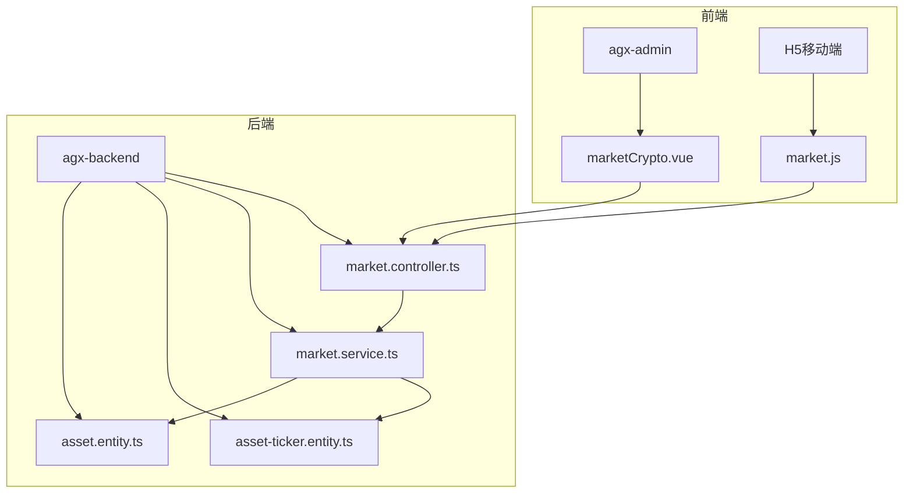
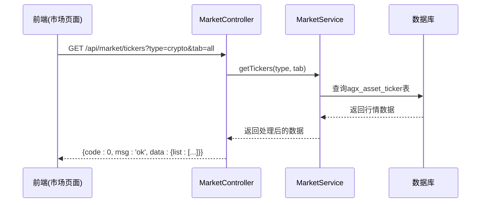
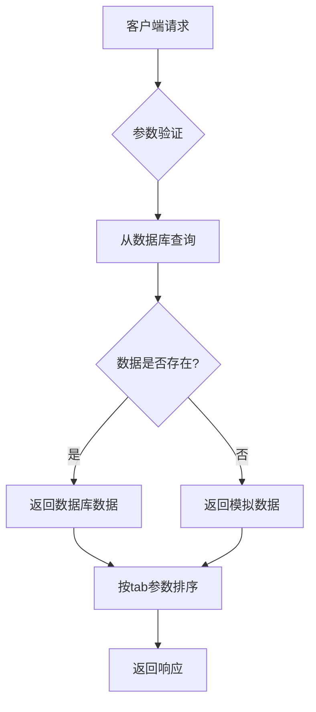
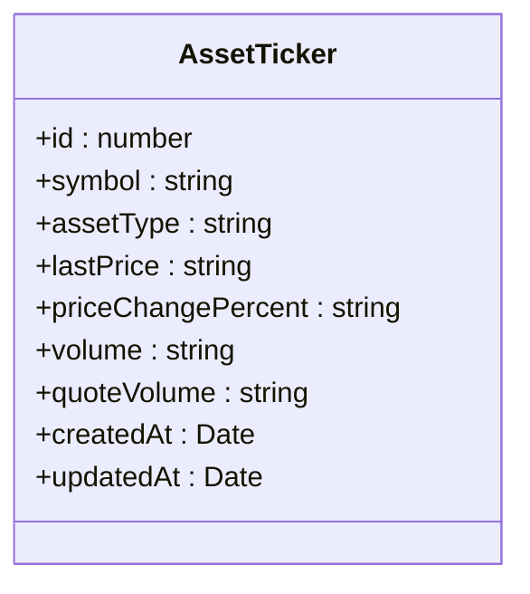
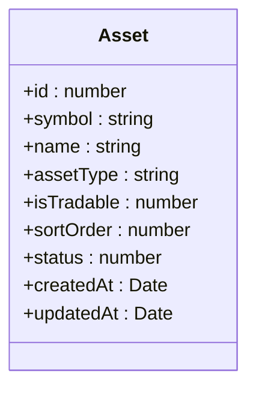
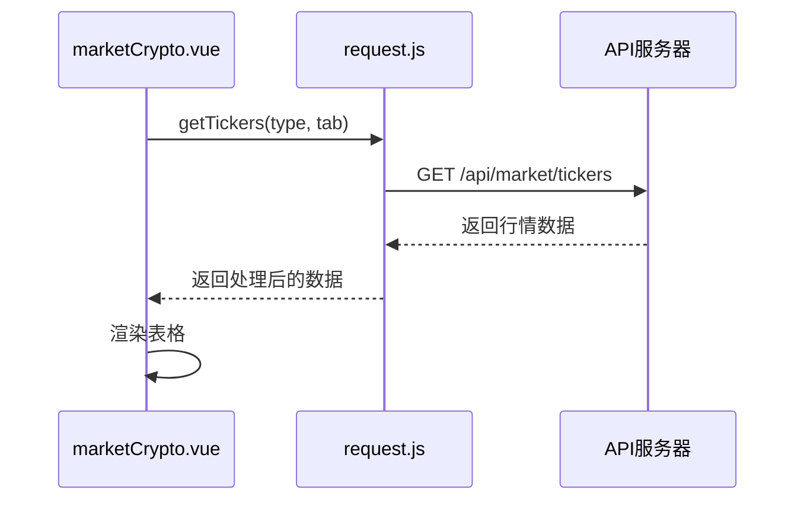
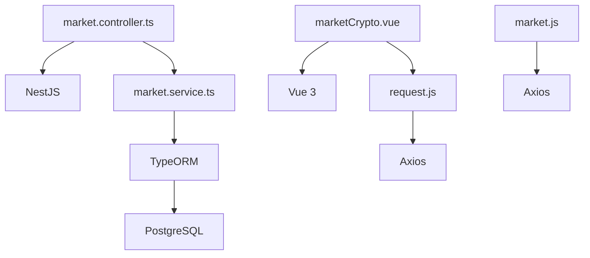

# 行情服务API

<cite>
**本文档引用文件**  
- [market.controller.ts](file://agx-backend/src/modules/market/market.controller.ts)
- [market.service.ts](file://agx-backend/src/modules/market/market.service.ts)
- [asset-ticker.entity.ts](file://agx-backend/src/entities/asset-ticker.entity.ts)
- [asset.entity.ts](file://agx-backend/src/entities/asset.entity.ts)
- [marketCrypto.vue](file://agx-admin/src/views/agx/marketCrypto.vue)
- [api.js](file://h5/src/utils/api.js)
- [request.js](file://agx-admin/src/utils/request.js)
</cite>

## 目录
1. [简介](#简介)
2. [项目结构](#项目结构)
3. [核心组件](#核心组件)
4. [架构概述](#架构概述)
5. [详细组件分析](#详细组件分析)
6. [依赖分析](#依赖分析)
7. [性能考虑](#性能考虑)
8. [故障排除指南](#故障排除指南)
9. [结论](#结论)

## 简介
本文档全面介绍行情服务API，涵盖获取行情列表、单个行情数据、K线数据和资产配置等端点。重点说明`GET /api/market/tickers`、`/ticker/:symbol`、`/klines`和`/assets`等API的查询参数（如type, tab, symbol, interval）、响应数据结构和使用场景。特别说明K线数据的格式（通常是时间戳、开盘价、最高价、最低价、收盘价、成交量的数组）。文档以`market.controller.ts`为源，解释后端如何从数据库或外部API获取数据。同时提供前端（如agx-admin的marketCrypto.vue）和移动端如何使用这些API渲染图表和行情列表的示例。

## 项目结构
行情服务API主要分布在后端`agx-backend`和前端`agx-admin`两个项目中。后端API由NestJS框架实现，位于`agx-backend/src/modules/market/`目录下，包含控制器、服务和实体类。前端管理界面位于`agx-admin/src/views/agx/`目录下，使用Vue 3和Arco Design组件库构建。移动端H5应用位于`h5/`目录，使用Vue 3和Axios进行API调用。

**图表来源**  
- [market.controller.ts](file://agx-backend/src/modules/market/market.controller.ts)
- [marketCrypto.vue](file://agx-admin/src/views/agx/marketCrypto.vue)
- [market.js](file://h5/src/api/market.js)

**本节来源**  
- [market.controller.ts](file://agx-backend/src/modules/market/market.controller.ts)
- [marketCrypto.vue](file://agx-admin/src/views/agx/marketCrypto.vue)

## 核心组件
行情服务API的核心组件包括后端控制器`MarketController`、服务`MarketService`和数据实体`AssetTicker`、`Asset`，以及前端组件`marketCrypto.vue`。`MarketController`定义了四个主要API端点：获取行情列表、获取单个行情、获取K线数据和获取资产配置列表。`MarketService`负责从数据库或外部API获取数据，并进行业务逻辑处理。`AssetTicker`实体存储实时行情数据，`Asset`实体存储资产配置信息。前端`marketCrypto.vue`组件使用这些API渲染数字货币行情管理界面。

**本节来源**  
- [market.controller.ts](file://agx-backend/src/modules/market/market.controller.ts)
- [market.service.ts](file://agx-backend/src/modules/market/market.service.ts)
- [asset-ticker.entity.ts](file://agx-backend/src/entities/asset-ticker.entity.ts)
- [asset.entity.ts](file://agx-backend/src/entities/asset.entity.ts)
- [marketCrypto.vue](file://agx-admin/src/views/agx/marketCrypto.vue)

## 架构概述
行情服务API采用典型的分层架构，包括控制器层、服务层和数据访问层。控制器层负责接收HTTP请求并返回响应，服务层负责业务逻辑处理，数据访问层负责与数据库交互。前端通过axios库调用API，后端使用TypeORM进行数据库操作。API响应遵循统一格式：`{ code: 0, msg: 'ok', data: {...} }`，其中code为0表示成功。

**图表来源**  
- [market.controller.ts](file://agx-backend/src/modules/market/market.controller.ts)
- [market.service.ts](file://agx-backend/src/modules/market/market.service.ts)

**本节来源**  
- [market.controller.ts](file://agx-backend/src/modules/market/market.controller.ts)
- [market.service.ts](file://agx-backend/src/modules/market/market.service.ts)

## 详细组件分析

### API端点分析
行情服务API提供了四个主要端点，分别用于获取不同类型的行情数据。

#### 获取行情列表
`GET /api/market/tickers`端点用于获取行情列表，支持`type`和`tab`两个查询参数。`type`参数指定资产类型（如crypto、forex、stocks等），`tab`参数指定子分类（如all、hot、gainers、losers、volume）。服务层会根据`tab`参数对数据进行过滤和排序。

**图表来源**  
- [market.controller.ts](file://agx-backend/src/modules/market/market.controller.ts#L16-L23)
- [market.service.ts](file://agx-backend/src/modules/market/market.service.ts#L39-L65)

#### 获取单个行情
`GET /api/market/ticker/:symbol`端点用于获取单个行情数据，`:symbol`路径参数指定交易对符号。服务层会尝试从数据库查询该符号的行情数据，如果不存在则返回模拟数据。

#### 获取K线数据
`GET /api/market/klines`端点用于获取K线数据，支持`symbol`、`interval`和`limit`三个查询参数。`symbol`参数指定交易对，`interval`参数指定时间间隔（默认1h），`limit`参数指定返回数据条数（默认100）。目前该功能尚未实现，返回模拟数据。

#### 获取资产配置
`GET /api/market/assets`端点用于获取资产配置列表，可选`type`查询参数用于过滤特定类型的资产。服务层会从`agx_asset`表查询启用状态的资产，并按排序值升序排列。

**本节来源**  
- [market.controller.ts](file://agx-backend/src/modules/market/market.controller.ts)
- [market.service.ts](file://agx-backend/src/modules/market/market.service.ts)

### 数据结构分析
行情服务API涉及两个主要数据实体：`AssetTicker`和`Asset`。

#### AssetTicker实体
`AssetTicker`实体存储实时行情数据，包含以下字段：
- `id`: 主键
- `symbol`: 资产代码
- `assetType`: 资产类型
- `lastPrice`: 最新价格
- `priceChangePercent`: 价格变动百分比
- `volume`: 成交量
- `quoteVolume`: 成交额

**图表来源**  
- [asset-ticker.entity.ts](file://agx-backend/src/entities/asset-ticker.entity.ts)

#### Asset实体
`Asset`实体存储资产配置信息，包含以下字段：
- `id`: 主键
- `symbol`: 资产代码
- `name`: 资产名称
- `assetType`: 资产类型
- `isTradable`: 是否可交易
- `sortOrder`: 排序值
- `status`: 状态（启用/禁用）

**图表来源**  
- [asset.entity.ts](file://agx-backend/src/entities/asset.entity.ts)

### 前端使用分析
前端通过`request.js`和`api.js`封装的HTTP客户端调用行情API。`agx-admin`中的`marketCrypto.vue`组件使用这些API渲染数字货币行情管理界面，包括行情列表、搜索、筛选和操作功能。移动端H5应用通过`market.js`模块调用相同的API。

**图表来源**  
- [marketCrypto.vue](file://agx-admin/src/views/agx/marketCrypto.vue)
- [request.js](file://agx-admin/src/utils/request.js)
- [api.js](file://h5/src/utils/api.js)

**本节来源**  
- [marketCrypto.vue](file://agx-admin/src/views/agx/marketCrypto.vue)
- [request.js](file://agx-admin/src/utils/request.js)
- [api.js](file://h5/src/utils/api.js)

## 依赖分析
行情服务API的主要依赖包括：
- 后端：NestJS框架、TypeORM、PostgreSQL数据库
- 前端：Vue 3、Axios、Arco Design组件库
- 移动端：Vue 3、Axios

**图表来源**  
- [market.controller.ts](file://agx-backend/src/modules/market/market.controller.ts)
- [market.service.ts](file://agx-backend/src/modules/market/market.service.ts)
- [request.js](file://agx-admin/src/utils/request.js)
- [api.js](file://h5/src/utils/api.js)

**本节来源**  
- [market.controller.ts](file://agx-backend/src/modules/market/market.controller.ts)
- [market.service.ts](file://agx-backend/src/modules/market/market.service.ts)
- [request.js](file://agx-admin/src/utils/request.js)
- [api.js](file://h5/src/utils/api.js)

## 性能考虑
行情服务API在性能方面有以下考虑：
1. **数据缓存**：行情数据存储在数据库中，避免每次请求都调用外部API。
2. **分页策略**：虽然当前API没有实现分页，但前端`marketCrypto.vue`组件使用了分页控件，为未来扩展做好准备。
3. **索引优化**：`AssetTicker`实体在`symbol`和`assetType`字段上创建了数据库索引，提高查询效率。
4. **模拟数据**：当数据库中没有数据时，返回模拟数据，保证API的可用性。

**本节来源**  
- [market.service.ts](file://agx-backend/src/modules/market/market.service.ts)
- [asset-ticker.entity.ts](file://agx-backend/src/entities/asset-ticker.entity.ts)
- [marketCrypto.vue](file://agx-admin/src/views/agx/marketCrypto.vue)

## 故障排除指南
使用行情服务API时可能遇到的常见问题及解决方案：

1. **API返回空数据**：检查数据库中`agx_asset_ticker`表是否有数据，如果没有，服务会返回模拟数据。
2. **前端无法显示行情**：检查浏览器控制台是否有网络错误，确认API基础URL配置正确。
3. **K线数据未更新**：当前K线数据是模拟的，需要实现从外部数据源获取真实数据的功能。
4. **权限错误**：确保请求头中包含有效的Bearer Token。

**本节来源**  
- [market.service.ts](file://agx-backend/src/modules/market/market.service.ts)
- [request.js](file://agx-admin/src/utils/request.js)
- [api.js](file://h5/src/utils/api.js)

## 结论
行情服务API提供了一套完整的多资产行情数据访问接口，支持加密货币、外汇、股票等多种资产类型。API设计清晰，前后端分离，易于扩展和维护。当前实现使用数据库缓存行情数据，并在数据缺失时返回模拟数据，保证了服务的稳定性。未来可以进一步优化，如实现真正的外部数据源集成、添加分页支持、优化前端图表展示等。