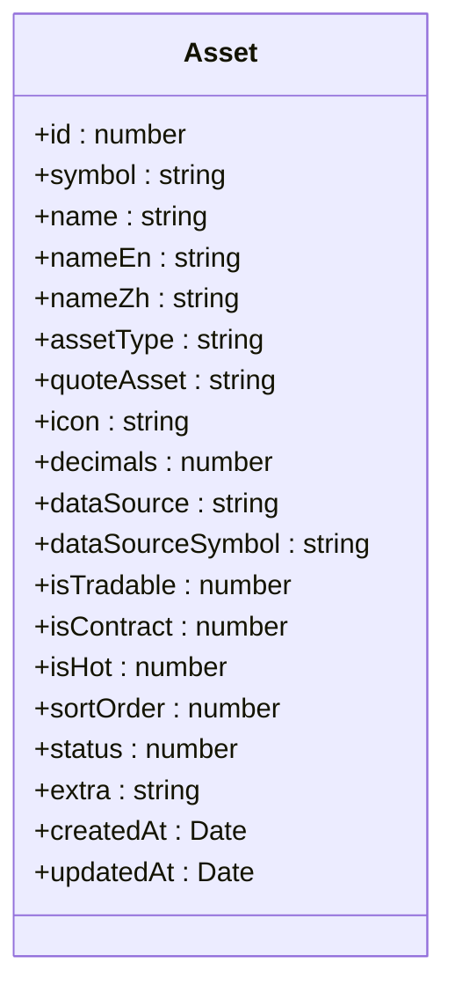
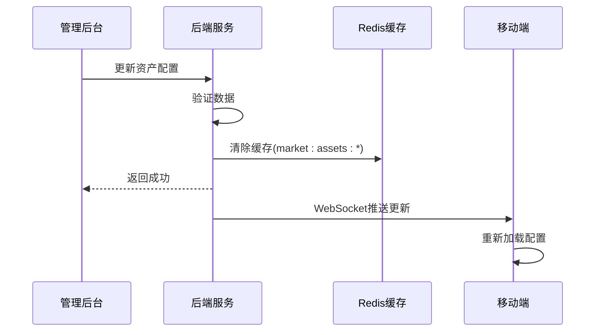

# 资产配置API

<cite>
**本文档引用文件**  
- [asset.entity.ts](file://agx-backend/src/entities/asset.entity.ts)
- [market.controller.ts](file://agx-backend/src/modules/market/market.controller.ts)
- [market.service.ts](file://agx-backend/src/modules/market/market.service.ts)
- [marketCrypto.vue](file://agx-admin/src/views/agx/marketCrypto.vue)
- [marketForex.vue](file://agx-admin/src/views/agx/marketForex.vue)
- [market.js](file://h5/src/api/market.js)
</cite>

## 目录
1. [简介](#简介)
2. [API端点说明](#api端点说明)
3. [数据模型与业务规则](#数据模型与业务规则)
4. [前端应用集成示例](#前端应用集成示例)
5. [缓存策略与配置更新](#缓存策略与配置更新)
6. [错误处理流程](#错误处理流程)

## 简介

资产配置API为平台提供交易资产的元数据信息，支持多类型资产（加密货币、外汇、股票、贵金属、基金等）的统一管理。该API通过`GET /api/market/assets`端点返回平台支持的交易资产列表及其配置信息，用于初始化交易界面、验证交易对合法性以及动态调整前端展示逻辑。

**本文档引用文件**  
- [asset.entity.ts](file://agx-backend/src/entities/asset.entity.ts)
- [market.controller.ts](file://agx-backend/src/modules/market/market.controller.ts)

## API端点说明

### 获取资产配置列表
- **端点**: `GET /api/market/assets`
- **功能**: 获取平台支持的交易资产列表
- **参数**:
  - `type` (可选): 资产类型过滤（crypto, forex, stock, metal, fund）
- **响应格式**:
```json
{
  "code": 0,
  "msg": "ok",
  "data": {
    "list": [
      {
        "symbol": "BTC",
        "name": "比特币",
        "assetType": "crypto",
        "status": 1,
        "isTradable": 1,
        "decimals": 8
      }
    ]
  }
}
```

### 使用场景
- 管理后台：用于资产配置管理界面的数据源
- 移动端应用：初始化交易市场页面，加载可交易资产列表
- 交易验证：检查用户请求的交易对是否在支持列表中

**本文档引用文件**  
- [market.controller.ts](file://agx-backend/src/modules/market/market.controller.ts)
- [market.service.ts](file://agx-backend/src/modules/market/market.service.ts)

## 数据模型与业务规则

### 资产实体定义 (Asset)
基于`asset.entity.ts`的实体定义，包含以下核心字段：

| 字段 | 类型 | 默认值 | 描述 |
|------|------|--------|------|
| symbol | string | - | 资产代码（如BTC, XAU, EUR） |
| name | string | - | 资产名称 |
| assetType | string | - | 资产类型（crypto/forex/stock/metal/fund/index） |
| quoteAsset | string | USD | 报价资产（如USD, USDT） |
| decimals | number | 8 | 价格小数位数 |
| dataSource | string | - | 数据源（binance, coingecko, custom） |
| dataSourceSymbol | string | - | 数据源对应的交易对符号 |
| isTradable | number | 0 | 是否可交易（0只展示，1可交易） |
| isContract | number | 0 | 是否支持合约（0不支持，1支持） |
| isHot | number | 0 | 是否热门资产 |
| sortOrder | number | 0 | 排序权重 |
| status | number | 1 | 状态（0禁用，1启用） |
| extra | string | null | 扩展配置JSON |

### 业务规则
1. **状态过滤**: 仅返回`status=1`（启用）的资产
2. **排序规则**: 按`sortOrder`升序排列
3. **类型过滤**: 可通过`type`参数筛选特定资产类型
4. **唯一性约束**: `symbol`字段具有唯一索引



**图表来源**  
- [asset.entity.ts](file://agx-backend/src/entities/asset.entity.ts)

**本文档引用文件**  
- [asset.entity.ts](file://agx-backend/src/entities/asset.entity.ts)

## 前端应用集成示例

### 管理后台集成
管理后台通过`marketCrypto.vue`和`marketForex.vue`组件实现资产配置管理：

1. **数据加载**: 在`onMounted`生命周期中调用API获取资产列表
2. **状态管理**: 使用开关组件控制`isTradable`、`isHot`、`status`等状态
3. **排序功能**: 通过`sortOrder`字段实现自定义排序
4. **分类展示**: 按`assetType`和`category`进行分类展示

### 移动端应用集成
移动端通过`market.js`封装API调用：

```javascript
// API调用示例
import { marketApi } from '@/api/market'

// 获取加密货币资产
const cryptoAssets = await marketApi.getAssets({ type: 'crypto' })

// 获取外汇资产
const forexAssets = await marketApi.getAssets({ type: 'forex' })

// 初始化交易界面
function initTradingInterface() {
  const assets = await marketApi.getAssets()
  // 根据资产配置初始化交易对选择器
  // 验证交易对是否支持
  return assets.data.list.filter(asset => asset.isTradable)
}
```

**本文档引用文件**  
- [marketCrypto.vue](file://agx-admin/src/views/agx/marketCrypto.vue)
- [marketForex.vue](file://agx-admin/src/views/agx/marketForex.vue)
- [market.js](file://h5/src/api/market.js)

## 缓存策略与配置更新

### 数据缓存机制
1. **服务端缓存**: 
   - 使用Redis缓存资产配置数据
   - 缓存键名为`market:assets:type:${type}`
   - 过期时间：5分钟

2. **客户端缓存**:
   - 管理后台：在组件内使用响应式数据缓存
   - 移动端：使用Pinia状态管理进行本地缓存

### 配置更新流程
1. **管理后台更新**:
   - 管理员在管理界面修改资产配置
   - 提交后调用更新接口
   - 自动清除相关缓存

2. **缓存清理**:
   - 更新后调用`clearCache`接口
   - 清除`market:assets:*`前缀的所有缓存
   - 确保客户端获取最新配置

3. **实时同步**:
   - 支持WebSocket通知机制
   - 配置更新时推送消息到所有客户端



**图表来源**  
- [market.service.ts](file://agx-backend/src/modules/market/market.service.ts)
- [marketCrypto.vue](file://agx-admin/src/views/agx/marketCrypto.vue)

**本文档引用文件**  
- [market.service.ts](file://agx-backend/src/modules/market/market.service.ts)

## 错误处理流程

### 常见错误码
| 错误码 | 含义 | 处理建议 |
|-------|------|---------|
| 0 | 成功 | 正常处理响应数据 |
| 500 | 服务器内部错误 | 记录日志，提示用户稍后重试 |
| 400 | 请求参数错误 | 检查`type`参数是否有效 |
| 404 | 资源未找到 | 检查API路径是否正确 |

### 异常处理策略
1. **服务端处理**:
   - 使用NestJS的异常过滤器统一处理
   - 记录错误日志
   - 返回标准化错误响应

2. **客户端处理**:
   - 捕获网络异常
   - 提供友好的错误提示
   - 支持重试机制

3. **降级方案**:
   - 当API不可用时，使用本地缓存数据
   - 显示"数据更新中"提示
   - 定期尝试重新获取

**本文档引用文件**  
- [market.controller.ts](file://agx-backend/src/modules/market/market.controller.ts)
- [market.service.ts](file://agx-backend/src/modules/market/market.service.ts)