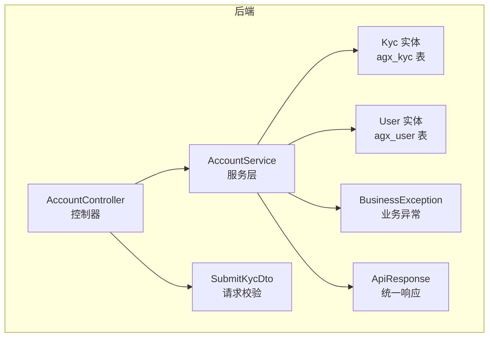
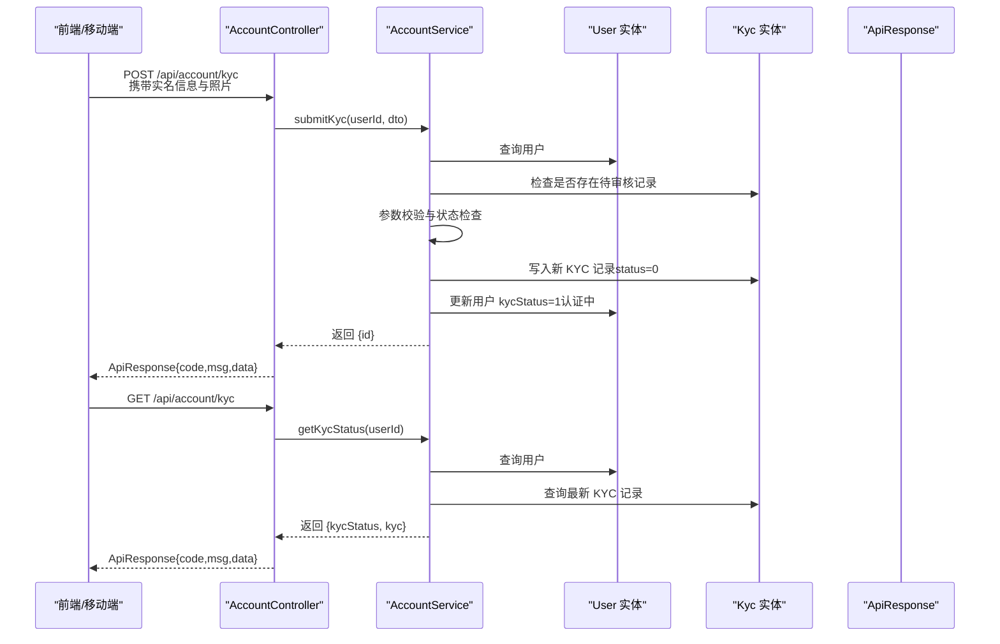
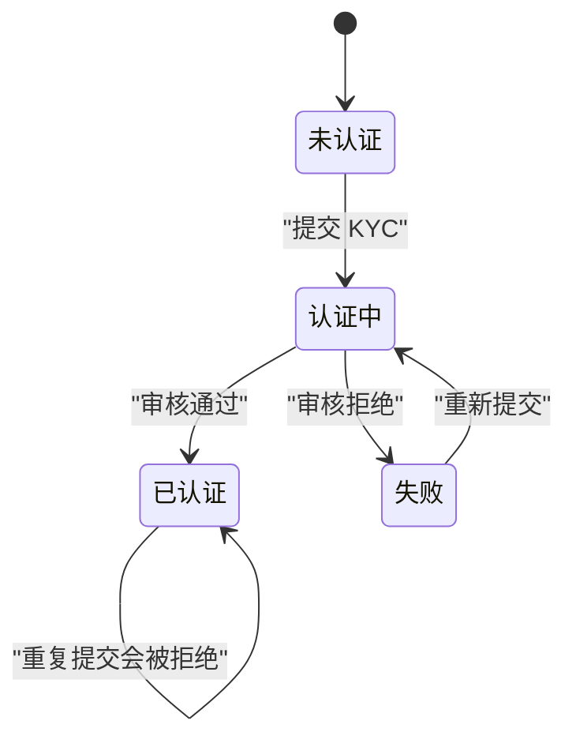
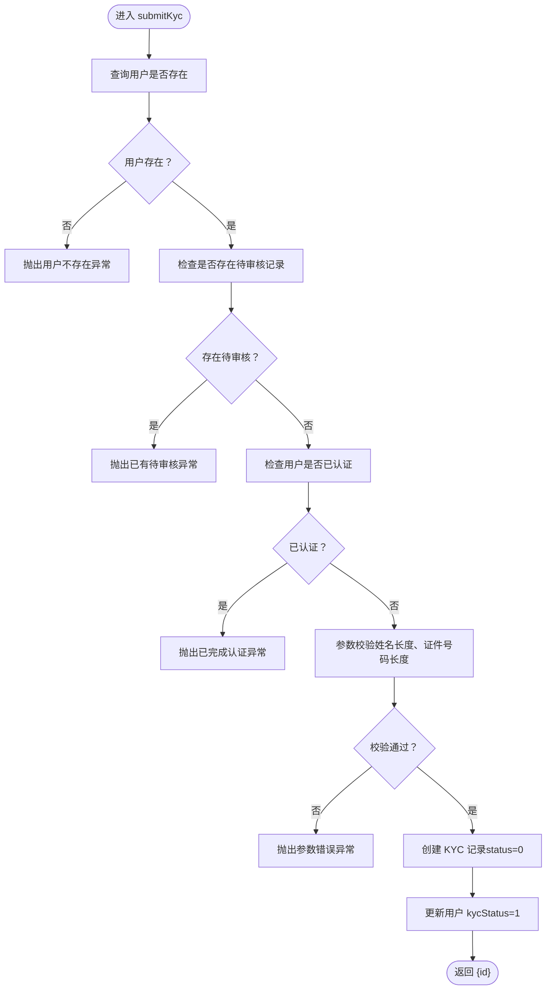
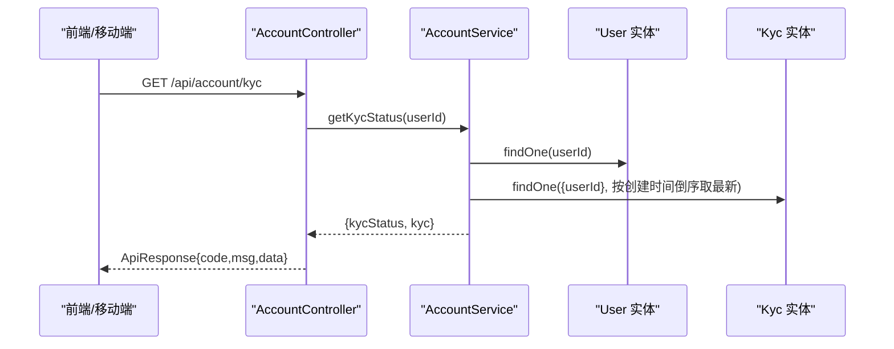
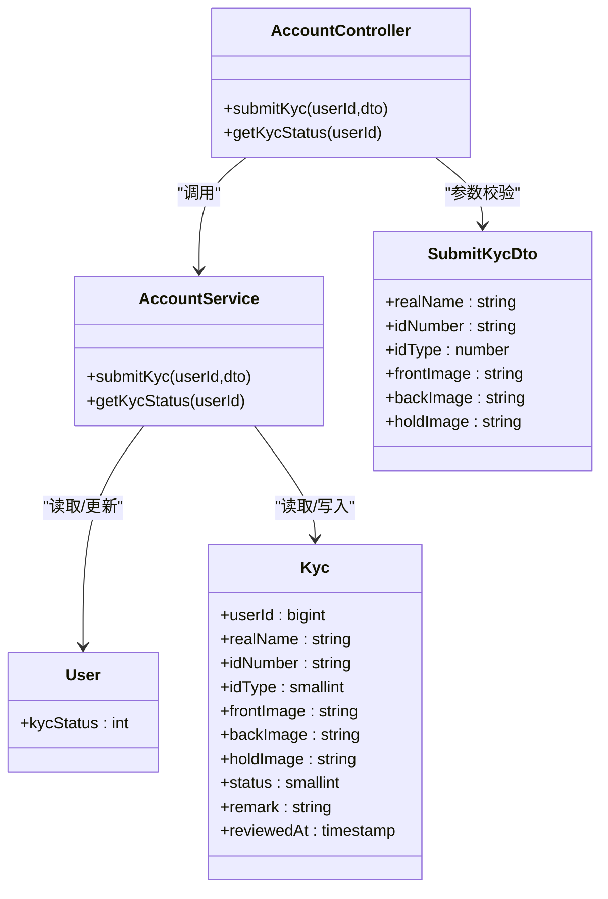

# KYC认证API

<cite>
**本文引用的文件**
- [kyc.entity.ts](file://agx-backend/src/entities/kyc.entity.ts)
- [user.entity.ts](file://agx-backend/src/entities/user.entity.ts)
- [account.controller.ts](file://agx-backend/src/modules/account/account.controller.ts)
- [account.service.ts](file://agx-backend/src/modules/account/account.service.ts)
- [account.dto.ts](file://agx-backend/src/modules/account/account.dto.ts)
- [business.exception.ts](file://agx-backend/src/common/filters/business.exception.ts)
- [api-response.dto.ts](file://agx-backend/src/common/dto/api-response.dto.ts)
- [kyc.vue](file://agx-admin/src/views/agx/kyc.vue)
- [index.js](file://agx-admin/src/api/agx/index.js)
</cite>

## 目录
1. [简介](#简介)
2. [项目结构](#项目结构)
3. [核心组件](#核心组件)
4. [架构总览](#架构总览)
5. [详细组件分析](#详细组件分析)
6. [依赖分析](#依赖分析)
7. [性能考虑](#性能考虑)
8. [故障排查指南](#故障排查指南)
9. [结论](#结论)
10. [附录](#附录)

## 简介
本文件面向前端与移动端开发者，系统化说明 KYC 实名认证 API 的设计与使用，包括：
- 接口清单：POST /api/account/kyc（提交 KYC）、GET /api/account/kyc（查询状态）
- 请求参数与请求体结构（姓名、身份证号、证件类型、证件照片等）
- 响应 JSON Schema 与错误码说明
- KYC 状态机流转逻辑
- 前端轮询查询与集成方式
- 与用户资料 API 的关联

## 项目结构
后端采用 NestJS 架构，KYC 相关能力集中在 account 模块：
- 控制器：负责路由与鉴权
- 服务层：封装业务逻辑与数据持久化
- 实体：数据库表映射（用户、KYC）
- DTO：请求参数校验
- 统一响应与异常：统一返回结构与错误码

图表来源
- [account.controller.ts](file://agx-backend/src/modules/account/account.controller.ts#L71-L89)
- [account.service.ts](file://agx-backend/src/modules/account/account.service.ts#L292-L399)
- [kyc.entity.ts](file://agx-backend/src/entities/kyc.entity.ts#L1-L57)
- [user.entity.ts](file://agx-backend/src/entities/user.entity.ts#L1-L60)
- [account.dto.ts](file://agx-backend/src/modules/account/account.dto.ts#L48-L71)
- [business.exception.ts](file://agx-backend/src/common/filters/business.exception.ts#L1-L60)
- [api-response.dto.ts](file://agx-backend/src/common/dto/api-response.dto.ts#L1-L68)

章节来源
- [account.controller.ts](file://agx-backend/src/modules/account/account.controller.ts#L71-L89)
- [account.service.ts](file://agx-backend/src/modules/account/account.service.ts#L292-L399)
- [kyc.entity.ts](file://agx-backend/src/entities/kyc.entity.ts#L1-L57)
- [user.entity.ts](file://agx-backend/src/entities/user.entity.ts#L1-L60)
- [account.dto.ts](file://agx-backend/src/modules/account/account.dto.ts#L48-L71)
- [business.exception.ts](file://agx-backend/src/common/filters/business.exception.ts#L1-L60)
- [api-response.dto.ts](file://agx-backend/src/common/dto/api-response.dto.ts#L1-L68)

## 核心组件
- 控制器：暴露 /api/account/kyc 提交与查询接口，使用 JWT 鉴权
- 服务层：提交 KYC 时进行重复申请检查、参数校验、写入 KYC 记录并更新用户状态；查询时返回用户 KYC 状态与最新 KYC 信息
- 实体：Kyc 表存储实名信息与状态；User 表维护全局 KYC 状态
- DTO：SubmitKycDto 定义提交参数与校验规则
- 异常与响应：统一响应结构与错误码

章节来源
- [account.controller.ts](file://agx-backend/src/modules/account/account.controller.ts#L71-L89)
- [account.service.ts](file://agx-backend/src/modules/account/account.service.ts#L292-L399)
- [kyc.entity.ts](file://agx-backend/src/entities/kyc.entity.ts#L1-L57)
- [user.entity.ts](file://agx-backend/src/entities/user.entity.ts#L1-L60)
- [account.dto.ts](file://agx-backend/src/modules/account/account.dto.ts#L48-L71)
- [business.exception.ts](file://agx-backend/src/common/filters/business.exception.ts#L1-L60)
- [api-response.dto.ts](file://agx-backend/src/common/dto/api-response.dto.ts#L1-L68)

## 架构总览
以下序列图展示“提交 KYC”到“查询状态”的端到端流程。

图表来源
- [account.controller.ts](file://agx-backend/src/modules/account/account.controller.ts#L71-L89)
- [account.service.ts](file://agx-backend/src/modules/account/account.service.ts#L292-L399)
- [user.entity.ts](file://agx-backend/src/entities/user.entity.ts#L1-L60)
- [kyc.entity.ts](file://agx-backend/src/entities/kyc.entity.ts#L1-L57)
- [api-response.dto.ts](file://agx-backend/src/common/dto/api-response.dto.ts#L1-L68)

## 详细组件分析

### 接口定义与鉴权
- POST /api/account/kyc
  - 鉴权：需要 JWT
  - 功能：提交实名认证资料
- GET /api/account/kyc
  - 鉴权：需要 JWT
  - 功能：查询当前用户的 KYC 状态与最新记录

章节来源
- [account.controller.ts](file://agx-backend/src/modules/account/account.controller.ts#L71-L89)

### 请求参数与请求体结构
- POST /api/account/kyc
  - 请求体字段（SubmitKycDto）：
    - realName：字符串，长度 2-50
    - idNumber：字符串，长度 15-18
    - idType：整数，1=身份证，2=护照（可选扩展类型）
    - frontImage：字符串，可选，证件正面照 URL
    - backImage：字符串，可选，证件背面照 URL
    - holdImage：字符串，可选，手持证件照 URL
  - 参数校验由 DTO 与服务层共同保证

章节来源
- [account.dto.ts](file://agx-backend/src/modules/account/account.dto.ts#L48-L71)
- [account.service.ts](file://agx-backend/src/modules/account/account.service.ts#L292-L341)

### 响应 JSON Schema
- 统一响应结构
  - code：数值，0 表示成功
  - msg：字符串，描述
  - data：对象或 null
- POST /api/account/kyc 成功响应
  - data：{ id: number }
- GET /api/account/kyc 成功响应
  - data：{
      kycStatus: number（用户全局状态）
      kyc: {
        id: number
        realName: string
        idNumber: string（中间部分掩码显示）
        idType: number
        status: number（0待审核 1通过 2拒绝）
        remark: string（审核备注）
        createdAt: string（YYYY-MM-DD HH:mm:ss）
      } 或 null（无记录）
    }

章节来源
- [api-response.dto.ts](file://agx-backend/src/common/dto/api-response.dto.ts#L1-L68)
- [account.service.ts](file://agx-backend/src/modules/account/account.service.ts#L343-L399)

### 错误码与异常
- 通用错误码（示例）
  - 5002：您已有待审核的认证申请
  - 5003：您已完成实名认证
  - 5004：真实姓名长度必须在2-50个字符之间
  - 5005：证件号码长度不正确
- 业务异常类 BusinessException 统一抛出，响应体 code=0，msg 为错误描述

章节来源
- [business.exception.ts](file://agx-backend/src/common/filters/business.exception.ts#L1-L60)
- [account.service.ts](file://agx-backend/src/modules/account/account.service.ts#L292-L341)

### KYC 状态机与流转
- 用户全局状态（User.kycStatus）
  - 0：未认证
  - 1：认证中
  - 2：已认证
  - 3：失败
- 单条 KYC 记录状态（Kyc.status）
  - 0：待审核
  - 1：通过
  - 2：拒绝
- 流转逻辑
  - 提交 KYC：若无待审核且未认证，则写入一条 status=0 的记录，并将用户 kycStatus 设为 1（认证中）
  - 审核通过：将该条记录 status 更新为 1，并将用户 kycStatus 更新为 2（已认证）
  - 审核拒绝：将该条记录 status 更新为 2，并将用户 kycStatus 更新为 3（失败）

图表来源
- [user.entity.ts](file://agx-backend/src/entities/user.entity.ts#L1-L60)
- [kyc.entity.ts](file://agx-backend/src/entities/kyc.entity.ts#L1-L57)
- [account.service.ts](file://agx-backend/src/modules/account/account.service.ts#L292-L399)

### 提交流程与参数校验流程

图表来源
- [account.service.ts](file://agx-backend/src/modules/account/account.service.ts#L292-L341)

### 查询流程

图表来源
- [account.controller.ts](file://agx-backend/src/modules/account/account.controller.ts#L81-L89)
- [account.service.ts](file://agx-backend/src/modules/account/account.service.ts#L343-L399)

### 前端与移动端调用方式
- 前端（管理后台）调用
  - 列表与审核：通过 agx-api 中的 getKycList 与 reviewKyc 接口（用于后台审核），前端页面 kyc.vue 展示与操作
  - 用户侧：通过 /api/account/kyc 提交与查询
- 移动端（H5）
  - 通过 utils/api 封装的 accountApi.account 调用 /api/account/* 下的账户相关接口（含 KYC）

章节来源
- [kyc.vue](file://agx-admin/src/views/agx/kyc.vue#L1-L188)
- [index.js](file://agx-admin/src/api/agx/index.js#L210-L228)
- [account.controller.ts](file://agx-backend/src/modules/account/account.controller.ts#L71-L89)

### 与用户资料 API 的关联
- 用户资料 API（GET /api/account/profile）返回用户基本信息，其中包含 kycStatus 字段，可用于前端判断是否需要引导用户完成 KYC
- KYC 查询 API（GET /api/account/kyc）返回更详细的 KYC 记录，便于前端展示进度与状态

章节来源
- [account.controller.ts](file://agx-backend/src/modules/account/account.controller.ts#L31-L69)
- [account.service.ts](file://agx-backend/src/modules/account/account.service.ts#L200-L231)
- [account.service.ts](file://agx-backend/src/modules/account/account.service.ts#L343-L399)

## 依赖分析
- 控制器依赖服务层
- 服务层依赖实体（User、Kyc）、DTO、异常与响应工具
- 实体间通过外键关联（Kyc.userId -> User.id）

图表来源
- [account.controller.ts](file://agx-backend/src/modules/account/account.controller.ts#L71-L89)
- [account.service.ts](file://agx-backend/src/modules/account/account.service.ts#L292-L399)
- [user.entity.ts](file://agx-backend/src/entities/user.entity.ts#L1-L60)
- [kyc.entity.ts](file://agx-backend/src/entities/kyc.entity.ts#L1-L57)
- [account.dto.ts](file://agx-backend/src/modules/account/account.dto.ts#L48-L71)

## 性能考虑
- 查询最新 KYC 记录时按创建时间倒序取第一条，建议在 userId + createdAt 上建立索引以优化性能
- 提交 KYC 时对用户状态与待审核记录的检查为 O(1) 查询，整体开销较小
- 建议在前端对查询接口做节流/去抖，避免频繁轮询导致不必要的压力

## 故障排查指南
- 提交时报错“已有待审核的认证申请”
  - 说明：同一用户存在 status=0 的 KYC 记录
  - 处理：等待审核结果或联系客服
- 提交时报错“已完成实名认证”
  - 说明：用户 kycStatus=2 已认证
  - 处理：无需重复提交
- 提交时报错“真实姓名长度不正确/证件号码长度不正确”
  - 说明：参数长度不符合校验规则
  - 处理：修正输入长度
- 查询时报错“用户不存在”
  - 说明：JWT 对应用户不存在
  - 处理：重新登录获取有效 Token

章节来源
- [account.service.ts](file://agx-backend/src/modules/account/account.service.ts#L292-L341)
- [business.exception.ts](file://agx-backend/src/common/filters/business.exception.ts#L1-L60)

## 结论
- KYC API 设计简洁，职责清晰：提交与查询分离，参数校验严格，状态机明确
- 前端与移动端均可通过 /api/account/* 接口完成实名认证全流程
- 建议在生产环境完善图片上传与审核流程，并在前端做好状态提示与轮询策略

## 附录

### 接口一览
- POST /api/account/kyc
  - 鉴权：是
  - 请求体：SubmitKycDto
  - 成功响应：{ id }
- GET /api/account/kyc
  - 鉴权：是
  - 成功响应：{ kycStatus, kyc }

章节来源
- [account.controller.ts](file://agx-backend/src/modules/account/account.controller.ts#L71-L89)
- [account.service.ts](file://agx-backend/src/modules/account/account.service.ts#L292-L399)
- [account.dto.ts](file://agx-backend/src/modules/account/account.dto.ts#L48-L71)
- [api-response.dto.ts](file://agx-backend/src/common/dto/api-response.dto.ts#L1-L68)