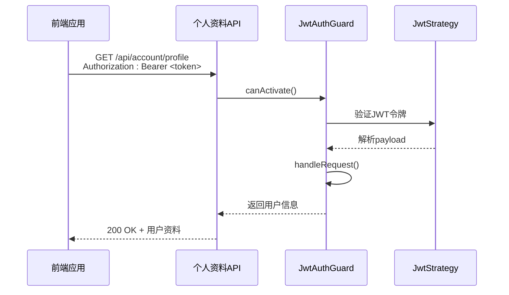
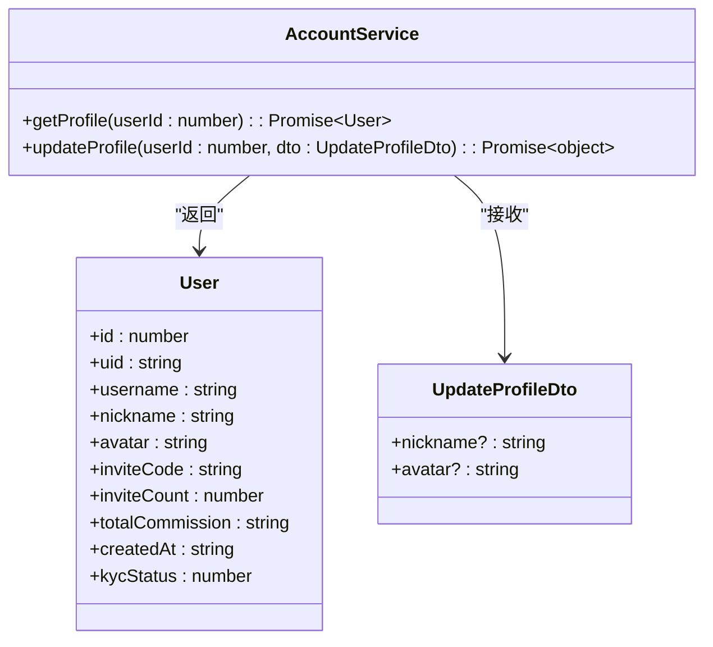
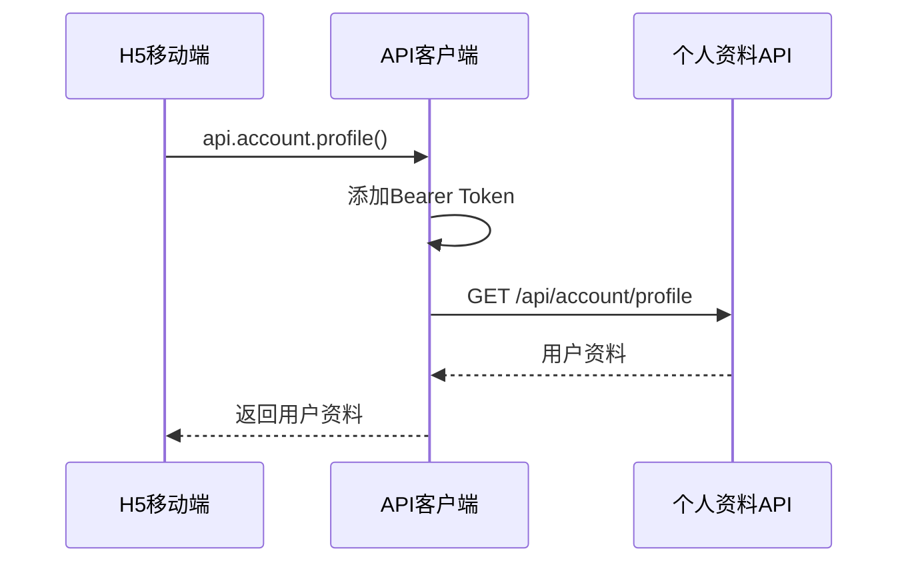
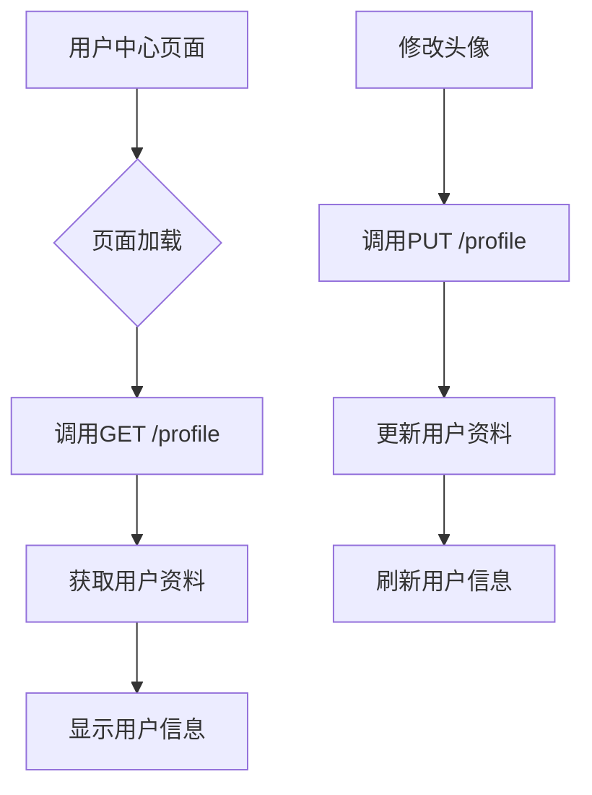
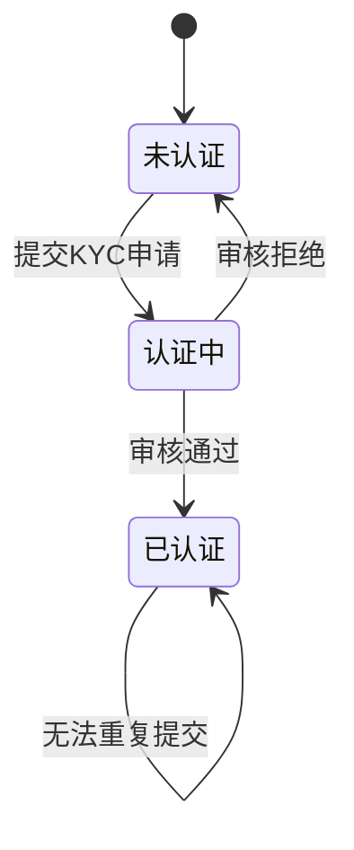

# 个人资料API

<cite>
**本文档引用的文件**  
- [account.controller.ts](file://agx-backend/src/modules/account/account.controller.ts)
- [account.dto.ts](file://agx-backend/src/modules/account/account.dto.ts)
- [account.service.ts](file://agx-backend/src/modules/account/account.service.ts)
- [jwt-auth.guard.ts](file://agx-backend/src/modules/auth/jwt-auth.guard.ts)
- [jwt.strategy.ts](file://agx-backend/src/modules/auth/jwt.strategy.ts)
- [api.js](file://h5/src/utils/api.js)
- [index.vue](file://agx-admin/src/views/userCenter/index.vue)
</cite>

## 目录
1. [简介](#简介)
2. [核心端点](#核心端点)
3. [请求认证机制](#请求认证机制)
4. [用户资料数据结构](#用户资料数据结构)
5. [前端调用示例](#前端调用示例)
6. [KYC认证状态管理](#kyc认证状态管理)
7. [错误码说明](#错误码说明)

## 简介
个人资料API提供用户信息的读取和更新功能，是系统用户中心的核心接口。该API支持通过`GET /profile`获取用户资料，通过`PUT /profile`更新用户资料，包括昵称和头像等字段。所有端点均需JWT认证，确保用户数据安全。本API被前端用户中心页面和移动端个人资料页广泛调用。

**Section sources**
- [account.controller.ts](file://agx-backend/src/modules/account/account.controller.ts#L8-L159)

## 核心端点

### GET /profile - 获取用户资料
获取当前登录用户的完整资料信息。

**请求信息**
- **HTTP方法**: GET
- **URL路径**: `/api/account/profile`
- **认证要求**: JWT Bearer Token

**响应JSON Schema**
```json
{
  "id": 123,
  "uid": "12345678",
  "username": "user123",
  "nickname": "昵称",
  "avatar": "https://example.com/avatar.jpg",
  "inviteCode": "ABC123",
  "inviteCount": 5,
  "totalCommission": "0.00",
  "createdAt": "2023-01-01 12:00:00"
}
```

**Section sources**
- [account.controller.ts](file://agx-backend/src/modules/account/account.controller.ts#L34-L39)
- [account.service.ts](file://agx-backend/src/modules/account/account.service.ts#L204-L231)

### PUT /profile - 更新用户资料
更新当前登录用户的可编辑资料字段。

**请求信息**
- **HTTP方法**: PUT
- **URL路径**: `/api/account/profile`
- **认证要求**: JWT Bearer Token
- **请求体结构**: `UpdateProfileDto`

**请求体参数**
- `nickname` (可选): 用户昵称，字符串类型，长度1-50
- `avatar` (可选): 头像URL，字符串类型

**响应JSON Schema**
```json
{
  "nickname": "新昵称",
  "avatar": "https://example.com/new-avatar.jpg"
}
```

**Section sources**
- [account.controller.ts](file://agx-backend/src/modules/account/account.controller.ts#L64-L69)
- [account.dto.ts](file://agx-backend/src/modules/account/account.dto.ts#L37-L46)
- [account.service.ts](file://agx-backend/src/modules/account/account.service.ts#L276-L290)

## 请求认证机制
个人资料API的所有端点均需JWT认证，通过`@UseGuards(JwtAuthGuard)`装饰器实现。



**Diagram sources**
- [account.controller.ts](file://agx-backend/src/modules/account/account.controller.ts#L35-L36)
- [jwt-auth.guard.ts](file://agx-backend/src/modules/auth/jwt-auth.guard.ts#L5-L17)
- [jwt.strategy.ts](file://agx-backend/src/modules/auth/jwt.strategy.ts#L13-L32)

## 用户资料数据结构
个人资料API涉及的主要数据结构包括用户实体和更新资料DTO。



**Diagram sources**
- [account.dto.ts](file://agx-backend/src/modules/account/account.dto.ts#L37-L46)
- [account.service.ts](file://agx-backend/src/modules/account/account.service.ts#L204-L290)
- [user.entity.ts](file://agx-backend/src/entities/user.entity.ts)

## 前端调用示例
前端通过封装的API客户端调用个人资料API。

### H5移动端调用


**Diagram sources**
- [api.js](file://h5/src/utils/api.js#L84-L85)
- [account.controller.ts](file://agx-backend/src/modules/account/account.controller.ts#L34-L39)

### 管理后台调用


**Diagram sources**
- [index.vue](file://agx-admin/src/views/userCenter/index.vue)
- [account.controller.ts](file://agx-backend/src/modules/account/account.controller.ts)

## KYC认证状态管理
KYC认证状态集成在用户资料系统中，通过`kycStatus`字段表示用户认证状态。

**KYC状态值说明**
- `0`: 未认证
- `1`: 认证中
- `2`: 已认证



**Diagram sources**
- [kyc.entity.ts](file://agx-backend/src/entities/kyc.entity.ts#L42-L43)
- [account.service.ts](file://agx-backend/src/modules/account/account.service.ts#L309-L311)

## 错误码说明
个人资料API可能返回的错误码及其含义。

**常见错误码**
- `1001`: 账号已被禁用
- `1002`: 旧密码错误
- `5002`: 已有待审核的认证申请
- `5003`: 已完成实名认证
- `5004`: 真实姓名长度不正确
- `5005`: 证件号码长度不正确

**Section sources**
- [account.service.ts](file://agx-backend/src/modules/account/account.service.ts#L305-L311)