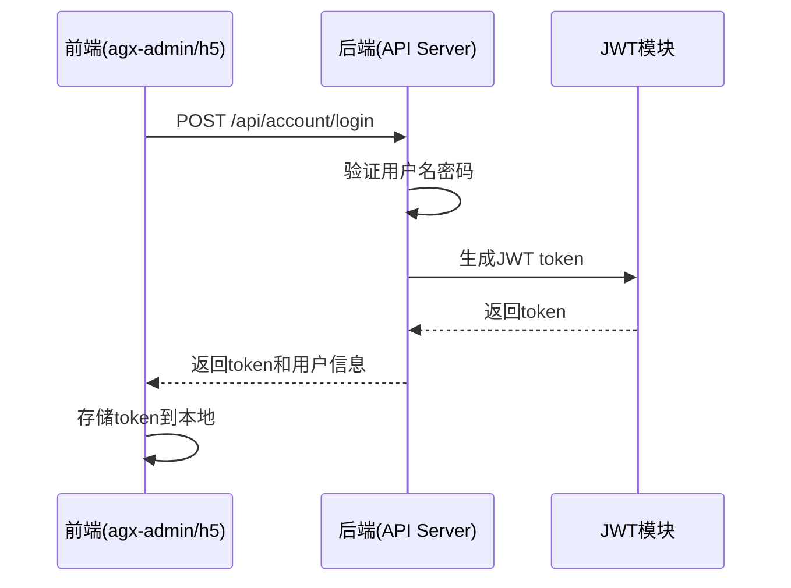
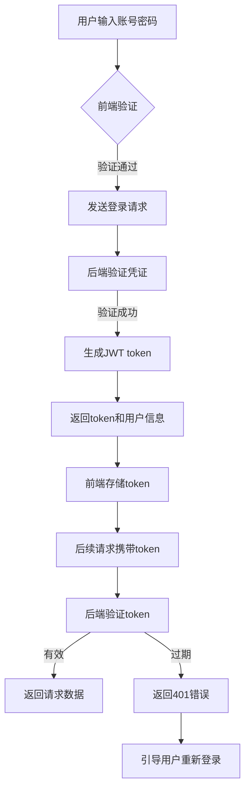
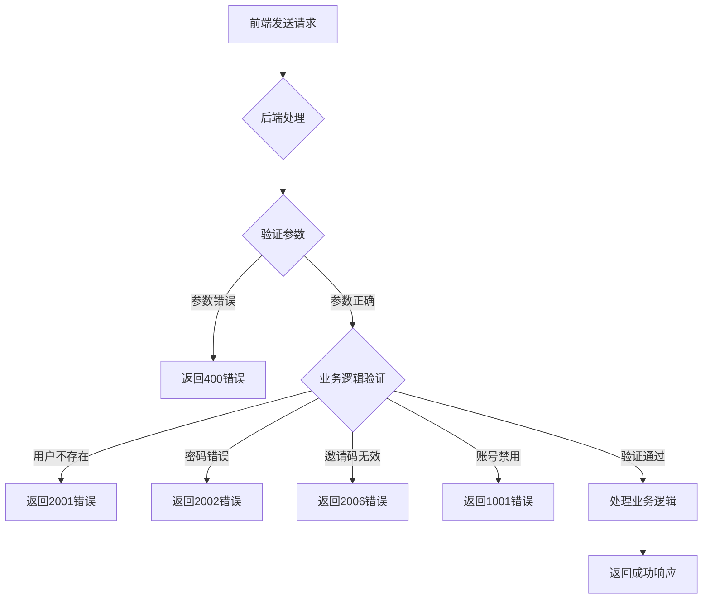

# 认证API

<cite>
**本文档引用文件**  
- [account.controller.ts](file://agx-backend/src/modules/account/account.controller.ts)
- [account.service.ts](file://agx-backend/src/modules/account/account.service.ts)
- [account.dto.ts](file://agx-backend/src/modules/account/account.dto.ts)
- [auth.module.ts](file://agx-backend/src/modules/auth/auth.module.ts)
- [business.exception.ts](file://agx-backend/src/common/filters/business.exception.ts)
- [api-response.dto.ts](file://agx-backend/src/common/dto/api-response.dto.ts)
- [jwt-auth.guard.ts](file://agx-backend/src/modules/auth/jwt-auth.guard.ts)
- [.env](file://agx-backend/.env)
</cite>

## 目录
1. [简介](#简介)
2. [注册与登录端点](#注册与登录端点)
3. [JWT认证机制](#jwt认证机制)
4. [请求与响应示例](#请求与响应示例)
5. [前端调用方式](#前端调用方式)
6. [错误处理场景](#错误处理场景)

## 简介
本API文档详细描述了用户注册和登录功能的实现，包括POST /register和POST /login端点的HTTP方法、URL路径、请求参数、请求体结构、响应JSON Schema、HTTP状态码等。文档还解释了JWT token的生成机制、有效期和刷新策略，并提供了实际的请求/响应示例。

**Section sources**
- [account.controller.ts](file://agx-backend/src/modules/account/account.controller.ts#L8-L159)

## 注册与登录端点

### 用户注册 (POST /api/account/register)
- **HTTP方法**: POST
- **URL路径**: /api/account/register
- **请求体结构**:
  - `username`: 字符串，长度4-20位，仅允许字母、数字和下划线
  - `password`: 字符串，长度8-20位
  - `inviteCode`: 字符串，6位邀请码

- **成功响应JSON Schema**:
```json
{
  "code": 0,
  "msg": "ok",
  "data": {
    "user": {
      "id": 1,
      "uid": "12345678",
      "username": "testuser",
      "nickname": "新用户",
      "inviteCode": "ABC123",
      "inviterId": 1,
      "createdAt": "2025-01-01 12:00:00"
    }
  }
}
```

- **可能的HTTP状态码**:
  - 200: 请求成功
  - 400: 参数错误
  - 409: 用户名已存在

### 用户登录 (POST /api/account/login)
- **HTTP方法**: POST
- **URL路径**: /api/account/login
- **请求体结构**:
  - `username`: 字符串，长度4-50位
  - `password`: 字符串，长度8-20位

- **成功响应JSON Schema**:
```json
{
  "code": 0,
  "msg": "ok",
  "data": {
    "token": "eyJhbGciOiJIUzI1NiIsInR5cCI6IkpXVCJ9.xxxxx",
    "user": {
      "id": 1,
      "uid": "12345678",
      "username": "testuser",
      "nickname": "新用户",
      "avatar": null,
      "inviteCode": "ABC123",
      "createdAt": "2025-01-01 12:00:00"
    }
  }
}
```

- **可能的HTTP状态码**:
  - 200: 登录成功
  - 401: 用户名或密码错误
  - 403: 账号被禁用

**Section sources**
- [account.controller.ts](file://agx-backend/src/modules/account/account.controller.ts#L16-L29)
- [account.dto.ts](file://agx-backend/src/modules/account/account.dto.ts#L3-L26)
- [account.service.ts](file://agx-backend/src/modules/account/account.service.ts#L65-L151)
- [account.service.ts](file://agx-backend/src/modules/account/account.service.ts#L156-L199)

## JWT认证机制

### JWT生成机制
系统使用NestJS JWT模块生成和验证token。JWT payload包含以下信息：
- `sub`: 用户ID
- `uid`: 用户唯一标识
- `username`: 用户名
- `type`: 用户类型（'user'）

### JWT配置
从环境变量中读取JWT配置：
- **密钥**: `JWT_SECRET=agx-jwt-secret-2025`
- **有效期**: `JWT_EXPIRES_IN=7d`（7天）

### 刷新策略
当前系统未实现自动刷新机制，当token过期后需要用户重新登录。建议前端在检测到401状态码时引导用户重新登录。



**Diagram sources**
- [auth.module.ts](file://agx-backend/src/modules/auth/auth.module.ts#L1-L25)
- [account.service.ts](file://agx-backend/src/modules/account/account.service.ts#L178-L186)
- [.env](file://agx-backend/.env#L12-L13)

## 请求与响应示例

### 用户注册请求示例
```json
{
  "username": "newuser123",
  "password": "Password123",
  "inviteCode": "ABC123"
}
```

### 用户登录请求示例
```json
{
  "username": "newuser123",
  "password": "Password123"
}
```

### 登录成功响应示例
```json
{
  "code": 0,
  "msg": "ok",
  "data": {
    "token": "eyJhbGciOiJIUzI1NiIsInR5cCI6IkpXVCJ9.eyJzdWIiOjEsInVpZCI6IjEyMzQ1Njc4IiwidXNlcm5hbWUiOiJudWV1c2VyMTIzIiwidHlwZSI6InVzZXIiLCJpYXQiOjE3MzU2Nzg5MDAsImV4cCI6MTczNjI4MzcwMH0.xxxxx",
    "user": {
      "id": 1,
      "uid": "12345678",
      "username": "newuser123",
      "nickname": "新用户",
      "avatar": null,
      "inviteCode": "DEF456",
      "createdAt": "2025-01-01 12:00:00"
    }
  }
}
```

**Section sources**
- [account.dto.ts](file://agx-backend/src/modules/account/account.dto.ts#L3-L26)
- [account.service.ts](file://agx-backend/src/modules/account/account.service.ts#L187-L198)

## 前端调用方式

### agx-admin调用方式
前端通过`src/api/login.js`文件中的API函数调用认证接口：
- 使用axios发送POST请求到`/api/account/login`
- 成功后将token存储在Vuex store中
- 设置axios拦截器，在后续请求中自动添加Authorization头

### h5移动端调用方式
移动端通过`src/api/account.js`文件调用认证接口：
- 使用封装的API请求函数
- 登录成功后将token存储在localStorage中
- 在请求拦截器中添加token认证信息



**Diagram sources**
- [account.controller.ts](file://agx-backend/src/modules/account/account.controller.ts#L25-L29)
- [jwt-auth.guard.ts](file://agx-backend/src/modules/auth/jwt-auth.guard.ts#L5-L17)

## 错误处理场景

### 常见错误码
| 错误码 | 错误消息 | 说明 |
|--------|---------|------|
| 2001 | 用户不存在 | 提供的用户名未找到 |
| 2002 | 密码错误 | 密码验证失败 |
| 2003 | 账号已存在 | 注册时用户名已存在 |
| 2006 | 邀请码无效 | 提供的邀请码不存在 |
| 1001 | 账号已被禁用 | 用户账号状态为禁用 |

### 错误处理流程


### 具体错误场景
- **密码错误**: 当用户输入的密码与数据库中存储的哈希值不匹配时，返回`ErrorCode.PASSWORD_ERROR(2002)`
- **账户不存在**: 当根据用户名无法找到用户记录时，返回`ErrorCode.USER_NOT_FOUND(2001)`
- **验证码错误**: 虽然当前代码中未实现验证码功能，但预留了`ErrorCode.CAPTCHA_ERROR(2004)`用于未来扩展
- **邀请码错误**: 当提供的邀请码在数据库中找不到对应用户时，返回`ErrorCode.INVITE_CODE_INVALID(2006)`

**Section sources**
- [business.exception.ts](file://agx-backend/src/common/filters/business.exception.ts#L28-L42)
- [api-response.dto.ts](file://agx-backend/src/common/dto/api-response.dto.ts#L27-L67)
- [account.service.ts](file://agx-backend/src/modules/account/account.service.ts#L160-L171)