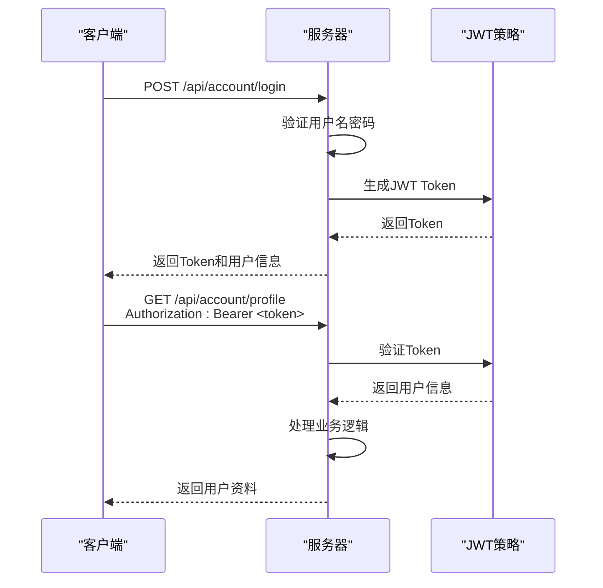
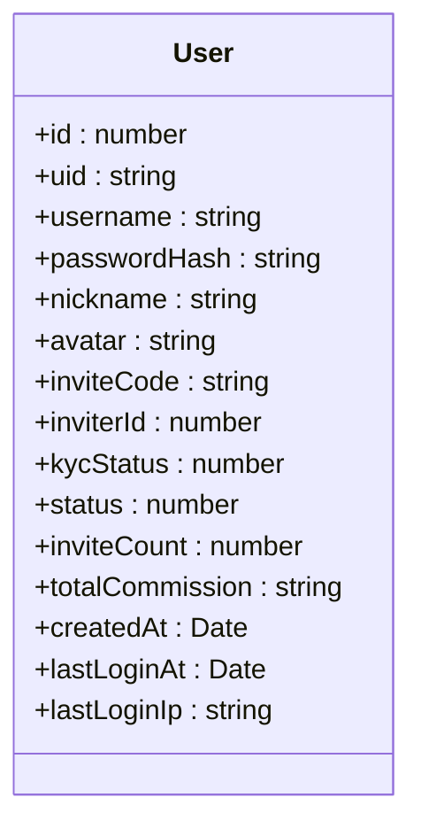
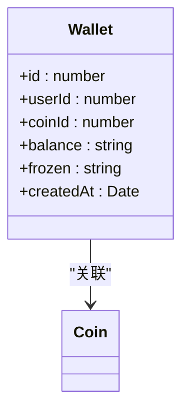
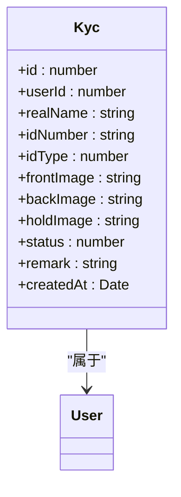

# 账户服务API

<cite>
**本文档引用的文件**   
- [account.controller.ts](file://agx-backend/src/modules/account/account.controller.ts)
- [account.service.ts](file://agx-backend/src/modules/account/account.service.ts)
- [account.dto.ts](file://agx-backend/src/modules/account/account.dto.ts)
- [user.entity.ts](file://agx-backend/src/entities/user.entity.ts)
- [wallet.entity.ts](file://agx-backend/src/entities/wallet.entity.ts)
- [kyc.entity.ts](file://agx-backend/src/entities/kyc.entity.ts)
- [jwt-auth.guard.ts](file://agx-backend/src/modules/auth/jwt-auth.guard.ts)
- [jwt.strategy.ts](file://agx-backend/src/modules/auth/jwt.strategy.ts)
- [api-response.dto.ts](file://agx-backend/src/common/dto/api-response.dto.ts)
- [business.exception.ts](file://agx-backend/src/common/filters/business.exception.ts)
- [api.js](file://h5/src/utils/api.js)
</cite>

## 目录
1. [简介](#简介)
2. [核心API端点](#核心api端点)
3. [JWT认证机制](#jwt认证机制)
4. [请求/响应示例](#请求响应示例)
5. [前端调用方式](#前端调用方式)
6. [错误处理](#错误处理)
7. [数据模型](#数据模型)

## 简介
账户服务API提供用户注册、登录、个人信息管理、KYC认证、资金管理（充值/提现）和邀请奖励等核心功能。所有API遵循RESTful设计原则，使用统一的响应格式和错误码体系。需要认证的端点通过JWT（JSON Web Token）进行身份验证。

**Section sources**
- [account.controller.ts](file://agx-backend/src/modules/account/account.controller.ts#L8-L159)

## 核心API端点

### 用户注册
- **HTTP方法**: POST
- **URL路径**: `/api/account/register`
- **认证要求**: 无需认证
- **请求参数**: 在请求体中
- **请求体结构**:
  - `username` (string): 用户名，4-20位，只能包含字母、数字、下划线
  - `password` (string): 密码，8-20位
  - `inviteCode` (string): 邀请码，6位大写字母数字
- **响应JSON Schema**:
```json
{
  "code": 0,
  "msg": "ok",
  "data": {
    "user": {
      "id": 123,
      "uid": "12345678",
      "username": "example_user",
      "nickname": "新用户",
      "inviteCode": "ABC123",
      "inviterId": 456,
      "createdAt": "2023-01-01 12:00:00"
    }
  }
}
```

### 用户登录
- **HTTP方法**: POST
- **URL路径**: `/api/account/login`
- **认证要求**: 无需认证
- **请求参数**: 在请求体中
- **请求体结构**:
  - `username` (string): 用户名
  - `password` (string): 密码
- **响应JSON Schema**:
```json
{
  "code": 0,
  "msg": "ok",
  "data": {
    "token": "eyJhbGciOiJIUzI1NiIsInR5cCI6IkpXVCJ9.xxxxx",
    "user": {
      "id": 123,
      "uid": "12345678",
      "username": "example_user",
      "nickname": "新用户",
      "avatar": "https://example.com/avatar.jpg",
      "inviteCode": "ABC123",
      "createdAt": "2023-01-01 12:00:00"
    }
  }
}
```

### 获取用户信息
- **HTTP方法**: GET
- **URL路径**: `/api/account/profile`
- **认证要求**: 需要JWT认证
- **请求参数**: 无
- **响应JSON Schema**:
```json
{
  "code": 0,
  "msg": "ok",
  "data": {
    "id": 123,
    "uid": "12345678",
    "username": "example_user",
    "nickname": "新用户",
    "avatar": "https://example.com/avatar.jpg",
    "inviteCode": "ABC123",
    "inviteCount": 5,
    "totalCommission": "0.00",
    "createdAt": "2023-01-01 12:00:00"
  }
}
```

### 获取用户余额
- **HTTP方法**: GET
- **URL路径**: `/api/account/balance`
- **认证要求**: 需要JWT认证
- **请求参数**: 无
- **响应JSON Schema**:
```json
{
  "code": 0,
  "msg": "ok",
  "data": {
    "assets": [
      {
        "asset": "USDT",
        "name": "USDT",
        "free": "100.00",
        "locked": "0.00",
        "usdValue": "100.00",
        "icon": "https://example.com/usdt.png"
      }
    ]
  }
}
```

### 修改密码
- **HTTP方法**: POST
- **URL路径**: `/api/account/password`
- **认证要求**: 需要JWT认证
- **请求参数**: 在请求体中
- **请求体结构**:
  - `oldPassword` (string): 旧密码
  - `newPassword` (string): 新密码，8-20位
- **响应JSON Schema**:
```json
{
  "code": 0,
  "msg": "ok",
  "data": {}
}
```

### 更新用户信息
- **HTTP方法**: PUT
- **URL路径**: `/api/account/profile`
- **认证要求**: 需要JWT认证
- **请求参数**: 在请求体中
- **请求体结构**:
  - `nickname` (string, 可选): 昵称，1-50字符
  - `avatar` (string, 可选): 头像URL
- **响应JSON Schema**:
```json
{
  "code": 0,
  "msg": "ok",
  "data": {
    "nickname": "新昵称",
    "avatar": "https://example.com/new_avatar.jpg"
  }
}
```

### 提交KYC认证
- **HTTP方法**: POST
- **URL路径**: `/api/account/kyc`
- **认证要求**: 需要JWT认证
- **请求参数**: 在请求体中
- **请求体结构**:
  - `realName` (string): 真实姓名，2-50字符
  - `idNumber` (string): 证件号码，15-18位
  - `idType` (number): 证件类型，1=身份证，2=护照
  - `frontImage` (string, 可选): 证件正面照URL
  - `backImage` (string, 可选): 证件背面照URL
  - `holdImage` (string, 可选): 手持证件照URL
- **响应JSON Schema**:
```json
{
  "code": 0,
  "msg": "ok",
  "data": {
    "id": 456
  }
}
```

### 获取KYC状态
- **HTTP方法**: GET
- **URL路径**: `/api/account/kyc`
- **认证要求**: 需要JWT认证
- **请求参数**: 无
- **响应JSON Schema**:
```json
{
  "code": 0,
  "msg": "ok",
  "data": {
    "kycStatus": 1,
    "kyc": {
      "id": 456,
      "realName": "张三",
      "idNumber": "1234****5678",
      "idType": 1,
      "status": 0,
      "remark": null,
      "createdAt": "2023-01-01 12:00:00"
    }
  }
}
```

### 获取充值地址
- **HTTP方法**: GET
- **URL路径**: `/api/account/deposit/address`
- **认证要求**: 需要JWT认证
- **请求参数**:
  - `coin` (string): 币种，如 "USDT"
  - `chain` (string): 链网络，如 "TRC20"
- **响应JSON Schema**:
```json
{
  "code": 0,
  "msg": "ok",
  "data": {
    "coin": "USDT",
    "chain": "TRC20",
    "address": "TN3W4H6rK7qj6bX7d9bR3j6bX7d9bR3j6bX7",
    "minDeposit": "10",
    "confirmations": 20
  }
}
```

### 获取充值记录
- **HTTP方法**: GET
- **URL路径**: `/api/account/deposit/history`
- **认证要求**: 需要JWT认证
- **请求参数**:
  - `page` (number, 可选): 页码，默认1
  - `pageSize` (number, 可选): 每页数量，默认20
  - `coin` (string, 可选): 币种筛选
- **响应JSON Schema**:
```json
{
  "code": 0,
  "msg": "ok",
  "data": {
    "list": [
      {
        "id": 789,
        "orderNo": "D20230101120000123",
        "coin": "USDT",
        "chain": "TRC20",
        "amount": "100.00",
        "status": 1,
        "txHash": "0xabcdef1234567890",
        "createdAt": "2023-01-01 12:00:00"
      }
    ],
    "total": 1
  }
}
```

### 申请提现
- **HTTP方法**: POST
- **URL路径**: `/api/account/withdraw`
- **认证要求**: 需要JWT认证
- **请求参数**: 在请求体中
- **请求体结构**:
  - `coin` (string): 币种，如 "USDT"
  - `chain` (string): 链网络，如 "TRC20"
  - `amount` (string): 提现金额
  - `address` (string): 提现地址
  - `payPassword` (string, 可选): 支付密码
- **响应JSON Schema**:
```json
{
  "code": 0,
  "msg": "ok",
  "data": {
    "id": 101,
    "orderNo": "W20230101120000123",
    "amount": "50.00",
    "fee": "0.50",
    "actualAmount": "49.50"
  }
}
```

### 获取提现记录
- **HTTP方法**: GET
- **URL路径**: `/api/account/withdraw/history`
- **认证要求**: 需要JWT认证
- **请求参数**:
  - `page` (number, 可选): 页码，默认1
  - `pageSize` (number, 可选): 每页数量，默认20
  - `coin` (string, 可选): 币种筛选
- **响应JSON Schema**:
```json
{
  "code": 0,
  "msg": "ok",
  "data": {
    "list": [
      {
        "id": 101,
        "orderNo": "W20230101120000123",
        "coin": "USDT",
        "chain": "TRC20",
        "amount": "50.00",
        "fee": "0.50",
        "actualAmount": "49.50",
        "toAddress": "TN3W4H6rK7qj6bX7d9bR3j6bX7d9bR3j6bX7",
        "status": 0,
        "txHash": null,
        "createdAt": "2023-01-01 12:00:00"
      }
    ],
    "total": 1
  }
}
```

### 获取邀请列表
- **HTTP方法**: GET
- **URL路径**: `/api/account/invites`
- **认证要求**: 需要JWT认证
- **请求参数**:
  - `page` (number, 可选): 页码，默认1
  - `pageSize` (number, 可选): 每页数量，默认20
  - `level` (number, 可选): 邀请层级，1=一级，2=二级，默认1
- **响应JSON Schema**:
```json
{
  "code": 0,
  "msg": "ok",
  "data": {
    "list": [
      {
        "id": 202,
        "userId": 303,
        "username": "invited_user",
        "nickname": "被邀请用户",
        "level": 1,
        "createdAt": "2023-01-01 12:00:00"
      }
    ],
    "total": 1
  }
}
```

### 获取邀请统计
- **HTTP方法**: GET
- **URL路径**: `/api/account/invite/stats`
- **认证要求**: 需要JWT认证
- **请求参数**: 无
- **响应JSON Schema**:
```json
{
  "code": 0,
  "msg": "ok",
  "data": {
    "level1Count": 5,
    "level2Count": 2,
    "totalCount": 7,
    "totalCommission": "0.00",
    "todayCommission": "0.00"
  }
}
```

### 获取公告列表
- **HTTP方法**: GET
- **URL路径**: `/api/account/notices`
- **认证要求**: 无需认证
- **请求参数**: 无
- **响应JSON Schema**:
```json
{
  "code": 0,
  "msg": "ok",
  "data": [
    {
      "id": 1,
      "title": "平台上线公告",
      "content": "欢迎使用AGX平台...",
      "type": 1
    }
  ]
}
```

**Section sources**
- [account.controller.ts](file://agx-backend/src/modules/account/account.controller.ts#L16-L159)
- [account.dto.ts](file://agx-backend/src/modules/account/account.dto.ts#L3-L97)

## JWT认证机制
需要认证的API端点（如`/profile`、`/balance`等）使用JWT（JSON Web Token）进行身份验证。认证流程如下：

1. **获取Token**：用户通过`/api/account/login`接口登录，成功后服务器返回包含JWT的响应。
2. **携带Token**：客户端在后续请求的`Authorization`头中携带Token，格式为`Bearer <token>`。
3. **验证Token**：服务器通过`JwtAuthGuard`守卫验证Token的有效性。

### JWT守卫实现
`JwtAuthGuard`继承自NestJS的`AuthGuard('jwt')`，在`handleRequest`方法中检查用户是否存在，如果Token无效或用户不存在，则抛出未授权异常。



**Diagram sources**
- [account.controller.ts](file://agx-backend/src/modules/account/account.controller.ts#L36-L37)
- [jwt-auth.guard.ts](file://agx-backend/src/modules/auth/jwt-auth.guard.ts#L5-L17)
- [jwt.strategy.ts](file://agx-backend/src/modules/auth/jwt.strategy.ts#L13-L31)

**Section sources**
- [account.controller.ts](file://agx-backend/src/modules/account/account.controller.ts#L36-L37)
- [jwt-auth.guard.ts](file://agx-backend/src/modules/auth/jwt-auth.guard.ts#L5-L17)
- [jwt.strategy.ts](file://agx-backend/src/modules/auth/jwt.strategy.ts#L13-L31)

## 请求/响应示例

### 用户注册请求
```json
{
  "username": "newuser123",
  "password": "Password123!",
  "inviteCode": "ABC123"
}
```

### 用户注册响应
```json
{
  "code": 0,
  "msg": "ok",
  "data": {
    "user": {
      "id": 1001,
      "uid": "12345678",
      "username": "newuser123",
      "nickname": "新用户",
      "inviteCode": "XYZ789",
      "inviterId": 1000,
      "createdAt": "2023-01-01 12:00:00"
    }
  }
}
```

### 登录成功响应
```json
{
  "code": 0,
  "msg": "ok",
  "data": {
    "token": "eyJhbGciOiJIUzI1NiIsInR5cCI6IkpXVCJ9.eyJzdWIiOjEwMDEsInVpZCI6IjEyMzQ1Njc4IiwidXNlcm5hbWUiOiJudWV1c2VyMTIzIiwidHlwZSI6InVzZXIiLCJpYXQiOjE2NzI1NDQwMDAsImV4cCI6MTY3MjYzMDQwMH0.xxxxx",
    "user": {
      "id": 1001,
      "uid": "12345678",
      "username": "newuser123",
      "nickname": "新用户",
      "avatar": null,
      "inviteCode": "XYZ789",
      "createdAt": "2023-01-01 12:00:00"
    }
  }
}
```

**Section sources**
- [account.controller.ts](file://agx-backend/src/modules/account/account.controller.ts#L16-L29)
- [account.service.ts](file://agx-backend/src/modules/account/account.service.ts#L65-L150)

## 前端调用方式
前端通过`api.js`中的封装方法调用账户服务API。所有请求都通过axios实例发送，并自动处理JWT认证。

### API调用封装
```javascript
// 账户相关API
export const api = {
  account: {
    register: (data) => apiClient.post('/api/account/register', data),
    login: (data) => apiClient.post('/api/account/login', data),
    profile: () => apiClient.get('/api/account/profile'),
    updateProfile: (data) => apiClient.put('/api/account/profile', data),
    balance: () => apiClient.get('/api/account/balance'),
    changePassword: (data) => apiClient.post('/api/account/password', data),
    submitKyc: (data) => apiClient.post('/api/account/kyc', data),
    getKycStatus: () => apiClient.get('/api/account/kyc'),
    getDepositAddress: (params) => apiClient.get('/api/account/deposit/address', { params }),
    getDepositHistory: (params) => apiClient.get('/api/account/deposit/history', { params }),
    withdraw: (data) => apiClient.post('/api/account/withdraw', data),
    getWithdrawHistory: (params) => apiClient.get('/api/account/withdraw/history', { params }),
    getInviteList: (params) => apiClient.get('/api/account/invites', { params }),
    getInviteStats: () => apiClient.get('/api/account/invite/stats'),
    getNotices: () => apiClient.get('/api/account/notices'),
  },
}
```

### 请求拦截器
请求拦截器自动将存储在`localStorage`中的Token添加到请求头中：

```javascript
apiClient.interceptors.request.use(
  (config) => {
    const token = localStorage.getItem('token')
    if (token) {
      config.headers.Authorization = `Bearer ${token}`
    }
    return config
  },
  (error) => {
    return Promise.reject(error)
  }
)
```

### 响应拦截器
响应拦截器统一处理后端返回的响应格式和错误：

```javascript
apiClient.interceptors.response.use(
  (response) => {
    const { data } = response
    if (data.code === 0) {
      return { success: true, data: data.data, message: data.msg }
    } else if (data.code === 1002) {
      localStorage.removeItem('token')
      window.location.href = '/login'
      return Promise.reject(new Error(data.msg || '请先登录'))
    } else {
      return { success: false, message: data.msg || '请求失败', code: data.code }
    }
  },
  (error) => {
    // 处理网络错误
  }
)
```

**Section sources**
- [api.js](file://h5/src/utils/api.js#L72-L181)

## 错误处理
系统使用统一的错误码体系，所有错误都通过`ApiResponse`格式返回。

### 通用错误码
| 错误码 | 错误消息 | 说明 |
|--------|--------|------|
| 0 | ok | 成功 |
| 1001 | 参数错误 | 请求参数无效 |
| 1002 | 未登录 | JWT Token缺失或无效 |
| 1003 | Token 过期 | JWT Token已过期 |
| 1004 | 无权限 | 用户无权访问该资源 |

### 用户相关错误码
| 错误码 | 错误消息 | 说明 |
|--------|--------|------|
| 2001 | 用户不存在 | 用户名不存在 |
| 2002 | 密码错误 | 登录密码错误 |
| 2003 | 账号已存在 | 注册用户名已存在 |
| 2006 | 邀请码无效 | 注册邀请码无效 |

### KYC相关错误码
| 错误码 | 错误消息 | 说明 |
|--------|--------|------|
| 5002 | 您已有待审核的认证申请 | 用户已提交待审核的KYC申请 |
| 5003 | 您已完成实名认证 | 用户已通过KYC认证 |
| 5004 | 真实姓名长度必须在2-50个字符之间 | KYC真实姓名长度验证失败 |
| 5005 | 证件号码长度不正确 | KYC证件号码长度验证失败 |

### 资金管理相关错误码
| 错误码 | 错误消息 | 说明 |
|--------|--------|------|
| 6002 | 请先完成实名认证 | 提现前必须完成KYC认证 |
| 6003 | 钱包不存在 | 用户钱包记录不存在 |
| 6004 | 余额不足 | 钱包余额不足以完成提现 |

**Section sources**
- [api-response.dto.ts](file://agx-backend/src/common/dto/api-response.dto.ts#L27-L67)
- [business.exception.ts](file://agx-backend/src/common/filters/business.exception.ts#L7-L59)

## 数据模型

### 用户实体 (User)
用户实体存储用户基本信息和账户状态。



**Diagram sources**
- [user.entity.ts](file://agx-backend/src/entities/user.entity.ts#L11-L117)

### 钱包实体 (Wallet)
钱包实体存储用户的资产余额信息。



**Diagram sources**
- [wallet.entity.ts](file://agx-backend/src/entities/wallet.entity.ts#L13-L41)

### KYC实体 (Kyc)
KYC实体存储用户的实名认证信息。



**Diagram sources**
- [kyc.entity.ts](file://agx-backend/src/entities/kyc.entity.ts#L12-L56)