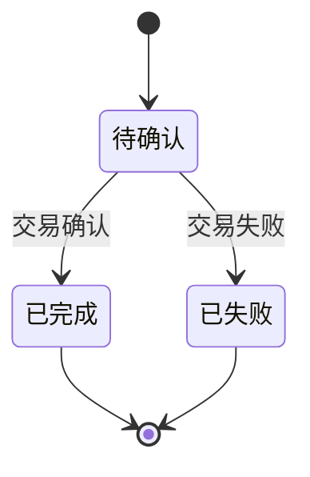
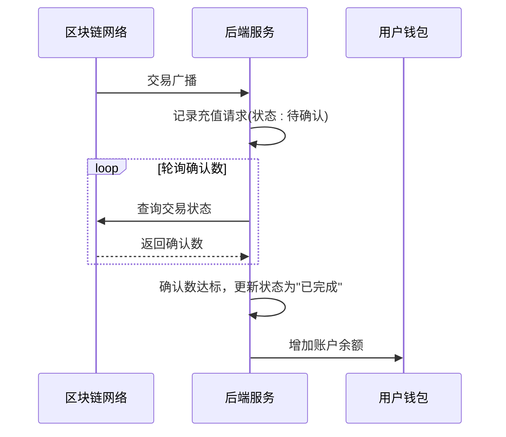
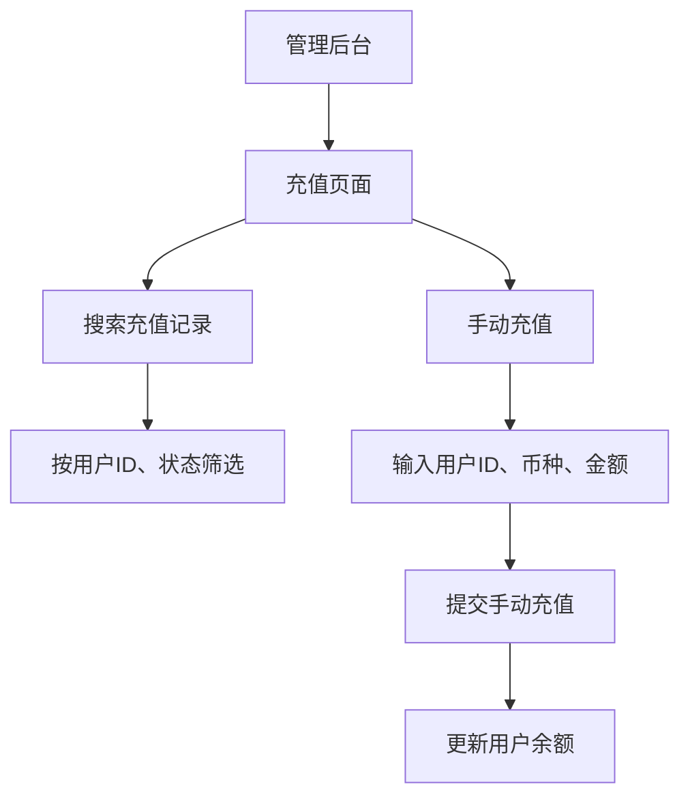
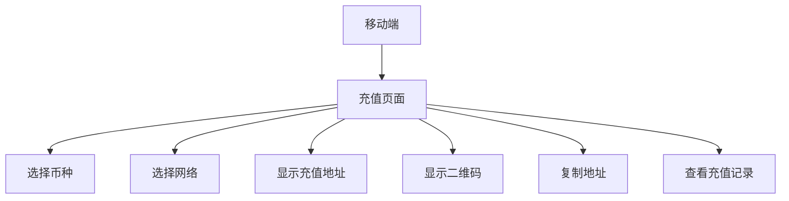

# 充值API

<cite>
**本文档引用的文件**   
- [account.controller.ts](file://agx-backend/src/modules/account/account.controller.ts)
- [account.service.ts](file://agx-backend/src/modules/account/account.service.ts)
- [recharge.entity.ts](file://agx-backend/src/entities/recharge.entity.ts)
- [account.dto.ts](file://agx-backend/src/modules/account/account.dto.ts)
- [recharge.vue](file://agx-admin/src/views/agx/recharge.vue)
- [Deposit.vue](file://h5/src/views/Deposit.vue)
- [API_CONTRACT.md](file://agx-backend/API_CONTRACT.md)
</cite>

## 目录
1. [充值API](#充值api)
2. [API端点详情](#api端点详情)
3. [请求参数与结构](#请求参数与结构)
4. [响应JSON Schema](#响应json-schema)
5. [错误码](#错误码)
6. [业务逻辑与状态机](#业务逻辑与状态机)
7. [回调机制](#回调机制)
8. [请求/响应示例](#请求响应示例)
9. [前端集成](#前端集成)
10. [移动端集成](#移动端集成)

## API端点详情

充值API提供了一个用于用户充值的端点。该端点允许用户通过指定币种、链网络和金额来发起充值请求。

**HTTP方法**: POST  
**URL路径**: `/api/account/deposit`

**Section sources**
- [account.controller.ts](file://agx-backend/src/modules/account/account.controller.ts#L101-L109)

## 请求参数与结构

充值请求需要在请求体中包含以下参数：

| 字段 | 类型 | 必填 | 说明 |
|------|------|------|------|
| coin | string | 是 | 币种代码（如USDT、BTC） |
| chain | string | 是 | 链网络（如TRC20、ERC20） |
| amount | string | 是 | 充值金额（字符串格式，支持小数） |
| orderNo | string | 是 | 唯一订单号 |

请求体示例：
```json
{
  "coin": "USDT",
  "chain": "TRC20",
  "amount": "100.00",
  "orderNo": "DEP20240115001"
}
```

**Section sources**
- [recharge.entity.ts](file://agx-backend/src/entities/recharge.entity.ts#L17-L34)
- [account.dto.ts](file://agx-backend/src/modules/account/account.dto.ts)

## 响应JSON Schema

成功响应包含交易ID、状态和时间戳等信息。

**成功响应：**
```json
{
  "code": 0,
  "msg": "ok",
  "data": {
    "id": 123,
    "orderNo": "DEP20240115001",
    "coin": "USDT",
    "chain": "TRC20",
    "amount": "100.00",
    "status": 0,
    "createdAt": "2024-01-15 10:30:00"
  }
}
```

| 字段 | 类型 | 说明 |
|------|------|------|
| id | number | 充值记录ID |
| orderNo | string | 订单号 |
| coin | string | 币种 |
| chain | string | 链网络 |
| amount | string | 充值金额 |
| status | number | 状态（0:待确认, 1:已完成, 2:已失败） |
| createdAt | string | 创建时间 |

**Section sources**
- [account.controller.ts](file://agx-backend/src/modules/account/account.controller.ts#L101-L109)
- [recharge.entity.ts](file://agx-backend/src/entities/recharge.entity.ts)

## 错误码

| 错误码 | 说明 |
|--------|------|
| 0 | 成功 |
| 1001 | 参数错误 |
| 1002 | 未登录 |
| 1003 | Token过期 |
| 2001 | 用户不存在 |
| 7001 | 用户不存在（管理员操作） |
| 7002 | 币种不存在 |

**Section sources**
- [API_CONTRACT.md](file://agx-backend/API_CONTRACT.md#L410-L428)
- [business.exception.ts](file://agx-backend/src/common/filters/business.exception.ts)

## 业务逻辑与状态机

充值流程包含以下状态：



**Diagram sources**
- [recharge.entity.ts](file://agx-backend/src/entities/recharge.entity.ts#L45-L46)

状态说明：
- **待确认 (0)**: 用户已发起充值，等待区块链网络确认
- **已完成 (1)**: 交易已确认，金额已记入用户账户
- **已失败 (2)**: 交易失败，充值未成功

**Section sources**
- [recharge.entity.ts](file://agx-backend/src/entities/recharge.entity.ts#L45-L46)
- [account.service.ts](file://agx-backend/src/modules/account/account.service.ts)

## 回调机制

系统通过轮询区块链网络来监控充值交易的状态。当检测到交易确认数达到预设阈值时，系统会自动更新充值记录状态为"已完成"，并将金额记入用户钱包余额。



**Diagram sources**
- [account.service.ts](file://agx-backend/src/modules/account/account.service.ts)
- [recharge.entity.ts](file://agx-backend/src/entities/recharge.entity.ts)

## 请求/响应示例

**请求示例：**
```http
POST /api/account/deposit
Authorization: Bearer <token>
Content-Type: application/json

{
  "coin": "USDT",
  "chain": "TRC20",
  "amount": "500.00",
  "orderNo": "DEP20240115002"
}
```

**成功响应示例：**
```json
{
  "code": 0,
  "msg": "ok",
  "data": {
    "id": 124,
    "orderNo": "DEP20240115002",
    "coin": "USDT",
    "chain": "TRC20",
    "amount": "500.00",
    "status": 0,
    "createdAt": "2024-01-15 14:20:00"
  }
}
```

**错误响应示例：**
```json
{
  "code": 1001,
  "msg": "金额无效",
  "data": null
}
```

**Section sources**
- [API_CONTRACT.md](file://agx-backend/API_CONTRACT.md)
- [account.controller.ts](file://agx-backend/src/modules/account/account.controller.ts)

## 前端集成

管理后台的充值页面提供了充值记录查询和手动充值功能。



**Diagram sources**
- [recharge.vue](file://agx-admin/src/views/agx/recharge.vue)

**Section sources**
- [recharge.vue](file://agx-admin/src/views/agx/recharge.vue)

## 移动端集成

移动端充值页面引导用户选择币种和网络，显示充值地址和二维码。



**Diagram sources**
- [Deposit.vue](file://h5/src/views/Deposit.vue)

**Section sources**
- [Deposit.vue](file://h5/src/views/Deposit.vue)