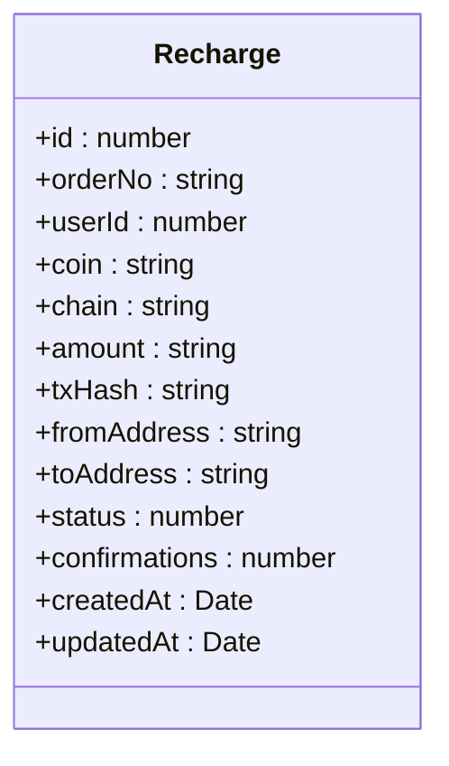
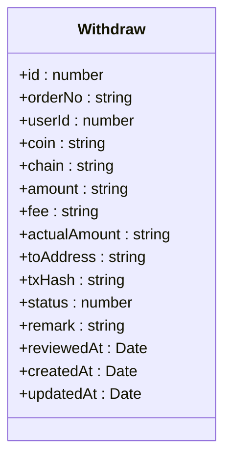
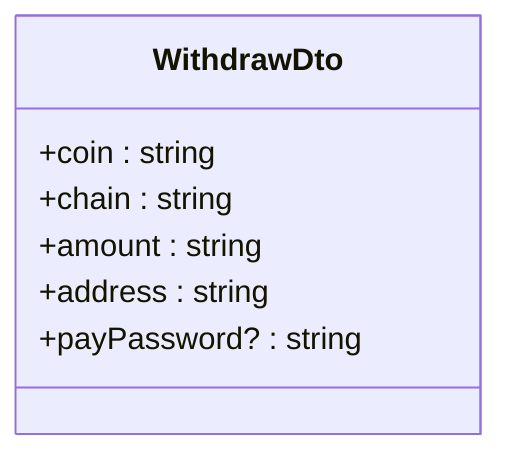
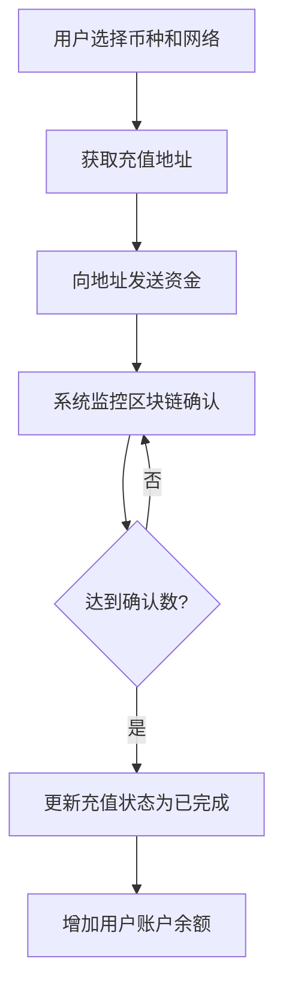
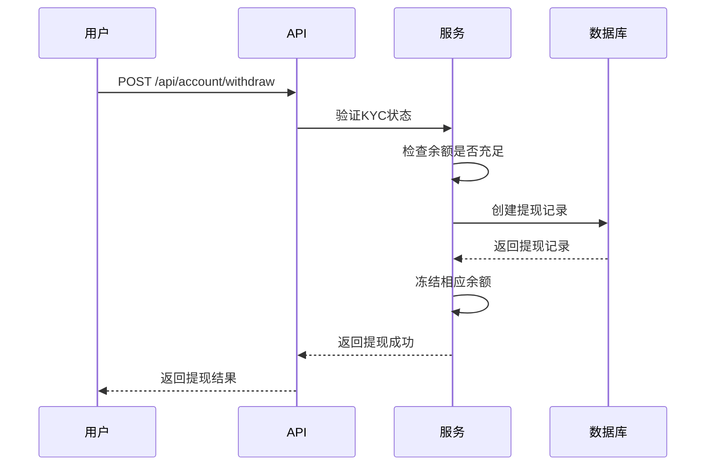
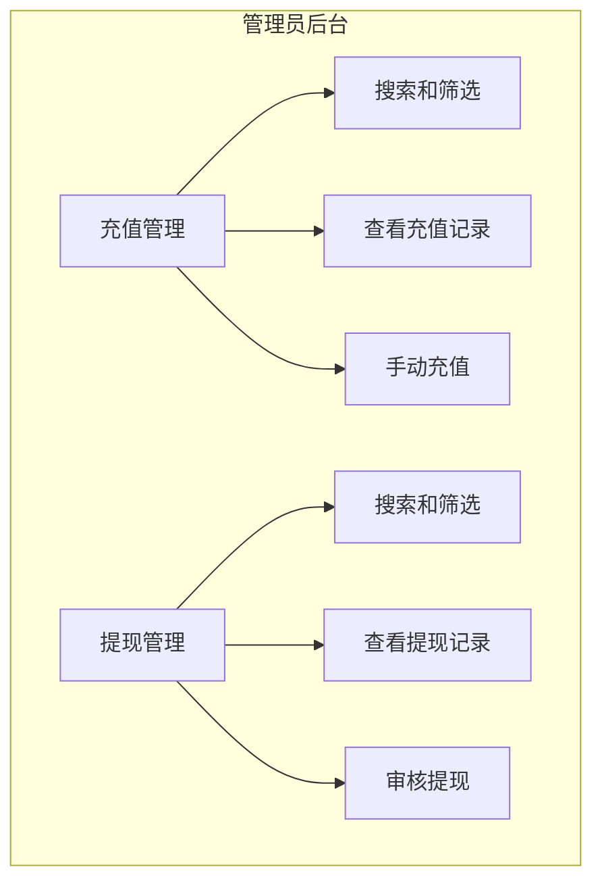
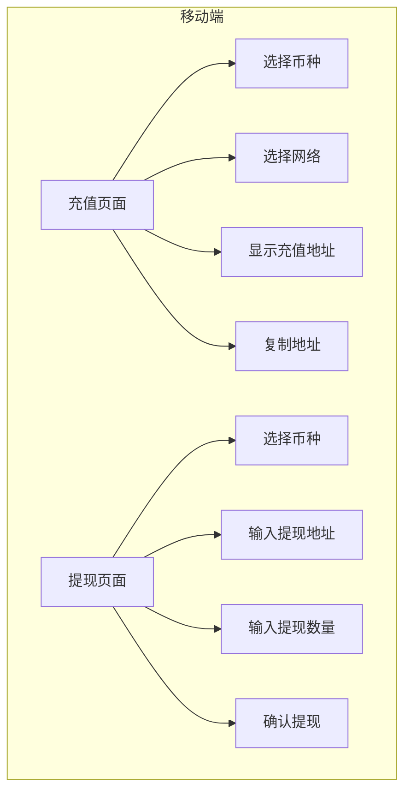

# 资金管理API

<cite>
**本文档引用文件**   
- [account.controller.ts](file://agx-backend/src/modules/account/account.controller.ts)
- [recharge.entity.ts](file://agx-backend/src/entities/recharge.entity.ts)
- [withdraw.entity.ts](file://agx-backend/src/entities/withdraw.entity.ts)
- [account.dto.ts](file://agx-backend/src/modules/account/account.dto.ts)
- [account.service.ts](file://agx-backend/src/modules/account/account.service.ts)
- [recharge.vue](file://agx-admin/src/views/agx/recharge.vue)
- [withdraw.vue](file://agx-admin/src/views/agx/withdraw.vue)
- [Deposit.vue](file://h5/src/views/Deposit.vue)
- [Withdraw.vue](file://h5/src/views/Withdraw.vue)
- [index.js](file://agx-admin/src/api/agx/index.js)
</cite>

## 目录
1. [简介](#简介)
2. [核心API端点](#核心api端点)
3. [数据模型](#数据模型)
4. [业务流程与状态](#业务流程与状态)
5. [请求/响应示例](#请求响应示例)
6. [前端集成](#前端集成)
7. [错误码](#错误码)

## 简介
资金管理API为用户提供充值和提现功能，支持多种数字货币和区块链网络。该API允许用户通过指定的充值地址进行资金充值，并申请将资金提现到外部钱包地址。系统实现了完整的KYC（了解你的客户）验证流程，确保提现操作的安全性。所有资金操作均记录在数据库中，便于审计和追踪。前端页面提供了直观的用户界面，支持管理员审核和管理用户的资金操作。

## 核心API端点

### 充值相关API
资金管理API提供以下充值相关端点：

| 端点 | 方法 | 描述 |
|------|------|------|
| `/api/account/deposit/address` | GET | 获取指定币种和网络的充值地址 |
| `/api/account/deposit/history` | GET | 获取用户的充值记录 |
| `/api/admin/recharge/list` | GET | 管理员获取充值记录列表 |
| `/api/admin/recharge/manual` | POST | 管理员手动为用户充值 |

### 提现相关API
资金管理API提供以下提现相关端点：

| 端点 | 方法 | 描述 |
|------|------|------|
| `/api/account/withdraw` | POST | 用户申请提现 |
| `/api/account/withdraw/history` | GET | 获取用户的提现记录 |
| `/api/admin/withdraw/list` | GET | 管理员获取提现记录列表 |
| `/api/admin/withdraw/:id/review` | PUT | 管理员审核提现申请 |

**Section sources**
- [account.controller.ts](file://agx-backend/src/modules/account/account.controller.ts#L91-L129)
- [index.js](file://agx-admin/src/api/agx/index.js#L233-L272)

## 数据模型

### 充值实体 (Recharge)
充值实体定义了用户充值操作的数据结构：



**Diagram sources**
- [recharge.entity.ts](file://agx-backend/src/entities/recharge.entity.ts#L12-L57)

### 提现实体 (Withdraw)
提现实体定义了用户提现操作的数据结构：



**Diagram sources**
- [withdraw.entity.ts](file://agx-backend/src/entities/withdraw.entity.ts#L12-L63)

### 请求数据传输对象
提现请求的数据传输对象定义了客户端提交提现申请时的参数结构：



**Diagram sources**
- [account.dto.ts](file://agx-backend/src/modules/account/account.dto.ts#L73-L89)

## 业务流程与状态

### 充值流程
用户的充值流程如下：



充值操作的状态流转如下：
- **0: 待确认** - 系统已生成充值地址，等待用户转账
- **1: 已完成** - 区块链交易已达到足够确认数，资金已到账
- **2: 已失败** - 充值操作失败，可能由于地址错误或其他原因

### 提现流程
用户的提现流程如下：



提现操作的状态流转如下：
- **0: 待审核** - 用户已提交提现申请，等待管理员审核
- **1: 处理中** - 提现申请已通过审核，正在处理
- **2: 已完成** - 提现已成功打款
- **3: 拒绝** - 提现申请被拒绝

**Section sources**
- [account.service.ts](file://agx-backend/src/modules/account/account.service.ts#L430-L492)
- [account.controller.ts](file://agx-backend/src/modules/account/account.controller.ts#L111-L129)

## 请求/响应示例

### 充值地址获取
获取USDT在TRC20网络上的充值地址：

**请求**
```
GET /api/account/deposit/address?coin=USDT&chain=TRC20
```

**响应**
```json
{
  "code": 0,
  "message": "Success",
  "data": {
    "coin": "USDT",
    "chain": "TRC20",
    "address": "TN3W4H6rK7qj6bX7d9bR3j6bX7d9bR3j6bX7",
    "minDeposit": "10",
    "confirmations": 20
  }
}
```

### 提现申请
用户申请提现100 USDT到指定地址：

**请求**
```
POST /api/account/withdraw
Content-Type: application/json

{
  "coin": "USDT",
  "chain": "TRC20",
  "amount": "100",
  "address": "TN3W4H6rK7qj6bX7d9bR3j6bX7d9bR3j6bX7"
}
```

**响应**
```json
{
  "code": 0,
  "message": "Success",
  "data": {
    "id": 12345,
    "orderNo": "W1698765432ABCDEF",
    "amount": "100",
    "fee": "1.00000000",
    "actualAmount": "99.00000000"
  }
}
```

**Section sources**
- [account.service.ts](file://agx-backend/src/modules/account/account.service.ts#L430-L492)
- [account.dto.ts](file://agx-backend/src/modules/account/account.dto.ts#L73-L89)

## 前端集成

### 管理员后台
管理员后台提供了充值和提现的管理界面：



管理员可以通过`recharge.vue`和`withdraw.vue`页面管理用户的资金操作。充值管理页面支持按用户ID、关键词、币种和状态进行搜索，并提供手动充值功能。提现管理页面显示待审核的提现申请，管理员可以批准或拒绝提现请求。

### 移动端
移动端提供了用户友好的充值和提现界面：



移动端的`Deposit.vue`和`Withdraw.vue`页面为用户提供了简洁的操作界面。充值页面显示当前选择币种的充值地址和二维码，用户可以一键复制地址。提现页面引导用户输入提现地址和数量，并显示手续费和实际到账金额。

**Section sources**
- [recharge.vue](file://agx-admin/src/views/agx/recharge.vue)
- [withdraw.vue](file://agx-admin/src/views/agx/withdraw.vue)
- [Deposit.vue](file://h5/src/views/Deposit.vue)
- [Withdraw.vue](file://h5/src/views/Withdraw.vue)

## 错误码
资金管理API定义了以下错误码：

| 错误码 | 描述 | 可能原因 |
|--------|------|---------|
| 6002 | 请先完成实名认证 | 用户未通过KYC验证 |
| 6003 | 钱包不存在 | 用户的钱包记录未找到 |
| 6004 | 余额不足 | 用户账户余额不足以完成操作 |
| 7001 | 用户不存在 | 指定的用户ID不存在 |
| 7002 | 币种不存在 | 指定的币种不支持 |

这些错误码帮助客户端准确识别和处理各种异常情况，提供更好的用户体验。

**Section sources**
- [account.service.ts](file://agx-backend/src/modules/account/account.service.ts#L436-L461)
- [account.controller.ts](file://agx-backend/src/modules/account/account.controller.ts#L117-L118)