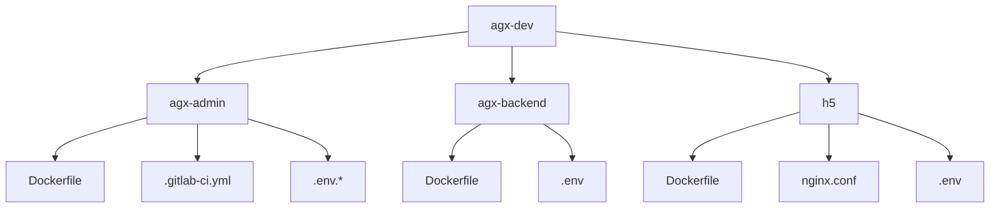
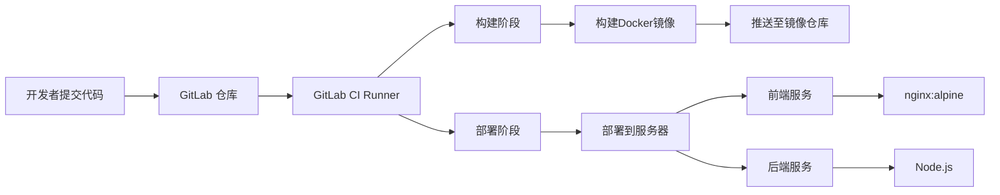
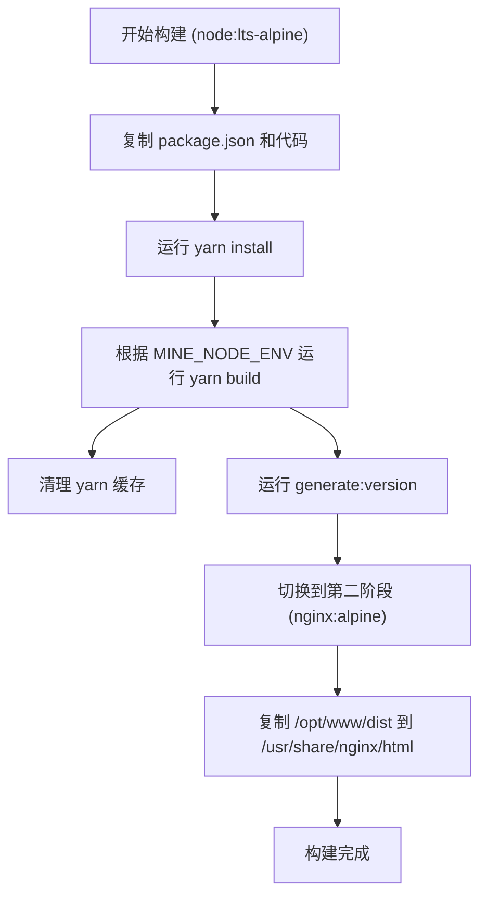
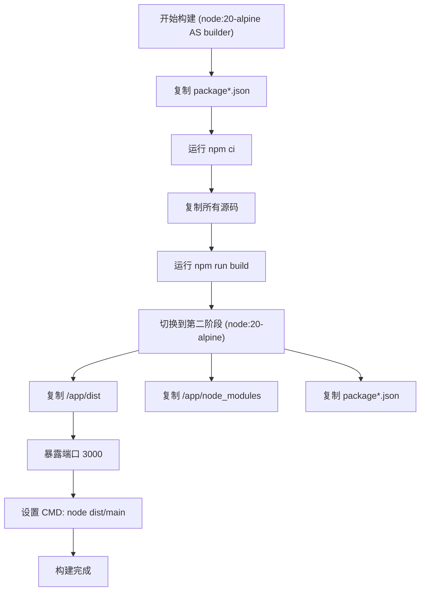
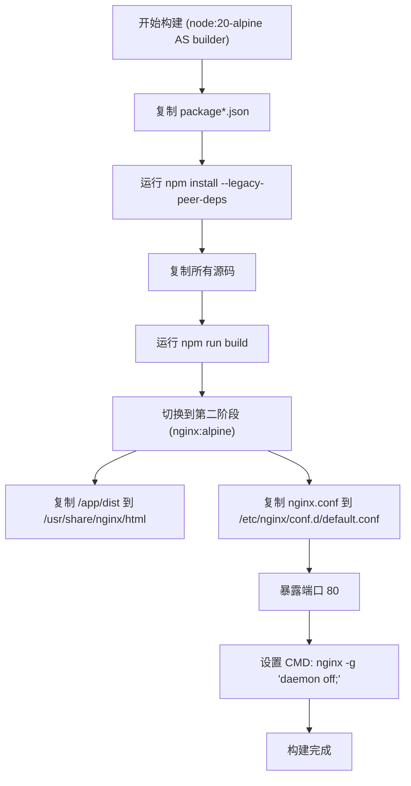
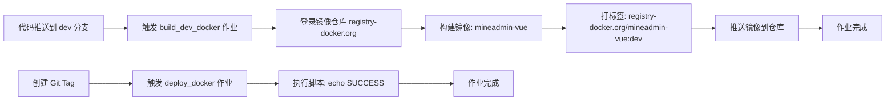
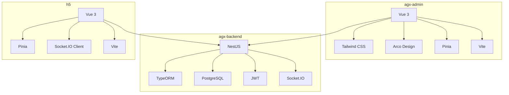

# CI/CD与部署

<cite>
**本文档中引用的文件**  
- [agx-admin/.gitlab-ci.yml](file://agx-admin/.gitlab-ci.yml)
- [agx-admin/Dockerfile](file://agx-admin/Dockerfile)
- [agx-backend/Dockerfile](file://agx-backend/Dockerfile)
- [h5/Dockerfile](file://h5/Dockerfile)
- [h5/nginx.conf](file://h5/nginx.conf)
- [agx-admin/.env.production](file://agx-admin/.env.production)
- [agx-admin/.env.development](file://agx-admin/.env.development)
- [agx-backend/.env](file://agx-backend/.env)
- [h5/.env](file://h5/.env)
- [agx-admin/package.json](file://agx-admin/package.json)
- [agx-backend/package.json](file://agx-backend/package.json)
- [h5/package.json](file://h5/package.json)
- [agx-admin/vite.config.js](file://agx-admin/vite.config.js)
- [h5/vite.config.js](file://h5/vite.config.js)
</cite>

## 目录
1. [简介](#简介)
2. [项目结构](#项目结构)
3. [核心组件](#核心组件)
4. [架构概述](#架构概述)
5. [详细组件分析](#详细组件分析)
6. [依赖分析](#依赖分析)
7. [性能考虑](#性能考虑)
8. [故障排除指南](#故障排除指南)
9. [结论](#结论)

## 简介
本文档详细说明了 agx-dev 项目的 CI/CD 流水线和部署流程。项目包含三个主要子项目：`agx-admin`（管理后台）、`agx-backend`（后端API服务）和 `h5`（移动端H5应用）。CI/CD 流程基于 GitLab CI，通过 `.gitlab-ci.yml` 文件定义。每个子项目都通过 Docker 容器化，使用多阶段构建优化镜像大小。文档还涵盖了本地构建、生产环境反向代理配置以及运维最佳实践。

## 项目结构

**图示来源**
- [agx-admin](file://agx-admin)
- [agx-backend](file://agx-backend)
- [h5](file://h5)

**章节来源**
- [agx-admin](file://agx-admin)
- [agx-backend](file://agx-backend)
- [h5](file://h5)

## 核心组件

本文档的核心组件是三个子项目的 Docker 构建流程和 CI/CD 配置。`agx-admin` 和 `h5` 是基于 Vue.js 的前端应用，使用 Nginx 作为生产镜像的基础。`agx-backend` 是基于 NestJS 的后端 API 服务，直接运行在 Node.js 环境中。CI/CD 流水线负责自动化构建、测试和部署这些容器镜像。

**章节来源**
- [agx-admin/Dockerfile](file://agx-admin/Dockerfile)
- [agx-backend/Dockerfile](file://agx-backend/Dockerfile)
- [h5/Dockerfile](file://h5/Dockerfile)
- [agx-admin/.gitlab-ci.yml](file://agx-admin/.gitlab-ci.yml)

## 架构概述

**图示来源**
- [agx-admin/.gitlab-ci.yml](file://agx-admin/.gitlab-ci.yml)
- [agx-admin/Dockerfile](file://agx-admin/Dockerfile)
- [agx-backend/Dockerfile](file://agx-backend/Dockerfile)
- [h5/Dockerfile](file://h5/Dockerfile)

## 详细组件分析

### agx-admin 容器化构建分析

`agx-admin` 项目使用多阶段 Docker 构建。第一阶段使用 `node:lts-alpine` 镜像进行依赖安装和前端构建。第二阶段使用 `nginx:alpine` 镜像，将第一阶段构建生成的 `dist` 目录复制到 Nginx 的默认 Web 根目录中。通过 `ARG` 和 `ENV` 指令，构建过程可以根据 `MINE_NODE_ENV` 参数选择 `development` 或 `production` 模式进行构建。

**图示来源**
- [agx-admin/Dockerfile](file://agx-admin/Dockerfile#L1-L33)
- [agx-admin/package.json](file://agx-admin/package.json#L7-L13)

**章节来源**
- [agx-admin/Dockerfile](file://agx-admin/Dockerfile#L1-L33)
- [agx-admin/package.json](file://agx-admin/package.json#L7-L13)

### agx-backend 容器化构建分析

`agx-backend` 项目同样采用多阶段构建。第一阶段（`builder`）使用 `node:20-alpine` 镜像，先复制 `package*.json` 并运行 `npm ci` 安装精确版本的依赖，然后复制源码并运行 `npm run build` 编译 TypeScript 代码。第二阶段将第一阶段的 `dist` 目录、`node_modules` 和 `package.json` 复制到新的 `node:20-alpine` 基础镜像中，并设置启动命令为 `node dist/main`。

**图示来源**
- [agx-backend/Dockerfile](file://agx-backend/Dockerfile#L1-L22)
- [agx-backend/package.json](file://agx-backend/package.json#L6-L11)

**章节来源**
- [agx-backend/Dockerfile](file://agx-backend/Dockerfile#L1-L22)
- [agx-backend/package.json](file://agx-backend/package.json#L6-L11)

### h5 容器化构建与Nginx配置分析

`h5` 项目的构建流程与 `agx-admin` 类似，使用 `node:20-alpine` 进行构建，然后将结果复制到 `nginx:alpine` 镜像中。其独特之处在于自定义的 `nginx.conf` 文件，该文件被复制到容器中，配置了反向代理、SPA 路由和静态资源缓存。`location /api/` 将 API 请求代理到名为 `backend` 的后端服务，实现了前后端分离部署。

**图示来源**
- [h5/Dockerfile](file://h5/Dockerfile#L1-L19)
- [h5/nginx.conf](file://h5/nginx.conf#L1-L35)

**章节来源**
- [h5/Dockerfile](file://h5/Dockerfile#L1-L19)
- [h5/nginx.conf](file://h5/nginx.conf#L1-L35)

### CI/CD流水线分析

`agx-admin` 项目的 `.gitlab-ci.yml` 文件定义了一个包含 `build` 和 `deploy` 两个阶段的流水线。`build_dev_docker` 作业在 `dev` 分支上触发，负责登录镜像仓库、构建 Docker 镜像、打上 `dev` 标签并推送。`deploy_docker` 作业在创建 `tags` 时触发，但当前仅输出 `SUCCESS`，实际部署逻辑可能在其他地方或尚未实现。

**图示来源**
- [agx-admin/.gitlab-ci.yml](file://agx-admin/.gitlab-ci.yml#L3-L35)

**章节来源**
- [agx-admin/.gitlab-ci.yml](file://agx-admin/.gitlab-ci.yml#L3-L35)

## 依赖分析

**图示来源**
- [agx-admin/package.json](file://agx-admin/package.json#L15-L47)
- [agx-backend/package.json](file://agx-backend/package.json#L13-L34)
- [h5/package.json](file://h5/package.json#L11-L18)

**章节来源**
- [agx-admin/package.json](file://agx-admin/package.json#L15-L47)
- [agx-backend/package.json](file://agx-backend/package.json#L13-L34)
- [h5/package.json](file://h5/package.json#L11-L18)

## 性能考虑
为了优化性能，所有 Docker 镜像都基于 `alpine` 版本，以减小镜像体积和攻击面。前端项目在构建时会清理依赖缓存（如 `yarn cache clean`），并利用 Vite 的依赖预构建功能（`optimizeDeps`）。Nginx 配置中启用了 Gzip 压缩和静态资源的长期缓存（`expires 1y`），显著提升了前端应用的加载速度。后端使用 `npm ci` 而非 `npm install`，确保了依赖安装的可重复性和速度。

## 故障排除指南

当遇到构建或部署问题时，应首先检查 `.env` 文件中的环境变量配置是否正确。对于 `agx-admin`，确保 `VITE_APP_BASE_URL` 指向正确的后端 API 地址。对于 `h5`，检查 `VITE_API_BASE_URL` 和 `VITE_WS_BASE_URL`。在 CI/CD 流程中，如果 `docker login` 失败，请确认 GitLab CI 变量 `$username` 和 `$password` 已正确设置。如果 Nginx 代理失败，请检查 `nginx.conf` 中的 `proxy_pass` 地址是否与后端服务的实际地址和端口匹配。

**章节来源**
- [agx-admin/.env.production](file://agx-admin/.env.production)
- [agx-admin/.env.development](file://agx-admin/.env.development)
- [agx-backend/.env](file://agx-backend/.env)
- [h5/.env](file://h5/.env)
- [h5/nginx.conf](file://h5/nginx.conf)

## 结论
agx-dev 项目通过 Docker 和 GitLab CI 实现了现代化的 CI/CD 流程。每个子项目都有清晰的容器化构建策略，前端应用通过 Nginx 高效服务，后端 API 通过轻量级 Node.js 镜像运行。CI/CD 流水线自动化了从代码提交到镜像构建的流程，为实现持续部署奠定了基础。建议完善 `deploy_docker` 作业的实际部署逻辑，并为 `agx-backend` 和 `h5` 添加 CI/CD 配置以实现全流程自动化。