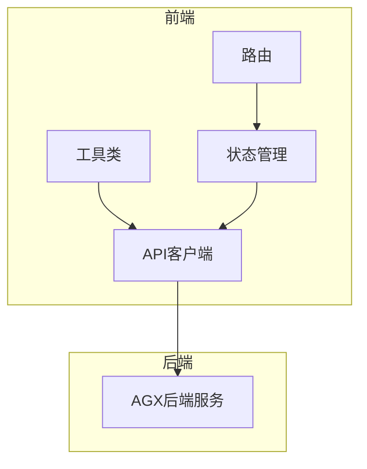
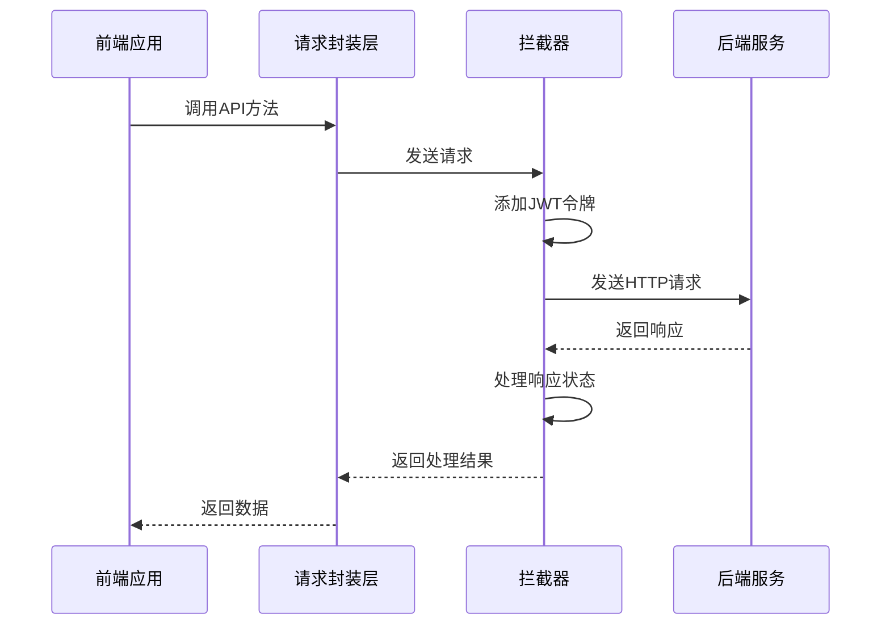
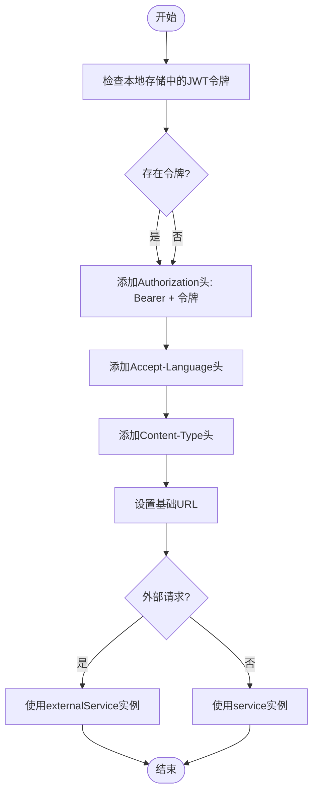
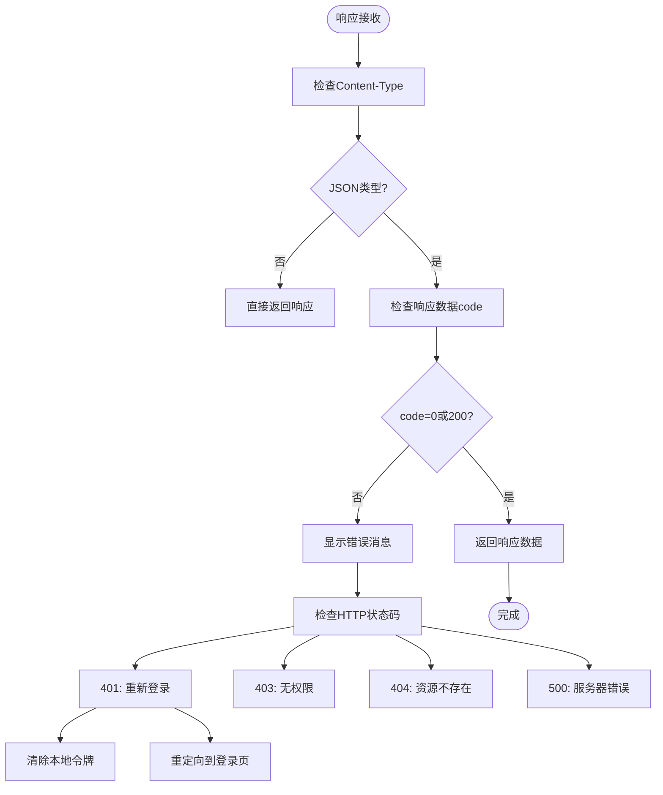
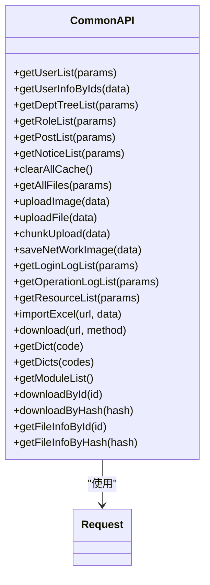
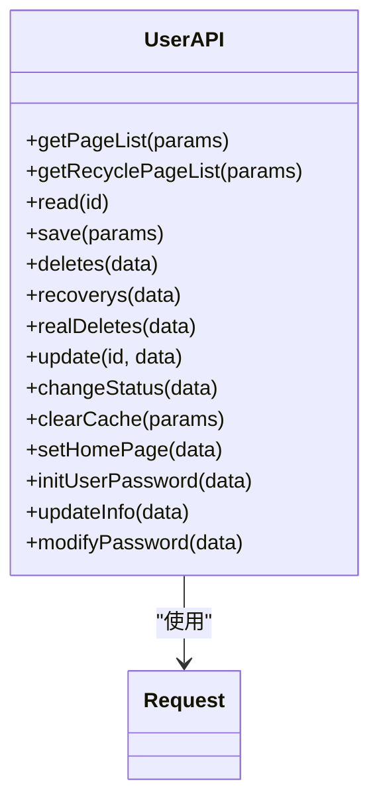
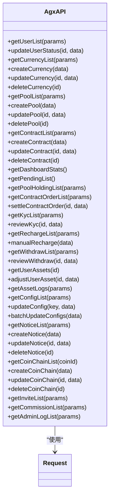
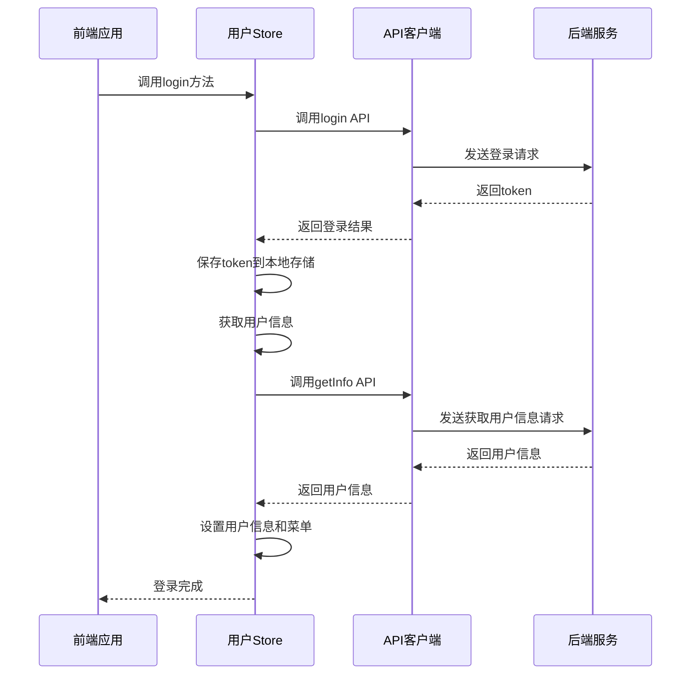

# API客户端

<cite>
**本文档引用文件**  
- [request.js](file://agx-admin/src/utils/request.js)
- [common.js](file://agx-admin/src/api/common.js)
- [login.js](file://agx-admin/src/api/login.js)
- [user.js](file://agx-admin/src/api/system/user.js)
- [index.js](file://agx-admin/src/api/agx/index.js)
- [tool.js](file://agx-admin/src/utils/tool.js)
- [upload.js](file://agx-admin/src/config/upload.js)
- [main.js](file://agx-admin/src/main.js)
- [user.js](file://agx-admin/src/store/modules/user.js)
</cite>

## 目录
1. [简介](#简介)
2. [项目结构](#项目结构)
3. [核心组件](#核心组件)
4. [架构概述](#架构概述)
5. [详细组件分析](#详细组件分析)
6. [依赖分析](#依赖分析)
7. [性能考虑](#性能考虑)
8. [故障排除指南](#故障排除指南)
9. [结论](#结论)

## 简介
本文档详细解析了AGX系统前端与后端服务的通信机制，重点聚焦于API客户端的实现。文档深入分析了`request.js`中的Axios封装逻辑，包括请求拦截、响应处理、错误统一处理和JWT令牌自动注入等核心功能。同时，文档还说明了`common.js`中公共API方法的抽象方式，以及各业务模块（如login、user、agx）API定义的组织结构。

文档涵盖了认证流程、分页参数规范、文件上传处理等常见模式，并以用户查询、登录认证等接口调用为例演示了完整的请求生命周期。为初学者提供了基本的API调用示例，同时也为高级开发者讲解了请求缓存、并发控制和接口Mock的实现方案。

## 项目结构



**图表来源**  
- [request.js](file://agx-admin/src/utils/request.js)
- [common.js](file://agx-admin/src/api/common.js)
- [main.js](file://agx-admin/src/main.js)

**章节来源**  
- [request.js](file://agx-admin/src/utils/request.js#L1-L165)
- [common.js](file://agx-admin/src/api/common.js#L1-L264)

## 核心组件

API客户端的核心组件包括请求封装、拦截器、错误处理和认证管理。`request.js`文件实现了基于Axios的请求封装，通过创建两个独立的axios实例（`service`和`externalService`）来分别处理内部API请求和外部网络请求。

请求拦截器负责在请求发送前自动注入JWT令牌和语言设置，而响应拦截器则统一处理各种HTTP状态码和业务错误。`common.js`文件提供了公共API方法的抽象，将常用的用户、部门、角色等查询操作封装为可复用的方法。

认证流程通过`login.js`文件中的`getInfo`方法实现，该方法返回静态管理员信息和权限路由，为前端菜单渲染提供数据支持。

**章节来源**  
- [request.js](file://agx-admin/src/utils/request.js#L1-L165)
- [common.js](file://agx-admin/src/api/common.js#L1-L264)
- [login.js](file://agx-admin/src/api/login.js#L1-L172)

## 架构概述



**图表来源**  
- [request.js](file://agx-admin/src/utils/request.js#L1-L165)
- [login.js](file://agx-admin/src/api/login.js#L1-L172)

## 详细组件分析

### Axios封装逻辑分析

#### 请求拦截与JWT令牌注入


**图表来源**  
- [request.js](file://agx-admin/src/utils/request.js#L124-L158)

#### 响应处理与错误统一处理


**图表来源**  
- [request.js](file://agx-admin/src/utils/request.js#L44-L96)

### 公共API方法抽象分析

#### common.js中的公共方法组织


**图表来源**  
- [common.js](file://agx-admin/src/api/common.js#L1-L264)
- [request.js](file://agx-admin/src/utils/request.js#L1-L165)

### 业务模块API定义分析

#### 用户管理API


**图表来源**  
- [user.js](file://agx-admin/src/api/system/user.js#L1-L171)
- [request.js](file://agx-admin/src/utils/request.js#L1-L165)

#### AGX业务模块API


**图表来源**  
- [index.js](file://agx-admin/src/api/agx/index.js#L1-L445)
- [request.js](file://agx-admin/src/utils/request.js#L1-L165)

### 认证流程分析

#### 登录认证流程


**图表来源**  
- [login.js](file://agx-admin/src/api/login.js#L1-L172)
- [user.js](file://agx-admin/src/store/modules/user.js#L1-L183)

**章节来源**  
- [login.js](file://agx-admin/src/api/login.js#L1-L172)
- [user.js](file://agx-admin/src/store/modules/user.js#L1-L183)

## 依赖分析

```mermaid
graph TD
Request[request.js] --> Axios[axios]
Request --> Message[@arco-design/web-vue Message]
Request --> Tool[tool.js]
Request --> Qs[qs]
Request --> Lodash[lodash]
Common[common.js] --> Request[request.js]
Login[login.js] --> Request[request.js]
User[user.js] --> Request[request.js]
Agx[index.js] --> Request[request.js]
Main[main.js] --> Request[request.js]
Main --> Tool[tool.js]
Store[user.js] --> Login[login.js]
Store --> Tool[tool.js]
Store --> Router[router]
```

**图表来源**  
- [request.js](file://agx-admin/src/utils/request.js#L1-L165)
- [common.js](file://agx-admin/src/api/common.js#L1-L264)
- [login.js](file://agx-admin/src/api/login.js#L1-L172)
- [user.js](file://agx-admin/src/api/system/user.js#L1-L171)
- [index.js](file://agx-admin/src/api/agx/index.js#L1-L445)
- [main.js](file://agx-admin/src/main.js#L1-L61)
- [user.js](file://agx-admin/src/store/modules/user.js#L1-L183)

**章节来源**  
- [request.js](file://agx-admin/src/utils/request.js#L1-L165)
- [package.json](file://agx-admin/package.json#L1-L58)

## 性能考虑

API客户端在性能方面进行了多项优化：

1. **请求超时设置**：所有请求都设置了10秒的超时时间，防止请求长时间挂起影响用户体验。
2. **错误处理节流**：对于401未授权错误，使用节流函数防止重复弹出登录过期提示。
3. **参数序列化优化**：使用qs库对参数进行序列化，支持点号分隔的嵌套参数。
4. **响应类型自动识别**：根据响应头的Content-Type自动判断是否为JSON响应，避免对文件下载等非JSON响应进行不必要的解析。
5. **外部请求分离**：创建独立的externalService实例处理外部网络请求，避免影响内部API请求的拦截器逻辑。

这些优化措施确保了API客户端在各种网络环境下都能稳定高效地工作。

## 故障排除指南

### 常见问题及解决方案

1. **401未授权错误**
   - 问题原因：JWT令牌过期或无效
   - 解决方案：系统会自动清除本地令牌并重定向到登录页面，用户需要重新登录

2. **403无权限访问**
   - 问题原因：当前用户角色没有访问该资源的权限
   - 解决方案：检查用户角色权限配置，或联系管理员提升权限

3. **404资源不存在**
   - 问题原因：请求的API端点不存在
   - 解决方案：检查API URL是否正确，或确认后端服务是否正常运行

4. **500服务器内部错误**
   - 问题原因：后端服务处理请求时发生异常
   - 解决方案：查看后端日志定位具体错误，或联系技术支持

5. **请求超时**
   - 问题原因：网络连接不稳定或服务器响应过慢
   - 解决方案：检查网络连接，或稍后重试

6. **文件上传失败**
   - 问题原因：文件大小超过限制或文件类型不支持
   - 解决方案：检查文件大小和类型是否符合要求，或联系管理员调整上传配置

**章节来源**  
- [request.js](file://agx-admin/src/utils/request.js#L62-L96)
- [tool.js](file://agx-admin/src/utils/tool.js#L276-L297)

## 结论

本文档全面解析了AGX系统的API客户端实现，涵盖了从基础请求封装到高级认证流程的各个方面。通过深入分析`request.js`中的Axios封装逻辑，我们了解了请求拦截、响应处理、错误统一处理和JWT令牌自动注入的核心机制。

`common.js`文件展示了公共API方法的抽象方式，将常用的查询操作封装为可复用的方法，提高了代码的可维护性和一致性。各业务模块的API定义遵循了统一的组织结构，使得API调用更加直观和易于理解。

认证流程通过`login.js`和用户Store的协同工作实现，确保了用户身份的安全验证和权限管理。文件上传、分页查询等常见模式都有相应的处理逻辑，满足了各种业务场景的需求。

对于初学者，本文档提供了基本的API调用示例；对于高级开发者，则深入讲解了请求缓存、并发控制等高级特性。这些内容为开发者高效使用API客户端提供了全面的指导和支持。