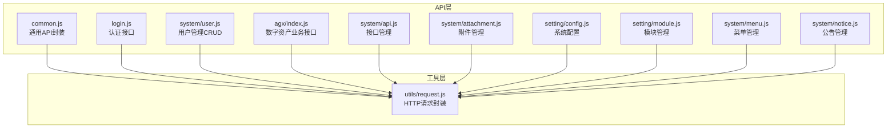
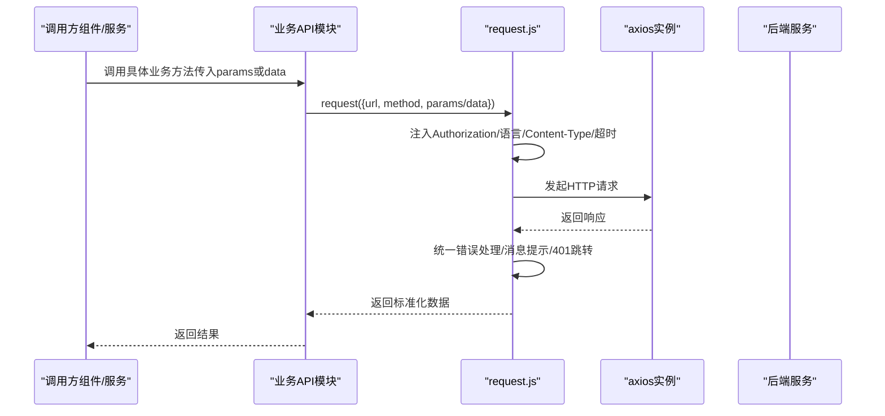
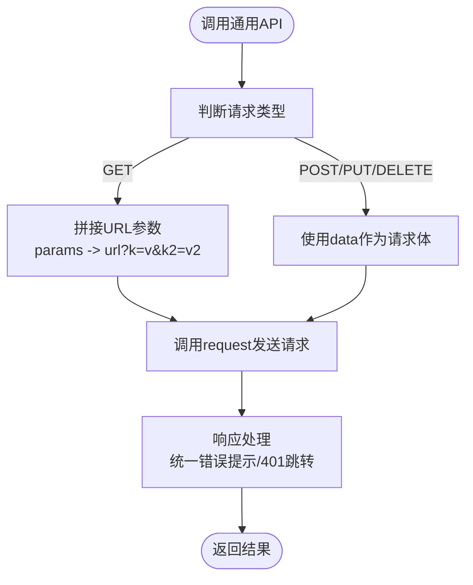
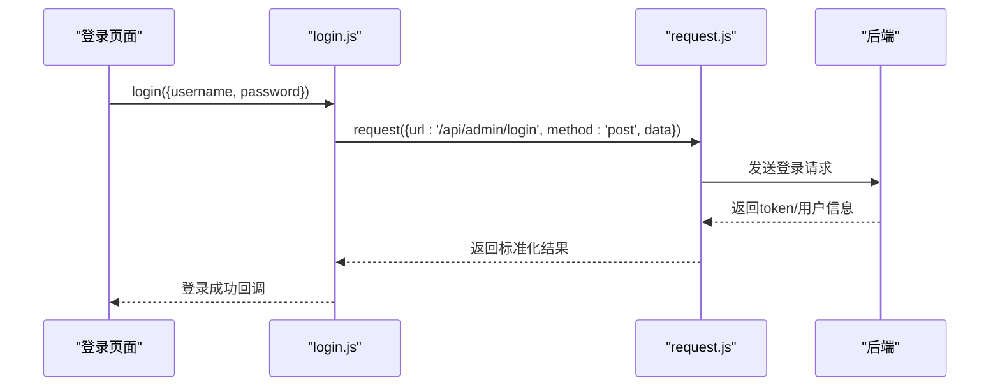
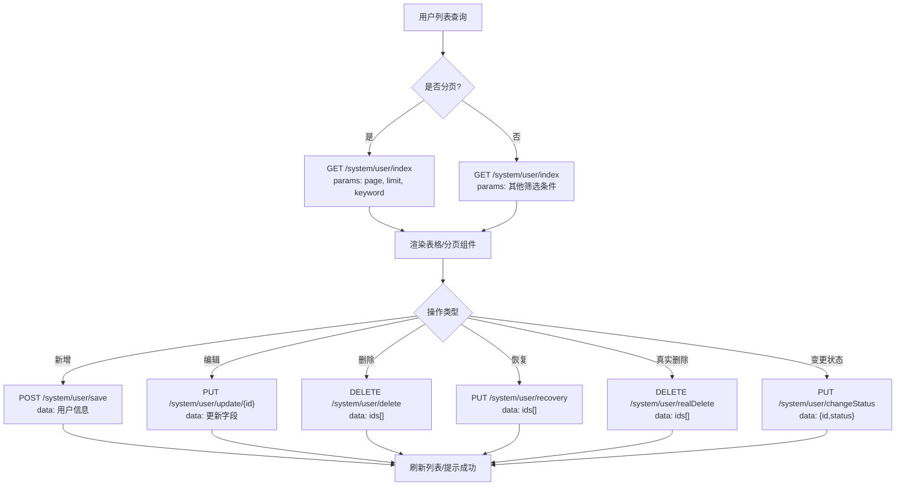
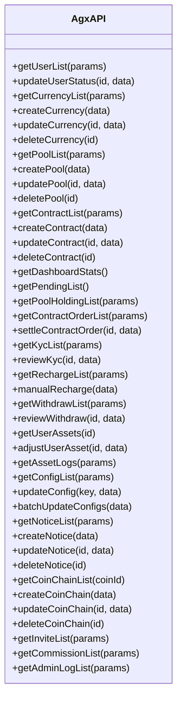
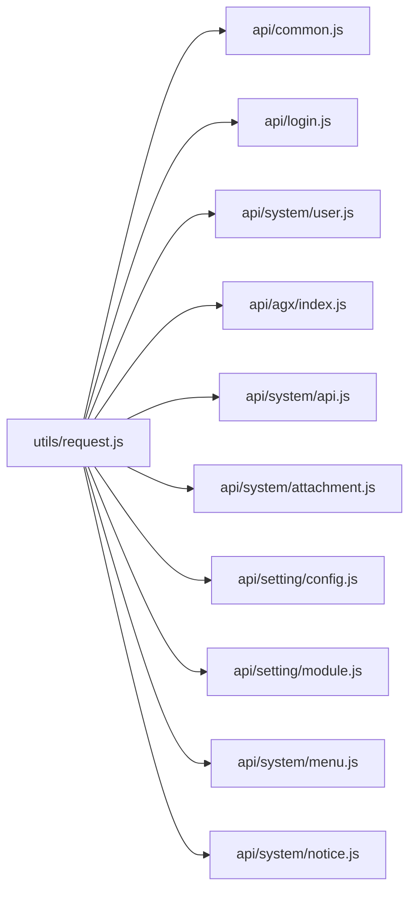

# 业务API模块

<cite>
**本文引用的文件**
- [common.js](file://agx-admin/src/api/common.js)
- [login.js](file://agx-admin/src/api/login.js)
- [user.js](file://agx-admin/src/api/system/user.js)
- [index.js](file://agx-admin/src/api/agx/index.js)
- [request.js](file://agx-admin/src/utils/request.js)
- [api.js](file://agx-admin/src/api/system/api.js)
- [attachment.js](file://agx-admin/src/api/system/attachment.js)
- [config.js](file://agx-admin/src/api/setting/config.js)
- [module.js](file://agx-admin/src/api/setting/module.js)
- [menu.js](file://agx-admin/src/api/system/menu.js)
- [notice.js](file://agx-admin/src/api/system/notice.js)
</cite>

## 目录
1. [简介](#简介)
2. [项目结构](#项目结构)
3. [核心组件](#核心组件)
4. [架构总览](#架构总览)
5. [详细组件分析](#详细组件分析)
6. [依赖分析](#依赖分析)
7. [性能考虑](#性能考虑)
8. [故障排查指南](#故障排查指南)
9. [结论](#结论)
10. [附录](#附录)

## 简介
本文件系统梳理 agx-admin/src/api 目录下的业务API模块，重点覆盖以下方面：
- common.js 中公共API方法的抽象模式（统一封装 get、post、delete 等）
- login.js 中认证相关接口（登录、获取验证码、获取用户信息）
- system/user.js 中用户管理 CRUD 的实现细节
- agx/index.js 中数字资产相关业务接口的组织方式
- 不同业务模块的命名规范、参数传递约定（如分页参数 page、limit 的使用）
- 文件上传接口的特殊处理
- 对比通用API调用模式与特定业务逻辑差异
- 在 Vue 组件中调用这些API的最佳实践

## 项目结构
API 层采用按功能域划分的目录结构，主要包含：
- system：系统管理相关（用户、菜单、公告、接口等）
- setting：系统配置相关（配置、模块等）
- agx：数字资产管理与运营相关
- common.js：通用API封装
- login.js：认证相关
- utils/request.js：HTTP请求封装与拦截器

图表来源
- [common.js](file://agx-admin/src/api/common.js#L1-L264)
- [login.js](file://agx-admin/src/api/login.js#L1-L172)
- [user.js](file://agx-admin/src/api/system/user.js#L1-L171)
- [index.js](file://agx-admin/src/api/agx/index.js#L1-L445)
- [request.js](file://agx-admin/src/utils/request.js#L1-L165)
- [api.js](file://agx-admin/src/api/system/api.js#L1-L127)
- [attachment.js](file://agx-admin/src/api/system/attachment.js#L1-L64)
- [config.js](file://agx-admin/src/api/setting/config.js#L1-L124)
- [module.js](file://agx-admin/src/api/setting/module.js#L1-L64)
- [menu.js](file://agx-admin/src/api/system/menu.js#L1-L124)
- [notice.js](file://agx-admin/src/api/system/notice.js#L1-L105)

章节来源
- [common.js](file://agx-admin/src/api/common.js#L1-L264)
- [login.js](file://agx-admin/src/api/login.js#L1-L172)
- [user.js](file://agx-admin/src/api/system/user.js#L1-L171)
- [index.js](file://agx-admin/src/api/agx/index.js#L1-L445)
- [request.js](file://agx-admin/src/utils/request.js#L1-L165)

## 核心组件
- 通用API封装（common.js）
  - 统一通过 request 工具发起请求，支持 GET/POST/DELETE/PUT 等
  - 提供分页查询、字典查询、文件上传、下载、缓存清理等常用能力
  - 参数传递约定：分页参数通常为 params（GET），业务数据为 data（POST/PUT/DELETE）
- 登录认证（login.js）
  - 登录、退出、获取验证码、获取用户信息
  - 返回静态管理员信息与路由结构（用于前端菜单渲染）
- 用户管理（system/user.js）
  - 支持分页列表、回收站、读取、保存、删除、恢复、真实删除、更新、状态变更、缓存清理、首页设置、密码初始化、个人资料更新、修改密码等
- 数字资产业务（agx/index.js）
  - 用户列表/状态、币种/链管理、矿池产品、秒合约配置、仪表盘统计、订单与持仓、KYC、充值/提现审核、资产调整、系统配置、公告管理、管理员日志等

章节来源
- [common.js](file://agx-admin/src/api/common.js#L1-L264)
- [login.js](file://agx-admin/src/api/login.js#L1-L172)
- [user.js](file://agx-admin/src/api/system/user.js#L1-L171)
- [index.js](file://agx-admin/src/api/agx/index.js#L1-L445)

## 架构总览
API 调用链路统一由 utils/request.js 提供的 request 方法执行，自动注入鉴权头、语言、默认 Content-Type、超时时间，并对响应进行统一处理（错误提示、401跳转登录等）。业务模块仅负责定义 URL、HTTP 方法与参数传递方式。

图表来源
- [request.js](file://agx-admin/src/utils/request.js#L1-L165)
- [common.js](file://agx-admin/src/api/common.js#L1-L264)
- [login.js](file://agx-admin/src/api/login.js#L1-L172)
- [user.js](file://agx-admin/src/api/system/user.js#L1-L171)
- [index.js](file://agx-admin/src/api/agx/index.js#L1-L445)

## 详细组件分析

### 通用API封装（common.js）分析
- 抽象模式
  - 统一使用 request(config) 发起请求，config 包含 url、method、params 或 data
  - GET 请求参数通过 params 传递；POST/PUT/DELETE 数据通过 data 传递
  - 特殊场景：下载使用 responseType: 'blob'；上传/分片上传设置较长超时
- 关键能力
  - 分页查询：getUserList、getDeptTreeList、getRoleList、getPostList、getNoticeList、getLoginLogList、getOperationLogList、getResourceList 等
  - 字典查询：getDict、getDicts
  - 文件上传：uploadImage、uploadFile、chunkUpload、saveNetWorkImage
  - 导入导出：importExcel、download
  - 缓存与信息：clearAllCache、getAllFiles、getModuleList
  - 文件信息：downloadById、downloadByHash、getFileInfoById、getFileInfoByHash
- 参数传递约定
  - 分页参数：建议使用 params 传递，常见字段如 page、limit、keyword、status 等
  - 业务数据：使用 data 传递对象
- 错误处理
  - 统一由 request.js 的拦截器处理，错误时弹窗提示并返回标准化数据结构

图表来源
- [common.js](file://agx-admin/src/api/common.js#L1-L264)
- [request.js](file://agx-admin/src/utils/request.js#L120-L165)

章节来源
- [common.js](file://agx-admin/src/api/common.js#L1-L264)
- [request.js](file://agx-admin/src/utils/request.js#L1-L165)

### 认证相关接口（login.js）分析
- 接口清单
  - 获取验证码：getCaptch（当前返回静态启用状态）
  - 管理员登录：login（POST /api/admin/login）
  - 用户退出：logout（静态返回）
  - 获取登录用户信息：getInfo（静态返回管理员信息+路由结构）
- 参数与响应
  - login：接收用户名/密码等凭据对象，返回标准化响应
  - getInfo：返回包含用户信息、角色、权限码与前端路由结构的对象
- 使用建议
  - 登录成功后应持久化 Token 并在 request.js 中自动注入 Authorization
  - 路由结构用于前端动态生成菜单

图表来源
- [login.js](file://agx-admin/src/api/login.js#L1-L172)
- [request.js](file://agx-admin/src/utils/request.js#L1-L165)

章节来源
- [login.js](file://agx-admin/src/api/login.js#L1-L172)
- [request.js](file://agx-admin/src/utils/request.js#L1-L165)

### 用户管理CRUD（system/user.js）分析
- 接口清单
  - 分页列表：getPageList(GET)
  - 回收站列表：getRecyclePageList(GET)
  - 读取详情：read(GET)
  - 新增：save(POST)
  - 删除至回收站：deletes(DELETE)
  - 恢复：recoverys(PUT)
  - 真实删除：realDeletes(DELETE)
  - 更新：update(PUT)
  - 变更状态：changeStatus(PUT)
  - 清理缓存：clearCache(POST)
  - 设置首页：setHomePage(POST)
  - 初始化密码：initUserPassword(PUT)
  - 个人资料更新：updateInfo(POST)
  - 修改密码：modifyPassword(POST)
- 参数传递约定
  - 分页：GET 请求通过 params 传递
  - 业务数据：POST/PUT/DELETE 通过 data 传递
  - 路径参数：read/update 等通过 URL 拼接 id
- 最佳实践
  - 列表查询时统一使用 params 传递分页字段（如 page、limit、keyword）
  - 批量操作使用 deletes/recoverys/realDeletes 传入 id 列表
  - 更新状态与密码等敏感操作使用 PUT/POST 明确语义

图表来源
- [user.js](file://agx-admin/src/api/system/user.js#L1-L171)

章节来源
- [user.js](file://agx-admin/src/api/system/user.js#L1-L171)

### 数字资产业务接口（agx/index.js）分析
- 接口组织方式
  - 按业务域分组：用户、币种/链、矿池产品、秒合约、仪表盘、订单与持仓、KYC、充值/提现、资产、系统配置、公告、管理员日志等
  - URL 命名规范：/api/admin/{resource}/{action}，路径参数用于资源标识
- 关键接口示例
  - 用户：getUserList(GET)、updateUserStatus(PUT)
  - 币种/链：getCurrencyList(GET)、createCurrency/ updateCurrency/ deleteCurrency(POST/PUT/DELETE)
  - 矿池产品：getPoolList(GET)、createPool/ updatePool/ deletePool(POST/PUT/DELETE)
  - 秒合约：getContractList(GET)、createContract/ updateContract/ deleteContract(POST/PUT/DELETE)
  - 仪表盘：getDashboardStats(GET)、getPendingList(GET)
  - 订单与持仓：getPoolHoldingList(GET)、getContractOrderList(GET)、settleContractOrder(PUT)
  - KYC：getKycList(GET)、reviewKyc(PUT)
  - 充值/提现：getRechargeList(GET)、manualRecharge(POST)、getWithdrawList(GET)、reviewWithdraw(PUT)
  - 资产：getUserAssets(GET)、adjustUserAsset(POST)、getAssetLogs(GET)
  - 系统配置：getConfigList(GET)、updateConfig(PUT)、batchUpdateConfigs(POST)
  - 公告：getNoticeList(GET)、createNotice/ updateNotice/ deleteNotice(POST/PUT/DELETE)
  - 管理员日志：getAdminLogList(GET)
- 参数传递约定
  - 分页：GET 请求通过 params 传递 page、limit、keyword 等
  - 业务数据：POST/PUT/DELETE 通过 data 传递
  - 路径参数：资源 id 通过 URL 拼接
- 最佳实践
  - 对于批量操作（如审核、删除、恢复），统一传入 id 列表
  - 对于配置类接口，支持单个 key 更新与批量更新两种方式

图表来源
- [index.js](file://agx-admin/src/api/agx/index.js#L1-L445)

章节来源
- [index.js](file://agx-admin/src/api/agx/index.js#L1-L445)

### 典型接口对比：用户列表查询 vs 系统配置获取
- 通用API调用模式（common.js）
  - 用户列表：getUserList(params) -> GET /system/common/getUserList
  - 参数：params 传递分页与筛选
  - 适用场景：通用列表查询、跨模块复用
- 特定业务逻辑（agx/index.js）
  - 用户列表：getUserList(params) -> GET /api/admin/user/list
  - 参数：params 传递分页与筛选
  - 业务差异：URL 前缀、业务域不同（system vs agx），但调用模式一致
- 系统配置获取（agx/index.js）
  - getConfigList(params) -> GET /api/admin/config/list
  - 参数：params 传递分页与筛选
  - 业务差异：配置管理属于系统设置域，接口职责明确

章节来源
- [common.js](file://agx-admin/src/api/common.js#L1-L264)
- [index.js](file://agx-admin/src/api/agx/index.js#L1-L445)

## 依赖分析
- 模块耦合
  - 所有业务模块均依赖 utils/request.js 提供的 request 方法
  - login.js 与 common.js 与业务模块解耦，独立维护认证与通用能力
- 外部依赖
  - axios：HTTP 客户端
  - @arco-design/web-vue：消息提示组件
  - lodash：工具函数（如 get、isEmpty）
  - qs：URL 查询串序列化
- 潜在循环依赖
  - 当前结构清晰，未发现循环依赖迹象

图表来源
- [request.js](file://agx-admin/src/utils/request.js#L1-L165)
- [common.js](file://agx-admin/src/api/common.js#L1-L264)
- [login.js](file://agx-admin/src/api/login.js#L1-L172)
- [user.js](file://agx-admin/src/api/system/user.js#L1-L171)
- [index.js](file://agx-admin/src/api/agx/index.js#L1-L445)
- [api.js](file://agx-admin/src/api/system/api.js#L1-L127)
- [attachment.js](file://agx-admin/src/api/system/attachment.js#L1-L64)
- [config.js](file://agx-admin/src/api/setting/config.js#L1-L124)
- [module.js](file://agx-admin/src/api/setting/module.js#L1-L64)
- [menu.js](file://agx-admin/src/api/system/menu.js#L1-L124)
- [notice.js](file://agx-admin/src/api/system/notice.js#L1-L105)

章节来源
- [request.js](file://agx-admin/src/utils/request.js#L1-L165)
- [common.js](file://agx-admin/src/api/common.js#L1-L264)
- [login.js](file://agx-admin/src/api/login.js#L1-L172)
- [user.js](file://agx-admin/src/api/system/user.js#L1-L171)
- [index.js](file://agx-admin/src/api/agx/index.js#L1-L445)

## 性能考虑
- 超时与重试
  - request.js 默认超时时间可按需调整；上传/分片上传设置了较长超时
- 并发控制
  - 列表查询建议合并请求或使用防抖，避免频繁刷新导致性能问题
- 响应处理
  - 统一错误处理减少重复逻辑，提升稳定性
- 传输优化
  - 大文件下载使用 blob 流式处理，避免内存峰值过高

[本节为通用指导，不直接分析具体文件]

## 故障排查指南
- 401 未授权
  - 现象：弹窗提示登录状态过期并跳转登录
  - 处理：清除本地存储的 token，重新登录
- 403 禁止访问
  - 现象：弹窗提示没有权限
  - 处理：检查用户角色与权限配置
- 404 资源不存在
  - 现象：弹窗提示资源不存在
  - 处理：确认接口 URL 是否正确
- 500 服务器内部错误
  - 现象：弹窗提示服务器内部错误
  - 处理：查看后端日志并反馈
- 请求超时
  - 现象：弹窗提示请求超时
  - 处理：检查网络与后端服务状态

章节来源
- [request.js](file://agx-admin/src/utils/request.js#L1-L165)

## 结论
- 通用API封装（common.js）提供了统一的请求模式与参数约定，便于跨模块复用
- 认证模块（login.js）与业务模块解耦，便于维护与扩展
- 用户管理（system/user.js）与数字资产（agx/index.js）分别覆盖了系统管理与业务运营两大领域，接口命名规范、参数传递约定清晰
- 在Vue组件中调用API时，遵循 params 与 data 的区分、分页参数的统一传递、以及错误处理的一致性，可显著提升开发效率与稳定性

[本节为总结，不直接分析具体文件]

## 附录

### 参数传递约定与命名规范
- 分页参数
  - 建议统一使用 params 传递，常见字段：page、limit、keyword、status、startTime、endTime 等
- 业务数据
  - 使用 data 传递对象，避免在 URL 中携带敏感信息
- 路径参数
  - 资源 id 通过 URL 拼接，如 /api/admin/user/{id}
- 文件上传
  - 上传图片/文件/分片上传：使用 data，必要时设置较长超时
  - 导出下载：使用 responseType: 'blob'

章节来源
- [common.js](file://agx-admin/src/api/common.js#L1-L264)
- [user.js](file://agx-admin/src/api/system/user.js#L1-L171)
- [index.js](file://agx-admin/src/api/agx/index.js#L1-L445)

### Vue 组件调用最佳实践（示例路径）
- 用户列表查询（system/user.js）
  - 调用：调用 getPageList(params) 并在组件中接收返回数据
  - 参考路径：[getPageList](file://agx-admin/src/api/system/user.js#L8-L14)
- 系统配置获取（agx/index.js）
  - 调用：调用 getConfigList(params) 并在组件中接收返回数据
  - 参考路径：[getConfigList](file://agx-admin/src/api/agx/index.js#L306-L320)
- 通用下载（common.js）
  - 调用：调用 download(url, method) 并处理 blob 响应
  - 参考路径：[download](file://agx-admin/src/api/common.js#L200-L205)
- 通用上传（common.js）
  - 调用：调用 uploadImage(data) 或 uploadFile(data)，注意设置正确的文件字段名
  - 参考路径：[uploadImage](file://agx-admin/src/api/common.js#L103-L111)、[uploadFile](file://agx-admin/src/api/common.js#L117-L125)

章节来源
- [user.js](file://agx-admin/src/api/system/user.js#L1-L171)
- [index.js](file://agx-admin/src/api/agx/index.js#L1-L445)
- [common.js](file://agx-admin/src/api/common.js#L1-L264)