# 数字资产API

<cite>
**本文档引用文件**   
- [index.js](file://agx-admin/src/api/agx/index.js)
- [API_CONTRACT.md](file://agx-backend/API_CONTRACT.md)
- [market.controller.ts](file://agx-backend/src/modules/market/market.controller.ts)
- [market.service.ts](file://agx-backend/src/modules/market/market.service.ts)
- [assetOverview.vue](file://agx-admin/src/views/agx/assetOverview.vue)
- [goldHolding.vue](file://agx-admin/src/views/agx/goldHolding.vue)
- [pool.vue](file://agx-admin/src/views/agx/pool.vue)
- [marketCrypto.vue](file://agx-admin/src/views/agx/marketCrypto.vue)
- [marketMetal.vue](file://agx-admin/src/views/agx/marketMetal.vue)
- [request.js](file://agx-admin/src/utils/request.js)
- [Wsocket.js](file://agx-admin/src/utils/Wsocket.js)
</cite>

## 目录
1. [简介](#简介)
2. [核心API接口](#核心api接口)
3. [数字资产类型管理](#数字资产类型管理)
4. [实时行情数据处理](#实时行情数据处理)
5. [关键响应字段说明](#关键响应字段说明)
6. [资产管理页面实现](#资产管理页面实现)
7. [错误处理与重试机制](#错误处理与重试机制)
8. [总结](#总结)

## 简介

本API文档系统梳理了AGX平台中定义的各类数字资产相关接口。文档详细说明了资产列表、资产详情、交易记录等核心接口的数据结构和调用方式。平台支持多种数字资产类型，包括数字货币、黄金产品和矿池投资等，通过统一的API端点进行管理。系统采用RESTful API设计，配合WebSocket实现实时行情数据的推送，为资产管理提供全面的数据支持。

**Section sources**
- [API_CONTRACT.md](file://agx-backend/API_CONTRACT.md#L1-L461)

## 核心API接口

数字资产API提供了完整的资产管理和查询功能。核心接口包括资产列表获取、资产详情查询、交易记录获取等。所有接口遵循统一的返回格式，成功响应时code为0，失败响应时返回相应的错误码和错误信息。

### 资产列表接口

资产列表接口用于获取平台支持的所有数字资产信息。接口支持分页和筛选功能，可根据资产类型、状态等条件进行查询。

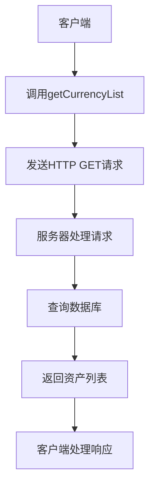

**Diagram sources**
- [index.js](file://agx-admin/src/api/agx/index.js#L29-L35)
- [API_CONTRACT.md](file://agx-backend/API_CONTRACT.md#L275-L318)

### 资产详情接口

资产详情接口用于获取特定资产的详细信息，包括价格、涨跌幅、交易量等关键指标。接口通过资产符号（symbol）进行查询，返回该资产的实时行情数据。

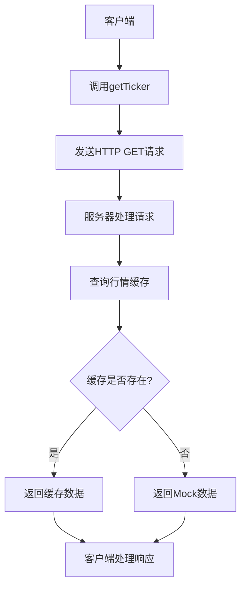

**Diagram sources**
- [market.controller.ts](file://agx-backend/src/modules/market/market.controller.ts#L29-L33)
- [market.service.ts](file://agx-backend/src/modules/market/market.service.ts#L68-L77)

### 交易记录接口

交易记录接口用于获取用户的资产变动历史。接口支持按时间范围、交易类型等条件进行筛选，返回详细的交易流水信息。

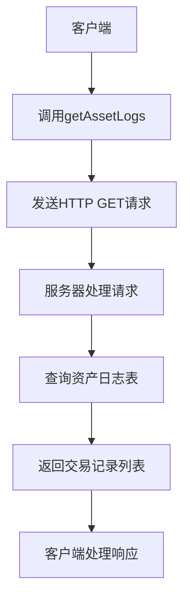

**Diagram sources**
- [index.js](file://agx-admin/src/api/agx/index.js#L298-L304)
- [API_CONTRACT.md](file://agx-backend/API_CONTRACT.md#L275-L318)

**Section sources**
- [index.js](file://agx-admin/src/api/agx/index.js#L29-L444)
- [API_CONTRACT.md](file://agx-backend/API_CONTRACT.md#L275-L407)

## 数字资产类型管理

平台支持多种类型的数字资产，包括数字货币、黄金产品和矿池投资等。每种资产类型都有专门的API端点进行管理，实现了统一的接口规范和数据结构。

### 数字货币管理

数字货币管理API提供了对平台支持的各类加密货币的完整管理功能，包括币种的增删改查、状态管理等。

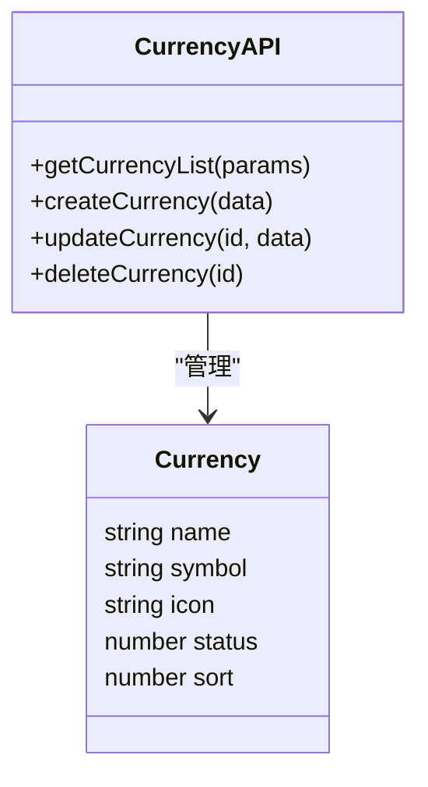

**Diagram sources**
- [index.js](file://agx-admin/src/api/agx/index.js#L29-L67)
- [API_CONTRACT.md](file://agx-backend/API_CONTRACT.md#L275-L407)

### 黄金产品管理

黄金产品管理API用于管理平台的黄金投资产品，包括产品配置、持仓管理、收益计算等功能。

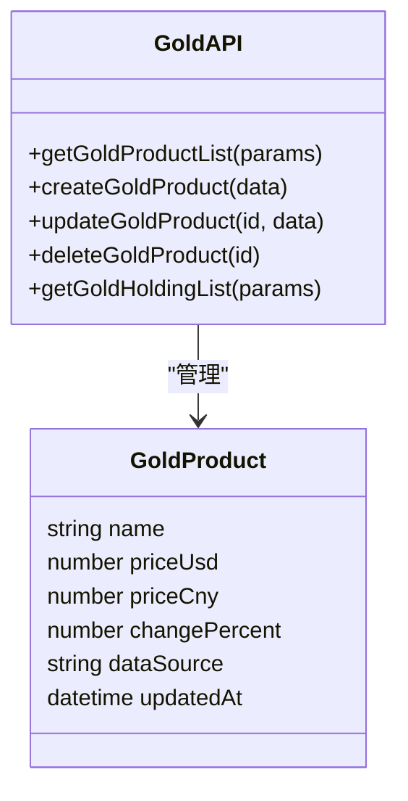

**Diagram sources**
- [goldHolding.vue](file://agx-admin/src/views/agx/goldHolding.vue#L1-L221)
- [marketMetal.vue](file://agx-admin/src/views/agx/marketMetal.vue#L1-L164)

### 矿池投资管理

矿池投资管理API用于管理平台的矿池产品，包括产品配置、用户持仓、收益分配等功能。

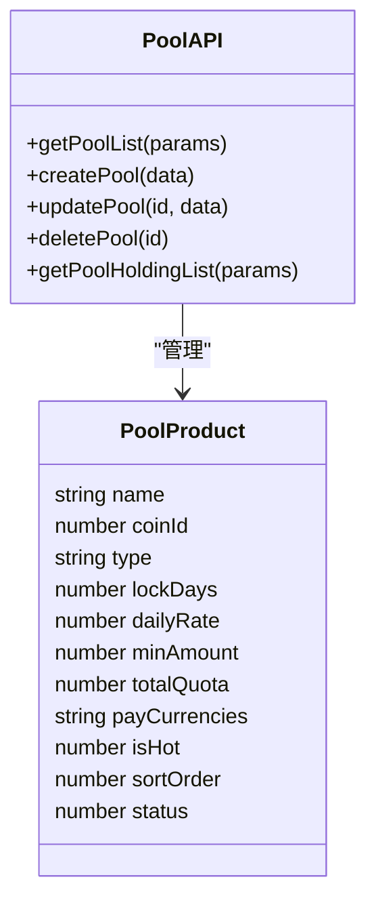

**Diagram sources**
- [pool.vue](file://agx-admin/src/views/agx/pool.vue#L1-L341)
- [index.js](file://agx-admin/src/api/agx/index.js#L72-L110)

**Section sources**
- [index.js](file://agx-admin/src/api/agx/index.js#L29-L110)
- [pool.vue](file://agx-admin/src/views/agx/pool.vue#L1-L341)
- [goldHolding.vue](file://agx-admin/src/views/agx/goldHolding.vue#L1-L221)

## 实时行情数据处理

平台通过REST API和WebSocket两种方式提供实时行情数据，满足不同场景下的数据获取需求。

### REST API轮询

对于不需要实时更新的场景，客户端可以通过REST API轮询获取行情数据。市场控制器提供了获取行情列表和单个行情的接口。

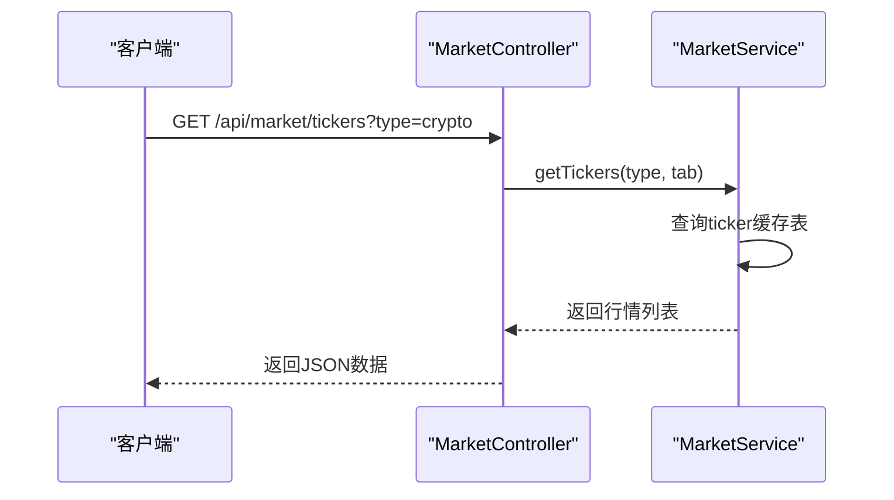

**Diagram sources**
- [market.controller.ts](file://agx-backend/src/modules/market/market.controller.ts#L16-L23)
- [market.service.ts](file://agx-backend/src/modules/market/market.service.ts#L39-L65)

### WebSocket订阅

对于需要实时更新的场景，客户端可以通过WebSocket连接订阅行情数据。平台提供了WebSocket封装类，支持自动重连和心跳机制。

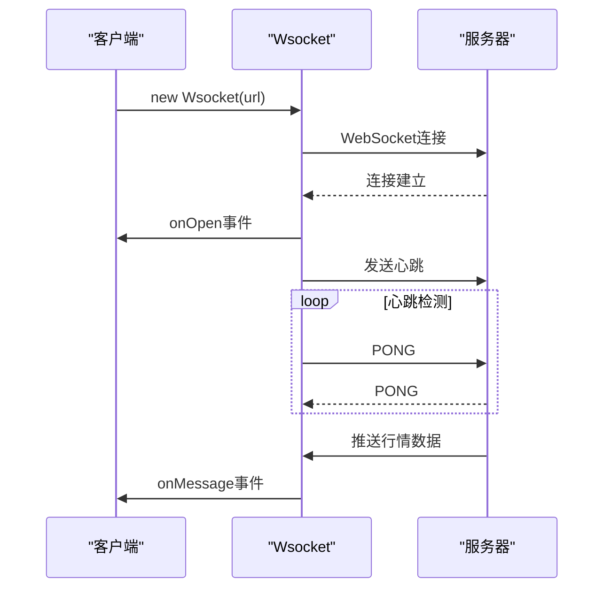

**Diagram sources**
- [Wsocket.js](file://agx-admin/src/utils/Wsocket.js#L1-L195)
- [market.controller.ts](file://agx-backend/src/modules/market/market.controller.ts#L16-L23)

### 行情数据缓存

系统采用缓存机制提高行情数据的获取效率。市场服务首先尝试从数据库缓存表获取数据，如果缓存为空则返回Mock数据。

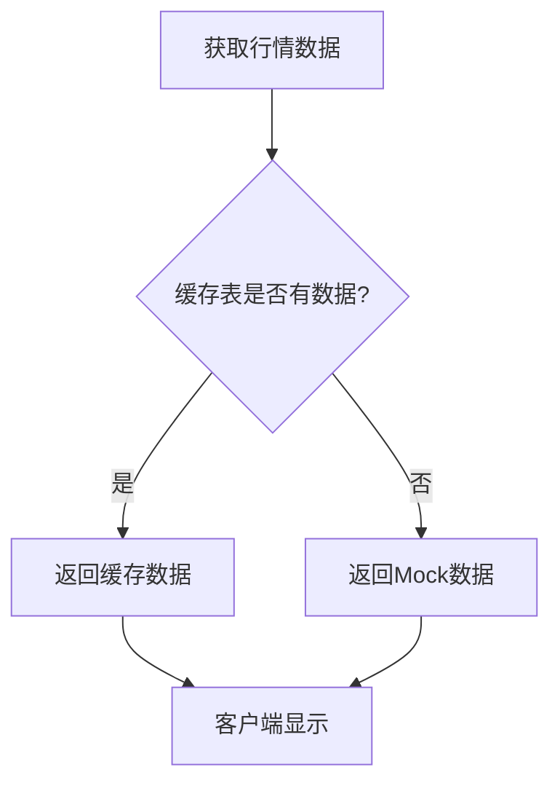

**Diagram sources**
- [market.service.ts](file://agx-backend/src/modules/market/market.service.ts#L40-L49)
- [market.service.ts](file://agx-backend/src/modules/market/market.service.ts#L89-L171)

**Section sources**
- [market.controller.ts](file://agx-backend/src/modules/market/market.controller.ts#L1-L59)
- [market.service.ts](file://agx-backend/src/modules/market/market.service.ts#L1-L209)
- [Wsocket.js](file://agx-admin/src/utils/Wsocket.js#L1-L195)

## 关键响应字段说明

API响应中的关键字段具有明确的业务含义，理解这些字段对于正确使用API至关重要。

### 价格相关字段

| 字段 | 类型 | 说明 |
|------|------|------|
| lastPrice | string | 最新成交价 |
| priceChange | string | 价格变动值 |
| priceChangePercent | string | 价格变动百分比 |
| high24h | string | 24小时最高价 |
| low24h | string | 24小时最低价 |

### 交易量相关字段

| 字段 | 类型 | 说明 |
|------|------|------|
| volume | string | 24小时交易量 |
| quoteVolume | string | 24小时成交额 |
| turnoverRate | string | 换手率 |

### 资产状态字段

| 字段 | 类型 | 说明 |
|------|------|------|
| status | number | 资产状态：0=禁用，1=启用 |
| isVisible | number | 前端展示：0=隐藏，1=显示 |
| isHot | number | 是否热门：0=否，1=是 |
| isTradable | number | 是否可交易：0=否，1=是 |

**Section sources**
- [API_CONTRACT.md](file://agx-backend/API_CONTRACT.md#L275-L407)
- [market.service.ts](file://agx-backend/src/modules/market/market.service.ts#L90-L171)

## 资产管理页面实现

资产管理页面通过调用数字资产API实现各种功能，包括数据展示、用户交互和业务逻辑处理。

### 数据获取与缓存

资产管理页面在初始化时获取数据，并采用缓存策略减少API调用频率。

```javascript
// 示例：资产概览页面数据获取
const fetchData = async () => {
  // Mock数据
  stats.totalAssets = 15680000
  stats.goldHolding = 8542.3456
  stats.goldValue = 723456.78
  stats.poolLocked = 3560000
  stats.contractMargin = 1250000
}
```

**Section sources**
- [assetOverview.vue](file://agx-admin/src/views/agx/assetOverview.vue#L106-L139)

### 错误重试机制

系统实现了完善的错误重试机制，确保在网络不稳定的情况下仍能正常获取数据。

```javascript
// 示例：矿池产品列表获取
const fetchData = async () => {
  loading.value = true
  try {
    const res = await agxApi.getPoolList({
      page: pagination.current,
      pageSize: pagination.pageSize,
      type: searchForm.type || undefined,
      status: searchForm.status
    })
    if (res.code === 0) {
      tableData.value = res.data?.list || res.list || []
      pagination.total = res.data?.total || res.total || 0
    }
  } catch (e) {
    console.error(e)
  } finally {
    loading.value = false
  }
}
```

**Section sources**
- [pool.vue](file://agx-admin/src/views/agx/pool.vue#L217-L235)
- [request.js](file://agx-admin/src/utils/request.js#L45-L96)

### 用户交互处理

页面通过事件处理函数响应用户操作，如搜索、分页、编辑等。

```javascript
// 示例：分页处理
const handlePageChange = (page) => {
  pagination.current = page
  fetchData()
}
```

**Section sources**
- [pool.vue](file://agx-admin/src/views/agx/pool.vue#L249-L252)
- [goldHolding.vue](file://agx-admin/src/views/agx/goldHolding.vue#L174-L177)

## 错误处理与重试机制

系统实现了全面的错误处理和重试机制，确保API调用的稳定性和可靠性。

### HTTP响应拦截

请求工具中实现了HTTP响应拦截器，统一处理各种错误情况。

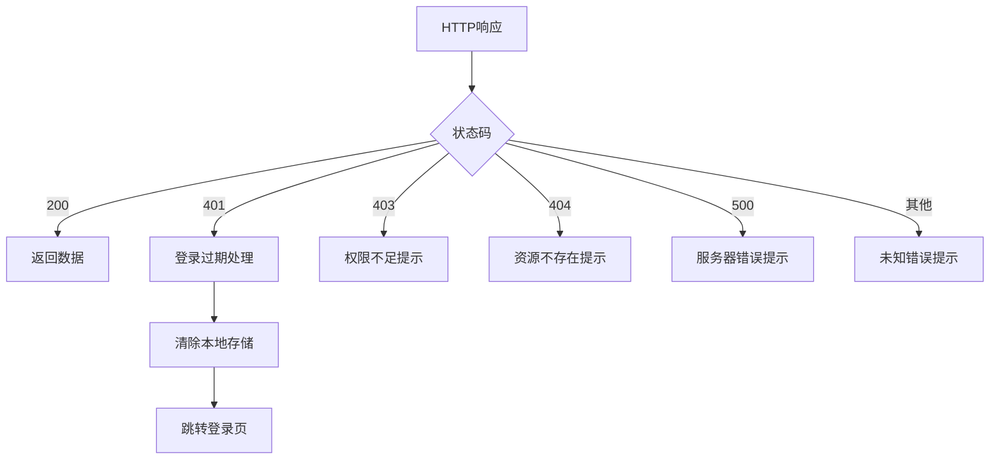

**Diagram sources**
- [request.js](file://agx-admin/src/utils/request.js#L45-L96)

### WebSocket重连机制

WebSocket封装类实现了自动重连机制，确保连接的稳定性。

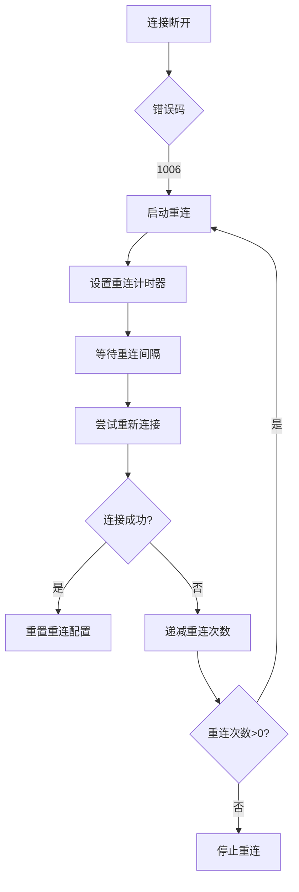

**Diagram sources**
- [Wsocket.js](file://agx-admin/src/utils/Wsocket.js#L158-L174)

**Section sources**
- [request.js](file://agx-admin/src/utils/request.js#L45-L96)
- [Wsocket.js](file://agx-admin/src/utils/Wsocket.js#L1-L195)

## 总结

AGX平台的数字资产API提供了一套完整的数字资产管理解决方案。系统通过RESTful API和WebSocket相结合的方式，实现了资产信息的高效获取和实时更新。API设计遵循统一的规范，支持多种数字资产类型，包括数字货币、黄金产品和矿池投资等。前端通过封装的请求工具和WebSocket类，实现了稳定的数据获取和错误处理机制。资产管理页面充分利用这些API，为用户提供了全面的资产视图和管理功能。