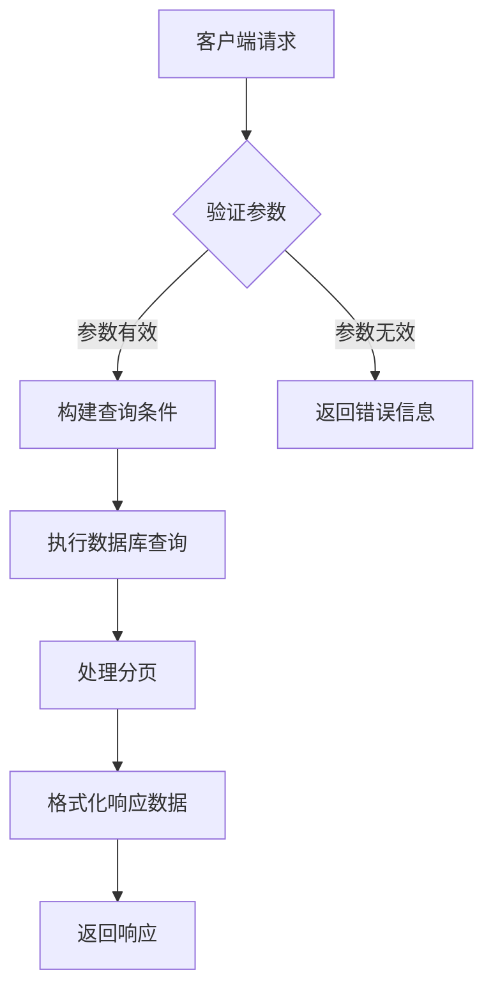
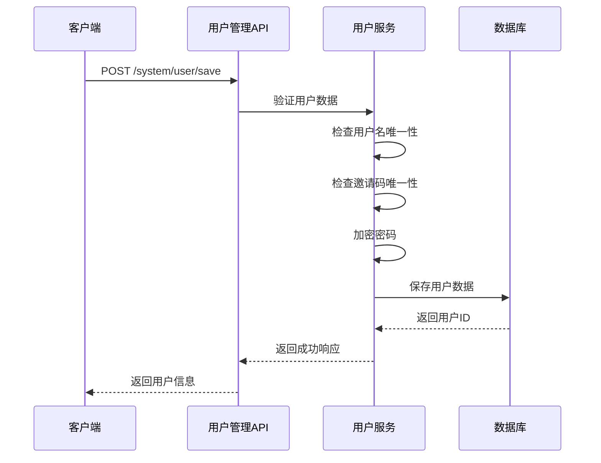
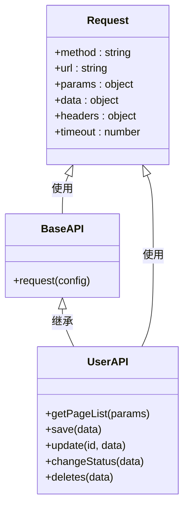
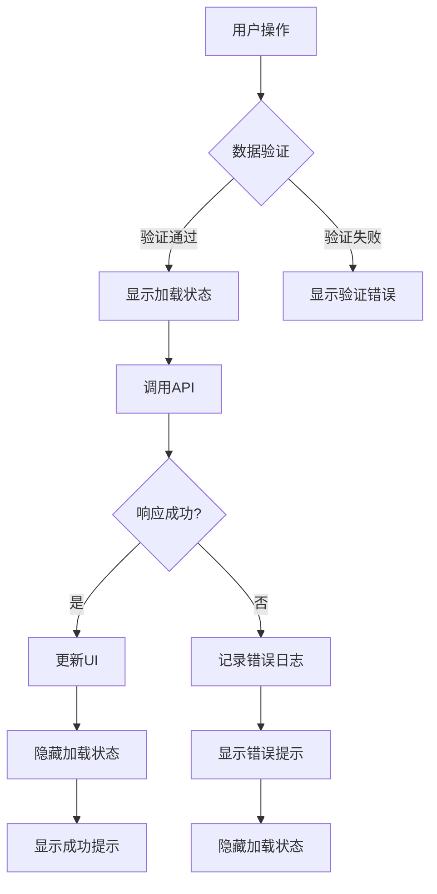

# 用户管理API

<cite>
**本文档引用的文件**   
- [user.js](file://agx-admin/src/api/system/user.js)
- [common.js](file://agx-admin/src/api/common.js)
- [request.js](file://agx-admin/src/utils/request.js)
- [user.entity.ts](file://agx-backend/src/entities/user.entity.ts)
- [users.vue](file://agx-admin/src/views/agx/users.vue)
- [admin.controller.ts](file://agx-backend/src/modules/admin/admin.controller.ts)
- [admin.service.ts](file://agx-backend/src/modules/admin/admin.service.ts)
</cite>

## 目录
1. [用户管理API概述](#用户管理api概述)
2. [用户列表查询接口](#用户列表查询接口)
3. [用户创建与更新接口](#用户创建与更新接口)
4. [批量操作与状态变更接口](#批量操作与状态变更接口)
5. [用户权限字段说明](#用户权限字段说明)
6. [Vue组件调用最佳实践](#vue组件调用最佳实践)

## 用户管理API概述

用户管理API提供了完整的用户CRUD操作功能，包括用户列表查询、用户创建、更新、删除等操作。这些API通过`system/user.js`文件中的方法实现，基于`common.js`中的基础请求方法进行扩展。API设计遵循RESTful规范，使用标准的HTTP方法进行操作。

**Section sources**
- [user.js](file://agx-admin/src/api/system/user.js#L1-L171)
- [common.js](file://agx-admin/src/api/common.js#L1-L264)

## 用户列表查询接口

用户列表查询接口提供了分页、筛选和排序功能，支持多种查询条件。接口通过`getPageList`方法实现，接受分页参数和筛选条件作为查询参数。

### 分页参数
用户列表查询接口支持以下分页参数：
- `page`: 当前页码，从1开始
- `pageSize`: 每页显示的记录数
- `keyword`: 搜索关键词，支持用户名、UID和昵称的模糊匹配
- `status`: 账户状态筛选（0禁用，1正常）

### 筛选条件
接口支持多种筛选条件，包括：
- 关键词搜索：支持用户名、UID和昵称的模糊匹配
- 状态筛选：根据账户状态（正常/禁用）进行筛选
- KYC状态：根据KYC认证状态进行筛选

### 响应数据结构
接口返回的响应数据包含以下字段：
- `code`: 响应状态码（0表示成功）
- `message`: 响应消息
- `data`: 包含分页数据的对象
  - `list`: 用户列表数组
  - `total`: 总记录数
  - `current`: 当前页码
  - `pageSize`: 每页记录数

每个用户对象包含以下字段：
- `id`: 用户ID
- `uid`: 用户UID
- `username`: 用户名
- `nickname`: 昵称
- `status`: 账户状态
- `kycStatus`: KYC认证状态
- `createdAt`: 创建时间



**Diagram sources **
- [user.js](file://agx-admin/src/api/system/user.js#L8-L13)
- [admin.service.ts](file://agx-backend/src/modules/admin/admin.service.ts#L168-L188)
- [user.entity.ts](file://agx-backend/src/entities/user.entity.ts#L1-L118)

**Section sources**
- [user.js](file://agx-admin/src/api/system/user.js#L8-L13)
- [admin.service.ts](file://agx-backend/src/modules/admin/admin.service.ts#L168-L188)

## 用户创建与更新接口

用户创建与更新接口提供了用户信息的增删改操作，包括用户创建、信息更新、密码修改等功能。

### 用户创建接口
用户创建接口通过`save`方法实现，接受用户信息作为请求体。请求体包含以下字段：
- `username`: 用户名（必填）
- `password`: 密码（必填）
- `nickname`: 昵称（可选）
- `avatar`: 头像URL（可选）
- `inviteCode`: 邀请码（可选）

### 用户更新接口
用户更新接口通过`update`方法实现，接受用户ID和更新数据作为参数。更新数据包含以下字段：
- `nickname`: 昵称
- `avatar`: 头像URL
- `status`: 账户状态
- `level`: 用户等级
- `isVerified`: 认证状态

### 验证规则
接口实现了严格的验证规则：
- 用户名必须唯一，长度在3-50个字符之间
- 密码必须包含大小写字母、数字和特殊字符，长度至少8位
- 邀请码必须唯一，长度为16位
- 昵称长度不超过50个字符
- 头像URL必须是有效的HTTP/HTTPS链接



**Diagram sources **
- [user.js](file://agx-admin/src/api/system/user.js#L43-L49)
- [user.entity.ts](file://agx-backend/src/entities/user.entity.ts#L1-L118)
- [admin.service.ts](file://agx-backend/src/modules/admin/admin.service.ts#L168-L188)

**Section sources**
- [user.js](file://agx-admin/src/api/system/user.js#L43-L49)
- [user.entity.ts](file://agx-backend/src/entities/user.entity.ts#L1-L118)

## 批量操作与状态变更接口

批量操作与状态变更接口提供了高效的批量处理功能，支持批量启用、禁用用户和批量更新用户状态。

### 批量状态变更接口
批量状态变更接口通过`changeStatus`方法实现，接受用户ID数组和状态值作为请求体。接口支持以下操作：
- 批量启用用户
- 批量禁用用户
- 批量重置用户密码
- 批量清除用户缓存

请求体格式：
```json
{
  "ids": [1, 2, 3, 4, 5],
  "status": 1
}
```

### 特殊处理逻辑
接口实现了以下特殊处理逻辑：
- 事务处理：所有批量操作在数据库事务中执行，确保数据一致性
- 错误处理：部分失败时返回成功和失败的用户ID列表
- 权限验证：检查操作员是否有权限修改目标用户的状态
- 日志记录：记录所有批量操作的详细信息

### 接口继承与扩展
这些接口继承了`common.js`中的基础请求方法，通过以下方式进行了扩展：
- 添加了批量操作的特殊处理逻辑
- 实现了更严格的权限验证
- 增加了操作日志记录功能
- 优化了数据库查询性能



**Diagram sources **
- [user.js](file://agx-admin/src/api/system/user.js#L103-L109)
- [common.js](file://agx-admin/src/api/common.js#L1-L264)
- [request.js](file://agx-admin/src/utils/request.js#L1-L165)

**Section sources**
- [user.js](file://agx-admin/src/api/system/user.js#L103-L109)
- [common.js](file://agx-admin/src/api/common.js#L1-L264)

## 用户权限字段说明

用户权限字段定义了用户的各种权限和属性，用于控制用户在系统中的行为和访问权限。

### 核心权限字段
| 字段名 | 类型 | 默认值 | 说明 |
|-------|------|-------|------|
| status | smallint | 1 | 账户状态：0禁用，1正常 |
| kycStatus | smallint | 0 | KYC认证状态：0未认证，1认证中，2已认证，3失败 |
| level | int | 1 | 用户等级：1普通，2银牌，3金牌，4钻石，5黑金 |
| isVerified | smallint | 0 | 是否认证用户：0否，1是（大V标识） |
| socialStatus | smallint | 1 | 社交状态：1正常，0禁言，-1社交封禁 |

### 扩展属性字段
| 字段名 | 类型 | 默认值 | 说明 |
|-------|------|-------|------|
| inviteCount | int | 0 | 直接邀请人数 |
| teamCount | int | 0 | 团队总人数 |
| totalCommission | decimal | 0 | 累计返佣 |
| totalTradeVolume | decimal | 0 | 累计交易额 |
| followerCount | int | 0 | 粉丝数 |
| followingCount | int | 0 | 关注数 |
| postCount | int | 0 | 帖子数 |
| winRate | int | 50 | 合约胜率控制：0-100 |

### 社交控制字段
| 字段名 | 类型 | 默认值 | 说明 |
|-------|------|-------|------|
| canBeFriended | smallint | 1 | 是否允许被加好友：0否，1是 |
| canSendFriendRequest | smallint | 1 | 是否允许发起好友请求：0否，1是 |
| canChat | smallint | 1 | 是否允许私聊：0否，1是 |
| friendCount | int | 0 | 好友数 |
| muteUntil | timestamp | null | 禁言截止时间 |

这些权限字段在用户管理、社交功能和交易系统中发挥重要作用，通过灵活的权限控制实现精细化的用户管理。

**Section sources**
- [user.entity.ts](file://agx-backend/src/entities/user.entity.ts#L1-L118)
- [users.vue](file://agx-admin/src/views/agx/users.vue#L1-L357)

## Vue组件调用最佳实践

在Vue组件中调用用户管理API的最佳实践包括参数传递、响应处理和错误提示的完整实现。

### 用户列表查询示例
```javascript
// 在Vue组件中调用用户列表查询API
import userApi from '@/api/system/user.js'

export default {
  data() {
    return {
      tableData: [],
      pagination: {
        current: 1,
        pageSize: 20,
        total: 0
      },
      searchForm: {
        keyword: '',
        status: undefined
      }
    }
  },
  methods: {
    async fetchData() {
      try {
        const res = await userApi.getPageList({
          page: this.pagination.current,
          pageSize: this.pagination.pageSize,
          ...this.searchForm
        })
        
        if (res.code === 0) {
          this.tableData = res.data?.list || []
          this.pagination.total = res.data?.total || 0
        }
      } catch (error) {
        console.error('获取用户列表失败:', error)
        this.$message.error('获取用户列表失败，请重试')
      }
    },
    
    handleSearch() {
      this.pagination.current = 1
      this.fetchData()
    },
    
    handleReset() {
      this.searchForm.keyword = ''
      this.searchForm.status = undefined
      this.pagination.current = 1
      this.fetchData()
    },
    
    onPageChange(page) {
      this.pagination.current = page
      this.fetchData()
    },
    
    onPageSizeChange(size) {
      this.pagination.pageSize = size
      this.pagination.current = 1
      this.fetchData()
    }
  },
  
  mounted() {
    this.fetchData()
  }
}
```

### 用户信息更新示例
```javascript
// 在Vue组件中调用用户信息更新API
import userApi from '@/api/system/user.js'
import { Message } from '@arco-design/web-vue'

export default {
  data() {
    return {
      userInfo: {
        id: null,
        nickname: '',
        avatar: '',
        status: 1
      },
      formVisible: false
    }
  },
  
  methods: {
    async handleUpdate() {
      try {
        // 验证表单数据
        if (!this.userInfo.nickname) {
          Message.warning('请输入昵称')
          return
        }
        
        const res = await userApi.update(this.userInfo.id, {
          nickname: this.userInfo.nickname,
          avatar: this.userInfo.avatar,
          status: this.userInfo.status
        })
        
        if (res.code === 0) {
          Message.success('用户信息更新成功')
          this.formVisible = false
          // 刷新用户列表
          this.$emit('refresh')
        } else {
          Message.error(res.message || '更新失败')
        }
      } catch (error) {
        console.error('更新用户信息失败:', error)
        Message.error('网络错误，请重试')
      }
    },
    
    openForm(user) {
      // 深拷贝用户信息，避免直接修改原始数据
      this.userInfo = JSON.parse(JSON.stringify(user))
      this.formVisible = true
    }
  }
}
```

### 错误处理与用户体验
在调用API时，应遵循以下最佳实践：
1. **统一错误处理**：在`request.js`中实现统一的错误拦截和处理
2. **用户友好的提示**：使用Message组件提供清晰的反馈信息
3. **加载状态管理**：在请求期间显示加载状态，提升用户体验
4. **防重复提交**：在表单提交时禁用按钮，防止重复提交
5. **数据验证**：在客户端进行基本的数据验证，减少无效请求



**Diagram sources **
- [users.vue](file://agx-admin/src/views/agx/users.vue#L1-L357)
- [request.js](file://agx-admin/src/utils/request.js#L1-L165)

**Section sources**
- [users.vue](file://agx-admin/src/views/agx/users.vue#L1-L357)
- [request.js](file://agx-admin/src/utils/request.js#L1-L165)