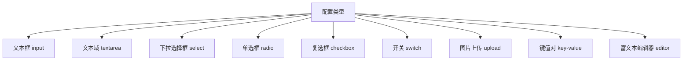
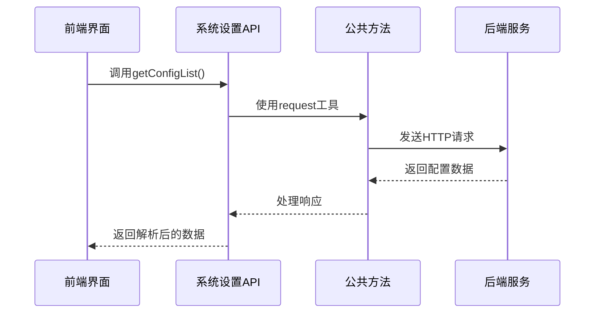
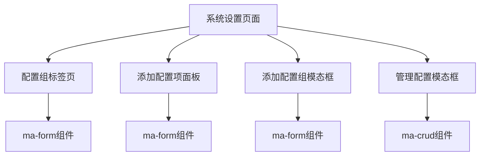

# 系统设置API

<cite>
**本文档引用的文件**
- [config.js](file://agx-admin/src/api/setting/config.js)
- [common.js](file://agx-admin/src/api/common.js)
- [index.vue](file://agx-admin/src/views/setting/config/index.vue)
- [addConfig.vue](file://agx-admin/src/views/setting/config/components/addConfig.vue)
- [manageConfig.vue](file://agx-admin/src/views/setting/config/components/manageConfig.vue)
- [config.entity.ts](file://agx-backend/src/entities/config.entity.ts)
- [admin.controller.ts](file://agx-backend/src/modules/admin/admin.controller.ts)
- [request.js](file://agx-admin/src/utils/request.js)
</cite>

## 目录
1. [简介](#简介)
2. [核心API接口](#核心api接口)
3. [配置类型系统](#配置类型系统)
4. [安全策略](#安全策略)
5. [与公共方法的集成](#与公共方法的集成)
6. [前端实现示例](#前端实现示例)
7. [错误处理](#错误处理)

## 简介
系统设置API提供了对应用程序配置的全面管理功能，包括配置项的增删改查、配置分组管理以及批量操作等。该API系统基于前后端分离架构，前端通过Vue组件与后端RESTful接口进行交互，实现了灵活的配置管理界面。配置数据存储在数据库的`agx_config`表中，所有操作都需要管理员权限验证。

## 核心API接口

### 配置列表获取
获取配置列表的API通过`getConfigList`方法实现，支持分页和排序参数。

**请求方式**: GET  
**请求路径**: `/setting/config/index`  
**参数结构**:
- `group_id`: 配置分组ID
- `orderBy`: 排序字段
- `orderType`: 排序类型（asc/desc）

**响应格式**:
```json
{
  "success": true,
  "data": [
    {
      "id": 1,
      "key": "site_name",
      "value": "My Site",
      "description": "网站名称",
      "configGroup": "basic",
      "updatedAt": "2023-01-01 00:00:00"
    }
  ]
}
```

### 配置项更新
配置项更新支持单个更新和批量更新两种方式。

**单个更新**:
- **请求方式**: POST
- **请求路径**: `/setting/config/update`
- **请求体**:
```json
{
  "key": "site_name",
  "value": "New Site Name",
  "description": "更新后的网站名称"
}
```

**批量更新**:
- **请求方式**: POST
- **请求路径**: `/setting/config/updateByKeys`
- **请求体**:
```json
{
  "config1": "value1",
  "config2": "value2"
}
```

### 配置分组管理
配置分组管理API提供了对配置分组的完整CRUD操作。

**保存配置组**:
- **请求方式**: POST
- **请求路径**: `/setting/configGroup/save`
- **请求体**:
```json
{
  "name": "基础配置",
  "code": "basic",
  "remark": "系统基础配置"
}
```

**删除配置组**:
- **请求方式**: DELETE
- **请求路径**: `/setting/configGroup/delete`
- **请求体**:
```json
{
  "id": 1
}
```

**Section sources**
- [config.js](file://agx-admin/src/api/setting/config.js#L1-L124)
- [admin.controller.ts](file://agx-backend/src/modules/admin/admin.controller.ts#L270-L286)

## 配置类型系统

### 配置项类型
系统支持多种配置项类型，每种类型在前端有不同的渲染方式和验证规则。



**Diagram sources**
- [configDefine.js](file://agx-admin/src/views/setting/config/components/js/configDefine.js#L1-L11)

### 类型验证规则
不同配置类型有不同的数据验证和转换规则：

- **文本框/文本域**: 字符串类型，支持基本的长度验证
- **下拉选择框/单选框**: 需要提供`config_select_data`作为选项数据
- **复选框**: 支持数组值，可以是JSON格式或逗号分隔的字符串
- **开关**: 支持布尔值或数字类型，根据值类型自动转换
- **键值对**: 存储为JSON格式的字符串
- **图片上传**: 存储为文件URL

### 前端类型处理
在`ma-form`组件中，根据`input_type`字段决定渲染哪种表单组件：

```javascript
{
  title: '配置值',
  dataIndex: 'value',
  formType: item.input_type, // 动态绑定输入组件类型
  labelWidth: '120px'
}
```

**Section sources**
- [addConfig.vue](file://agx-admin/src/views/setting/config/components/addConfig.vue#L45-L106)
- [manageConfig.vue](file://agx-admin/src/views/setting/config/components/manageConfig.vue#L54-L117)

## 安全策略

### 敏感配置项处理
系统对敏感配置项实施特殊的安全策略：

1. **权限控制**: 只有具有`setting:config:update`权限的用户才能修改配置
2. **删除验证**: 删除配置组需要输入组名进行二次确认
3. **核心保护**: 系统核心配置组（ID为1和2）禁止删除

```javascript
const openDeleteModal = (data) => {
  const id = data.split('-')[1]
  if (id == 1 || id == 2) {
    Message.info('该配置为系统核心配置，无法删除')
    return
  }
  // 显示删除确认对话框
}
```

### 数据验证
后端对配置数据进行严格验证：

```typescript
@Column({ type: 'varchar', length: 50, unique: true, name: 'config_key', comment: '配置键' })
configKey: string;

@Column({ type: 'text', name: 'config_value', comment: '配置值' })
configValue: string;
```

**Section sources**
- [index.vue](file://agx-admin/src/views/setting/config/index.vue#L96-L104)
- [config.entity.ts](file://agx-backend/src/entities/config.entity.ts#L14-L18)

## 与公共方法的集成

### 表单数据序列化
系统设置API与`common.js`中的公共方法紧密集成，特别是在表单数据处理方面。



**Diagram sources**
- [config.js](file://agx-admin/src/api/setting/config.js#L9-L14)
- [request.js](file://agx-admin/src/utils/request.js#L124-L164)

### 文件上传处理
虽然系统设置主要处理文本配置，但也集成了文件上传功能：

```javascript
// common.js中的文件上传方法
uploadImage(data = {}) {
  return request({
    url: 'system/uploadImage',
    method: 'post',
    timeout: 30000,
    data
  })
}
```

**Section sources**
- [common.js](file://agx-admin/src/api/common.js#L103-L110)
- [request.js](file://agx-admin/src/utils/request.js#L124-L164)

## 前端实现示例

### 配置项动态渲染
系统设置页面通过动态方式渲染配置项，根据配置类型自动选择合适的表单组件。

```javascript
optionsArray.value[id] = response.data.map(item => {
  let option = {
    title: item.name, 
    dataIndex: item.key, 
    formType: item.input_type,
    labelWidth: '120px', 
    extra: item.remark, 
    tooltip: item.key,
  }
  // 根据类型添加特殊配置
  if (['select', 'radio', 'checkbox'].includes(item.input_type)) {
    option.dict = { data: item.config_select_data }
  }
  return option
})
```

### 实时保存功能
配置修改后通过`updateByKeys`接口实现批量保存：

```javascript
const submit = async (data) => {
  if (! auth('setting:config:update')) {
    Message.info('没有权限修改配置')
    return
  }
  const response = await config.updateByKeys(data)
  if (response.success) {
    Message.success(response.message)
    getConfigGroupList() // 刷新配置列表
  }
}
```

### 组件结构
系统设置页面由多个组件组成，形成完整的配置管理界面：



**Diagram sources**
- [index.vue](file://agx-admin/src/views/setting/config/index.vue#L13-L51)
- [addConfig.vue](file://agx-admin/src/views/setting/config/components/addConfig.vue#L13-L19)

**Section sources**
- [index.vue](file://agx-admin/src/views/setting/config/index.vue#L112-L219)
- [addConfig.vue](file://agx-admin/src/views/setting/config/components/addConfig.vue#L32-L42)

## 错误处理

### 前端错误处理
前端通过统一的请求拦截器处理API错误：

```javascript
// request.js中的错误处理
service.interceptors.response.use(
  response => {
    if (response.data.code !== undefined && response.data.code !== 0 && response.data.code !== 200) {
      Message.error({
        content: response.data.msg || response.data.message || '请求失败',
      })
    }
    return response.data;
  },
  error => {
    // 处理不同状态码的错误
    switch (error.response.status) {
      case 401:
        // 重新登录
        break
      case 403:
        Message.error('没有权限访问该资源')
        break
    }
  }
)
```

### 后端错误处理
后端使用统一的异常处理机制：

```typescript
@Put('config/:key')
@UseGuards(AdminGuard)
async updateConfig(@Param('key') key: string, @Body() dto: any) {
  return this.adminService.updateConfig(key, dto);
}
```

**Section sources**
- [request.js](file://agx-admin/src/utils/request.js#L44-L96)
- [admin.controller.ts](file://agx-backend/src/modules/admin/admin.controller.ts#L276-L280)