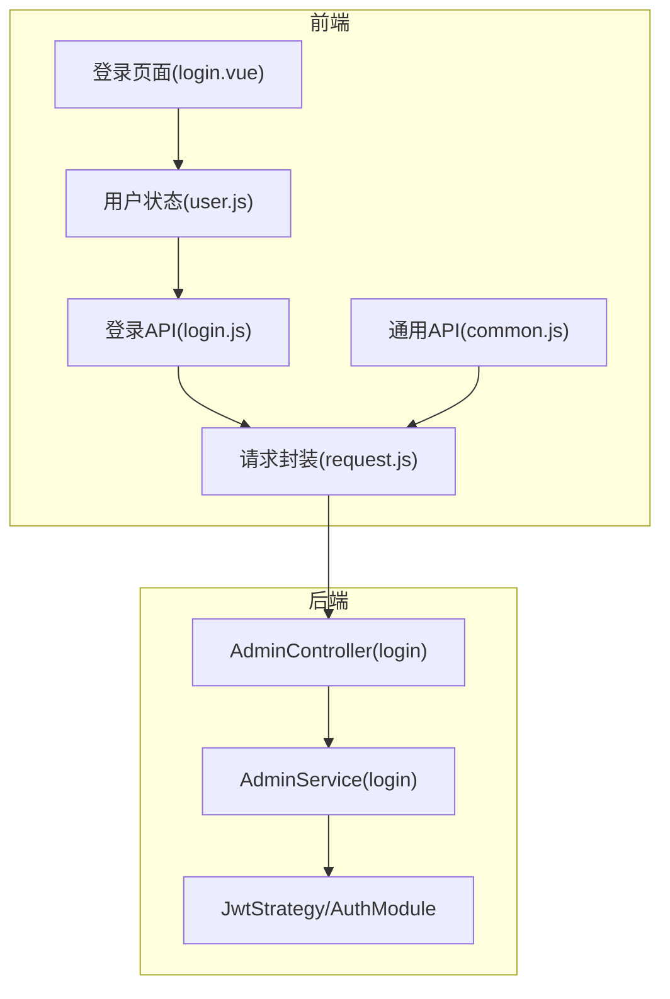
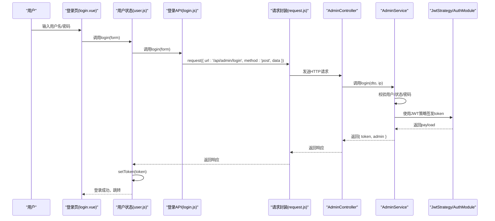
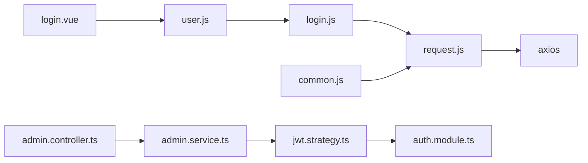

# 认证API

<cite>
**本文引用的文件**
- [login.js](file://agx-admin/src/api/login.js)
- [common.js](file://agx-admin/src/api/common.js)
- [request.js](file://agx-admin/src/utils/request.js)
- [user.js](file://agx-admin/src/store/modules/user.js)
- [login.vue](file://agx-admin/src/views/login.vue)
- [admin.controller.ts](file://agx-backend/src/modules/admin/admin.controller.ts)
- [admin.service.ts](file://agx-backend/src/modules/admin/admin.service.ts)
- [jwt.strategy.ts](file://agx-backend/src/modules/auth/jwt.strategy.ts)
- [auth.module.ts](file://agx-backend/src/modules/auth/auth.module.ts)
- [.env](file://agx-admin/.env)
- [.env.development](file://agx-admin/.env.development)
</cite>

## 目录
1. [简介](#简介)
2. [项目结构](#项目结构)
3. [核心组件](#核心组件)
4. [架构总览](#架构总览)
5. [详细组件分析](#详细组件分析)
6. [依赖分析](#依赖分析)
7. [性能考虑](#性能考虑)
8. [故障排查指南](#故障排查指南)
9. [结论](#结论)
10. [附录](#附录)

## 简介
本文件聚焦于认证API，详细解析前端登录接口与验证码接口的实现与使用，说明其HTTP方法、请求参数、响应结构，并阐述如何通过公共请求封装完成token自动注入与鉴权流程。同时提供在登录页面组件中调用这些API的完整示例思路，覆盖错误处理（如密码错误、账户锁定）与加载状态管理，并补充JWT token的刷新与失效处理策略建议。

## 项目结构
- 前端位于 agx-admin/src/api 与 agx-admin/src/utils 中：
  - 登录API：src/api/login.js
  - 通用请求封装：src/utils/request.js
  - 用户状态与token管理：src/store/modules/user.js
  - 登录页面视图：src/views/login.vue
- 后端位于 agx-backend/src/modules/admin 与 agx-backend/src/modules/auth：
  - 登录控制器：src/modules/admin/admin.controller.ts
  - 登录服务：src/modules/admin/admin.service.ts
  - JWT策略与模块：src/modules/auth/jwt.strategy.ts、auth.module.ts

图表来源
- [login.vue](file://agx-admin/src/views/login.vue#L1-L213)
- [login.js](file://agx-admin/src/api/login.js#L1-L172)
- [common.js](file://agx-admin/src/api/common.js#L1-L264)
- [request.js](file://agx-admin/src/utils/request.js#L1-L165)
- [user.js](file://agx-admin/src/store/modules/user.js#L1-L183)
- [admin.controller.ts](file://agx-backend/src/modules/admin/admin.controller.ts#L36-L44)
- [admin.service.ts](file://agx-backend/src/modules/admin/admin.service.ts#L75-L118)
- [jwt.strategy.ts](file://agx-backend/src/modules/auth/jwt.strategy.ts#L1-L31)
- [auth.module.ts](file://agx-backend/src/modules/auth/auth.module.ts#L1-L24)

章节来源
- [login.vue](file://agx-admin/src/views/login.vue#L1-L213)
- [login.js](file://agx-admin/src/api/login.js#L1-L172)
- [common.js](file://agx-admin/src/api/common.js#L1-L264)
- [request.js](file://agx-admin/src/utils/request.js#L1-L165)
- [user.js](file://agx-admin/src/store/modules/user.js#L1-L183)
- [admin.controller.ts](file://agx-backend/src/modules/admin/admin.controller.ts#L36-L44)
- [admin.service.ts](file://agx-backend/src/modules/admin/admin.service.ts#L75-L118)
- [jwt.strategy.ts](file://agx-backend/src/modules/auth/jwt.strategy.ts#L1-L31)
- [auth.module.ts](file://agx-backend/src/modules/auth/auth.module.ts#L1-L24)

## 核心组件
- 登录API(login.js)
  - 提供登录、退出、获取用户信息等方法；当前验证码接口返回静态启用状态（开发用途）。
- 请求封装(request.js)
  - 统一封装axios实例，自动注入Authorization头、语言头、Content-Type，默认超时；统一拦截器处理错误与401/403等场景。
- 用户状态(user.js)
  - 封装token本地持久化、读取、清理；登录成功后写入token；登出清理；拉取用户信息并构建路由。
- 登录页面(login.vue)
  - 表单校验、加载态控制、调用用户状态store执行登录逻辑并跳转。
- 后端控制器与服务
  - 控制器暴露POST /api/admin/login；服务实现校验、账户状态、密码比对、签发JWT并返回token与用户简要信息。

章节来源
- [login.js](file://agx-admin/src/api/login.js#L1-L172)
- [request.js](file://agx-admin/src/utils/request.js#L1-L165)
- [user.js](file://agx-admin/src/store/modules/user.js#L1-L183)
- [login.vue](file://agx-admin/src/views/login.vue#L1-L213)
- [admin.controller.ts](file://agx-backend/src/modules/admin/admin.controller.ts#L36-L44)
- [admin.service.ts](file://agx-backend/src/modules/admin/admin.service.ts#L75-L118)

## 架构总览
下图展示从前端登录到后端鉴权与返回token的整体流程。

图表来源
- [login.vue](file://agx-admin/src/views/login.vue#L38-L60)
- [user.js](file://agx-admin/src/store/modules/user.js#L72-L88)
- [login.js](file://agx-admin/src/api/login.js#L18-L24)
- [request.js](file://agx-admin/src/utils/request.js#L124-L165)
- [admin.controller.ts](file://agx-backend/src/modules/admin/admin.controller.ts#L36-L44)
- [admin.service.ts](file://agx-backend/src/modules/admin/admin.service.ts#L75-L118)
- [jwt.strategy.ts](file://agx-backend/src/modules/auth/jwt.strategy.ts#L1-L31)
- [auth.module.ts](file://agx-backend/src/modules/auth/auth.module.ts#L1-L24)

## 详细组件分析

### 登录接口 /api/admin/login
- 接口定义
  - 方法：POST
  - 路径：/api/admin/login
  - 请求体字段：用户名、密码（具体DTO由后端AdminLoginDto定义）
  - 响应结构：包含token与admin简要信息（id、username、role、lastLoginAt）
- 前端调用
  - 在login.js中以request封装调用，返回Promise，供用户状态store处理。
- 后端实现
  - 控制器接收请求并调用服务层；
  - 服务层校验用户是否存在、状态是否正常、密码是否正确；
  - 成功后使用JwtService签发JWT，返回token与用户简要信息。

章节来源
- [admin.controller.ts](file://agx-backend/src/modules/admin/admin.controller.ts#L36-L44)
- [admin.service.ts](file://agx-backend/src/modules/admin/admin.service.ts#L75-L118)
- [login.js](file://agx-admin/src/api/login.js#L18-L24)

### 验证码获取接口
- 当前实现
  - 前端login.js中提供getCaptch方法，返回静态enabled:false，表示暂不启用验证码。
- 后续扩展建议
  - 若启用验证码，可在login.js新增/captcha接口调用，并在登录页login.vue中集成验证码组件与校验逻辑。

章节来源
- [login.js](file://agx-admin/src/api/login.js#L9-L11)
- [login.vue](file://agx-admin/src/views/login.vue#L105-L126)

### 公共请求方法封装与token自动注入
- 自动注入Authorization头
  - request.js在创建请求时从本地存储读取token并拼接为Bearer形式，注入到headers.Authorization中。
- 语言与Content-Type
  - 默认Accept-Language来自本地存储的setting.language；默认Content-Type为application/json;charset=UTF-8，可被调用方覆盖。
- baseURL与代理
  - 非http/https开头的相对路径会根据环境变量选择baseURL或代理前缀。
- 错误处理
  - 统一拦截器处理401/403/404/500等状态码，触发消息提示与路由跳转至登录页。

章节来源
- [request.js](file://agx-admin/src/utils/request.js#L124-L165)
- [.env](file://agx-admin/.env#L1-L5)
- [.env.development](file://agx-backend/.env.development#L1-L7)

### 登录页面组件调用示例（思路）
- 表单与校验
  - 使用表单组件收集用户名、密码；开发模式下可预填默认值；非开发模式下可选加入验证码校验。
- 加载状态
  - 使用loading布尔值避免重复提交；提交前检查loading与表单错误。
- 调用流程
  - 触发表单提交事件 -> 校验通过 -> 调用用户状态store.login(form) -> 成功则清空标签并跳转到redirect地址。
- 错误处理
  - 登录失败时保持loading为false，等待store返回false并提示错误（由后端业务异常或请求拦截器统一处理）。

章节来源
- [login.vue](file://agx-admin/src/views/login.vue#L38-L60)
- [user.js](file://agx-admin/src/store/modules/user.js#L72-L88)

### JWT token刷新与失效处理策略
- 当前实现
  - 前端在登录成功后将token写入本地存储；后续请求通过request.js自动注入Authorization头。
  - 后端使用Passport JWT策略，从Authorization头提取Bearer token并验证过期与签名。
- 刷新机制
  - 项目未实现专用的token刷新接口；建议在后端新增刷新接口，前端在拦截器检测401时触发刷新流程：
    - 401拦截器节流触发 -> 调用刷新接口 -> 成功则更新本地token并重试原请求；失败则清除token并跳转登录。
- 失效处理
  - request.js已针对401进行节流处理，弹出“登录状态已过期，需要重新登录”提示并清空本地存储与跳转登录页。

章节来源
- [request.js](file://agx-admin/src/utils/request.js#L71-L96)
- [jwt.strategy.ts](file://agx-backend/src/modules/auth/jwt.strategy.ts#L1-L31)
- [auth.module.ts](file://agx-backend/src/modules/auth/auth.module.ts#L1-L24)

## 依赖分析
- 前端依赖关系
  - login.vue依赖user.js与router；user.js依赖login.js与tool；login.js依赖request.js；request.js依赖axios与工具库。
- 后端依赖关系
  - AdminController依赖AdminService；AdminService依赖JwtService与实体仓库；JwtStrategy与AuthModule提供JWT签发与验证。

图表来源
- [login.vue](file://agx-admin/src/views/login.vue#L1-L213)
- [user.js](file://agx-admin/src/store/modules/user.js#L1-L183)
- [login.js](file://agx-admin/src/api/login.js#L1-L172)
- [common.js](file://agx-admin/src/api/common.js#L1-L264)
- [request.js](file://agx-admin/src/utils/request.js#L1-L165)
- [admin.controller.ts](file://agx-backend/src/modules/admin/admin.controller.ts#L36-L44)
- [admin.service.ts](file://agx-backend/src/modules/admin/admin.service.ts#L75-L118)
- [jwt.strategy.ts](file://agx-backend/src/modules/auth/jwt.strategy.ts#L1-L31)
- [auth.module.ts](file://agx-backend/src/modules/auth/auth.module.ts#L1-L24)

章节来源
- [login.vue](file://agx-admin/src/views/login.vue#L1-L213)
- [user.js](file://agx-admin/src/store/modules/user.js#L1-L183)
- [login.js](file://agx-admin/src/api/login.js#L1-L172)
- [common.js](file://agx-admin/src/api/common.js#L1-L264)
- [request.js](file://agx-admin/src/utils/request.js#L1-L165)
- [admin.controller.ts](file://agx-backend/src/modules/admin/admin.controller.ts#L36-L44)
- [admin.service.ts](file://agx-backend/src/modules/admin/admin.service.ts#L75-L118)
- [jwt.strategy.ts](file://agx-backend/src/modules/auth/jwt.strategy.ts#L1-L31)
- [auth.module.ts](file://agx-backend/src/modules/auth/auth.module.ts#L1-L24)

## 性能考虑
- 请求超时与节流
  - request.js设置默认超时；401拦截器使用节流避免频繁跳转登录。
- 本地存储与序列化
  - token与设置均使用localStorage存储，注意避免过大JSON导致序列化开销。
- 响应处理
  - 非JSON或下载场景通过拦截器直接透传，减少不必要的解析成本。

[本节为通用指导，无需列出章节来源]

## 故障排查指南
- 登录失败
  - 后端抛出业务异常（如用户不存在、密码错误、账户被禁用），前端拦截器会统一提示；检查用户名/密码是否正确，账户状态是否正常。
- 401未授权
  - 可能是token过期或无效；拦截器会提示“登录状态已过期，需要重新登录”，并清空本地存储与跳转登录页。
- 403禁止访问
  - 当前无权限访问该资源；检查用户角色与菜单权限。
- 404/500
  - 资源不存在或服务器内部错误；检查接口路径与后端服务状态。
- 验证码问题
  - 当前验证码接口返回disabled；若启用验证码，请确保前端验证码组件与后端接口一致。

章节来源
- [request.js](file://agx-admin/src/utils/request.js#L45-L96)
- [admin.service.ts](file://agx-backend/src/modules/admin/admin.service.ts#L82-L93)
- [login.js](file://agx-admin/src/api/login.js#L9-L11)

## 结论
本认证体系通过login.js与request.js实现登录与请求封装，借助后端JwtStrategy与AuthModule完成JWT签发与验证。当前验证码接口处于开发态，登录页面具备基本的加载态与错误提示能力。建议后续完善token刷新与验证码接口，增强用户体验与安全性。

[本节为总结性内容，无需列出章节来源]

## 附录

### 接口一览与调用要点
- 登录接口
  - 方法：POST
  - 路径：/api/admin/login
  - 请求体：用户名、密码
  - 响应：token与admin简要信息
  - 前端调用：login.js.login -> request.js -> 后端控制器与服务
- 验证码接口
  - 当前：login.js.getCaptch返回enabled:false
  - 建议：新增/captcha接口并在登录页集成验证码组件

章节来源
- [admin.controller.ts](file://agx-backend/src/modules/admin/admin.controller.ts#L36-L44)
- [admin.service.ts](file://agx-backend/src/modules/admin/admin.service.ts#L75-L118)
- [login.js](file://agx-admin/src/api/login.js#L9-L24)
- [login.vue](file://agx-admin/src/views/login.vue#L105-L126)

### JWT策略与模块
- JwtStrategy
  - 从Authorization头提取Bearer token，校验过期与签名，返回payload。
- AuthModule
  - 注册JwtModule，配置secret与过期时间；注册Passport默认策略为jwt。

章节来源
- [jwt.strategy.ts](file://agx-backend/src/modules/auth/jwt.strategy.ts#L1-L31)
- [auth.module.ts](file://agx-backend/src/modules/auth/auth.module.ts#L1-L24)