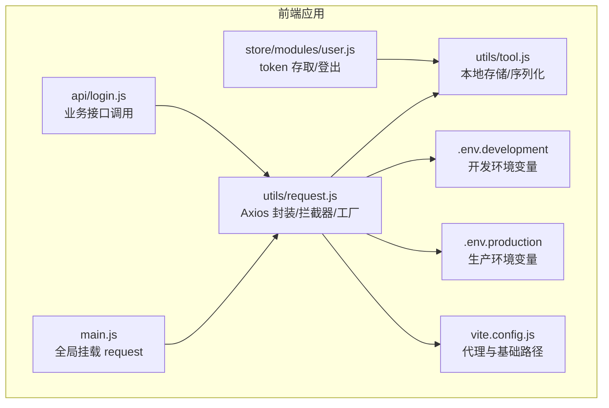
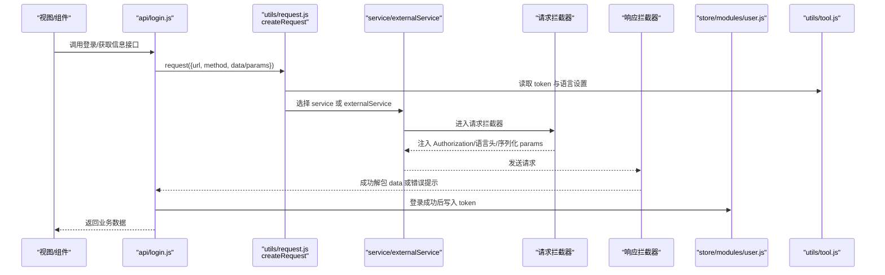
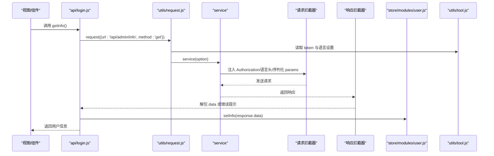
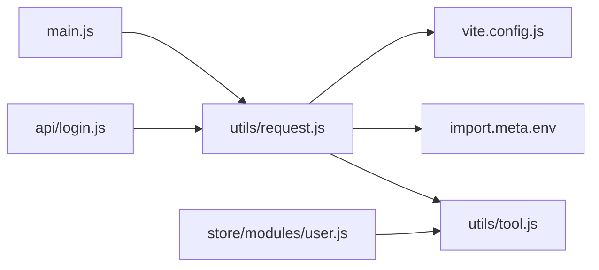

# 核心请求机制

<cite>
**本文引用的文件**
- [agx-admin/src/utils/request.js](file://agx-admin/src/utils/request.js)
- [agx-admin/src/utils/tool.js](file://agx-admin/src/utils/tool.js)
- [agx-admin/src/store/modules/user.js](file://agx-admin/src/store/modules/user.js)
- [agx-admin/src/api/login.js](file://agx-admin/src/api/login.js)
- [agx-admin/.env](file://agx-admin/.env)
- [agx-admin/.env.development](file://agx-admin/.env.development)
- [agx-admin/.env.production](file://agx-admin/.env.production)
- [agx-admin/vite.config.js](file://agx-admin/vite.config.js)
- [agx-admin/src/main.js](file://agx-admin/src/main.js)
</cite>

## 目录
1. [简介](#简介)
2. [项目结构](#项目结构)
3. [核心组件](#核心组件)
4. [架构总览](#架构总览)
5. [详细组件分析](#详细组件分析)
6. [依赖分析](#依赖分析)
7. [性能考虑](#性能考虑)
8. [故障排查指南](#故障排查指南)
9. [结论](#结论)
10. [附录](#附录)

## 简介
本文件聚焦 agx-admin 前端项目中的核心请求机制，围绕 agx-admin/src/utils/request.js 的 Axios 封装实现进行深入解析。重点涵盖：
- 请求实例创建流程与基础配置（baseURL、timeout）
- 请求拦截器中 JWT 令牌自动注入逻辑（从 Pinia store 的本地存储读取 token）
- 响应拦截器中的统一错误处理（HTTP 状态码映射、业务错误码处理）与成功响应数据解包
- 工具函数在请求参数序列化、语言头设置等处的作用
- 以“用户登录后获取个人信息”的完整生命周期为例，展示从发起到响应处理的全过程
- 初学者基础 GET/POST 示例与高级特性（请求取消、超时重试、请求缓存）的实现原理与配置建议

## 项目结构
与请求机制直接相关的文件与职责如下：
- utils/request.js：Axios 实例封装、请求/响应拦截器、请求方法工厂
- utils/tool.js：本地存储、HTTP 参数序列化、加密等工具
- store/modules/user.js：登录态维护、token 存取、登出清理
- api/login.js：业务 API 接口定义，使用 request 方法发起请求
- .env* 与 vite.config.js：环境变量与代理配置，影响 baseURL 与代理行为
- main.js：全局挂载 request，便于调试与复用

图表来源
- [agx-admin/src/main.js](file://agx-admin/src/main.js#L1-L61)
- [agx-admin/src/utils/request.js](file://agx-admin/src/utils/request.js#L1-L165)
- [agx-admin/src/utils/tool.js](file://agx-admin/src/utils/tool.js#L1-L375)
- [agx-admin/src/store/modules/user.js](file://agx-admin/src/store/modules/user.js#L1-L183)
- [agx-admin/src/api/login.js](file://agx-admin/src/api/login.js#L1-L172)
- [agx-admin/.env.development](file://agx-admin/.env.development#L1-L7)
- [agx-admin/.env.production](file://agx-admin/.env.production#L1-L9)
- [agx-admin/vite.config.js](file://agx-admin/vite.config.js#L1-L47)

章节来源
- [agx-admin/src/utils/request.js](file://agx-admin/src/utils/request.js#L1-L165)
- [agx-admin/src/utils/tool.js](file://agx-admin/src/utils/tool.js#L1-L375)
- [agx-admin/src/store/modules/user.js](file://agx-admin/src/store/modules/user.js#L1-L183)
- [agx-admin/src/api/login.js](file://agx-admin/src/api/login.js#L1-L172)
- [agx-admin/.env](file://agx-admin/.env#L1-L5)
- [agx-admin/.env.development](file://agx-admin/.env.development#L1-L7)
- [agx-admin/.env.production](file://agx-admin/.env.production#L1-L9)
- [agx-admin/vite.config.js](file://agx-admin/vite.config.js#L1-L47)
- [agx-admin/src/main.js](file://agx-admin/src/main.js#L1-L61)

## 核心组件
- Axios 实例与拦截器
  - createService/createExternalService：分别创建用于同源与外链请求的 Axios 实例，并注册请求/响应拦截器
  - 请求拦截器：对请求进行预处理（如参数序列化、语言头设置、超时等），并注入 Authorization 头
  - 响应拦截器：统一处理业务错误码与 HTTP 错误，成功时解包 data 字段
- 请求方法工厂 createRequest
  - 组装默认请求头（Authorization、Accept-Language、Content-Type）
  - 处理 params 序列化与 baseURL 选择（代理或直连）
  - 返回 service 或 externalService 的调用结果
- 工具函数
  - tool.local：localStorage 读写，用于 token 与用户设置的持久化
  - stringify：基于 qs 的参数序列化，支持点号键名
- 环境与代理
  - import.meta.env 提供运行时环境变量（baseURL、代理前缀、token 前缀）
  - vite.config.js 通过代理 rewrite 将 /api 或 /prod 重写到后端服务

章节来源
- [agx-admin/src/utils/request.js](file://agx-admin/src/utils/request.js#L1-L165)
- [agx-admin/src/utils/tool.js](file://agx-admin/src/utils/tool.js#L1-L375)
- [agx-admin/vite.config.js](file://agx-admin/vite.config.js#L1-L47)

## 架构总览
下图展示了从视图层到后端的整体请求链路，以及关键节点的职责划分。

图表来源
- [agx-admin/src/api/login.js](file://agx-admin/src/api/login.js#L1-L172)
- [agx-admin/src/utils/request.js](file://agx-admin/src/utils/request.js#L120-L165)
- [agx-admin/src/store/modules/user.js](file://agx-admin/src/store/modules/user.js#L1-L183)
- [agx-admin/src/utils/tool.js](file://agx-admin/src/utils/tool.js#L1-L375)

## 详细组件分析

### Axios 封装与拦截器
- 实例创建
  - createService：创建 Axios 实例，注册请求/响应拦截器
  - createExternalService：创建外部网络实例，仅做简单透传
- 请求拦截器
  - 预处理：参数序列化、语言头设置、超时等
  - 注入 Authorization：从本地存储读取 token 并拼接 Bearer
- 响应拦截器
  - 文件下载/非 JSON 场景透传原响应
  - 业务错误码处理：当 code 非 0/200 时弹出错误消息
  - HTTP 错误处理：401 清理本地 token 并跳转登录；403/404/500 显示对应提示；其他错误提示超时或未知错误
  - 成功响应：统一返回 data 字段，便于上层业务直接消费

章节来源
- [agx-admin/src/utils/request.js](file://agx-admin/src/utils/request.js#L1-L165)

### 请求方法工厂 createRequest
- 默认头组装
  - Authorization: Bearer + token
  - Accept-Language: 来自本地存储的 language
  - Content-Type: 若未显式指定则默认 application/json;charset=UTF-8
- 参数处理
  - 当存在 params 时，将其序列化并拼接到 url 上，同时清空 option.params
- baseURL 选择
  - 非 http/https 开头的相对路径：
    - 若开启代理开关，则使用代理前缀（如 /api 或 /prod）
    - 否则使用基础 baseURL（如 http://127.0.0.1:3000）
  - http/https 开头的绝对路径：走 externalService，不加 baseURL
- 超时
  - 默认 10000ms

章节来源
- [agx-admin/src/utils/request.js](file://agx-admin/src/utils/request.js#L120-L165)

### 工具函数在请求中的作用
- token 读取与语言设置
  - 通过 tool.local.get 读取 token 与语言设置，注入到请求头
- 参数序列化
  - 使用 qs.stringify 支持点号键名（allowDots），避免编码（encode: false）
- 其他用途
  - 下载场景中根据响应头构造 Blob 并触发下载
  - 提供 httpBuild、getRequestParams 等辅助方法，便于复杂参数构建与解析

章节来源
- [agx-admin/src/utils/request.js](file://agx-admin/src/utils/request.js#L115-L165)
- [agx-admin/src/utils/tool.js](file://agx-admin/src/utils/tool.js#L1-L375)

### 环境变量与代理配置
- 环境变量
  - VITE_APP_BASE_URL：后端服务基础地址
  - VITE_APP_PROXY_PREFIX：代理前缀（如 /api、/prod）
  - VITE_APP_OPEN_PROXY：是否启用代理
  - VITE_APP_TOKEN_PREFIX：token 在本地存储中的键名
- 开发/生产差异
  - 开发环境：BASE_URL、WS_URL、代理前缀、token 前缀不同
  - 生产环境：BASE_URL、代理前缀、token 前缀不同
- Vite 代理
  - 通过 rewrite 将代理前缀重写到实际后端地址，实现跨域与本地联调

章节来源
- [agx-admin/.env](file://agx-admin/.env#L1-L5)
- [agx-admin/.env.development](file://agx-admin/.env.development#L1-L7)
- [agx-admin/.env.production](file://agx-admin/.env.production#L1-L9)
- [agx-admin/vite.config.js](file://agx-admin/vite.config.js#L1-L47)

### 登录后获取个人信息的完整生命周期
以下流程以“用户登录后获取个人信息”为例，展示从发起到响应处理的全链路。

图表来源
- [agx-admin/src/api/login.js](file://agx-admin/src/api/login.js#L1-L172)
- [agx-admin/src/utils/request.js](file://agx-admin/src/utils/request.js#L120-L165)
- [agx-admin/src/store/modules/user.js](file://agx-admin/src/store/modules/user.js#L1-L183)
- [agx-admin/src/utils/tool.js](file://agx-admin/src/utils/tool.js#L1-L375)

章节来源
- [agx-admin/src/api/login.js](file://agx-admin/src/api/login.js#L1-L172)
- [agx-admin/src/store/modules/user.js](file://agx-admin/src/store/modules/user.js#L1-L183)

### 初学者基础示例
- GET 请求
  - 通过 request({ url, method: 'get', params }) 发起
  - params 会被序列化并拼接到 url 上
  - 参考路径：[agx-admin/src/views/setting/autoform/index.vue](file://agx-admin/src/views/setting/autoform/index.vue#L37-L96)
- POST 请求
  - 通过 request({ url, method: 'post', data }) 发起
  - data 作为请求体发送
  - 参考路径：[agx-admin/src/api/login.js](file://agx-admin/src/api/login.js#L18-L24)

章节来源
- [agx-admin/src/views/setting/autoform/index.vue](file://agx-admin/src/views/setting/autoform/index.vue#L37-L96)
- [agx-admin/src/api/login.js](file://agx-admin/src/api/login.js#L18-L24)

### 高级特性与实现原理
- 请求取消
  - Axios 支持 AbortController 控制请求取消，可在组件销毁或路由切换时取消未完成请求
  - 原理：在请求配置中传入 signal，组件卸载时调用 abort()
  - 建议：在业务层封装统一的取消策略，避免重复请求与内存泄漏
- 超时重试
  - 可在响应拦截器中识别超时错误并进行有限次数重试
  - 建议：结合指数退避与幂等性判断，避免重复副作用
- 请求缓存
  - 可基于 URL + 方法 + params 的组合键缓存响应，命中则直接返回
  - 建议：为 GET 请求启用缓存，POST/非幂等请求禁用缓存；设置合理的过期策略

说明：上述为通用实现思路，仓库当前未内置这些高级特性，但可按需扩展。

## 依赖分析
- 组件耦合
  - request.js 依赖 tool.js（本地存储、序列化）
  - api/login.js 依赖 request.js
  - store/modules/user.js 依赖 tool.js 与 router，负责 token 生命周期
  - main.js 全局暴露 request，便于调试
- 外部依赖
  - axios、@arco-design/web-vue（Message、Icon）、qs、lodash
- 环境与代理
  - import.meta.env 提供运行时配置
  - vite.config.js 通过代理 rewrite 实现本地联调

图表来源
- [agx-admin/src/utils/request.js](file://agx-admin/src/utils/request.js#L1-L165)
- [agx-admin/src/utils/tool.js](file://agx-admin/src/utils/tool.js#L1-L375)
- [agx-admin/src/api/login.js](file://agx-admin/src/api/login.js#L1-L172)
- [agx-admin/src/store/modules/user.js](file://agx-admin/src/store/modules/user.js#L1-L183)
- [agx-admin/src/main.js](file://agx-admin/src/main.js#L1-L61)
- [agx-admin/vite.config.js](file://agx-admin/vite.config.js#L1-L47)

章节来源
- [agx-admin/src/utils/request.js](file://agx-admin/src/utils/request.js#L1-L165)
- [agx-admin/src/utils/tool.js](file://agx-admin/src/utils/tool.js#L1-L375)
- [agx-admin/src/api/login.js](file://agx-admin/src/api/login.js#L1-L172)
- [agx-admin/src/store/modules/user.js](file://agx-admin/src/store/modules/user.js#L1-L183)
- [agx-admin/src/main.js](file://agx-admin/src/main.js#L1-L61)
- [agx-admin/vite.config.js](file://agx-admin/vite.config.js#L1-L47)

## 性能考虑
- 请求头与参数
  - 合理设置 Accept-Language，减少不必要的国际化资源
  - params 序列化避免多余字段，降低请求体积
- 超时与重试
  - 合理设置超时时间，避免长时间阻塞 UI
  - 对网络不稳定场景谨慎启用重试，防止重复请求
- 缓存策略
  - 对高频 GET 请求启用缓存，减少后端压力
  - 对敏感数据禁用缓存，确保一致性

## 故障排查指南
- 401 未授权
  - 现象：弹出“登录状态已过期，需要重新登录”
  - 处理：清理本地 token 并跳转登录页
  - 参考路径：[agx-admin/src/utils/request.js](file://agx-admin/src/utils/request.js#L71-L95)
- 403 权限不足
  - 现象：弹出“没有权限访问该资源”
  - 处理：检查用户角色与接口权限
  - 参考路径：[agx-admin/src/utils/request.js](file://agx-admin/src/utils/request.js#L79-L89)
- 404/500 服务器错误
  - 现象：弹出对应错误提示
  - 处理：检查接口是否存在与后端服务状态
  - 参考路径：[agx-admin/src/utils/request.js](file://agx-admin/src/utils/request.js#L73-L81)
- 超时/无响应
  - 现象：弹出“请求超时，服务器无响应！”
  - 处理：检查网络与代理配置
  - 参考路径：[agx-admin/src/utils/request.js](file://agx-admin/src/utils/request.js#L92-L96)
- 业务错误码
  - 现象：当 code 非 0/200 时弹出错误消息
  - 处理：根据 msg 或 message 字段定位问题
  - 参考路径：[agx-admin/src/utils/request.js](file://agx-admin/src/utils/request.js#L53-L60)
- token 读取异常
  - 现象：Authorization 头缺失导致 401
  - 处理：确认 VITE_APP_TOKEN_PREFIX 与本地存储键一致
  - 参考路径：[agx-admin/src/utils/request.js](file://agx-admin/src/utils/request.js#L126-L133)，[agx-admin/.env.development](file://agx-admin/.env.development#L6-L7)，[agx-admin/.env.production](file://agx-admin/.env.production#L8-L9)

章节来源
- [agx-admin/src/utils/request.js](file://agx-admin/src/utils/request.js#L44-L100)
- [agx-admin/.env.development](file://agx-admin/.env.development#L6-L7)
- [agx-admin/.env.production](file://agx-admin/.env.production#L8-L9)

## 结论
- request.js 将 Axios 封装为统一的请求层，提供：
  - 自动注入 JWT 令牌与语言头
  - 统一的业务错误码与 HTTP 错误处理
  - 简洁的请求方法工厂，支持代理与直连
- 与 store/modules/user.js、utils/tool.js 协作，形成完整的登录态与本地存储体系
- 通过环境变量与 Vite 代理，实现开发/生产环境的灵活切换
- 高级特性（取消、重试、缓存）可按需扩展，提升用户体验与稳定性

## 附录
- 关键实现路径参考
  - 请求方法工厂与拦截器：[agx-admin/src/utils/request.js](file://agx-admin/src/utils/request.js#L120-L165)
  - 参数序列化与 baseURL 选择：[agx-admin/src/utils/request.js](file://agx-admin/src/utils/request.js#L147-L160)
  - 业务错误码与 HTTP 错误处理：[agx-admin/src/utils/request.js](file://agx-admin/src/utils/request.js#L44-L100)
  - token 读取与语言设置：[agx-admin/src/utils/request.js](file://agx-admin/src/utils/request.js#L126-L135)
  - 登录与个人信息接口：[agx-admin/src/api/login.js](file://agx-admin/src/api/login.js#L18-L24)，[agx-admin/src/api/login.js](file://agx-admin/src/api/login.js#L40-L41)
  - 登录成功写入 token：[agx-admin/src/store/modules/user.js](file://agx-admin/src/store/modules/user.js#L72-L88)
  - 环境变量与代理配置：[agx-admin/.env.development](file://agx-admin/.env.development#L1-L7)，[agx-admin/.env.production](file://agx-admin/.env.production#L1-L9)，[agx-admin/vite.config.js](file://agx-admin/vite.config.js#L33-L44)