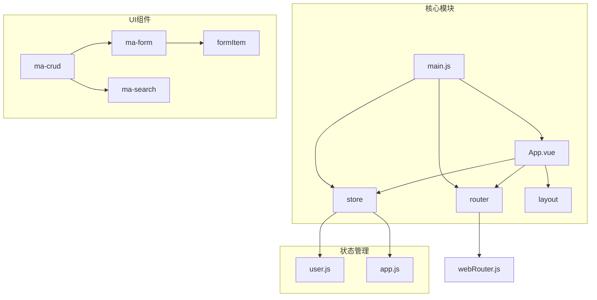
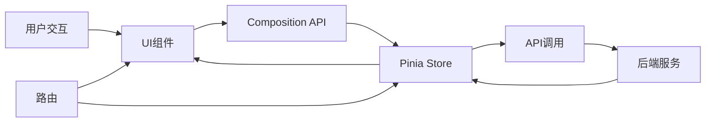
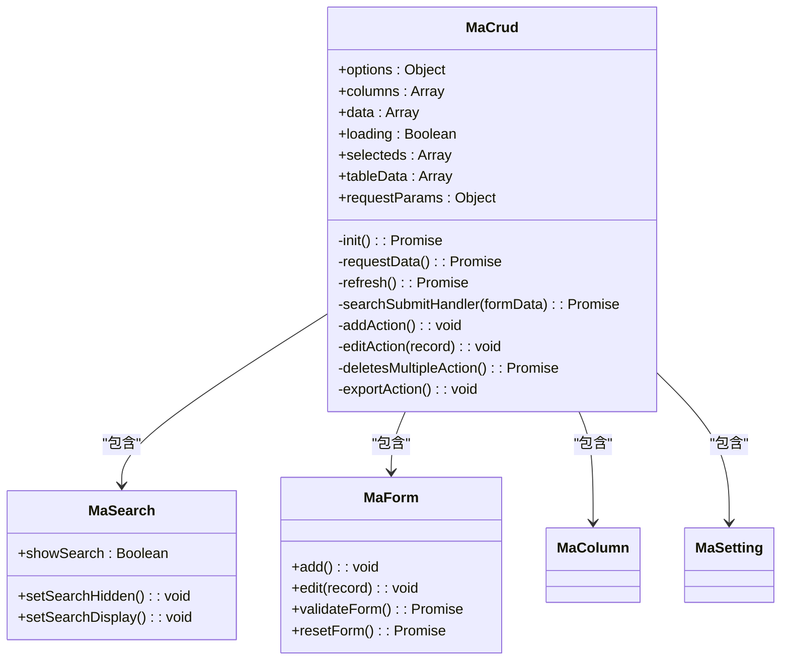
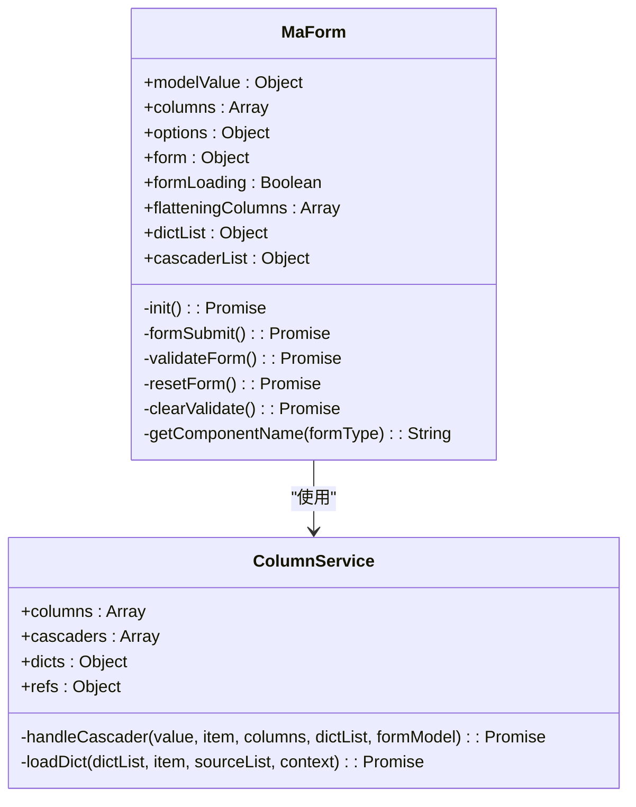
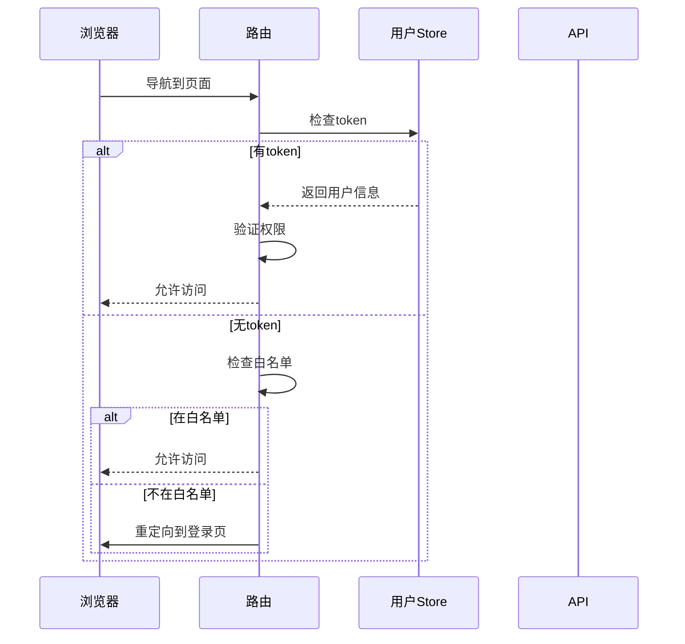
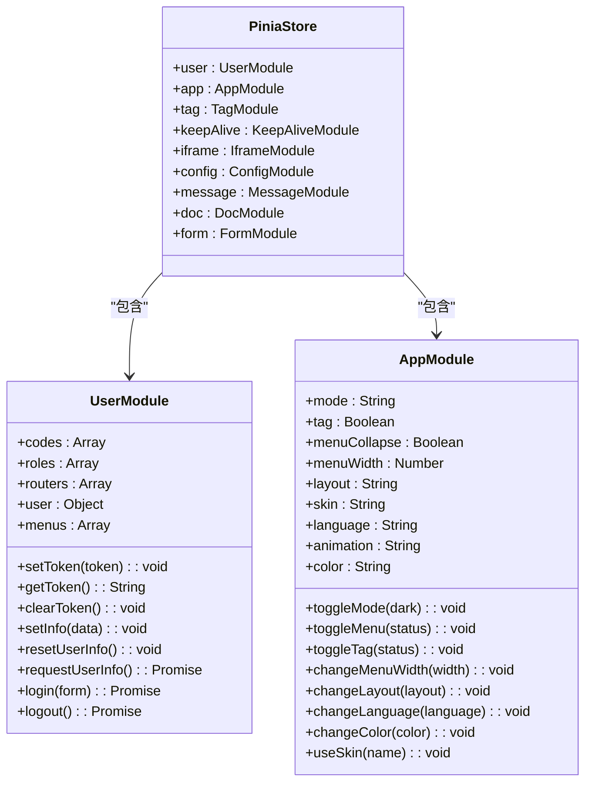
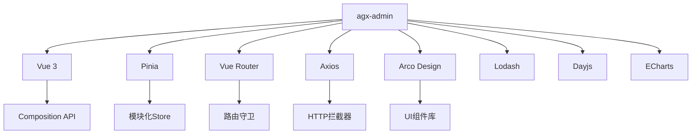

# 前端架构

<cite>
**本文档引用的文件**
- [main.js](file://agx-admin/src/main.js)
- [App.vue](file://agx-admin/src/App.vue)
- [router/index.js](file://agx-admin/src/router/index.js)
- [store/index.js](file://agx-admin/src/store/index.js)
- [store/modules/user.js](file://agx-admin/src/store/modules/user.js)
- [store/modules/app.js](file://agx-admin/src/store/modules/app.js)
- [components/ma-crud/index.vue](file://agx-admin/src/components/ma-crud/index.vue)
- [components/ma-form/index.vue](file://agx-admin/src/components/ma-form/index.vue)
- [layout/index.vue](file://agx-admin/src/layout/index.vue)
- [api/system/user.js](file://agx-admin/src/api/system/user.js)
- [utils/request.js](file://agx-admin/src/utils/request.js)
- [directives/auth/auth.js](file://agx-admin/src/directives/auth/auth.js)
</cite>

## 目录
1. [简介](#简介)
2. [项目结构](#项目结构)
3. [核心组件](#核心组件)
4. [架构概览](#架构概览)
5. [详细组件分析](#详细组件分析)
6. [依赖分析](#依赖分析)
7. [性能考虑](#性能考虑)
8. [故障排除指南](#故障排除指南)
9. [结论](#结论)

## 简介
agx-admin管理后台采用现代化的Vue 3 MVVM架构，构建了一个高效、可扩展的前端管理系统。该系统基于Vue 3 Composition API，结合Pinia状态管理和Vue Router路由控制，实现了清晰的数据流和组件交互模式。系统通过ma-crud和ma-form等高级UI组件库，提供了丰富的数据展示和表单处理能力，同时通过权限管理和API调用机制确保了系统的安全性和功能性。

## 项目结构
agx-admin项目的结构遵循现代Vue应用的最佳实践，采用模块化设计。src目录下包含api、components、config、directives、i18n、layout、plugin、router、store、style、utils和views等核心目录。其中，components目录包含ma-crud、ma-form等核心UI组件，store目录实现Pinia状态管理，router目录处理路由逻辑，views目录存放具体页面组件。

**图示来源**
- [main.js](file://agx-admin/src/main.js#L1-L61)
- [store/index.js](file://agx-admin/src/store/index.js#L1-L26)
- [router/index.js](file://agx-admin/src/router/index.js#L1-L58)

**本节来源**
- [main.js](file://agx-admin/src/main.js#L1-L61)
- [package.json](file://agx-admin/package.json#L1-L58)

## 核心组件
agx-admin的核心组件体系围绕ma-crud和ma-form构建，这两个组件提供了强大的数据管理和表单处理能力。ma-crud组件实现了完整的CRUD操作，包括数据展示、搜索、分页、批量操作等功能，而ma-form组件则提供了灵活的表单生成和验证机制。这些组件通过Composition API实现了逻辑复用和代码组织，使得开发更加高效。

**本节来源**
- [components/ma-crud/index.vue](file://agx-admin/src/components/ma-crud/index.vue#L1-L880)
- [components/ma-form/index.vue](file://agx-admin/src/components/ma-form/index.vue#L1-L283)

## 架构概览
agx-admin的前端架构采用典型的MVVM模式，通过Vue 3的响应式系统实现视图与数据的双向绑定。整个架构由三个主要部分组成：路由控制、状态管理和UI组件。路由控制负责页面导航和权限验证，状态管理维护全局应用状态，UI组件则负责具体的用户界面展示和交互。

**图示来源**
- [main.js](file://agx-admin/src/main.js#L1-L61)
- [App.vue](file://agx-admin/src/App.vue#L1-L36)
- [router/index.js](file://agx-admin/src/router/index.js#L1-L58)

## 详细组件分析

### ma-crud组件分析
ma-crud是agx-admin中最核心的UI组件之一，它提供了一个完整的数据表格解决方案。该组件支持数据展示、搜索、分页、批量操作、导入导出等多种功能。通过options配置对象，开发者可以灵活地定制组件的行为和外观。

**图示来源**
- [components/ma-crud/index.vue](file://agx-admin/src/components/ma-crud/index.vue#L1-L880)

**本节来源**
- [components/ma-crud/index.vue](file://agx-admin/src/components/ma-crud/index.vue#L1-L880)

### ma-form组件分析
ma-form组件是agx-admin中用于表单处理的核心组件。它支持多种表单元素类型，包括输入框、选择器、日期选择器等，并提供了灵活的验证规则配置。通过columns配置数组，开发者可以定义表单的结构和行为。

**图示来源**
- [components/ma-form/index.vue](file://agx-admin/src/components/ma-form/index.vue#L1-L283)

**本节来源**
- [components/ma-form/index.vue](file://agx-admin/src/components/ma-form/index.vue#L1-L283)

### 路由控制分析
路由控制是agx-admin权限管理的核心。通过vue-router的beforeEach守卫，系统实现了登录状态验证和页面访问控制。未登录用户只能访问白名单中的页面，如登录页和文档页，其他页面需要有效的身份验证才能访问。

**图示来源**
- [router/index.js](file://agx-admin/src/router/index.js#L1-L58)
- [store/modules/user.js](file://agx-admin/src/store/modules/user.js#L1-L183)

**本节来源**
- [router/index.js](file://agx-admin/src/router/index.js#L1-L58)

### 状态管理分析
Pinia状态管理是agx-admin的核心，它通过模块化的方式组织全局状态。user模块管理用户信息、权限和菜单，app模块管理应用主题、布局等全局设置。这种模块化设计使得状态管理更加清晰和可维护。

**图示来源**
- [store/index.js](file://agx-admin/src/store/index.js#L1-L26)
- [store/modules/user.js](file://agx-admin/src/store/modules/user.js#L1-L183)
- [store/modules/app.js](file://agx-admin/src/store/modules/app.js#L1-L130)

**本节来源**
- [store/index.js](file://agx-admin/src/store/index.js#L1-L26)
- [store/modules/user.js](file://agx-admin/src/store/modules/user.js#L1-L183)
- [store/modules/app.js](file://agx-admin/src/store/modules/app.js#L1-L130)

## 依赖分析
agx-admin的依赖关系清晰，主要依赖Vue 3生态系统的核心库。项目使用Pinia进行状态管理，Vue Router进行路由控制，Axios进行HTTP请求。UI组件基于Arco Design构建，提供了丰富的视觉元素和交互体验。这些依赖通过package.json统一管理，确保了版本的一致性和兼容性。

**图示来源**
- [package.json](file://agx-admin/package.json#L1-L58)

**本节来源**
- [package.json](file://agx-admin/package.json#L1-L58)

## 性能考虑
agx-admin在性能优化方面做了多项考虑。首先，通过懒加载和代码分割减少初始加载时间。其次，使用虚拟滚动和分页技术处理大量数据展示。再者，通过缓存机制减少重复的API调用。最后，利用Vue 3的响应式系统优化渲染性能，避免不必要的重渲染。

## 故障排除指南
当遇到问题时，首先检查控制台错误信息和网络请求状态。对于权限问题，确认用户token是否有效，权限代码是否正确配置。对于数据加载问题，检查API接口是否正常，请求参数是否正确。对于UI显示问题，检查组件配置是否正确，CSS样式是否有冲突。

**本节来源**
- [utils/request.js](file://agx-admin/src/utils/request.js#L1-L165)
- [router/index.js](file://agx-admin/src/router/index.js#L1-L58)
- [store/modules/user.js](file://agx-admin/src/store/modules/user.js#L1-L183)

## 结论
agx-admin管理后台通过现代化的Vue 3 MVVM架构，构建了一个高效、可扩展的前端系统。其核心的ma-crud和ma-form组件提供了强大的数据管理和表单处理能力，结合Pinia状态管理和Vue Router路由控制，实现了清晰的数据流和组件交互模式。系统的模块化设计和良好的架构使得开发和维护更加容易，为构建复杂的管理后台应用提供了优秀的基础。