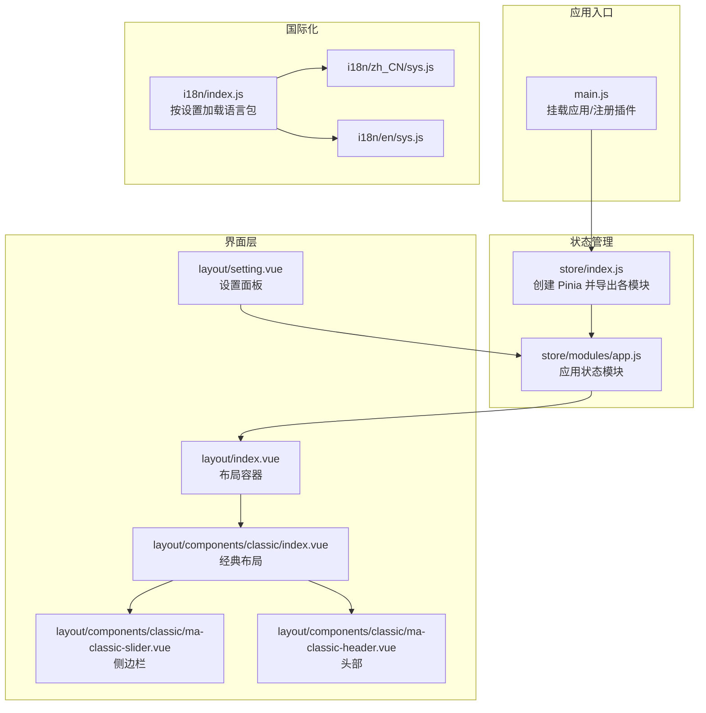
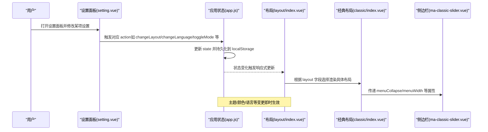
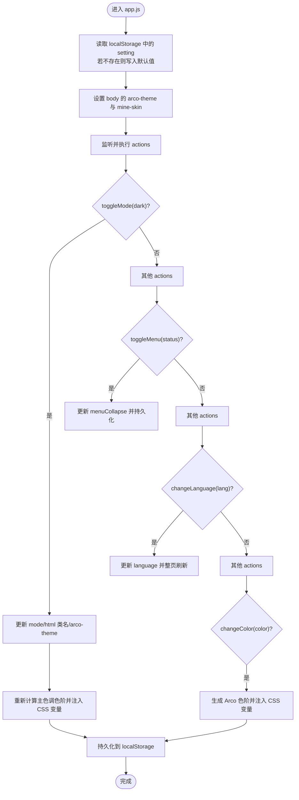
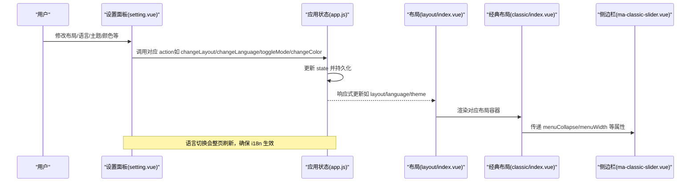
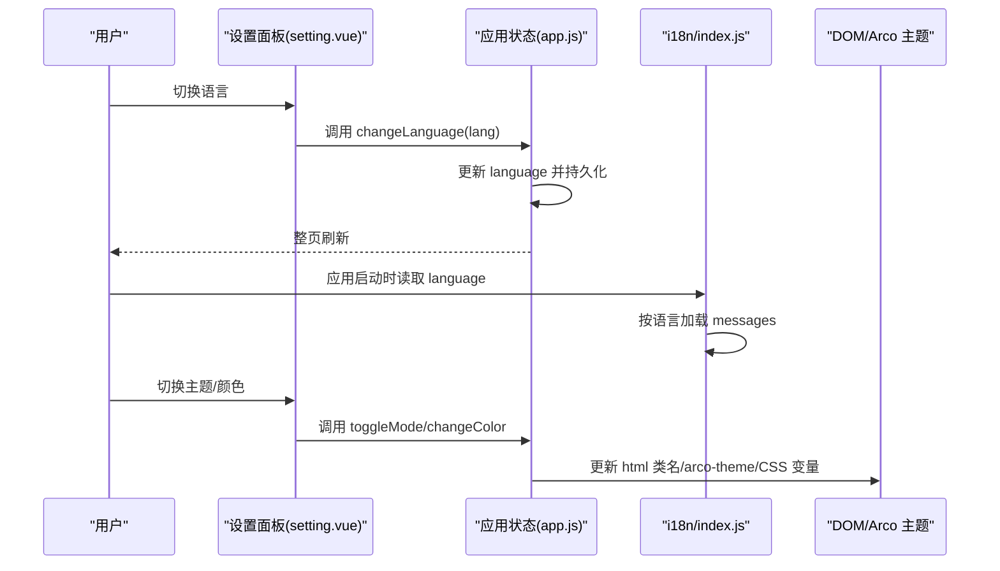
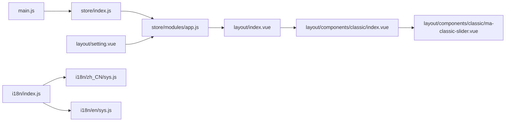

# 应用状态管理

<cite>
**本文引用的文件列表**
- [app.js](file://agx-admin/src/store/modules/app.js)
- [index.js（store）](file://agx-admin/src/store/index.js)
- [index.js（main）](file://agx-admin/src/main.js)
- [index.vue（layout）](file://agx-admin/src/layout/index.vue)
- [setting.vue（layout 设置面板）](file://agx-admin/src/layout/setting.vue)
- [index.vue（classic 布局）](file://agx-admin/src/layout/components/classic/index.vue)
- [ma-classic-slider.vue（经典布局侧边栏）](file://agx-admin/src/layout/components/classic/ma-classic-slider.vue)
- [ma-classic-header.vue（经典布局头部）](file://agx-admin/src/layout/components/classic/ma-classic-header.vue)
- [index.js（i18n）](file://agx-admin/src/i18n/index.js)
- [sys.js（zh_CN）](file://agx-admin/src/i18n/zh_CN/sys.js)
- [sys.js（en）](file://agx-admin/src/i18n/en/sys.js)
- [tool.js（工具）](file://agx-admin/src/utils/tool.js)
</cite>

## 目录
1. [简介](#简介)
2. [项目结构](#项目结构)
3. [核心组件](#核心组件)
4. [架构总览](#架构总览)
5. [详细组件分析](#详细组件分析)
6. [依赖关系分析](#依赖关系分析)
7. [性能考虑](#性能考虑)
8. [故障排查指南](#故障排查指南)
9. [结论](#结论)

## 简介
本文件围绕应用状态管理模块进行深入解析，重点聚焦于 app.js 的实现与使用。内容涵盖：
- 应用级状态的定义与持久化（localStorage）
- 布局模式（classic/columns/banner/mixed）、主题切换（明/暗）、语言设置、菜单折叠与宽度、动画、颜色、标签页、WebSocket 开关等
- 状态字段作用机制与动作触发逻辑（actions）
- 与 layout 组件及设置面板的协同工作流程
- 动态主题切换与多语言支持的集成示例
- 避免不必要重渲染的性能优化建议

## 项目结构
应用状态管理采用 Pinia Store 模块化组织，app.js 作为核心模块负责全局 UI/UX 状态；layout 与设置面板通过响应式绑定 appStore 的状态实现联动；i18n 在启动时根据用户设置加载对应语言包。

图表来源
- [index.js（main）](file://agx-admin/src/main.js#L1-L61)
- [index.js（store）](file://agx-admin/src/store/index.js#L1-L26)
- [app.js](file://agx-admin/src/store/modules/app.js#L1-L130)
- [index.vue（layout）](file://agx-admin/src/layout/index.vue#L1-L76)
- [index.vue（classic 布局）](file://agx-admin/src/layout/components/classic/index.vue#L1-L31)
- [ma-classic-slider.vue（经典布局侧边栏）](file://agx-admin/src/layout/components/classic/ma-classic-slider.vue#L1-L47)
- [ma-classic-header.vue（经典布局头部）](file://agx-admin/src/layout/components/classic/ma-classic-header.vue#L1-L26)
- [setting.vue（layout 设置面板）](file://agx-admin/src/layout/setting.vue#L1-L178)
- [index.js（i18n）](file://agx-admin/src/i18n/index.js#L1-L50)
- [sys.js（zh_CN）](file://agx-admin/src/i18n/zh_CN/sys.js#L1-L88)
- [sys.js（en）](file://agx-admin/src/i18n/en/sys.js#L1-L86)

章节来源
- [index.js（main）](file://agx-admin/src/main.js#L1-L61)
- [index.js（store）](file://agx-admin/src/store/index.js#L1-L26)

## 核心组件
- 应用状态模块（app.js）
  - 默认设置：主题模式、标签页、菜单折叠、菜单宽度、布局类型、皮肤、国际化开关、语言、动画、主色调、设置抽屉与搜索抽屉开关、WebSocket 开关、编辑器按钮注册标记等
  - 初始化：从 localStorage 读取或写入默认设置，并在 body 上设置 arco-theme 与 mine-skin 属性
  - 状态字段与作用
    - sidebarCollapsed：控制菜单折叠（menuCollapse），影响侧边栏宽度与菜单项展示
    - theme：控制明/暗主题（mode），同时更新 html 类名与 arco 主题属性
    - language：控制页面语言（language），切换后会整页刷新以重新加载语言包
    - color：主色调（color），动态生成 Arco Design 色阶并注入 CSS 变量
    - layout：布局模式（classic/columns/banner/mixed），决定渲染哪一种布局容器
    - skin：皮肤（skin），通过 body 属性切换皮肤
    - i18n：是否启用多语言（i18n）
    - animation：页面切换动画（animation）
    - tag：是否启用标签页（tag）
    - menuWidth：菜单宽度（menuWidth）
    - ws：是否启用 WebSocket（ws）
    - searchOpen/settingOpen：控制搜索与设置抽屉的显隐
  - 动作（actions）与触发逻辑
    - toggleMode(dark)：切换明/暗主题，更新 html 类名与 arco-theme 属性，重新生成主色调色阶，持久化
    - toggleMenu(status)：切换菜单折叠状态，持久化
    - toggleTag(status)：切换标签页开关，持久化
    - toggleI18n(i18n)：切换多语言开关，持久化
    - toggleWs(val)：切换 WebSocket 开关，持久化
    - changeMenuWidth(width)：调整菜单宽度，持久化
    - changeLayout(layout)：切换布局模式，持久化
    - changeLanguage(language)：切换语言，持久化并整页刷新
    - changeColor(color)：设置主色调，生成 Arco 色阶并注入 CSS 变量，持久化
    - changeAnimation(name)：切换页面动画，持久化
    - useSkin(name)：切换皮肤，更新 body 属性，持久化
    - setRegisterWangEditorButtonFlag(value)：编辑器按钮注册标记，用于富文本扩展
  - 持久化策略：所有变更均通过工具方法写入 localStorage，并同步 defaultSetting 以便后续初始化复用

章节来源
- [app.js](file://agx-admin/src/store/modules/app.js#L1-L130)
- [tool.js（工具）](file://agx-admin/src/utils/tool.js#L23-L68)

## 架构总览
应用状态管理通过 Pinia Store 将 UI 状态集中管理，layout 与设置面板通过响应式绑定 appStore 的状态实现联动。i18n 在应用启动阶段根据 appStore 中的语言设置加载对应语言包，确保界面文案与后台设置一致。

图表来源
- [setting.vue（layout 设置面板）](file://agx-admin/src/layout/setting.vue#L1-L178)
- [app.js](file://agx-admin/src/store/modules/app.js#L1-L130)
- [index.vue（layout）](file://agx-admin/src/layout/index.vue#L1-L76)
- [index.vue（classic 布局）](file://agx-admin/src/layout/components/classic/index.vue#L1-L31)
- [ma-classic-slider.vue（经典布局侧边栏）](file://agx-admin/src/layout/components/classic/ma-classic-slider.vue#L1-L47)

## 详细组件分析

### 应用状态模块（app.js）
- 数据结构与初始化
  - 默认设置对象包含主题、布局、皮肤、国际化、语言、动画、颜色、菜单折叠与宽度、标签页、WebSocket、搜索与设置抽屉开关等字段
  - 启动时若 localStorage 中不存在设置则写入默认值；否则以本地存储为准
  - 初始化时设置 body 的 arco-theme 与 mine-skin 属性，保证首次渲染即符合用户偏好
- 状态字段与作用机制
  - sidebarCollapsed：通过 menuCollapse 控制侧边栏宽度与菜单项展示，影响 ma-classic-slider 的宽度与图标布局
  - theme：通过 mode 控制明/暗主题，同时更新 html 类名与 arco-theme 属性，配合 changeColor 生成色阶
  - language：通过 language 控制页面语言，切换后整页刷新以重新加载 i18n 语言包
  - color：通过 changeColor 生成 Arco Design 色阶并注入 CSS 变量，使全局组件跟随主色调变化
  - layout：通过 changeLayout 切换布局模式，layout/index.vue 根据 layout 渲染不同布局容器
  - skin：通过 useSkin 切换皮肤，设置 body 的 mine-skin 属性
  - i18n/animation/tag/menuWidth/ws/searchOpen/settingOpen：分别控制多语言开关、页面切换动画、标签页开关、菜单宽度、WebSocket 开关、搜索与设置抽屉显隐
- 动作触发逻辑
  - 所有动作均通过 $patch 或直接赋值更新 state，并同步更新 defaultSetting 与 localStorage
  - changeLanguage 会触发整页刷新，确保语言包与界面完全替换
  - toggleMode 会重新生成主色调色阶，保证主题切换后颜色体系一致

图表来源
- [app.js](file://agx-admin/src/store/modules/app.js#L1-L130)
- [tool.js（工具）](file://agx-admin/src/utils/tool.js#L23-L68)

章节来源
- [app.js](file://agx-admin/src/store/modules/app.js#L1-L130)

### 布局与设置面板协同
- layout/index.vue
  - 根据 appStore.layout 渲染不同布局容器（classic/columns/banner/mixed）
  - 监听 appStore.settingOpen，打开设置抽屉并重置标志位
  - 提供快捷键打开/关闭系统搜索（Alt+S 与 ESC）
- classic 布局
  - classic/index.vue 包含侧边栏与头部区域
  - ma-classic-slider.vue 使用 appStore.menuCollapse 与 appStore.menuWidth 控制侧边栏宽度与图标布局
  - ma-classic-header.vue 展示面包屑与操作区，支持标签页（当 appStore.tag 为真时）
- 设置面板（layout/setting.vue）
  - 表单模型 form 与 appStore 同步，双向绑定布局、皮肤、语言、动画、主题、标签、菜单折叠、菜单宽度、WebSocket 等
  - 通过调用 appStore 的对应 action 实现状态变更
  - 支持保存到后台（通过用户信息接口上传当前设置）

图表来源
- [index.vue（layout）](file://agx-admin/src/layout/index.vue#L1-L76)
- [index.vue（classic 布局）](file://agx-admin/src/layout/components/classic/index.vue#L1-L31)
- [ma-classic-slider.vue（经典布局侧边栏）](file://agx-admin/src/layout/components/classic/ma-classic-slider.vue#L1-L47)
- [setting.vue（layout 设置面板）](file://agx-admin/src/layout/setting.vue#L1-L178)
- [app.js](file://agx-admin/src/store/modules/app.js#L1-L130)

章节来源
- [index.vue（layout）](file://agx-admin/src/layout/index.vue#L1-L76)
- [index.vue（classic 布局）](file://agx-admin/src/layout/components/classic/index.vue#L1-L31)
- [ma-classic-slider.vue（经典布局侧边栏）](file://agx-admin/src/layout/components/classic/ma-classic-slider.vue#L1-L47)
- [setting.vue（layout 设置面板）](file://agx-admin/src/layout/setting.vue#L1-L178)

### 多语言与动态主题集成示例
- 多语言
  - i18n/index.js 在启动时读取 localStorage 中的 language 设置，按 zh_CN 或 en 加载对应语言包
  - 设置面板中的语言切换通过 appStore.changeLanguage 触发整页刷新，确保语言包与界面完全替换
  - 语言包位于 i18n/zh_CN 与 i18n/en 下，sys.js 提供系统级文案
- 动态主题
  - appStore.toggleMode 切换明/暗主题时，同时更新 html 类名与 arco-theme 属性
  - appStore.changeColor 生成 Arco 色阶并注入 CSS 变量，使全局组件随主色调变化
  - 皮肤切换通过 appStore.useSkin 更新 body 的 mine-skin 属性

图表来源
- [index.js（i18n）](file://agx-admin/src/i18n/index.js#L1-L50)
- [sys.js（zh_CN）](file://agx-admin/src/i18n/zh_CN/sys.js#L1-L88)
- [sys.js（en）](file://agx-admin/src/i18n/en/sys.js#L1-L86)
- [setting.vue（layout 设置面板）](file://agx-admin/src/layout/setting.vue#L1-L178)
- [app.js](file://agx-admin/src/store/modules/app.js#L1-L130)

章节来源
- [index.js（i18n）](file://agx-admin/src/i18n/index.js#L1-L50)
- [sys.js（zh_CN）](file://agx-admin/src/i18n/zh_CN/sys.js#L1-L88)
- [sys.js（en）](file://agx-admin/src/i18n/en/sys.js#L1-L86)
- [setting.vue（layout 设置面板）](file://agx-admin/src/layout/setting.vue#L1-L178)
- [app.js](file://agx-admin/src/store/modules/app.js#L1-L130)

## 依赖关系分析
- 入口与状态
  - main.js 注册 Pinia 与 i18n 插件，确保应用启动时具备全局状态与国际化能力
  - store/index.js 创建 Pinia 并导出各模块（包括 app.js）
- 状态与视图
  - layout/index.vue 与 classic 布局组件依赖 appStore 的布局、菜单折叠、菜单宽度等状态
  - setting.vue 作为设置入口，直接调用 appStore 的 actions 进行状态变更
- 工具与持久化
  - app.js 使用工具类的 localStorage 方法进行持久化，保证用户偏好跨会话保留

图表来源
- [index.js（main）](file://agx-admin/src/main.js#L1-L61)
- [index.js（store）](file://agx-admin/src/store/index.js#L1-L26)
- [app.js](file://agx-admin/src/store/modules/app.js#L1-L130)
- [index.vue（layout）](file://agx-admin/src/layout/index.vue#L1-L76)
- [index.vue（classic 布局）](file://agx-admin/src/layout/components/classic/index.vue#L1-L31)
- [ma-classic-slider.vue（经典布局侧边栏）](file://agx-admin/src/layout/components/classic/ma-classic-slider.vue#L1-L47)
- [setting.vue（layout 设置面板）](file://agx-admin/src/layout/setting.vue#L1-L178)
- [index.js（i18n）](file://agx-admin/src/i18n/index.js#L1-L50)
- [sys.js（zh_CN）](file://agx-admin/src/i18n/zh_CN/sys.js#L1-L88)
- [sys.js（en）](file://agx-admin/src/i18n/en/sys.js#L1-L86)

章节来源
- [index.js（main）](file://agx-admin/src/main.js#L1-L61)
- [index.js（store）](file://agx-admin/src/store/index.js#L1-L26)
- [app.js](file://agx-admin/src/store/modules/app.js#L1-L130)
- [index.vue（layout）](file://agx-admin/src/layout/index.vue#L1-L76)
- [index.vue（classic 布局）](file://agx-admin/src/layout/components/classic/index.vue#L1-L31)
- [ma-classic-slider.vue（经典布局侧边栏）](file://agx-admin/src/layout/components/classic/ma-classic-slider.vue#L1-L47)
- [setting.vue（layout 设置面板）](file://agx-admin/src/layout/setting.vue#L1-L178)
- [index.js（i18n）](file://agx-admin/src/i18n/index.js#L1-L50)
- [sys.js（zh_CN）](file://agx-admin/src/i18n/zh_CN/sys.js#L1-L88)
- [sys.js（en）](file://agx-admin/src/i18n/en/sys.js#L1-L86)

## 性能考虑
- 避免不必要的重渲染
  - 将频繁变更的状态拆分为独立的 store 模块（如 app.js 仅负责 UI/UX 状态），减少无关组件订阅
  - 在设置面板中使用表单模型与 appStore 同步时，尽量使用浅层响应式（如只绑定需要的字段），避免深层嵌套导致的过度追踪
  - 对于布局切换（changeLayout）与语言切换（changeLanguage），由于涉及整页刷新，应在 UI 层面提示用户并延迟触发，减少频繁切换带来的抖动
- 主题与颜色
  - changeColor 会批量注入大量 CSS 变量，建议在高频切换时增加节流/防抖，避免短时间内多次计算与注入
  - 主题切换（toggleMode）时可先缓存当前颜色，切换后再恢复，减少视觉跳变
- 本地存储
  - 所有变更均持久化到 localStorage，建议在高频操作时合并写入或使用批量更新策略，降低 I/O 压力
- 布局与菜单
  - 侧边栏宽度与折叠状态直接影响 DOM 结构与重排，建议在移动端与桌面端分别设置合理的默认值与阈值，减少频繁尺寸变化

## 故障排查指南
- 语言切换无效
  - 检查 appStore.changeLanguage 是否被调用且已持久化
  - 确认 i18n/index.js 正确读取 localStorage 中的 language 设置
  - 若未整页刷新，请确认浏览器未拦截自动刷新
- 主题切换不生效
  - 检查 html 类名与 body 的 arco-theme 属性是否正确更新
  - 确认 changeColor 已生成并注入 CSS 变量
- 皮肤切换异常
  - 检查 body 的 mine-skin 属性是否更新
  - 确认皮肤配置与皮肤组件正确关联
- 布局切换无反应
  - 检查 layout 字段是否更新
  - 确认 layout/index.vue 的条件渲染逻辑是否匹配当前布局值
- 设置抽屉无法打开
  - 检查 appStore.settingOpen 是否被置为 true
  - 确认 layout/index.vue 的 watch 是否触发并调用设置面板的 open 方法

章节来源
- [app.js](file://agx-admin/src/store/modules/app.js#L1-L130)
- [index.js（i18n）](file://agx-admin/src/i18n/index.js#L1-L50)
- [index.vue（layout）](file://agx-admin/src/layout/index.vue#L1-L76)
- [setting.vue（layout 设置面板）](file://agx-admin/src/layout/setting.vue#L1-L178)

## 结论
app.js 作为应用状态的核心模块，通过 Pinia 将 UI/UX 状态集中管理，并与 layout 与设置面板形成清晰的协作关系。其设计兼顾了易用性与可维护性：默认设置与持久化保障用户体验一致性；actions 提供细粒度的控制；与 i18n 的集成确保多语言无缝切换。遵循本文提供的性能优化建议与故障排查要点，可进一步提升应用的稳定性与响应速度。