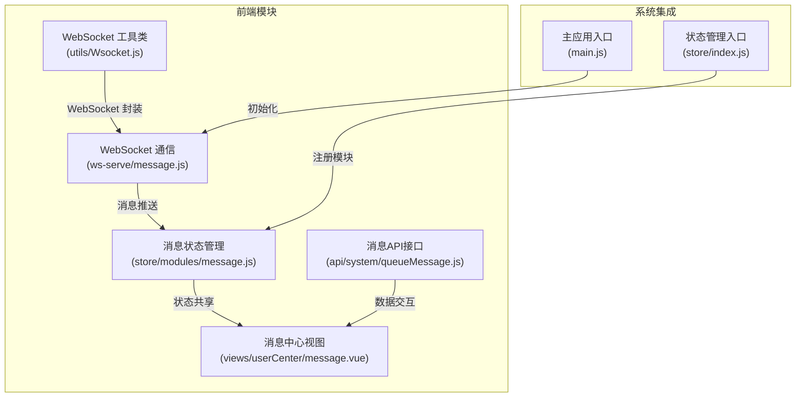
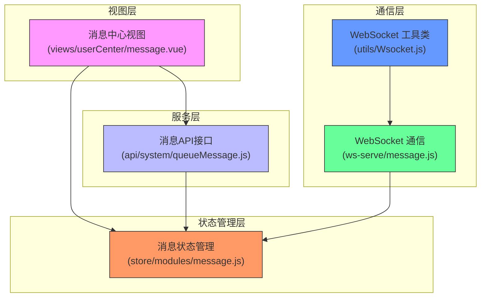
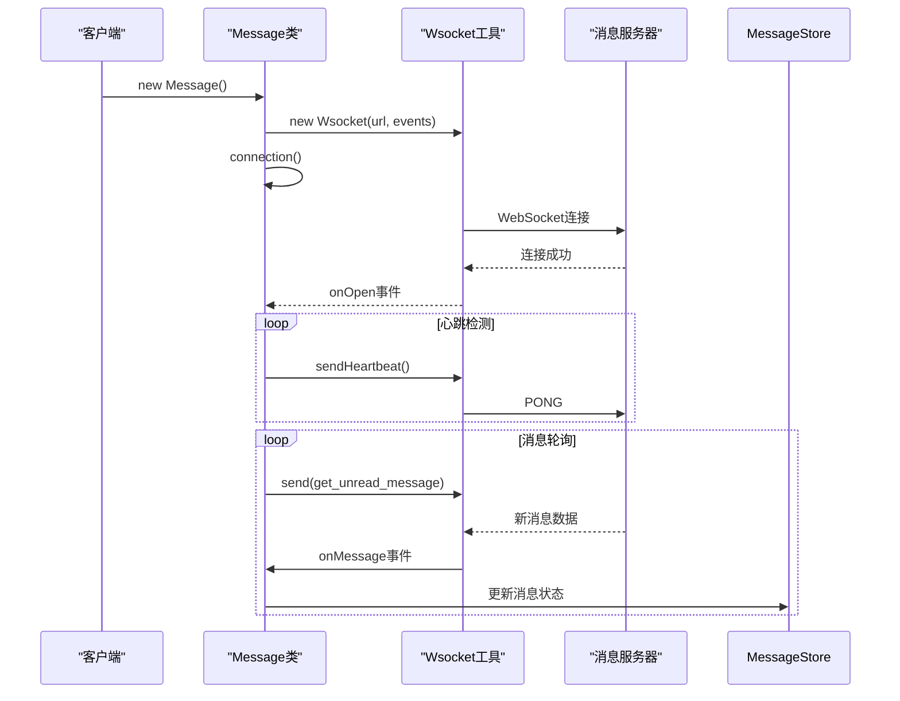
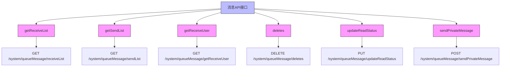
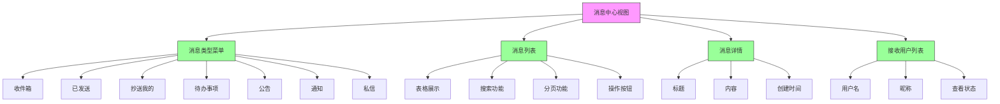
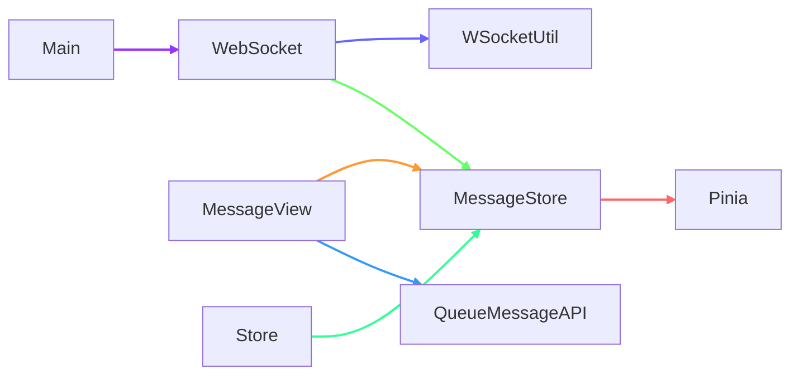

# 消息通知管理

<cite>
**本文档引用文件**  
- [message.js](file://agx-admin/src/store/modules/message.js)
- [message.js](file://agx-admin/src/ws-serve/message.js)
- [Wsocket.js](file://agx-admin/src/utils/Wsocket.js)
- [queueMessage.js](file://agx-admin/src/api/system/queueMessage.js)
- [message.vue](file://agx-admin/src/views/userCenter/message.vue)
- [main.js](file://agx-admin/src/main.js)
- [index.js](file://agx-admin/src/store/index.js)
</cite>

## 目录
1. [项目结构](#项目结构)
2. [核心组件](#核心组件)
3. [架构概述](#架构概述)
4. [详细组件分析](#详细组件分析)
5. [依赖分析](#依赖分析)
6. [性能考虑](#性能考虑)
7. [故障排除指南](#故障排除指南)
8. [结论](#结论)

## 项目结构

消息通知管理模块主要分布在前端管理系统的 `agx-admin` 目录下，涉及状态管理、WebSocket 通信、API 接口和用户界面等多个层面。



**图示来源**  
- [message.js](file://agx-admin/src/store/modules/message.js)
- [message.js](file://agx-admin/src/ws-serve/message.js)
- [Wsocket.js](file://agx-admin/src/utils/Wsocket.js)
- [queueMessage.js](file://agx-admin/src/api/system/queueMessage.js)
- [message.vue](file://agx-admin/src/views/userCenter/message.vue)
- [main.js](file://agx-admin/src/main.js)
- [index.js](file://agx-admin/src/store/index.js)

**本节来源**  
- [agx-admin/src/store/modules/message.js](file://agx-admin/src/store/modules/message.js)
- [agx-admin/src/ws-serve/message.js](file://agx-admin/src/ws-serve/message.js)
- [agx-admin/src/utils/Wsocket.js](file://agx-admin/src/utils/Wsocket.js)

## 核心组件

消息通知管理模块的核心组件包括消息状态管理、WebSocket 通信服务、消息API接口和消息中心视图。这些组件共同实现了全局消息队列的管理和实时消息推送功能。

消息状态管理使用 Pinia 作为状态管理工具，维护消息列表的状态。WebSocket 通信服务负责与后端建立长连接，实现消息的实时推送。消息API接口封装了与后端交互的各种请求，包括获取消息列表、更新读取状态等。消息中心视图则提供了用户友好的界面，支持多种消息类型的分类展示和操作。

**本节来源**  
- [message.js](file://agx-admin/src/store/modules/message.js)
- [message.js](file://agx-admin/src/ws-serve/message.js)
- [queueMessage.js](file://agx-admin/src/api/system/queueMessage.js)
- [message.vue](file://agx-admin/src/views/userCenter/message.vue)

## 架构概述

消息通知管理模块采用分层架构设计，从下到上分为通信层、状态管理层、服务层和视图层。



**图示来源**  
- [message.js](file://agx-admin/src/store/modules/message.js)
- [message.js](file://agx-admin/src/ws-serve/message.js)
- [Wsocket.js](file://agx-admin/src/utils/Wsocket.js)
- [queueMessage.js](file://agx-admin/src/api/system/queueMessage.js)
- [message.vue](file://agx-admin/src/views/userCenter/message.vue)

## 详细组件分析

### 消息状态管理分析

消息状态管理模块基于 Pinia 实现，负责维护全局消息队列的状态。该模块定义了消息列表的状态结构，并提供了更新消息的 action 方法。

```mermaid
classDiagram
class MessageStore {
+messageList : Array
+getState() : Object
+updateMessage(partial : Object) : void
}
note right of MessageStore
消息状态管理模块
- 使用 Pinia 作为状态管理工具
- 维护全局消息队列
- 提供状态更新接口
end
```

**图示来源**  
- [message.js](file://agx-admin/src/store/modules/message.js)

**本节来源**  
- [message.js](file://agx-admin/src/store/modules/message.js)

### WebSocket 通信分析

WebSocket 通信模块负责与后端服务器建立长连接，实现消息的实时推送。该模块封装了连接管理、心跳机制和消息接收处理等功能。



**图示来源**  
- [message.js](file://agx-admin/src/ws-serve/message.js)
- [Wsocket.js](file://agx-admin/src/utils/Wsocket.js)

**本节来源**  
- [message.js](file://agx-admin/src/ws-serve/message.js)
- [Wsocket.js](file://agx-admin/src/utils/Wsocket.js)

### 消息API接口分析

消息API接口模块封装了与后端交互的各种HTTP请求，包括获取消息列表、更新读取状态、删除消息等操作。



**图示来源**  
- [queueMessage.js](file://agx-admin/src/api/system/queueMessage.js)

**本节来源**  
- [queueMessage.js](file://agx-admin/src/api/system/queueMessage.js)

### 消息中心视图分析

消息中心视图提供了用户友好的界面，支持多种消息类型的分类展示和操作。该视图通过调用API接口获取数据，并与状态管理模块交互更新UI。



**图示来源**  
- [message.vue](file://agx-admin/src/views/userCenter/message.vue)

**本节来源**  
- [message.vue](file://agx-admin/src/views/userCenter/message.vue)

## 依赖分析

消息通知管理模块与其他模块存在紧密的依赖关系，这些依赖关系确保了模块的正常运行和功能完整性。



**图示来源**  
- [message.js](file://agx-admin/src/store/modules/message.js)
- [message.js](file://agx-admin/src/ws-serve/message.js)
- [Wsocket.js](file://agx-admin/src/utils/Wsocket.js)
- [queueMessage.js](file://agx-admin/src/api/system/queueMessage.js)
- [message.vue](file://agx-admin/src/views/userCenter/message.vue)
- [main.js](file://agx-admin/src/main.js)
- [index.js](file://agx-admin/src/store/index.js)

**本节来源**  
- [message.js](file://agx-admin/src/store/modules/message.js)
- [message.js](file://agx-admin/src/ws-serve/message.js)
- [Wsocket.js](file://agx-admin/src/utils/Wsocket.js)
- [queueMessage.js](file://agx-admin/src/api/system/queueMessage.js)
- [message.vue](file://agx-admin/src/views/userCenter/message.vue)
- [main.js](file://agx-admin/src/main.js)
- [index.js](file://agx-admin/src/store/index.js)

## 性能考虑

消息通知管理模块在设计时考虑了多个性能优化点：

1. **WebSocket 长连接**：使用 WebSocket 实现双向通信，避免了传统轮询带来的性能开销。
2. **心跳机制**：通过心跳包保持连接活跃，及时发现并处理断线情况。
3. **自动重连**：在网络不稳定时自动尝试重连，提高系统的可用性。
4. **状态管理**：使用 Pinia 进行状态管理，避免不必要的组件重新渲染。
5. **按需加载**：消息列表采用分页加载，减少一次性加载大量数据的压力。

这些优化措施确保了消息通知系统的高效运行和良好的用户体验。

## 故障排除指南

在使用消息通知管理模块时，可能会遇到以下常见问题及解决方案：

1. **无法连接到消息服务器**
   - 检查 WebSocket 服务器地址配置是否正确
   - 确认网络连接是否正常
   - 检查防火墙设置是否阻止了 WebSocket 连接

2. **消息推送延迟或丢失**
   - 检查心跳间隔设置是否合理
   - 确认服务器端消息推送逻辑是否正确
   - 查看浏览器控制台是否有错误信息

3. **消息状态不同步**
   - 检查状态管理模块的更新逻辑
   - 确认 API 接口返回的数据格式是否正确
   - 验证前端数据处理逻辑

4. **界面显示异常**
   - 检查组件间的依赖关系
   - 确认数据绑定是否正确
   - 查看浏览器开发者工具中的错误信息

**本节来源**  
- [message.js](file://agx-admin/src/store/modules/message.js)
- [message.js](file://agx-admin/src/ws-serve/message.js)
- [Wsocket.js](file://agx-admin/src/utils/Wsocket.js)
- [queueMessage.js](file://agx-admin/src/api/system/queueMessage.js)
- [message.vue](file://agx-admin/src/views/userCenter/message.vue)

## 结论

消息通知管理模块通过 WebSocket 实现实时通信，结合 Pinia 状态管理和 RESTful API 接口，构建了一个高效、可靠的消息系统。该系统支持多种消息类型，提供了完整的消息生命周期管理功能，包括消息的发送、接收、读取状态更新和删除等操作。

模块设计充分考虑了性能优化和用户体验，通过心跳机制、自动重连、状态管理和按需加载等技术手段，确保了系统的稳定性和响应速度。同时，清晰的分层架构和模块化设计使得系统易于维护和扩展。

对于开发者而言，该模块提供了良好的开发体验和清晰的代码结构，便于理解和二次开发。建议在实际使用中根据具体需求调整配置参数，如心跳间隔、重连次数等，以达到最佳的性能表现。