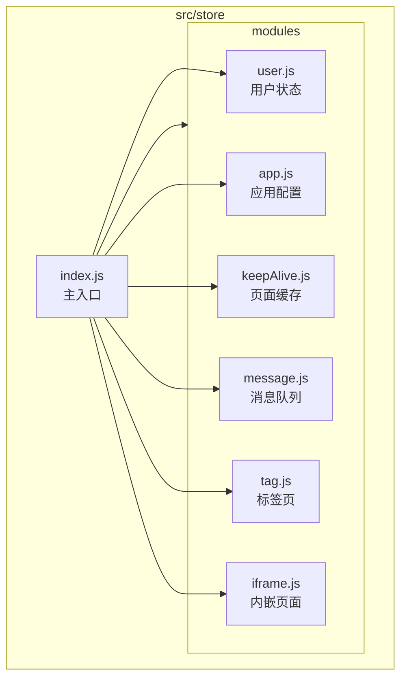
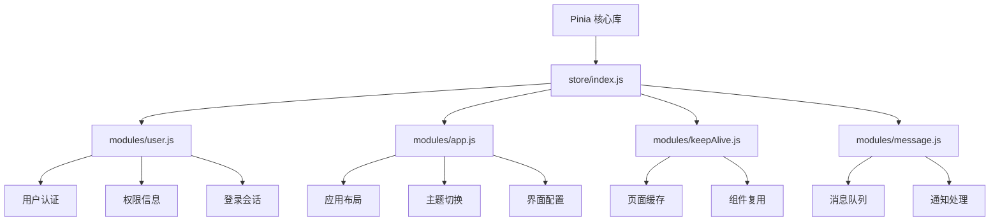
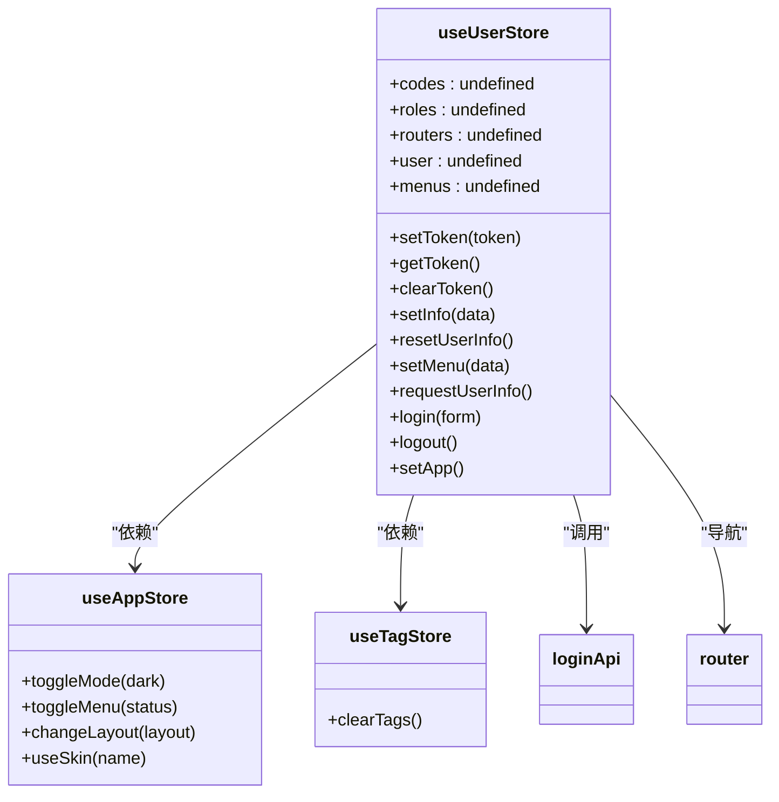
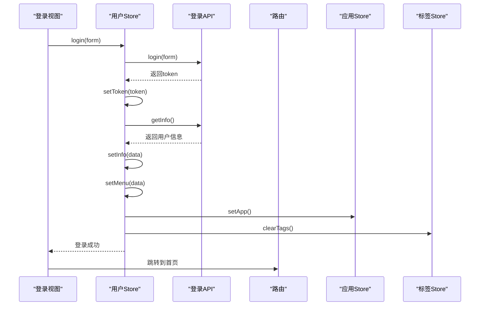
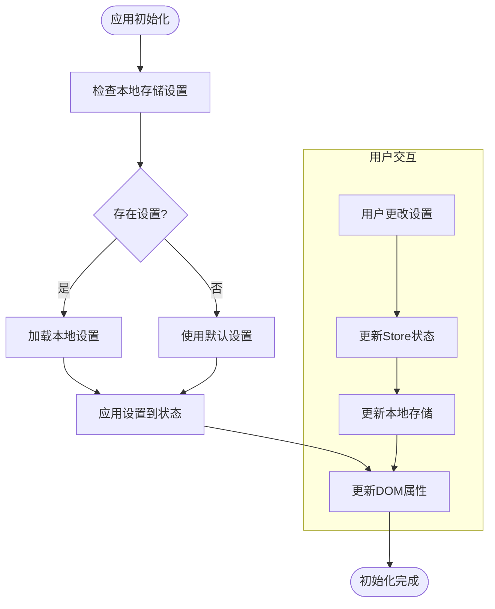
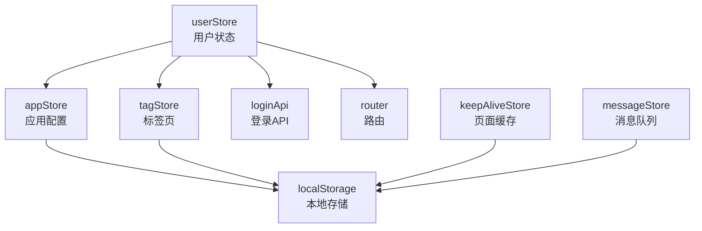

# 状态管理

<cite>
**本文档引用文件**  
- [index.js](file://agx-admin/src/store/index.js)
- [user.js](file://agx-admin/src/store/modules/user.js)
- [app.js](file://agx-admin/src/store/modules/app.js)
- [keepAlive.js](file://agx-admin/src/store/modules/keepAlive.js)
- [message.js](file://agx-admin/src/store/modules/message.js)
- [tag.js](file://agx-admin/src/store/modules/tag.js)
- [iframe.js](file://agx-admin/src/store/modules/iframe.js)
- [main.js](file://agx-admin/src/main.js)
- [login.vue](file://agx-admin/src/views/login.vue)
- [setting.vue](file://agx-admin/src/layout/setting.vue)
- [ma-workerArea.vue](file://agx-admin/src/layout/components/ma-workerArea.vue)
- [auth.js](file://agx-admin/src/directives/auth/auth.js)
- [tool.js](file://agx-admin/src/utils/tool.js)
</cite>

## 目录
1. [引言](#引言)
2. [项目结构](#项目结构)
3. [核心组件](#核心组件)
4. [架构概述](#架构概述)
5. [详细组件分析](#详细组件分析)
6. [依赖分析](#依赖分析)
7. [性能考虑](#性能考虑)
8. [故障排除指南](#故障排除指南)
9. [结论](#结论)

## 引言
本文档详细描述了agx-admin项目中基于Pinia的状态管理架构。文档聚焦于全局状态管理的设计与实现，解释了store/index.js如何集成各个模块化store，深入分析了user、app、keepAlive和message等核心模块的功能与交互机制。通过登录流程、权限校验等实际场景，展示了状态变更的完整流程和模块间通信机制。文档同时为初学者提供了Pinia基本概念和API用法的介绍，并为高级开发者提供了状态持久化、模块热重载和性能监控的最佳实践。

## 项目结构
agx-admin项目采用模块化的状态管理设计，所有Pinia store位于`src/store`目录下。该目录包含一个主入口文件`index.js`和一个`modules`子目录，其中存放了多个功能模块化的store文件。这种设计实现了关注点分离，使得每个store模块专注于特定的业务领域，如用户认证、应用配置、页面缓存和消息通知等。



**图表来源**  
- [index.js](file://agx-admin/src/store/index.js#L1-L25)
- [user.js](file://agx-admin/src/store/modules/user.js#L1-L183)
- [app.js](file://agx-admin/src/store/modules/app.js#L1-L130)

## 核心组件
本项目的核心状态管理组件包括用户认证、应用配置、页面缓存和消息通知四大模块。这些模块通过Pinia的模块化store机制进行组织，每个模块都封装了其特定的状态、getter和actions，实现了高内聚、低耦合的设计原则。`store/index.js`作为中心枢纽，负责创建Pinia实例并统一导出所有模块化的store，使得它们可以在整个应用中被方便地导入和使用。

**章节来源**  
- [index.js](file://agx-admin/src/store/index.js#L1-L25)
- [user.js](file://agx-admin/src/store/modules/user.js#L1-L183)
- [app.js](file://agx-admin/src/store/modules/app.js#L1-L130)
- [keepAlive.js](file://agx-admin/src/store/modules/keepAlive.js#L1-L42)
- [message.js](file://agx-admin/src/store/modules/message.js#L1-L24)

## 架构概述
agx-admin的状态管理架构采用分层设计，以Pinia为核心，构建了一个清晰、可维护的状态管理生态系统。在最底层是Pinia库本身，它提供了响应式状态管理和模块化store的基础设施。中间层是`store/index.js`，它作为应用的全局状态中心，负责初始化Pinia实例并集成所有功能模块。最上层是位于`modules`目录下的各个功能store，它们各自管理特定领域的状态，并通过定义良好的API与应用的其他部分进行交互。



**图表来源**  
- [index.js](file://agx-admin/src/store/index.js#L1-L25)
- [user.js](file://agx-admin/src/store/modules/user.js#L1-L183)
- [app.js](file://agx-admin/src/store/modules/app.js#L1-L130)
- [keepAlive.js](file://agx-admin/src/store/modules/keepAlive.js#L1-L42)
- [message.js](file://agx-admin/src/store/modules/message.js#L1-L24)

## 详细组件分析
本节将深入分析agx-admin项目中的各个状态管理模块，包括它们的内部结构、关键功能和在实际应用中的使用方式。

### 用户模块分析
用户模块（user.js）是整个应用安全和个性化体验的核心。它管理着用户的认证状态、权限信息和登录会话，是应用启动时最关键的初始化模块之一。

#### 用户模块类图


**图表来源**  
- [user.js](file://agx-admin/src/store/modules/user.js#L9-L112)
- [app.js](file://agx-admin/src/store/modules/app.js#L31-L127)
- [tag.js](file://agx-admin/src/store/modules/tag.js#L5-L69)

#### 用户登录流程序列图


**图表来源**  
- [login.vue](file://agx-admin/src/views/login.vue#L44-L58)
- [user.js](file://agx-admin/src/store/modules/user.js#L72-L97)
- [router/index.js](file://agx-admin/src/router/index.js#L18-L46)

### 应用模块分析
应用模块（app.js）负责管理应用的全局UI配置和用户偏好设置，如主题模式、布局样式、菜单状态等。它实现了状态的持久化，确保用户的个性化设置在页面刷新后依然有效。

#### 应用模块状态流程图


**图表来源**  
- [app.js](file://agx-admin/src/store/modules/app.js#L1-L127)
- [setting.vue](file://agx-admin/src/layout/setting.vue#L138-L172)

### 页面缓存模块分析
页面缓存模块（keepAlive.js）实现了Vue的`<keep-alive>`组件的动态管理，通过维护一个需要被缓存的组件名称列表，实现了对特定页面状态的持久化，避免了不必要的组件销毁和重建。

#### 页面缓存机制流程图
```mermaid
flowchart TD
A[路由跳转] --> B{目标页面是否需要缓存?}
B --> |是| C[调用addKeepAlive(component)]
B --> |否| D[不进行缓存操作]
C --> E[将组件名加入keepAlives数组]
E --> F[在<keep-alive>中include该组件]
F --> G[组件状态被保留]
H[关闭标签页] --> I{是缓存页面?}
I --> |是| J[调用removeKeepAlive(component)]
I --> |否| K[正常移除]
J --> L[从keepAlives数组中移除组件名]
L --> M[组件下次访问时重新创建]
```

**图表来源**  
- [keepAlive.js](file://agx-admin/src/store/modules/keepAlive.js#L3-L39)
- [ma-workerArea.vue](file://agx-admin/src/layout/components/ma-workerArea.vue#L15-L17)

### 消息模块分析
消息模块（message.js）提供了一个简单的消息队列管理机制，用于处理应用内的通知消息。它通过一个可变的消息列表和一个通用的更新方法，实现了消息的动态管理。

#### 消息模块类图
```mermaid
classDiagram
class useMessageStore {
+messageList : []
+updateMessage(partial)
+getState()
}
class MessageHandler as "消息处理器"
MessageHandler --> useMessageStore : "调用updateMessage"
class NotificationUI as "通知UI组件"
NotificationUI --> useMessageStore : "读取messageList"
```

**图表来源**  
- [message.js](file://agx-admin/src/store/modules/message.js#L8-L22)

## 依赖分析
agx-admin的状态管理模块之间存在明确的依赖关系，这些关系确保了应用状态的一致性和协同工作。



**图表来源**  
- [user.js](file://agx-admin/src/store/modules/user.js#L7-L8)
- [app.js](file://agx-admin/src/store/modules/app.js#L19-L26)
- [tag.js](file://agx-admin/src/store/modules/tag.js#L2-L3)
- [keepAlive.js](file://agx-admin/src/store/modules/keepAlive.js#L1-L2)
- [message.js](file://agx-admin/src/store/modules/message.js#L2-L3)

## 性能考虑
在状态管理方面，agx-admin项目通过模块化设计和合理的状态更新策略来保证性能。每个store模块只关注其特定领域的状态，避免了单一store过大导致的性能问题。通过使用Pinia的`$patch`方法进行批量状态更新，减少了不必要的响应式通知。对于页面缓存，通过`<keep-alive>`组件避免了频繁的组件创建和销毁开销。同时，应用配置等状态被持久化到本地存储，减少了应用初始化时的计算负担。

## 故障排除指南
当遇到状态管理相关的问题时，可以参考以下常见问题的排查方法：

1.  **登录后状态未正确初始化**：检查`userStore.requestUserInfo()`是否被正确调用，确保API返回的数据结构符合预期。
2.  **应用设置未持久化**：确认`tool.local.set('setting', defaultSetting)`在每次状态变更后都被调用。
3.  **页面缓存失效**：检查`keepAliveStore.addKeepAlive()`是否在正确的时机被调用，确保组件的`name`属性是唯一的。
4.  **权限校验不生效**：验证`userStore.codes`是否在登录后被正确设置，并检查`auth`指令的使用方式。

**章节来源**  
- [user.js](file://agx-admin/src/store/modules/user.js#L52-L69)
- [app.js](file://agx-admin/src/store/modules/app.js#L51-L52)
- [keepAlive.js](file://agx-admin/src/store/modules/keepAlive.js#L18-L24)
- [auth.js](file://agx-admin/src/directives/auth/auth.js#L1-L8)

## 结论
agx-admin项目通过Pinia实现了高效、可维护的状态管理。其模块化的设计使得代码结构清晰，易于理解和扩展。`store/index.js`作为中心枢纽，优雅地集成了各个功能模块，而每个模块又专注于解决特定的业务问题。通过分析登录流程、权限校验和页面缓存等实际场景，可以看出该状态管理架构能够有效地支撑复杂的应用逻辑。对于开发者而言，理解这一架构有助于更好地进行功能开发和问题排查，同时也为未来的功能扩展提供了坚实的基础。