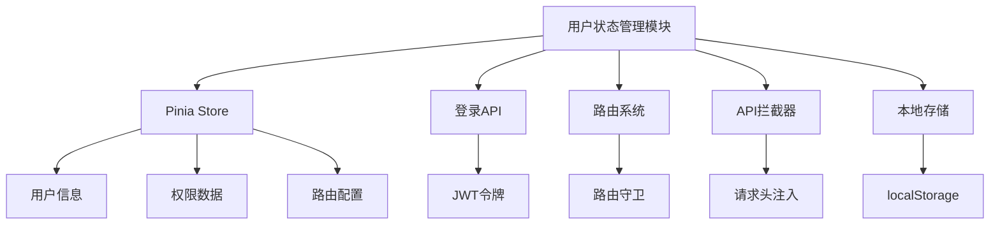
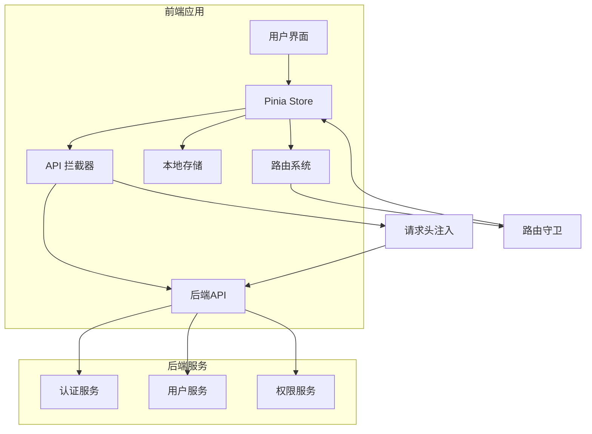
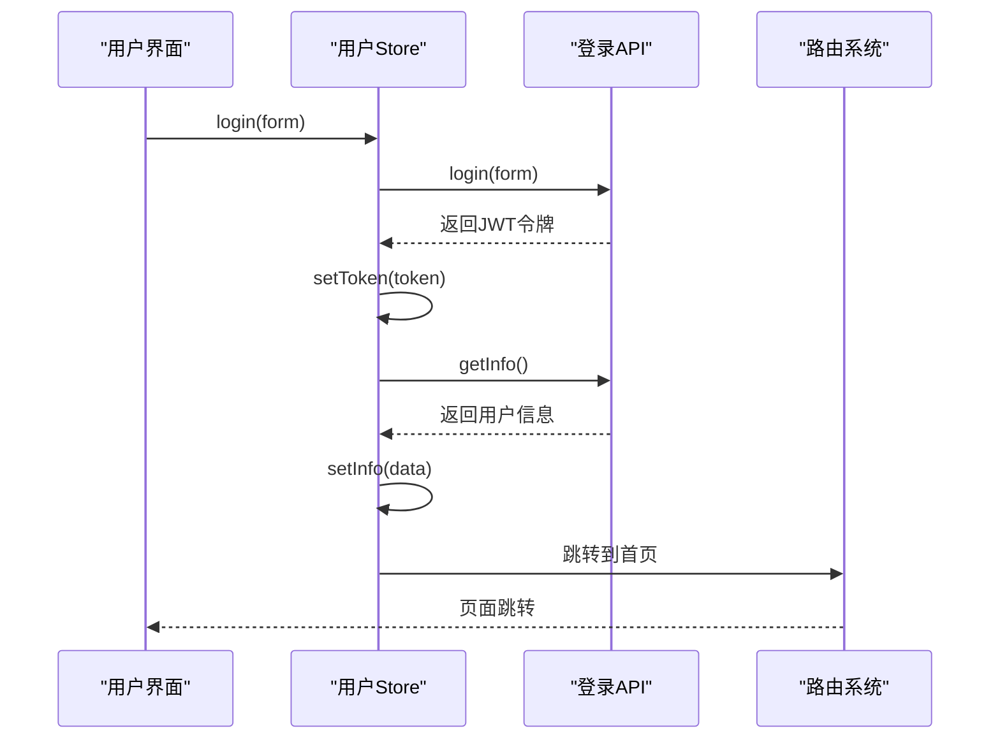
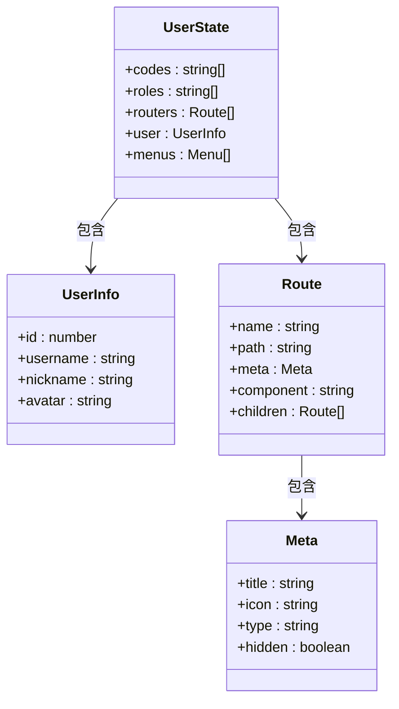
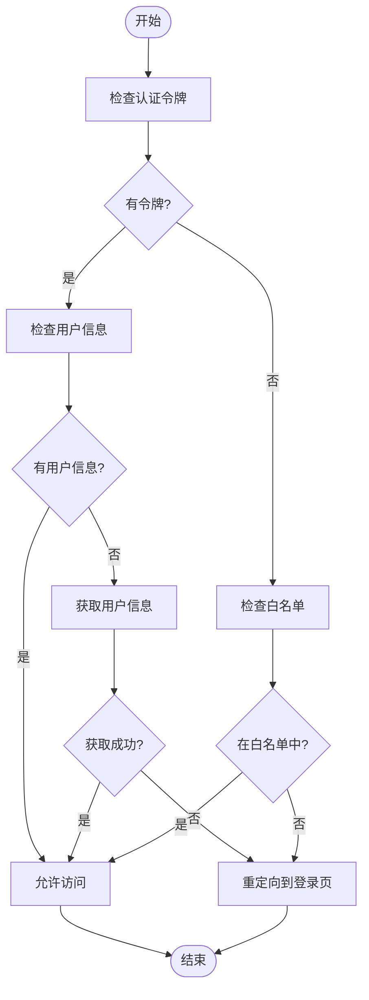
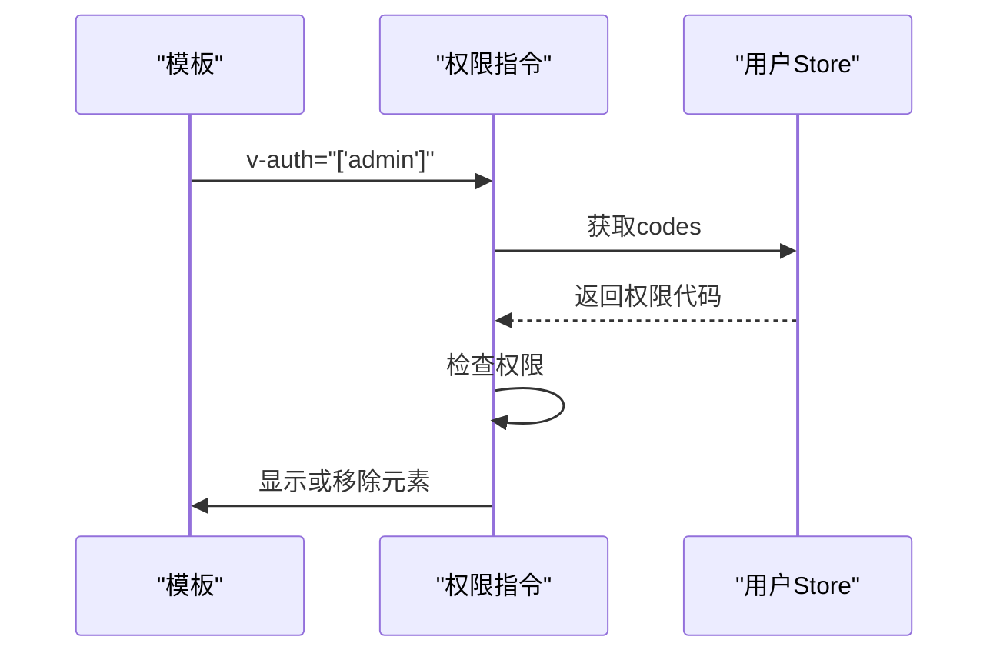
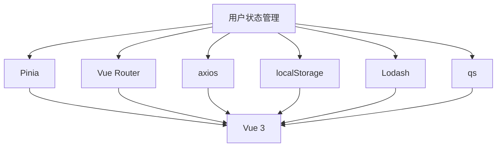

# 用户状态管理

<cite>
**本文档引用文件**  
- [user.js](file://agx-admin/src/store/modules/user.js)
- [login.js](file://agx-admin/src/api/login.js)
- [request.js](file://agx-admin/src/utils/request.js)
- [tool.js](file://agx-admin/src/utils/tool.js)
- [index.js](file://agx-admin/src/router/index.js)
- [auth.js](file://agx-admin/src/directives/auth/auth.js)
- [webRouter.js](file://agx-admin/src/router/webRouter.js)
- [homePageRoutes.js](file://agx-admin/src/router/homePageRoutes.js)
</cite>

## 目录
1. [项目结构](#项目结构)
2. [核心组件](#核心组件)
3. [架构概述](#架构概述)
4. [详细组件分析](#详细组件分析)
5. [依赖分析](#依赖分析)
6. [性能考虑](#性能考虑)
7. [故障排除指南](#故障排除指南)
8. [结论](#结论)

## 项目结构

用户状态管理模块位于 `agx-admin/src/store/modules/user.js`，是基于 Pinia 状态管理库实现的核心模块。该模块负责管理用户登录状态、认证令牌（JWT）、用户信息和权限数据。模块通过调用登录 API 实现用户认证，并与路由系统、API 拦截器等组件进行交互。

**图表来源**  
- [user.js](file://agx-admin/src/store/modules/user.js)
- [login.js](file://agx-admin/src/api/login.js)
- [index.js](file://agx-admin/src/router/index.js)

**章节来源**  
- [user.js](file://agx-admin/src/store/modules/user.js#L1-L183)
- [login.js](file://agx-admin/src/api/login.js#L1-L172)

## 核心组件

用户状态管理模块的核心功能包括用户登录、登出、获取用户信息等。模块通过 Pinia Store 管理用户状态，使用本地存储持久化认证令牌，并通过路由守卫控制页面访问权限。

**章节来源**  
- [user.js](file://agx-admin/src/store/modules/user.js#L1-L183)
- [login.js](file://agx-admin/src/api/login.js#L1-L172)

## 架构概述

用户状态管理模块采用分层架构设计，包含状态管理、API 通信、路由控制和本地存储四个主要部分。状态管理使用 Pinia 实现，API 通信通过 axios 拦截器处理，路由控制由 Vue Router 的导航守卫实现，本地存储使用浏览器的 localStorage。

**图表来源**  
- [user.js](file://agx-admin/src/store/modules/user.js)
- [request.js](file://agx-admin/src/utils/request.js)
- [index.js](file://agx-admin/src/router/index.js)

## 详细组件分析

### 用户状态管理分析

用户状态管理模块实现了完整的用户认证流程，包括登录、登出和用户信息获取。模块通过 Pinia Store 管理用户状态，确保状态的一致性和可预测性。

#### 核心方法实现

**图表来源**  
- [user.js](file://agx-admin/src/store/modules/user.js#L72-L88)
- [login.js](file://agx-admin/src/api/login.js#L18-L32)

#### 状态字段结构

**图表来源**  
- [user.js](file://agx-admin/src/store/modules/user.js#L11-L17)
- [login.js](file://agx-admin/src/api/login.js#L40-L169)

### 路由守卫分析

路由守卫是用户状态管理的重要组成部分，负责控制页面访问权限。当用户尝试访问受保护的路由时，路由守卫会检查用户的登录状态和权限。

**图表来源**  
- [index.js](file://agx-admin/src/router/index.js#L18-L45)

**章节来源**  
- [index.js](file://agx-admin/src/router/index.js#L18-L45)
- [user.js](file://agx-admin/src/store/modules/user.js#L52-L67)

### 权限指令分析

权限指令用于在模板中控制元素的显示和隐藏，基于用户的权限代码进行判断。指令通过访问用户 Store 中的权限数据来决定是否显示元素。

**图表来源**  
- [auth.js](file://agx-admin/src/directives/auth/auth.js#L1-L8)
- [index.js](file://agx-admin/src/directives/auth/index.js#L1-L30)

**章节来源**  
- [auth.js](file://agx-admin/src/directives/auth/auth.js#L1-L8)
- [index.js](file://agx-admin/src/directives/auth/index.js#L1-L30)

## 依赖分析

用户状态管理模块依赖于多个核心组件，包括 Pinia 状态管理、Vue Router 路由系统、axios HTTP 客户端和本地存储 API。这些依赖关系确保了模块的完整功能和稳定性。

**图表来源**  
- [user.js](file://agx-admin/src/store/modules/user.js)
- [request.js](file://agx-admin/src/utils/request.js)
- [tool.js](file://agx-admin/src/utils/tool.js)

**章节来源**  
- [user.js](file://agx-admin/src/store/modules/user.js#L1-L183)
- [request.js](file://agx-admin/src/utils/request.js#L1-L165)
- [tool.js](file://agx-admin/src/utils/tool.js#L1-L375)

## 性能考虑

用户状态管理模块在性能方面进行了优化，包括使用 Pinia 的响应式系统、axios 拦截器的高效处理和路由懒加载。这些优化确保了应用的快速响应和流畅体验。

## 故障排除指南

当用户状态管理出现问题时，可以检查以下常见问题：
- 认证令牌是否正确存储在 localStorage 中
- 用户信息 API 是否返回正确的数据
- 路由守卫是否正确配置
- 权限指令是否正确使用

**章节来源**  
- [user.js](file://agx-admin/src/store/modules/user.js#L27-L37)
- [request.js](file://agx-admin/src/utils/request.js#L45-L96)
- [index.js](file://agx-admin/src/router/index.js#L23-L45)

## 结论

用户状态管理模块是 AGX 管理系统的核心组件之一，负责管理用户的身份认证、权限控制和状态持久化。通过 Pinia 状态管理、Vue Router 路由守卫和 axios 拦截器的协同工作，模块实现了安全、高效的用户状态管理。对于初学者，建议理解状态变更的生命周期；对于高级开发者，可以探索自动登录、多设备登录控制和权限动态更新的最佳实践。