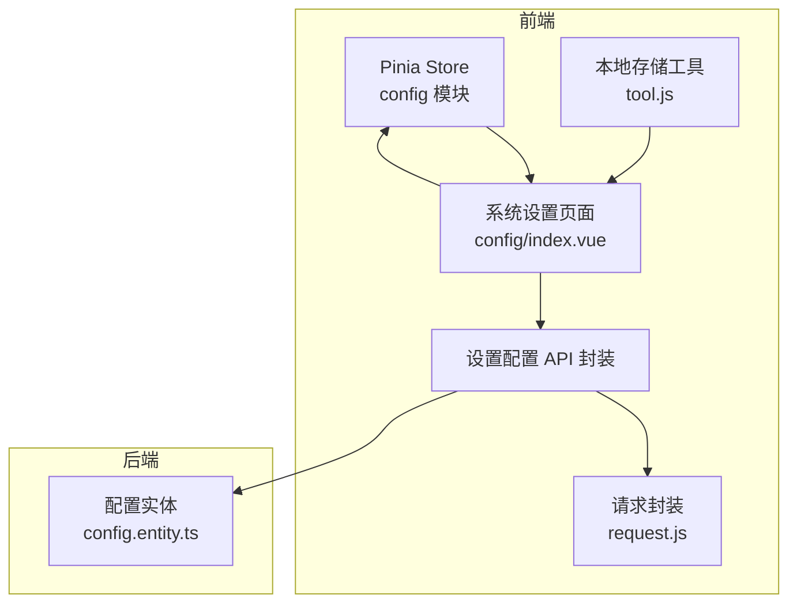
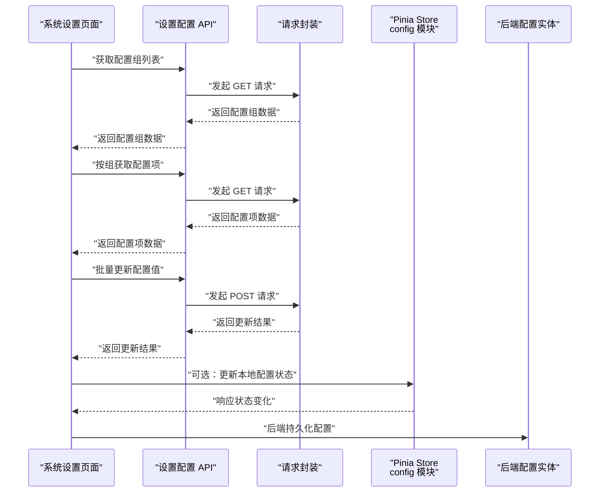
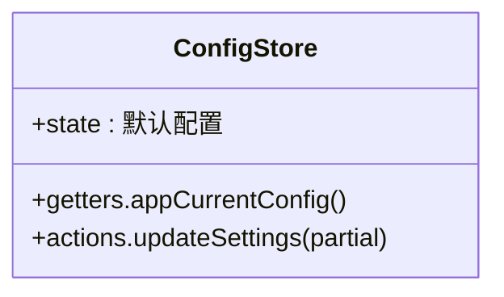
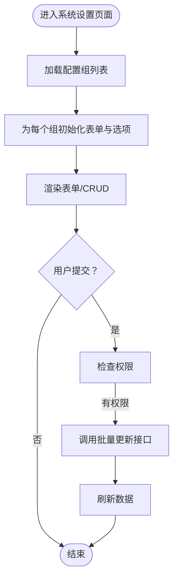
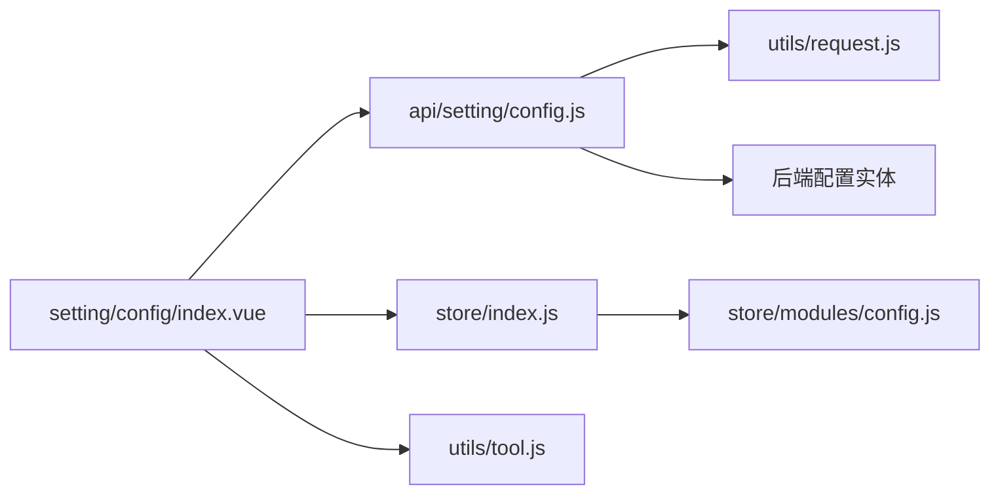

# 配置状态管理

<cite>
**本文引用的文件**
- [config.js](file://agx-admin/src/store/modules/config.js)
- [setting/config.js](file://agx-admin/src/api/setting/config.js)
- [setting/config/index.vue](file://agx-admin/src/views/setting/config/index.vue)
- [store/index.js](file://agx-admin/src/store/index.js)
- [request.js](file://agx-admin/src/utils/request.js)
- [tool.js](file://agx-admin/src/utils/tool.js)
- [config.entity.ts](file://agx-backend/src/entities/config.entity.ts)
- [config-DoammVAP.js](file://agx-admin/dist/assets/config-DoammVAP.js)
</cite>

## 目录
1. [简介](#简介)
2. [项目结构](#项目结构)
3. [核心组件](#核心组件)
4. [架构总览](#架构总览)
5. [详细组件分析](#详细组件分析)
6. [依赖关系分析](#依赖关系分析)
7. [性能考量](#性能考量)
8. [故障排查指南](#故障排查指南)
9. [结论](#结论)
10. [附录](#附录)

## 简介
本文件围绕配置状态管理模块展开，重点分析前端 Pinia Store 中的 config 模块与系统设置页面之间的协作关系，梳理配置数据从后端 API 加载、渲染到前端状态更新的完整流程，并给出配置缓存、版本控制与热更新的实现策略建议，帮助开发者在不直接阅读源码的情况下也能快速理解并扩展配置能力。

## 项目结构
配置状态管理涉及以下关键文件：
- 前端状态：Pinia Store 的 config 模块，负责集中管理应用运行时配置
- 前端 API：系统设置模块的配置相关接口封装
- 前端视图：系统设置页面，负责展示与编辑配置
- 工具层：请求封装与本地存储工具
- 后端实体：配置表结构定义

图表来源
- [config.js](file://agx-admin/src/store/modules/config.js#L1-L30)
- [setting/config.js](file://agx-admin/src/api/setting/config.js#L1-L124)
- [setting/config/index.vue](file://agx-admin/src/views/setting/config/index.vue#L1-L228)
- [request.js](file://agx-admin/src/utils/request.js#L1-L165)
- [tool.js](file://agx-admin/src/utils/tool.js#L1-L110)
- [config.entity.ts](file://agx-backend/src/entities/config.entity.ts#L1-L32)

章节来源
- [config.js](file://agx-admin/src/store/modules/config.js#L1-L30)
- [setting/config.js](file://agx-admin/src/api/setting/config.js#L1-L124)
- [setting/config/index.vue](file://agx-admin/src/views/setting/config/index.vue#L1-L228)
- [store/index.js](file://agx-admin/src/store/index.js#L1-L26)
- [request.js](file://agx-admin/src/utils/request.js#L1-L165)
- [tool.js](file://agx-admin/src/utils/tool.js#L1-L110)
- [config.entity.ts](file://agx-backend/src/entities/config.entity.ts#L1-L32)

## 核心组件
- Pinia Store 中的 config 模块：提供默认配置、当前配置快照与更新动作
- 系统设置页面：按配置组加载配置项，支持增删改查与批量更新
- 设置配置 API 封装：统一调用后端配置接口
- 请求封装：统一处理鉴权、语言、超时与错误提示
- 本地存储工具：提供本地持久化能力

章节来源
- [config.js](file://agx-admin/src/store/modules/config.js#L1-L30)
- [setting/config.js](file://agx-admin/src/api/setting/config.js#L1-L124)
- [setting/config/index.vue](file://agx-admin/src/views/setting/config/index.vue#L1-L228)
- [request.js](file://agx-admin/src/utils/request.js#L1-L165)
- [tool.js](file://agx-admin/src/utils/tool.js#L1-L110)

## 架构总览
配置状态管理采用“视图驱动”的模式：系统设置页面作为入口，通过 API 层加载配置数据，渲染为表单或 CRUD 列表；用户提交后，通过 API 层调用后端接口并接收结果；前端根据结果刷新页面或更新 Pinia 状态，最终影响全局界面。

图表来源
- [setting/config/index.vue](file://agx-admin/src/views/setting/config/index.vue#L112-L216)
- [setting/config.js](file://agx-admin/src/api/setting/config.js#L1-L124)
- [request.js](file://agx-admin/src/utils/request.js#L1-L165)
- [config.js](file://agx-admin/src/store/modules/config.js#L1-L30)
- [config.entity.ts](file://agx-backend/src/entities/config.entity.ts#L1-L32)

## 详细组件分析

### Pinia Store 中的 config 模块
- 默认配置字段：包含站点名称、关键词、描述、备案号、版权、存储模式、站点关闭等基础字段
- getter：提供当前配置快照，便于组件读取
- action：提供更新动作，使用 $patch 进行局部更新

图表来源
- [config.js](file://agx-admin/src/store/modules/config.js#L1-L30)

章节来源
- [config.js](file://agx-admin/src/store/modules/config.js#L1-L30)

### 系统设置页面（配置管理）
- 配置组加载：通过 API 获取配置组列表，为每个组初始化表单与选项数组
- 配置项渲染：根据输入类型动态生成表单项，支持字典、开关、键值对、多选等
- 批量更新：提交时调用批量更新接口，成功后刷新数据
- 权限控制：基于权限标识判断是否允许更新
- 安全校验：删除配置组前进行二次确认

图表来源
- [setting/config/index.vue](file://agx-admin/src/views/setting/config/index.vue#L112-L216)

章节来源
- [setting/config/index.vue](file://agx-admin/src/views/setting/config/index.vue#L1-L228)

### 设置配置 API 封装
- 提供配置列表、组列表、保存、更新、删除、清空缓存等接口
- 支持按 keys 批量更新，适合系统设置页面的提交场景
- 统一返回结构，便于前端处理

章节来源
- [setting/config.js](file://agx-admin/src/api/setting/config.js#L1-L124)
- [config-DoammVAP.js](file://agx-admin/dist/assets/config-DoammVAP.js#L1-L1)

### 请求封装与本地存储
- 请求封装：统一注入 Token、语言、超时与错误处理
- 本地存储：提供 localStorage/sessionStorage 工具，可用于持久化配置或缓存

章节来源
- [request.js](file://agx-admin/src/utils/request.js#L1-L165)
- [tool.js](file://agx-admin/src/utils/tool.js#L1-L110)

### 后端配置实体
- 字段：键、值、描述、分组、创建/更新时间
- 用途：作为配置持久化的数据模型

章节来源
- [config.entity.ts](file://agx-backend/src/entities/config.entity.ts#L1-L32)

## 依赖关系分析
- 视图依赖 API 封装与请求封装
- API 封装依赖请求封装
- 视图可选依赖 Pinia Store（config 模块）
- 本地存储工具被视图与工具层使用

图表来源
- [setting/config/index.vue](file://agx-admin/src/views/setting/config/index.vue#L1-L228)
- [setting/config.js](file://agx-admin/src/api/setting/config.js#L1-L124)
- [store/index.js](file://agx-admin/src/store/index.js#L1-L26)
- [config.js](file://agx-admin/src/store/modules/config.js#L1-L30)
- [request.js](file://agx-admin/src/utils/request.js#L1-L165)
- [tool.js](file://agx-admin/src/utils/tool.js#L1-L110)
- [config.entity.ts](file://agx-backend/src/entities/config.entity.ts#L1-L32)

章节来源
- [store/index.js](file://agx-admin/src/store/index.js#L1-L26)
- [config.js](file://agx-admin/src/store/modules/config.js#L1-L30)

## 性能考量
- 批量更新：系统设置页面使用按 keys 批量更新接口，减少多次请求往返
- 并行加载：配置组列表加载后，对每个组并行获取配置项，缩短首屏等待
- 表单渲染优化：根据输入类型动态生成表单项，避免不必要的 DOM 重排
- 缓存策略：可利用本地存储缓存常用配置，降低重复请求成本（见“实现策略”）

## 故障排查指南
- 接口返回非成功状态：请求封装会统一弹出错误消息，检查后端返回的 code 与 message
- 权限不足：系统设置页面在提交前会检查权限，若无权限则提示
- 登录过期：请求封装在 401 场景下会清理本地存储并跳转登录页
- 数据解析异常：配置项中字典、开关、键值对等类型需按约定格式传入，否则解析可能失败

章节来源
- [request.js](file://agx-admin/src/utils/request.js#L1-L165)
- [setting/config/index.vue](file://agx-admin/src/views/setting/config/index.vue#L1-L228)

## 结论
本模块以 Pinia Store 的 config 模块为核心，配合系统设置页面与 API 封装，实现了配置的集中管理与实时更新。通过批量更新、并行加载与统一错误处理，提升了用户体验与开发效率。后续可在本地缓存、版本控制与热更新方面进一步增强，确保配置变更能稳定、及时地反映到整个应用界面。

## 附录

### 配置状态结构设计
- 默认字段：站点名称、关键词、描述、备案号、版权、存储模式、站点关闭等
- 快照：通过 getter 返回当前配置副本，避免直接修改内部状态
- 更新：通过 action 使用 $patch 进行局部更新，保持响应式与最小化变更

章节来源
- [config.js](file://agx-admin/src/store/modules/config.js#L1-L30)

### updateConfig 与 resetConfig 的触发机制
- updateSettings：通过 action 接收部分配置对象，使用 $patch 合并到当前状态
- resetConfig：当前代码未提供 resetConfig 动作，如需重置，可在业务层调用 updateSettings 传入默认值或在视图层重新加载配置

章节来源
- [config.js](file://agx-admin/src/store/modules/config.js#L1-L30)

### 从后端 API 加载并同步到前端状态
- 配置组加载：调用配置组列表接口，为每个组初始化表单与选项数组
- 配置项加载：按组获取配置项，根据输入类型生成表单项与默认值
- 同步更新：用户提交后调用批量更新接口，成功后刷新数据；如需同步 Pinia 状态，可在 action 中追加逻辑

章节来源
- [setting/config/index.vue](file://agx-admin/src/views/setting/config/index.vue#L112-L216)
- [setting/config.js](file://agx-admin/src/api/setting/config.js#L1-L124)

### 开发者实现策略（建议）
- 配置缓存
  - 使用本地存储工具在首次加载后缓存配置，减少重复请求
  - 在系统设置页面提供“清空缓存”按钮，调用后端清空缓存接口
- 版本控制
  - 在后端实体中增加版本字段，前端在加载时比对版本，决定是否强制刷新
  - 在请求头中携带客户端版本，后端据此返回增量或全量配置
- 热更新
  - 前端监听配置变更事件（如 WebSocket 或轮询），在收到变更后调用批量更新接口并刷新视图
  - 对关键配置（如主题、语言）在变更后立即应用到全局样式与路由

章节来源
- [setting/config.js](file://agx-admin/src/api/setting/config.js#L1-L124)
- [tool.js](file://agx-admin/src/utils/tool.js#L1-L110)
- [config.entity.ts](file://agx-backend/src/entities/config.entity.ts#L1-L32)