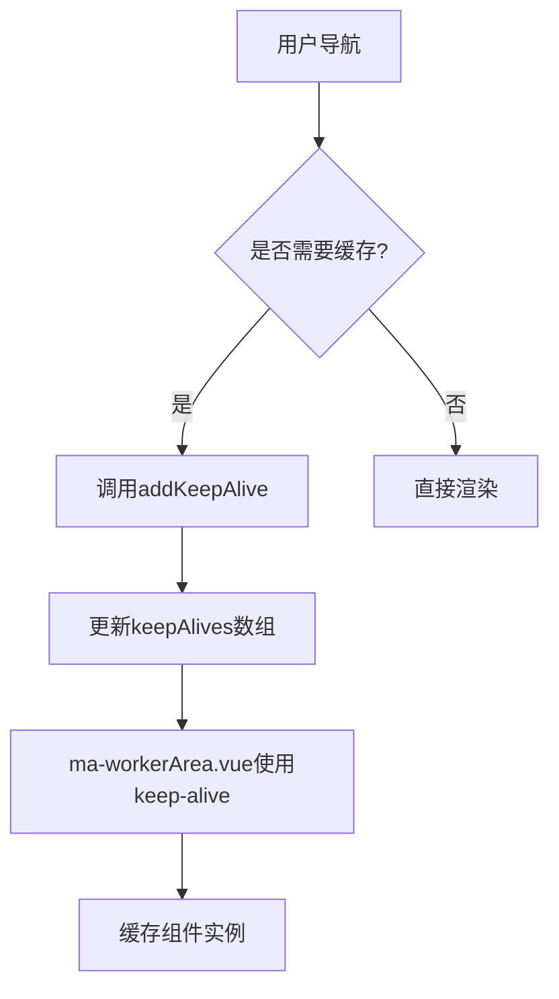
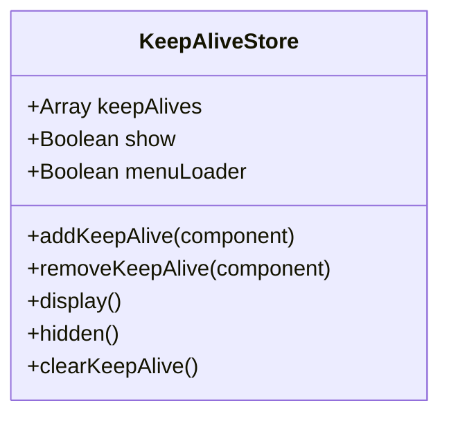
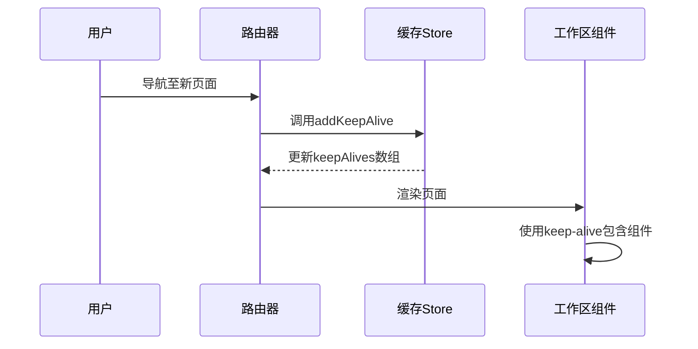
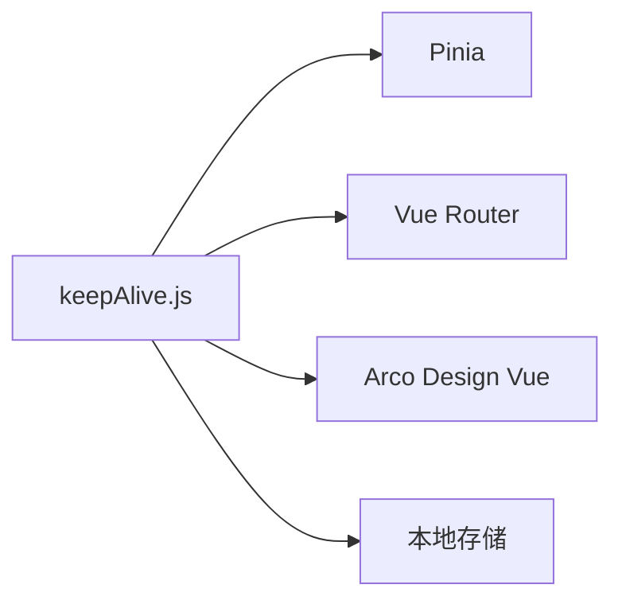

# 页面缓存管理

<cite>
**本文档引用文件**  
- [keepAlive.js](file://agx-admin/src/store/modules/keepAlive.js)
- [ma-workerArea.vue](file://agx-admin/src/layout/components/ma-workerArea.vue)
- [common.js](file://agx-admin/src/utils/common.js)
- [tag.js](file://agx-admin/src/store/modules/tag.js)
- [index.js](file://agx-admin/src/store/index.js)
- [webRouter.js](file://agx-admin/src/router/webRouter.js)
</cite>

## 目录
1. [简介](#简介)
2. [核心组件](#核心组件)
3. [架构概述](#架构概述)
4. [详细组件分析](#详细组件分析)
5. [依赖分析](#依赖分析)
6. [性能考虑](#性能考虑)
7. [故障排除指南](#故障排除指南)
8. [结论](#结论)

## 简介
本项目中的页面缓存管理模块通过Vue的keep-alive功能实现，旨在提升用户体验和页面响应速度。该模块通过维护缓存页面名称列表来控制哪些组件需要被缓存。系统利用Pinia状态管理库中的keepAlive store来跟踪和管理这些缓存页面，确保在用户导航时能够快速恢复页面状态。

## 核心组件

页面缓存管理的核心在于`keepAlive.js`文件中定义的store，它负责维护一个缓存组件名称的列表。通过`addKeepAlive`和`removeKeepAlive`方法，系统可以动态地添加或移除需要缓存的页面。此外，`ma-workerArea.vue`组件中的`<keep-alive>`标签使用了这个列表来决定哪些组件实例应该被保留。

**Section sources**
- [keepAlive.js](file://agx-admin/src/store/modules/keepAlive.js#L1-L42)
- [ma-workerArea.vue](file://agx-admin/src/layout/components/ma-workerArea.vue#L13-L17)

## 架构概述

整个页面缓存机制依赖于Vue Router与Pinia store的协同工作。当用户访问某个页面时，路由变化会触发相应的逻辑，将当前页面的信息加入到缓存列表中。如果页面被配置为需要缓存（即不在排除列表内），则其名称会被添加到`keepAlives`数组中。随后，在`ma-workerArea.vue`中，`<keep-alive>`组件根据这个数组来决定是否缓存对应的组件实例。

**Diagram sources**
- [keepAlive.js](file://agx-admin/src/store/modules/keepAlive.js#L18-L38)
- [ma-workerArea.vue](file://agx-admin/src/layout/components/ma-workerArea.vue#L15-L17)

## 详细组件分析

### keepAlive Store 分析
`keepAlive` store是整个缓存机制的核心，它维护了一个名为`keepAlives`的状态变量，用于存储需要被缓存的组件名称。通过`addKeepAlive`方法，可以向此列表添加新的组件名；而`removeKeepAlive`则允许从列表中移除指定的组件名。此外，还有`clearKeepAlive`方法用于清空整个缓存列表。

#### 方法工作机制
- **addKeepAlive**: 检查传入的组件路径是否包含'maIframe'，如果是，则不进行任何操作。否则检查该组件名称是否已存在于`keepAlives`数组中，若不存在，则将其添加进去。
- **removeKeepAlive**: 查找给定组件名称在`keepAlives`数组中的索引位置，并移除该元素。
- **display/hidden**: 控制`show`标志位，影响`<keep-alive>`组件的行为。

**Diagram sources**
- [keepAlive.js](file://agx-admin/src/store/modules/keepAlive.js#L3-L39)

**Section sources**
- [keepAlive.js](file://agx-admin/src/store/modules/keepAlive.js#L1-L42)

### ma-workerArea.vue 组件分析
`ma-workerArea.vue`组件负责实际应用`<keep-alive>`功能。它通过`useKeepAliveStore`获取`keepAlives`数组，并将其作为`include`属性传递给`<keep-alive>`标签。这样就实现了只有列表中的组件才会被缓存的功能。

#### 缓存激活与销毁过程
当用户访问一个新页面时，如果该页面需要被缓存，那么它的名称将被添加到`keepAlives`数组中。此时，`ma-workerArea.vue`会检测到这一变化，并使`<keep-alive>`组件开始缓存该页面。相反，当用户离开该页面或者手动关闭标签页时，对应的名字将从数组中移除，导致`<keep-alive>`停止对该页面的缓存。

**Diagram sources**
- [ma-workerArea.vue](file://agx-admin/src/layout/components/ma-workerArea.vue#L13-L17)
- [keepAlive.js](file://agx-admin/src/store/modules/keepAlive.js#L18-L25)

**Section sources**
- [ma-workerArea.vue](file://agx-admin/src/layout/components/ma-workerArea.vue#L1-L30)

## 依赖分析

页面缓存管理模块依赖于多个其他模块和库，包括Pinia用于状态管理、Vue Router处理路由逻辑以及Arco Design Vue提供UI组件。此外，还依赖于本地存储来持久化标签页信息，确保即使刷新浏览器后也能恢复之前的会话状态。

**Diagram sources**
- [keepAlive.js](file://agx-admin/src/store/modules/keepAlive.js#L1-L42)
- [tag.js](file://agx-admin/src/store/modules/tag.js#L1-L71)

**Section sources**
- [keepAlive.js](file://agx-admin/src/store/modules/keepAlive.js#L1-L42)
- [tag.js](file://agx-admin/src/store/modules/tag.js#L1-L71)

## 性能考虑

为了优化内存使用并避免潜在的内存泄漏问题，建议实施以下策略：
- 设置合理的缓存上限，防止过多页面被缓存导致内存占用过高。
- 对于不需要长期保持状态的页面，应明确排除在缓存之外。
- 定期清理不再使用的缓存条目，特别是在用户长时间未活动之后。

## 故障排除指南

遇到页面缓存相关的问题时，首先检查`keepAlives`数组的内容是否正确反映了预期的缓存页面。同时确认`ma-workerArea.vue`中的`<keep-alive>`组件是否正确接收到了最新的`keepAlives`列表。如果发现某些页面未能正确缓存，请检查它们的路由配置是否有特殊设置阻止了缓存行为。

**Section sources**
- [keepAlive.js](file://agx-admin/src/store/modules/keepAlive.js#L18-L38)
- [ma-workerArea.vue](file://agx-admin/src/layout/components/ma-workerArea.vue#L15-L17)

## 结论

通过深入分析`keepAlive.js`及其相关组件，我们了解了如何有效地利用Vue的keep-alive特性来提升Web应用的性能和用户体验。合理配置缓存策略不仅能够加快页面加载速度，还能减少服务器负担。未来的工作可以集中在进一步优化缓存算法上，比如引入LRU（最近最少使用）淘汰机制等高级技术。