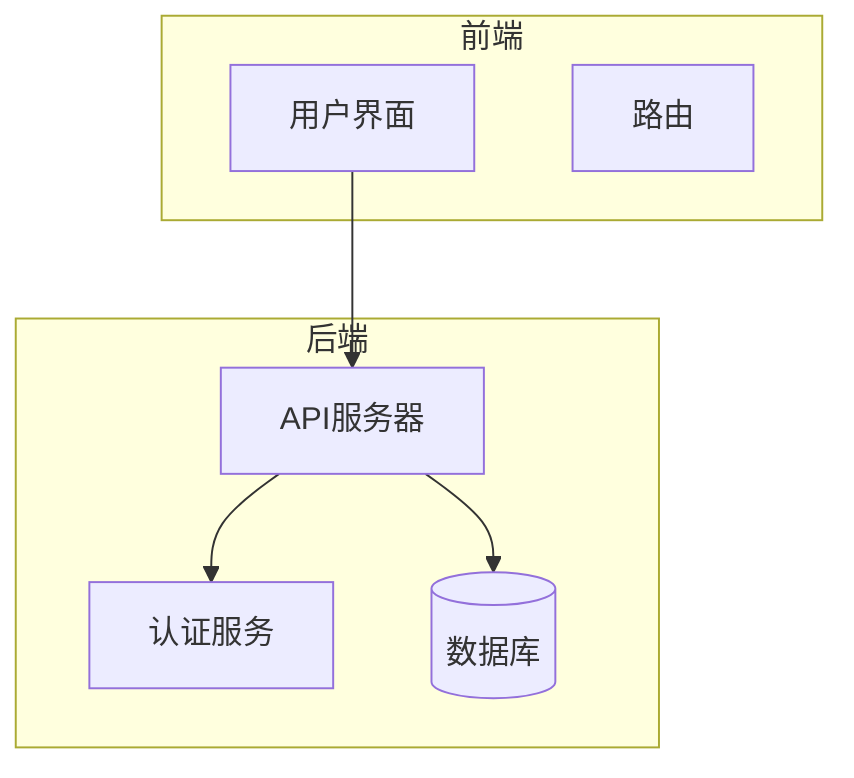
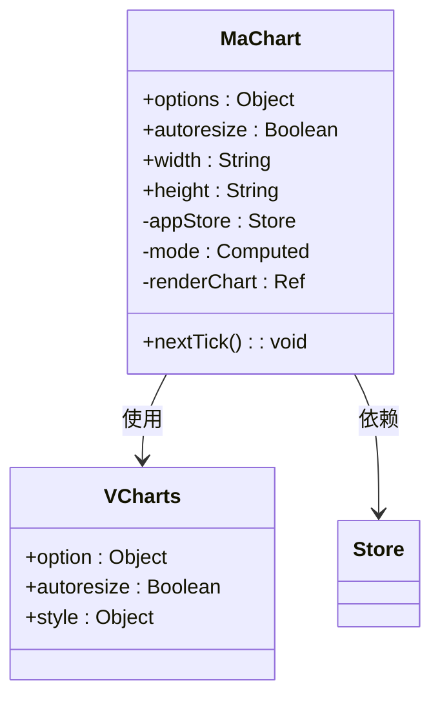
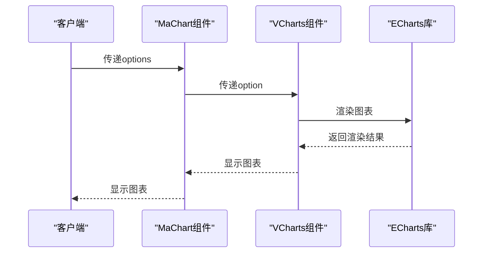
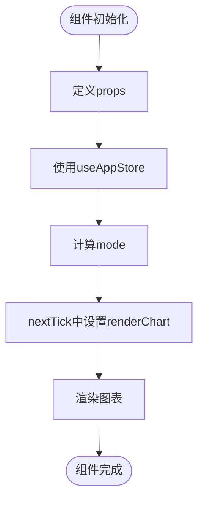
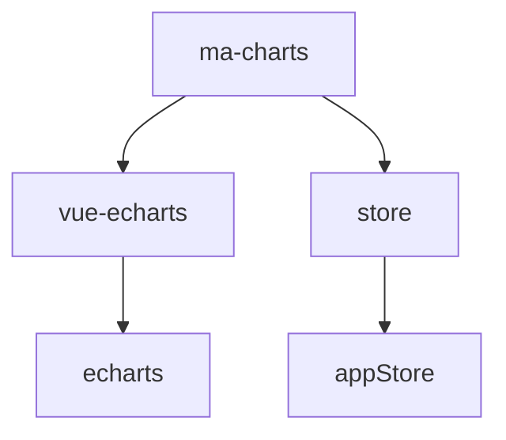

# ma-charts组件

<cite>
**本文档引用文件**  
- [ma-charts/index.vue](file://agx-admin/src/components/ma-charts/index.vue)
- [index.js](file://agx-admin/src/components/index.js)
- [st-loginChart.vue](file://agx-admin/src/views/dashboard/components/components/st-loginChart.vue)
- [common.js](file://agx-admin/src/utils/common.js)
- [st-count.vue](file://agx-admin/src/views/dashboard/components/components/st-count.vue)
</cite>

## 目录
1. [简介](#简介)
2. [项目结构](#项目结构)
3. [核心组件](#核心组件)
4. [架构概述](#架构概述)
5. [详细组件分析](#详细组件分析)
6. [依赖分析](#依赖分析)
7. [性能考虑](#性能考虑)
8. [故障排除指南](#故障排除指南)
9. [结论](#结论)

## 简介
ma-charts组件是MineAdmin框架中的一个数据可视化组件，用于在仪表板中渲染各种图表，如柱状图、折线图和饼图。该组件基于ECharts库构建，提供了丰富的配置选项来驱动图表的渲染，并支持动态数据更新、交互事件处理、主题切换和响应式布局。

## 项目结构
ma-charts组件位于`agx-admin/src/components/ma-charts/`目录下，主要由`index.vue`文件构成。该组件通过`vue-echarts`封装了ECharts的功能，使得在Vue应用中使用ECharts更加方便。

**图表来源**
- [ma-charts/index.vue](file://agx-admin/src/components/ma-charts/index.vue#L1-L60)

**章节来源**
- [ma-charts/index.vue](file://agx-admin/src/components/ma-charts/index.vue#L1-L60)
- [index.js](file://agx-admin/src/components/index.js#L1-L59)

## 核心组件
ma-charts组件的核心功能是通过`options`属性接收ECharts的配置项，从而驱动图表的渲染。组件支持自动调整大小、宽度和高度的自定义设置。

**章节来源**
- [ma-charts/index.vue](file://agx-admin/src/components/ma-charts/index.vue#L24-L43)

## 架构概述
ma-charts组件利用`vue-echarts`作为底层库，实现了对ECharts的封装。通过`useAppStore`获取应用状态，根据当前模式（暗色或亮色）调整图表的显示效果。组件在`nextTick`中设置`renderChart`为`true`，确保图表在DOM更新后渲染。

**图表来源**
- [ma-charts/index.vue](file://agx-admin/src/components/ma-charts/index.vue#L20-L55)

**章节来源**
- [ma-charts/index.vue](file://agx-admin/src/components/ma-charts/index.vue#L20-L55)
- [index.js](file://agx-admin/src/components/index.js#L1-L59)

## 详细组件分析

### ma-charts组件分析
ma-charts组件通过`props`接收`options`、`autoresize`、`width`和`height`等属性，其中`options`是ECharts的配置项，决定了图表的类型和样式。组件通过`computed`属性`mode`根据应用的当前模式（暗色或亮色）调整图表的显示效果。

#### 对象导向组件

**图表来源**
- [ma-charts/index.vue](file://agx-admin/src/components/ma-charts/index.vue#L20-L55)

#### API/服务组件

**图表来源**
- [ma-charts/index.vue](file://agx-admin/src/components/ma-charts/index.vue#L11-L16)

#### 复杂逻辑组件

**图表来源**
- [ma-charts/index.vue](file://agx-admin/src/components/ma-charts/index.vue#L53-L55)

**章节来源**
- [ma-charts/index.vue](file://agx-admin/src/components/ma-charts/index.vue#L1-L59)

### st-loginChart组件分析
st-loginChart组件展示了如何在实际应用中使用ma-charts组件。该组件通过`loginChartOptions`配置项定义了一个折线图，用于显示登录次数的变化趋势。组件还使用了`graphicFactory`函数生成图表的文本元素。

**章节来源**
- [st-loginChart.vue](file://agx-admin/src/views/dashboard/components/components/st-loginChart.vue#L1-L176)

## 依赖分析
ma-charts组件依赖于`vue-echarts`和`echarts`库，通过`use`函数注册了所需的图表类型和组件。此外，组件还依赖于`@/store`中的`useAppStore`来获取应用状态。

**图表来源**
- [index.js](file://agx-admin/src/components/index.js#L1-L39)

**章节来源**
- [index.js](file://agx-admin/src/components/index.js#L1-L59)
- [ma-charts/index.vue](file://agx-admin/src/components/ma-charts/index.vue#L21-L22)

## 性能考虑
为了提高性能，ma-charts组件在`nextTick`中设置`renderChart`为`true`，确保图表在DOM更新后渲染。此外，组件支持`autoresize`属性，可以自动调整图表大小以适应容器变化。

## 故障排除指南
如果图表无法正常显示，请检查以下几点：
1. 确保`options`属性正确传递了ECharts的配置项。
2. 检查`width`和`height`属性是否设置了合适的值。
3. 确认`autoresize`属性是否设置为`true`，以便图表能够自动调整大小。
4. 查看浏览器控制台是否有错误信息。

**章节来源**
- [ma-charts/index.vue](file://agx-admin/src/components/ma-charts/index.vue#L53-L55)
- [st-loginChart.vue](file://agx-admin/src/views/dashboard/components/components/st-loginChart.vue#L1-L176)

## 结论
ma-charts组件是一个功能强大的数据可视化工具，通过简单的配置即可实现复杂的图表渲染。结合st-loginChart等实例，可以轻松地在仪表板中集成各种图表，提供直观的数据展示和交互体验。