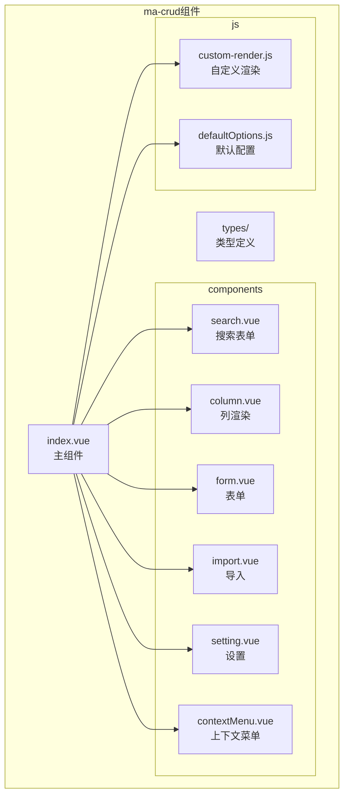
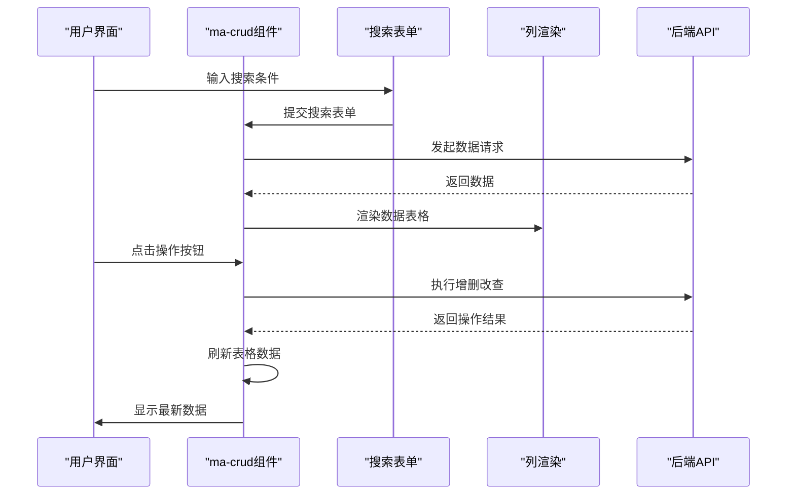
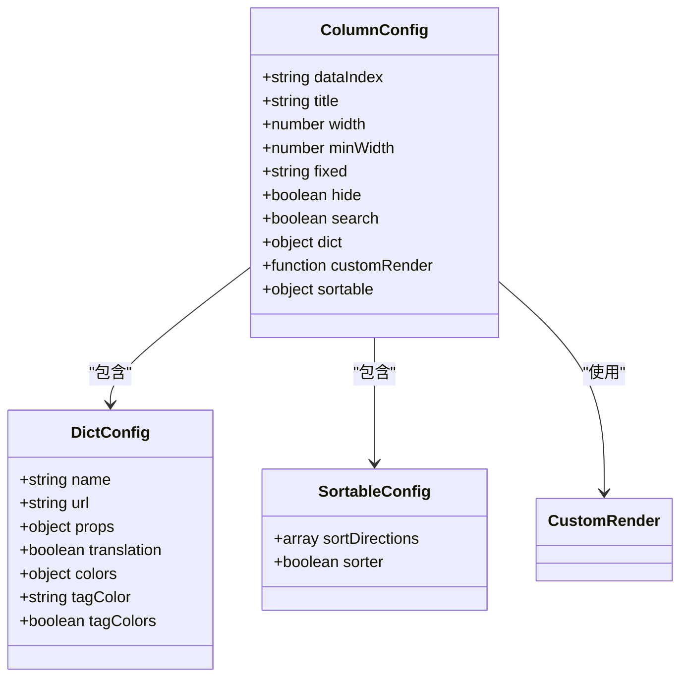
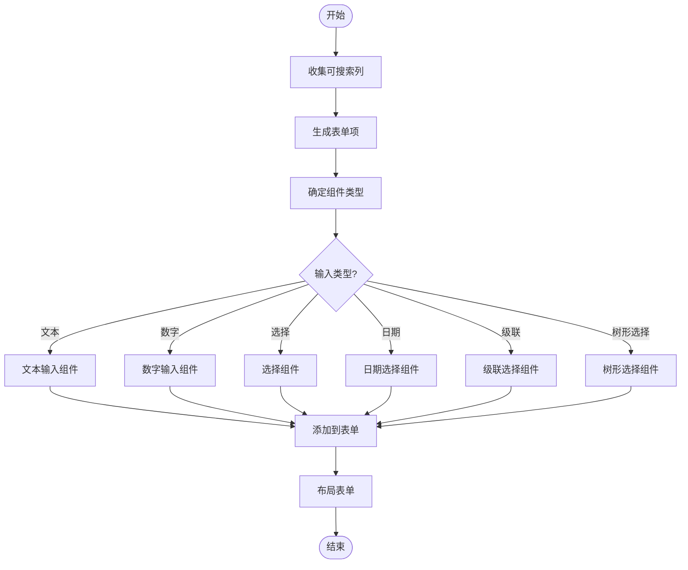
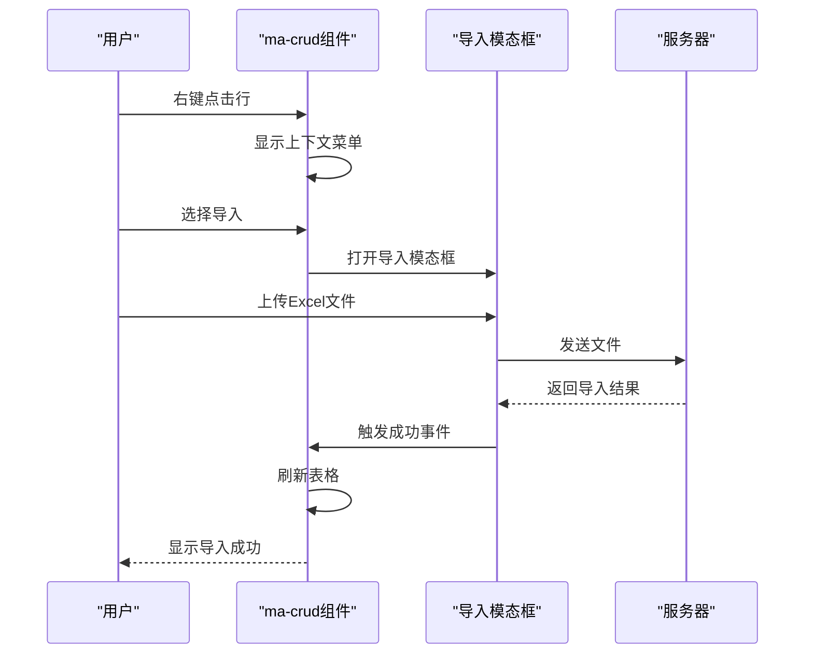
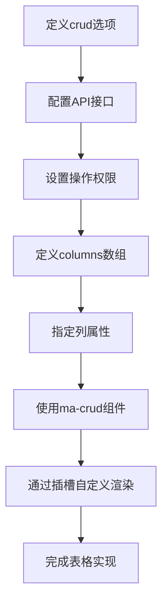
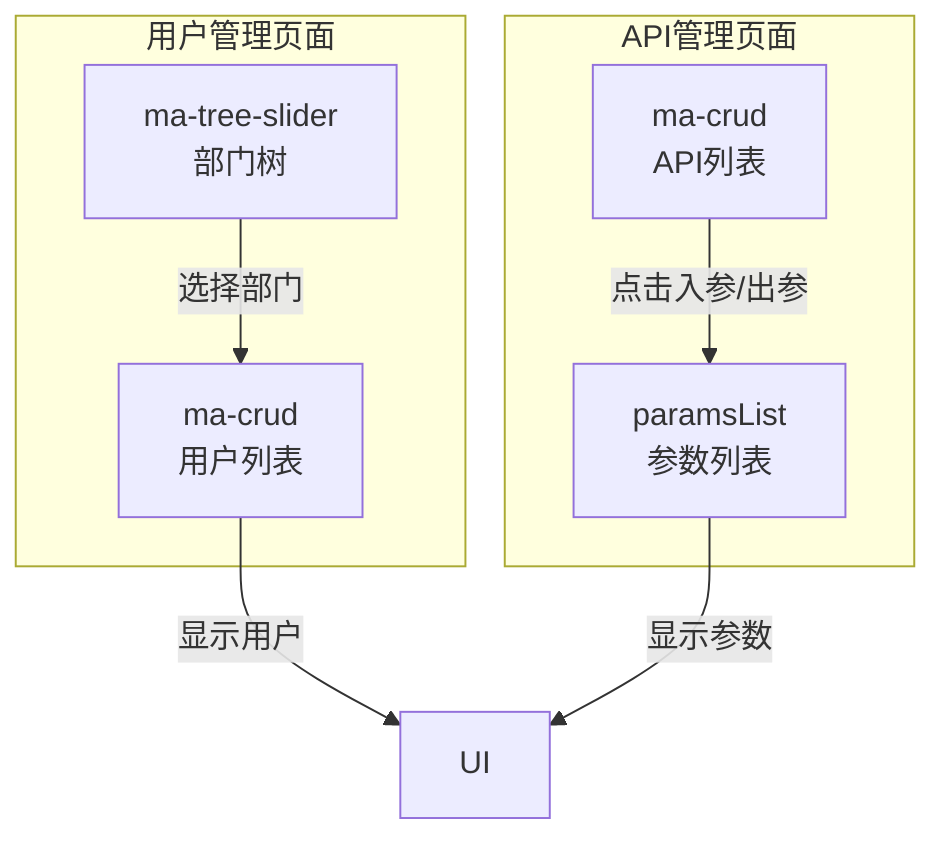
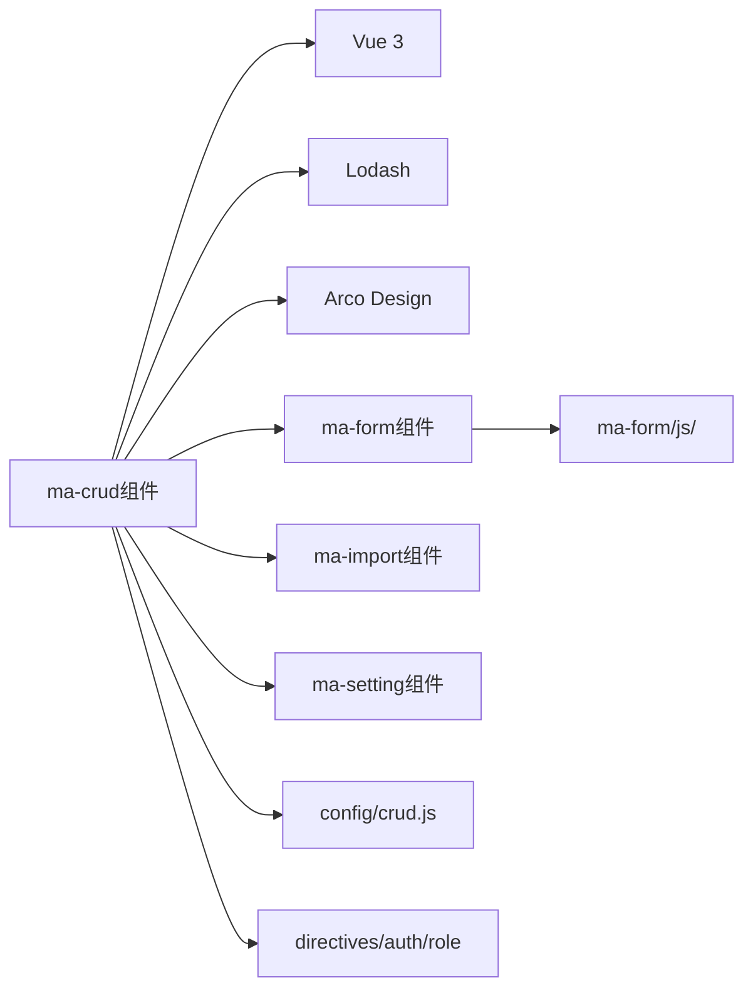

# ma-crud组件

<cite>
**本文档引用文件**   
- [index.vue](file://agx-admin/src/components/ma-crud/index.vue)
- [column.vue](file://agx-admin/src/components/ma-crud/components/column.vue)
- [search.vue](file://agx-admin/src/components/ma-crud/components/search.vue)
- [defaultOptions.js](file://agx-admin/src/components/ma-crud/js/defaultOptions.js)
- [custom-render.js](file://agx-admin/src/components/ma-crud/js/custom-render.js)
- [import.vue](file://agx-admin/src/components/ma-crud/components/import.vue)
- [contextMenu.vue](file://agx-admin/src/components/ma-crud/components/contextMenu.vue)
- [setting.vue](file://agx-admin/src/components/ma-crud/components/setting.vue)
- [user/index.vue](file://agx-admin/src/views/system/user/index.vue)
- [api/index.vue](file://agx-admin/src/views/system/api/index.vue)
</cite>

## 目录
1. [简介](#简介)
2. [项目结构](#项目结构)
3. [核心组件](#核心组件)
4. [架构概述](#架构概述)
5. [详细组件分析](#详细组件分析)
6. [依赖分析](#依赖分析)
7. [性能考虑](#性能考虑)
8. [故障排除指南](#故障排除指南)
9. [结论](#结论)

## 简介
ma-crud组件是MineAdmin管理后台的核心数据表格组件，为快速构建Web应用提供了解决方案。该组件提供了完整的增删改查功能，支持动态列渲染、排序、筛选、批量操作、分页控制、上下文菜单及导入导出等高级功能。通过灵活的column配置系统和search组件，开发者可以轻松构建复杂的管理界面。组件设计遵循模块化原则，通过提供defaultOptions.js中的全局配置和custom-render.js中的自定义渲染机制，既满足了通用需求，又为高级开发者提供了深度定制的可能性。

## 项目结构
ma-crud组件位于`/src/components/ma-crud/`目录下，采用清晰的模块化结构。组件主要由核心index.vue文件和多个子组件构成，每个子组件负责特定功能。js目录包含可扩展的逻辑文件，types目录定义了类型约束。这种结构使得组件既保持了内聚性，又具有良好的可维护性和可扩展性。

**图源**
- [index.vue](file://agx-admin/src/components/ma-crud/index.vue)
- [components/](file://agx-admin/src/components/ma-crud/components/)
- [js/](file://agx-admin/src/components/ma-crud/js/)

**本节来源**
- [index.vue](file://agx-admin/src/components/ma-crud/index.vue)
- [components/](file://agx-admin/src/components/ma-crud/components/)

## 核心组件
ma-crud组件的核心功能围绕数据表格的展示与交互展开。通过`options`配置对象控制整体行为，`columns`数组定义列的显示与行为。组件提供了丰富的操作按钮，包括新增、删除、导入、导出等，并支持回收站模式下的数据恢复。分页控制支持固定布局和标准布局两种模式，可根据应用场景灵活选择。组件通过provide/inject机制向子组件传递配置和数据，确保了配置的一致性和数据流的清晰性。

**本节来源**
- [index.vue](file://agx-admin/src/components/ma-crud/index.vue#L1-L880)

## 架构概述
ma-crud组件采用基于Vue 3的组合式API架构，通过响应式系统管理组件状态。组件通过props接收外部配置，通过defineExpose暴露内部方法供外部调用。整个组件形成了一个完整的数据流闭环：搜索表单收集查询条件，主组件发起数据请求，列组件负责数据渲染，操作按钮触发增删改查动作，最后通过回调刷新数据。这种架构设计使得组件既独立又可集成，能够很好地适应不同的业务场景。

**图源**
- [index.vue](file://agx-admin/src/components/ma-crud/index.vue#L1-L880)
- [components/search.vue](file://agx-admin/src/components/ma-crud/components/search.vue)
- [components/column.vue](file://agx-admin/src/components/ma-crud/components/column.vue)

## 详细组件分析

### column配置系统分析
column配置系统是ma-crud组件的核心，它驱动着动态列渲染、排序、筛选和操作按钮的生成。每个列配置对象包含丰富的属性，如`dataIndex`、`title`、`width`、`fixed`等，用于控制列的显示行为。通过`customRender`属性，可以实现完全自定义的渲染逻辑。系统还支持字典转换，通过`dict`属性自动将数值转换为可读的文本标签，并支持标签颜色配置。

**图源**
- [column.vue](file://agx-admin/src/components/ma-crud/components/column.vue#L1-L335)
- [index.vue](file://agx-admin/src/components/ma-crud/index.vue#L1-L880)

#### 搜索组件分析
搜索组件负责构建复杂的查询表单，并集成多种输入控件。通过分析column配置中的`search`属性，自动为标记为可搜索的列生成相应的表单项。组件支持多种输入类型，包括文本输入、选择器、日期选择器、级联选择器等，并能根据`formType`自动选择合适的表单项。搜索表单采用响应式网格布局，可通过`searchColNumber`配置每行显示的列数。

**图源**
- [search.vue](file://agx-admin/src/components/ma-crud/components/search.vue#L1-L198)
- [components/searchFormItem/](file://agx-admin/src/components/ma-crud/components/searchFormItem/)

#### 批量操作与分页控制分析
ma-crud组件提供了完善的批量操作和分页控制机制。通过`rowSelection`配置启用行选择功能，结合`selecteds`响应式变量跟踪选中的行。批量删除操作通过`deletesMultipleAction`方法实现，先验证选择状态，然后调用删除API，最后刷新数据。分页控制支持两种模式：当`tablePagination`为true时使用内置分页，否则使用自定义分页组件。`pageSizeChangeHandler`和`pageChangeHandler`方法分别处理页大小和页码变化。

**本节来源**
- [index.vue](file://agx-admin/src/components/ma-crud/index.vue#L662-L678)
- [index.vue](file://agx-admin/src/components/ma-crud/index.vue#L556-L564)

#### 上下文菜单与导入导出功能分析
上下文菜单功能通过右键点击表格行触发，提供了一组快捷操作。菜单项通过`contextMenu`配置定义，支持打印、刷新、新增、编辑、删除等操作。导入功能通过`importAction`方法打开模态框，支持拖拽上传Excel文件，并可下载模板。导出功能通过`exportAction`方法实现，向服务器发送POST请求下载文件。

**图源**
- [contextMenu.vue](file://agx-admin/src/components/ma-crud/components/contextMenu.vue#L1-L159)
- [import.vue](file://agx-admin/src/components/ma-crud/components/import.vue#L1-L72)
- [index.vue](file://agx-admin/src/components/ma-crud/index.vue#L647-L660)

### 初学者使用示例
对于初学者，ma-crud组件提供了简单易用的API。以下是一个基础表格使用的示例：首先定义`crud`选项对象，配置API接口和操作权限；然后定义`columns`数组，指定每列的显示属性；最后在模板中使用`ma-crud`标签，并通过插槽自定义特殊列的渲染。

**本节来源**
- [user/index.vue](file://agx-admin/src/views/system/user/index.vue#L23-L61)
- [api/index.vue](file://agx-admin/src/views/system/api/index.vue#L13-L28)

### 高级开发者扩展机制分析
高级开发者可以通过多种方式扩展ma-crud组件的功能。`custom-render.js`文件提供了一个自定义渲染组件，允许开发者传入渲染函数来完全控制单元格的显示。`defaultOptions.js`文件定义了全局默认配置，开发者可以修改这些配置来改变组件的默认行为。此外，组件暴露了丰富的API方法，如`getColumnService`，可用于在运行时动态修改列配置。

**本节来源**
- [custom-render.js](file://agx-admin/src/components/ma-crud/js/custom-render.js#L1-L17)
- [defaultOptions.js](file://agx-admin/src/components/ma-crud/js/defaultOptions.js#L1-L300)
- [index.vue](file://agx-admin/src/components/ma-crud/index.vue#L859-L866)

### 实际页面组合用法分析
在实际应用中，ma-crud组件与其他组件组合使用，构建完整的管理页面。以用户管理页面为例，左侧使用`ma-tree-slider`组件显示部门树，右侧使用`ma-crud`组件显示用户列表。通过`switchDept`方法，实现部门切换时自动刷新用户列表。API管理页面则通过`operationBeforeExtend`插槽添加"入参"和"出参"链接，点击后打开参数列表模态框。

**图源**
- [user/index.vue](file://agx-admin/src/views/system/user/index.vue#L13-L21)
- [api/index.vue](file://agx-admin/src/views/system/api/index.vue#L13-L30)

#### 大数据量性能优化建议
对于大数据量的场景，ma-crud组件提供了多种性能优化建议。首先，启用`pageLayout: 'fixed'`配置，实现固定高度的表格布局，避免页面滚动时的重排。其次，合理配置`scroll`属性，启用虚拟滚动。此外，通过`requestParams`手动控制请求参数，实现更精细的数据加载策略。最后，利用`getColumnService`方法在运行时动态调整列配置，减少不必要的列渲染。

**本节来源**
- [user/index.vue](file://agx-admin/src/views/system/user/index.vue#L166)
- [index.vue](file://agx-admin/src/components/ma-crud/index.vue#L270)
- [index.vue](file://agx-admin/src/components/ma-crud/index.vue#L859-L866)

## 依赖分析
ma-crud组件依赖于多个外部库和内部模块。主要依赖包括Vue 3的组合式API、Lodash工具库、Arco Design UI组件库。内部依赖包括ma-form组件用于表单操作、ma-import组件用于文件导入、ma-setting组件用于表格设置。通过`@cps/ma-form/js/`路径导入的网络请求和事件处理模块，实现了与表单系统的深度集成。

**图源**
- [index.vue](file://agx-admin/src/components/ma-crud/index.vue#L261-L275)
- [package.json](file://agx-admin/package.json)

**本节来源**
- [index.vue](file://agx-admin/src/components/ma-crud/index.vue#L261-L275)
- [package.json](file://agx-admin/package.json)

## 性能考虑
ma-crud组件在设计时充分考虑了性能因素。通过`reloadColumn`和`tableIsShow`响应式变量控制列的重新渲染，避免不必要的DOM操作。使用`provide/inject`机制传递数据，减少了props的层层传递。在大数据量场景下，建议使用固定布局模式，通过`settingFixedPage`方法精确控制表格高度，避免页面重排。对于频繁更新的场景，合理使用`requestSuccess`回调，避免不必要的数据刷新。

**本节来源**
- [index.vue](file://agx-admin/src/components/ma-crud/index.vue#L299-L300)
- [index.vue](file://agx-admin/src/components/ma-crud/index.vue#L581-L585)
- [index.vue](file://agx-admin/src/components/ma-crud/index.vue#L591-L601)

## 故障排除指南
常见问题包括搜索表单不显示、列配置不生效、数据刷新失败等。对于搜索表单问题，检查column配置中的`search`属性是否正确设置。对于列配置问题，确保`dataIndex`唯一且正确。数据刷新失败时，检查API接口是否返回正确的数据结构。调试时可利用`defineExpose`暴露的方法，如`refresh`、`requestData`等，在控制台手动调用进行测试。

**本节来源**
- [index.vue](file://agx-admin/src/components/ma-crud/index.vue#L518-L537)
- [index.vue](file://agx-admin/src/components/ma-crud/index.vue#L864-L866)

## 结论
ma-crud组件是一个功能强大且灵活的管理后台数据表格组件。通过深入分析其column配置系统、搜索组件、批量操作、分页控制等核心机制，我们可以看到它为开发者提供了从基础使用到高级定制的完整解决方案。组件的设计体现了良好的架构思想，通过模块化、响应式系统和清晰的数据流，实现了高内聚低耦合。对于初学者，提供了简单易用的API；对于高级开发者，通过custom-render.js和defaultOptions.js提供了深度扩展的可能性。结合用户管理、API管理等实际页面的使用示例，展示了组件在真实项目中的组合用法。通过遵循性能优化建议，可以确保组件在大数据量场景下的流畅运行。