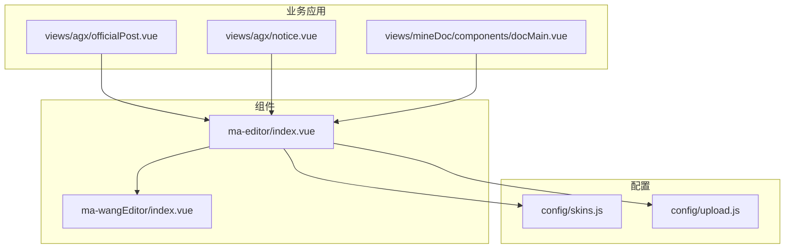
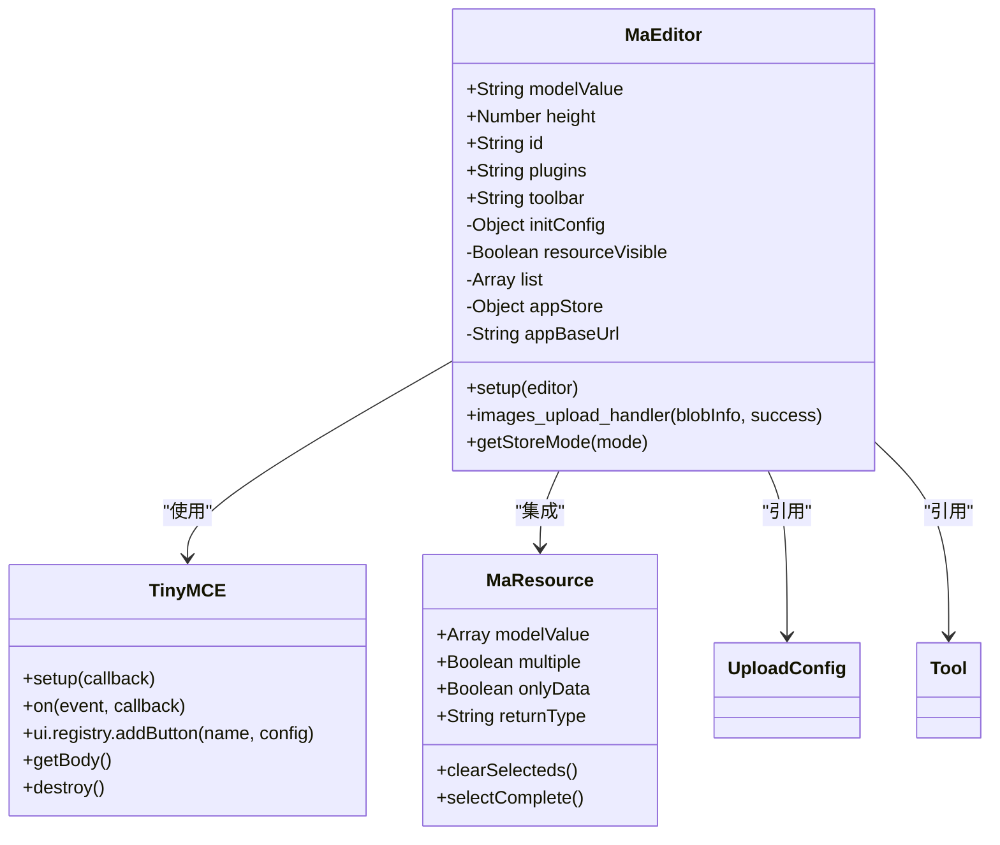
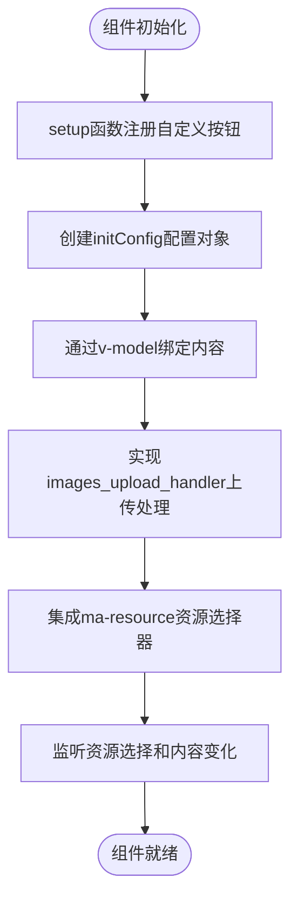
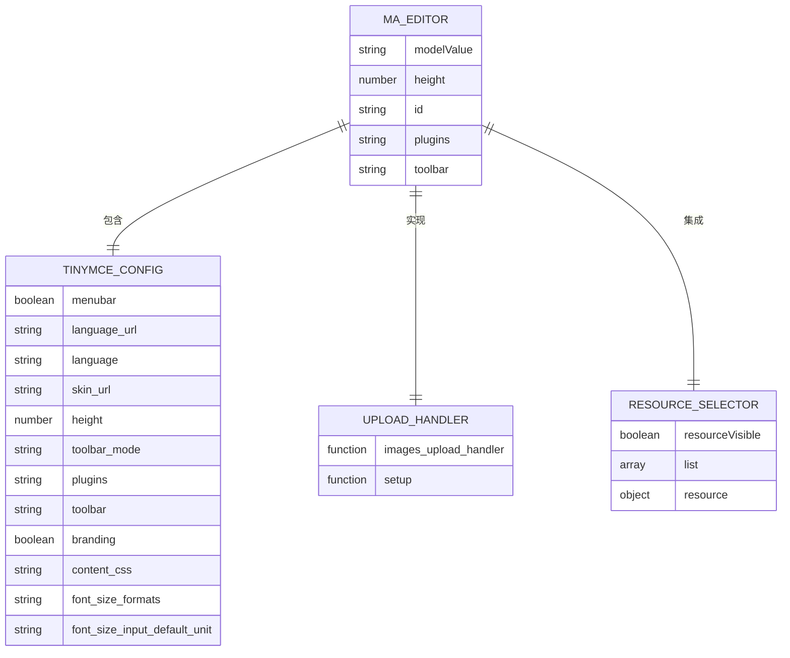
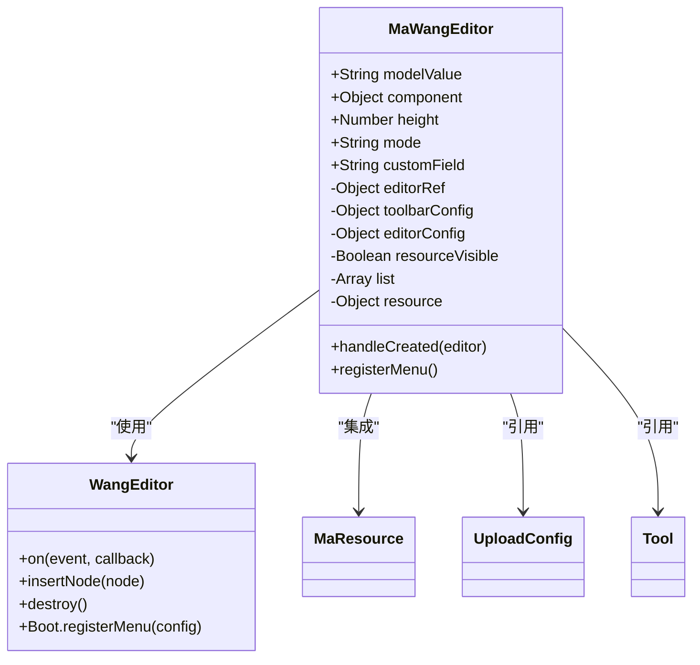
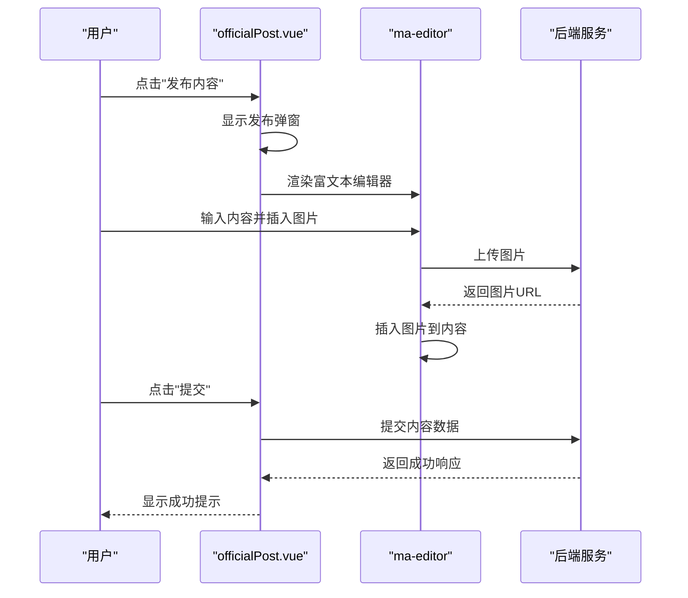
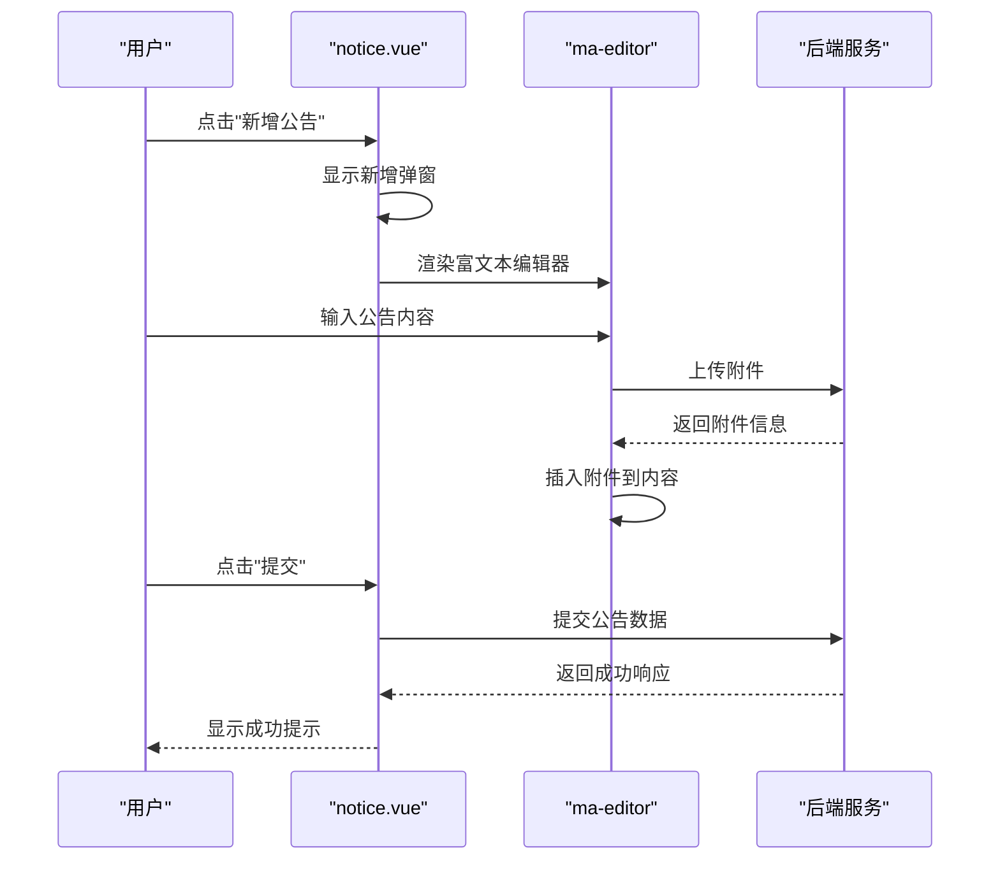
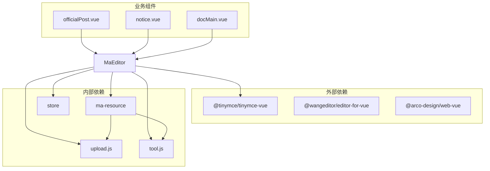

# ma-editor组件

<cite>
**本文档引用文件**   
- [index.vue](file://agx-admin/src/components/ma-editor/index.vue)
- [skins.js](file://agx-admin/src/config/skins.js)
- [docMain.vue](file://agx-admin/src/views/mineDoc/components/docMain.vue)
- [officialPost.vue](file://agx-admin/src/views/agx/officialPost.vue)
- [notice.vue](file://agx-admin/src/views/agx/notice.vue)
- [ma-wangEditor/index.vue](file://agx-admin/src/components/ma-wangEditor/index.vue)
- [upload.js](file://agx-admin/src/config/upload.js)
- [tool.js](file://agx-admin/src/utils/tool.js)
- [utils.js](file://agx-admin/src/components/ma-upload/js/utils.js)
- [ma-resource/index.vue](file://agx-admin/src/components/ma-resource/index.vue)
</cite>

## 目录
1. [简介](#简介)
2. [项目结构](#项目结构)
3. [核心组件](#核心组件)
4. [架构概述](#架构概述)
5. [详细组件分析](#详细组件分析)
6. [依赖分析](#依赖分析)
7. [性能考虑](#性能考虑)
8. [故障排除指南](#故障排除指南)
9. [结论](#结论)

## 简介
ma-editor组件是MineAdmin框架中的富文本编辑器核心组件，提供基于TinyMCE和wangEditor的多编辑器内核支持。该组件通过统一的调用接口，实现了内容格式化、图片/附件插入、HTML转义、自定义插件扩展等核心功能。组件广泛应用于官方帖子、公告编辑等业务场景，支持通过skins.js进行编辑器主题定制和public/tinymce资源路径配置。同时，组件集成了XSS过滤、内容长度限制等安全防护机制，并提供了性能优化建议。

## 项目结构
ma-editor组件位于`agx-admin/src/components/ma-editor/`目录下，作为独立的Vue组件实现。组件通过TinyMCE作为主要编辑器内核，同时支持wangEditor作为替代方案。相关配置文件分布在`agx-admin/src/config/`目录下，包括skins.js主题配置和upload.js上传配置。业务场景应用主要在`agx-admin/src/views/`目录下的官方帖子、公告等页面中。

**图表来源**
- [index.vue](file://agx-admin/src/components/ma-editor/index.vue)
- [skins.js](file://agx-admin/src/config/skins.js)
- [upload.js](file://agx-admin/src/config/upload.js)
- [officialPost.vue](file://agx-admin/src/views/agx/officialPost.vue)
- [notice.vue](file://agx-admin/src/views/agx/notice.vue)
- [docMain.vue](file://agx-admin/src/views/mineDoc/components/docMain.vue)

**章节来源**
- [index.vue](file://agx-admin/src/components/ma-editor/index.vue#L1-L156)
- [project_structure](file://agx-admin/)

## 核心组件
ma-editor组件的核心实现位于`ma-editor/index.vue`文件中，基于TinyMCE构建。组件通过props接收高度、ID、插件和工具栏配置等参数，并通过v-model实现双向数据绑定。组件集成了资源选择器功能，允许用户从已上传的资源中选择图片和附件。初始化配置中包含了语言、皮肤、字体大小等设置，并通过setup函数注册了自定义的"资源选择器"按钮。

**章节来源**
- [index.vue](file://agx-admin/src/components/ma-editor/index.vue#L1-L156)

## 架构概述
ma-editor组件采用基于TinyMCE的架构，通过Vue的setup语法糖实现响应式编程。组件通过import引入TinyMCE的各个模块和插件，包括advlist、anchor、autolink等。初始化配置对象initConfig包含了编辑器的所有配置项，如菜单栏显隐、语言、皮肤、高度、工具栏模式、插件、工具栏、品牌标识、内容CSS等。组件通过watch监听资源选择和内容变化，实现动态更新。

**图表来源**
- [index.vue](file://agx-admin/src/components/ma-editor/index.vue#L1-L156)
- [upload.js](file://agx-admin/src/config/upload.js)
- [tool.js](file://agx-admin/src/utils/tool.js)

## 详细组件分析

### ma-editor组件分析
ma-editor组件通过Vue 3的composition API实现，使用ref和reactive创建响应式数据。组件的主要功能包括：

1. **双向数据绑定**：通过computed属性实现v-model的双向绑定，get方法返回props.modelValue，set方法触发update:modelValue事件。
2. **初始化配置**：initConfig对象包含编辑器的所有配置项，包括语言、皮肤、高度、插件、工具栏等。
3. **资源选择器**：通过a-modal实现资源选择器弹窗，集成ma-resource组件实现资源选择功能。
4. **图片上传处理**：通过images_upload_handler实现图片上传，调用uploadRequest进行文件上传，并返回处理后的URL。
5. **自定义按钮**：通过setup函数注册"资源选择器"按钮，点击时显示资源选择器弹窗。

#### 组件交互流程

**图表来源**
- [index.vue](file://agx-admin/src/components/ma-editor/index.vue#L1-L156)

#### 对象关系图

**图表来源**
- [index.vue](file://agx-admin/src/components/ma-editor/index.vue#L1-L156)

**章节来源**
- [index.vue](file://agx-admin/src/components/ma-editor/index.vue#L1-L156)

### wangEditor支持分析
项目中还提供了ma-wangEditor组件，作为TinyMCE的替代方案。该组件同样实现了富文本编辑功能，但使用wangEditor作为编辑器内核。通过对比两个组件的实现，可以看出项目支持多编辑器内核的设计理念。

**图表来源**
- [ma-wangEditor/index.vue](file://agx-admin/src/components/ma-wangEditor/index.vue#L1-L189)

### 业务场景应用分析
ma-editor组件在多个业务场景中得到应用，包括官方帖子发布、公告管理等。

#### 官方帖子发布场景

**图表来源**
- [officialPost.vue](file://agx-admin/src/views/agx/officialPost.vue#L1-L280)
- [index.vue](file://agx-admin/src/components/ma-editor/index.vue#L1-L156)

#### 公告管理场景

**图表来源**
- [notice.vue](file://agx-admin/src/views/agx/notice.vue#L1-L234)
- [index.vue](file://agx-admin/src/components/ma-editor/index.vue#L1-L156)

**章节来源**
- [officialPost.vue](file://agx-admin/src/views/agx/officialPost.vue#L1-L280)
- [notice.vue](file://agx-admin/src/views/agx/notice.vue#L1-L234)

## 依赖分析
ma-editor组件依赖多个外部库和内部模块，形成了复杂的依赖关系网络。

**图表来源**
- [index.vue](file://agx-admin/src/components/ma-editor/index.vue#L1-L156)
- [ma-resource/index.vue](file://agx-admin/src/components/ma-resource/index.vue#L1-L287)
- [upload.js](file://agx-admin/src/config/upload.js)
- [tool.js](file://agx-admin/src/utils/tool.js)

**章节来源**
- [index.vue](file://agx-admin/src/components/ma-editor/index.vue#L1-L156)
- [ma-resource/index.vue](file://agx-admin/src/components/ma-resource/index.vue#L1-L287)
- [upload.js](file://agx-admin/src/config/upload.js)
- [tool.js](file://agx-admin/src/utils/tool.js)

## 性能考虑
ma-editor组件在性能方面有以下考虑：

1. **按需加载**：通过import引入TinyMCE的各个模块和插件，实现按需加载，减少初始加载体积。
2. **资源管理**：通过ma-resource组件实现资源的统一管理和选择，避免重复上传。
3. **内存管理**：在组件销毁时调用editor.destroy()方法，释放编辑器占用的内存。
4. **异步处理**：图片上传处理使用async/await实现异步处理，避免阻塞主线程。
5. **配置优化**：通过配置plugins和toolbar参数，只加载必要的插件和工具栏按钮，减少不必要的功能。

## 故障排除指南
在使用ma-editor组件时可能遇到以下常见问题及解决方案：

1. **编辑器不显示**：检查是否正确引入了TinyMCE的相关CSS和JS文件，确保public/tinymce目录下的资源文件存在。
2. **图片上传失败**：检查upload.js中的存储配置是否正确，确保后端上传接口可用。
3. **资源选择器不工作**：检查ma-resource组件是否正确集成，确保commonApi.getResourceList接口返回正确数据。
4. **中文显示乱码**：检查language_url配置是否正确指向zh_CN.js文件。
5. **自定义按钮不显示**：检查setup函数中注册按钮的代码是否正确执行，确保按钮key值唯一。

**章节来源**
- [index.vue](file://agx-admin/src/components/ma-editor/index.vue#L1-L156)
- [upload.js](file://agx-admin/src/config/upload.js)
- [tool.js](file://agx-admin/src/utils/tool.js)
- [ma-resource/index.vue](file://agx-admin/src/components/ma-resource/index.vue#L1-L287)

## 结论
ma-editor组件是一个功能丰富、架构清晰的富文本编辑器组件，通过TinyMCE和wangEditor双内核支持，提供了灵活的编辑功能。组件通过统一的API接口，实现了内容格式化、图片/附件插入、HTML转义等核心功能，并在官方帖子、公告等多个业务场景中得到应用。通过skins.js和upload.js的配置，实现了主题定制和上传管理。组件还集成了XSS过滤、内容长度限制等安全防护机制，确保了应用的安全性。对于初学者，组件提供了简单的集成方式；对于高级开发者，提供了丰富的配置选项和扩展点。