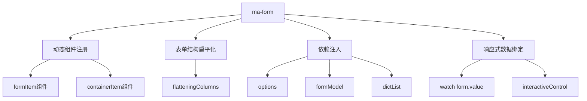
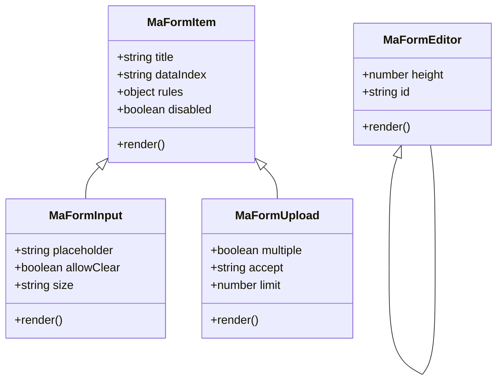
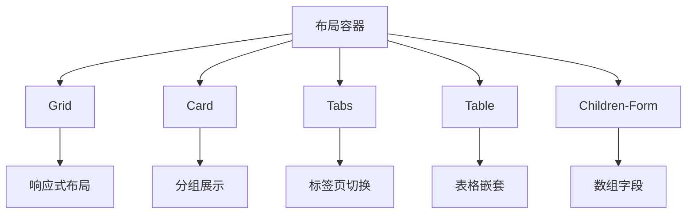
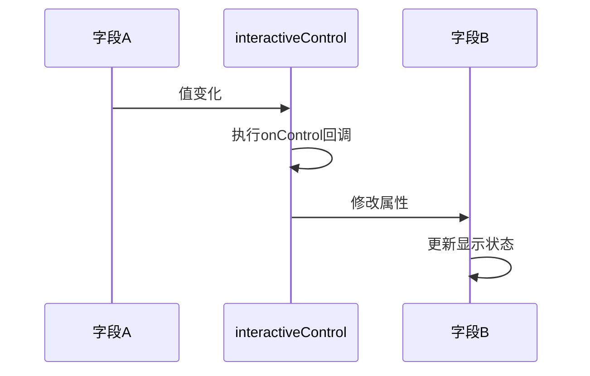
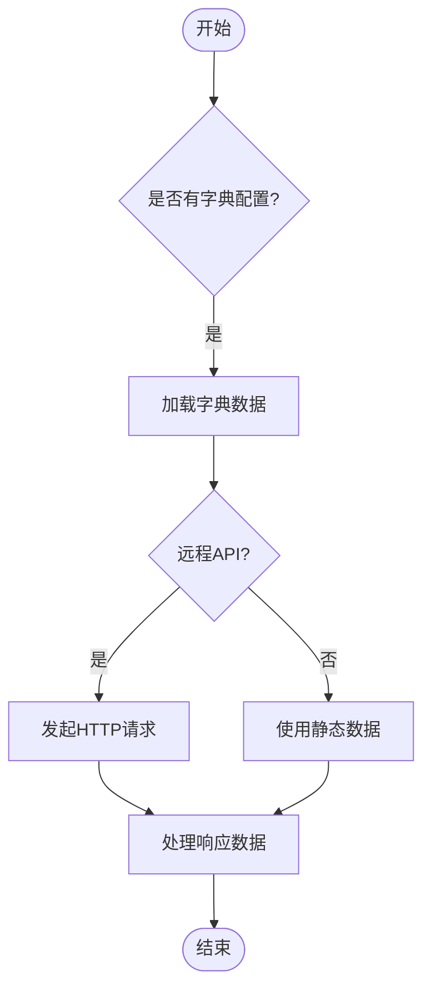
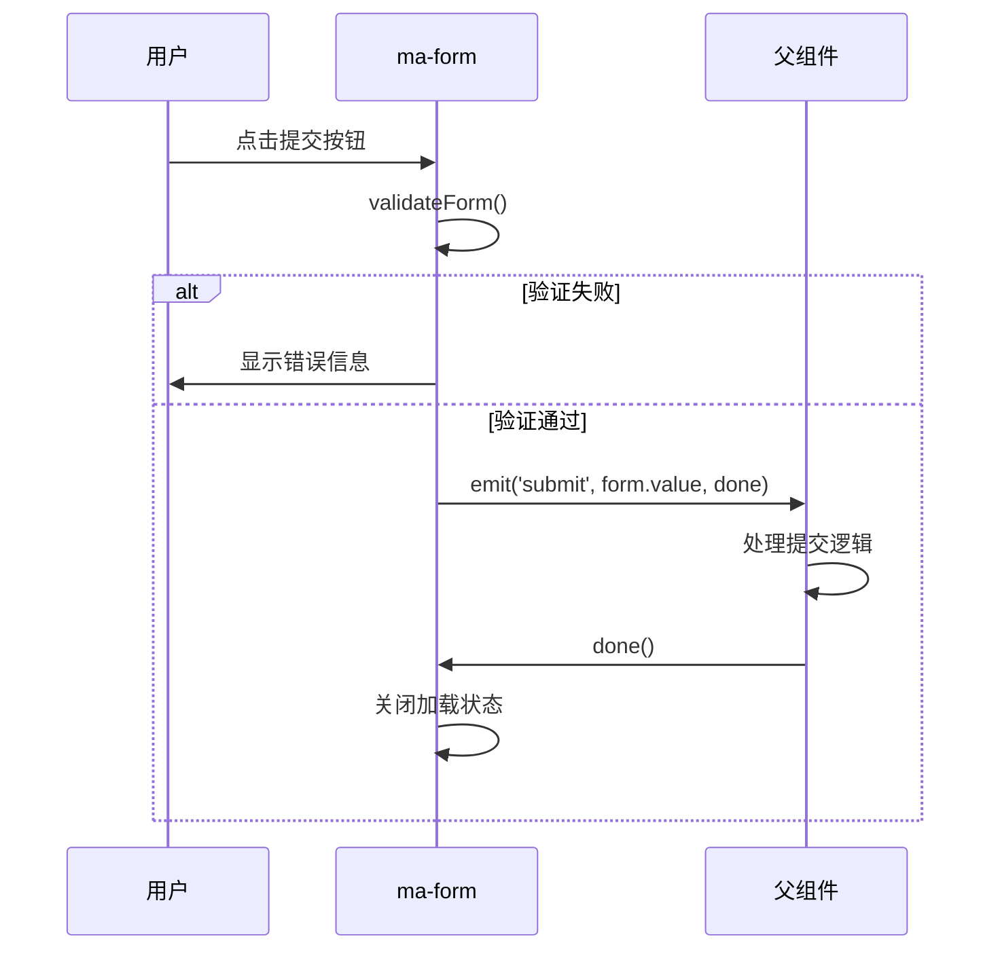
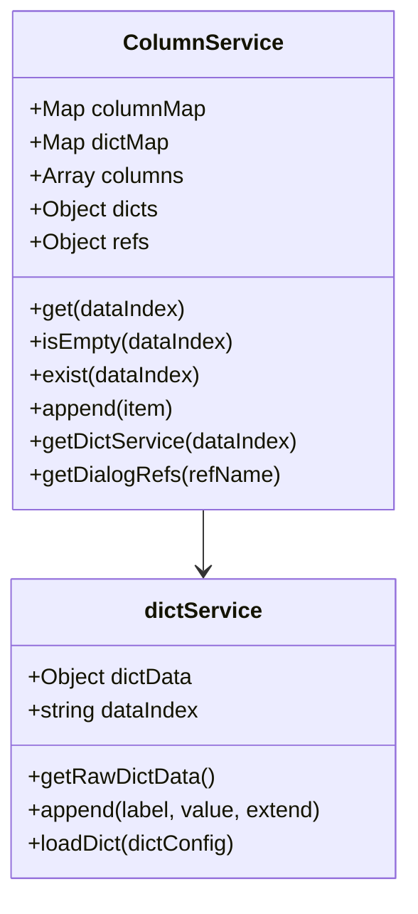

# ma-form组件

<cite>
**本文档引用文件**  
- [ma-form/index.vue](file://agx-admin/src/components/ma-form/index.vue)
- [ma-form/js/defaultOptions.js](file://agx-admin/src/components/ma-form/js/defaultOptions.js)
- [ma-form/js/networkRequest.js](file://agx-admin/src/components/ma-form/js/networkRequest.js)
- [ma-form/js/utils.js](file://agx-admin/src/components/ma-form/js/utils.js)
- [ma-form/js/columnService.js](file://agx-admin/src/components/ma-form/js/columnService.js)
- [ma-form/js/event.js](file://agx-admin/src/components/ma-form/js/event.js)
- [ma-form/formItem/form-item.vue](file://agx-admin/src/components/ma-form/formItem/form-item.vue)
- [ma-form/formItem/form-input.vue](file://agx-admin/src/components/ma-form/formItem/form-input.vue)
- [ma-form/formItem/form-upload.vue](file://agx-admin/src/components/ma-form/formItem/form-upload.vue)
- [ma-form/formItem/form-editor.vue](file://agx-admin/src/components/ma-form/formItem/form-editor.vue)
- [ma-form/containerItem/card.vue](file://agx-admin/src/components/ma-form/containerItem/card.vue)
- [ma-form/containerItem/grid.vue](file://agx-admin/src/components/ma-form/containerItem/grid.vue)
- [ma-form/js/defaultArrayComponent.js](file://agx-admin/src/components/ma-form/js/defaultArrayComponent.js)
</cite>

## 目录
1. [简介](#简介)
2. [核心架构与实现原理](#核心架构与实现原理)
3. [表单项体系](#表单项体系)
4. [布局容器](#布局容器)
5. [高级特性](#高级特性)
6. [表单提交与网络请求](#表单提交与网络请求)
7. [全局配置与行为定制](#全局配置与行为定制)
8. [最佳实践](#最佳实践)
9. [总结](#总结)

## 简介

ma-form组件是MineAdmin框架中的动态表单生成器，旨在通过声明式配置快速构建复杂表单界面。该组件支持多种表单项类型（如input、select、upload、editor等），提供灵活的布局容器（如grid、card），并具备表单联动、异步数据加载、自定义组件注入等高级功能。通过系统配置、角色编辑等实际场景，可展示其在复杂表单构建中的强大能力。

**本文档引用文件**  
- [ma-form/index.vue](file://agx-admin/src/components/ma-form/index.vue)

## 核心架构与实现原理

ma-form组件采用基于Vue 3的组合式API架构，通过动态组件渲染机制实现表单的灵活构建。其核心实现原理包括：

1. **动态组件注册**：在组件初始化时，通过`import.meta.glob`动态导入`formItem`和`containerItem`目录下的所有组件，并注册为全局组件，实现按需加载和动态渲染。

2. **表单结构扁平化**：通过`handleFlatteningColumns`函数将嵌套的表单配置结构扁平化，便于后续的数据绑定和联动控制。

3. **依赖注入**：使用`provide/inject`机制将表单配置、字段列表、字典数据、表单模型等关键状态注入到子组件中，实现跨层级组件通信。

4. **响应式数据绑定**：通过`watch`监听表单模型的变化，实现双向数据绑定和联动控制。

**图表来源**  
- [ma-form/index.vue](file://agx-admin/src/components/ma-form/index.vue#L121-L147)

**本节来源**  
- [ma-form/index.vue](file://agx-admin/src/components/ma-form/index.vue#L70-L275)

## 表单项体系

ma-form组件通过`formItem`目录下的34个组件实现了对多种表单项的支持，包括input、select、upload、editor等。每个表单项组件都遵循统一的实现模式：

1. **继承ma-form-item**：所有表单项组件都通过`ma-form-item`包装，继承其标签、验证规则、布局等通用属性。

2. **属性映射**：将ma-form的配置属性映射到底层UI组件（如Arco Design的a-input、a-select等）。

3. **事件代理**：通过`runEvent`函数代理底层组件的事件，支持在配置中定义事件处理函数。

4. **数据绑定**：通过`v-model`与表单模型进行双向绑定，并处理嵌套字段（如`user.name`）的特殊逻辑。

**图表来源**  
- [ma-form/formItem/form-item.vue](file://agx-admin/src/components/ma-form/formItem/form-item.vue)
- [ma-form/formItem/form-input.vue](file://agx-admin/src/components/ma-form/formItem/form-input.vue)
- [ma-form/formItem/form-upload.vue](file://agx-admin/src/components/ma-form/formItem/form-upload.vue)
- [ma-form/formItem/form-editor.vue](file://agx-admin/src/components/ma-form/formItem/form-editor.vue)

**本节来源**  
- [ma-form/index.vue](file://agx-admin/src/components/ma-form/index.vue#L34-L41)
- [ma-form/formItem/form-item.vue](file://agx-admin/src/components/ma-form/formItem/form-item.vue)
- [ma-form/formItem/form-input.vue](file://agx-admin/src/components/ma-form/formItem/form-input.vue)
- [ma-form/formItem/form-upload.vue](file://agx-admin/src/components/ma-form/formItem/form-upload.vue)
- [ma-form/formItem/form-editor.vue](file://agx-admin/src/components/ma-form/formItem/form-editor.vue)

## 布局容器

ma-form组件提供了多种布局容器，支持复杂的表单布局需求。主要容器包括：

1. **Grid**：基于栅格系统的布局容器，支持响应式布局和灵活的列配置。

2. **Card**：卡片式布局容器，可用于分组表单项或创建可折叠的表单区域。

3. **Tabs**：标签页布局容器，支持多标签页的表单展示。

4. **Table**：表格布局容器，支持在表格单元格中嵌入表单项。

5. **Children-Form**：子表单容器，支持嵌套表单和数组字段的编辑。

布局容器通过递归渲染机制实现嵌套使用，每个容器组件都会遍历其`formList`属性中的表单项配置，并递归渲染。

**图表来源**  
- [ma-form/containerItem/grid.vue](file://agx-admin/src/components/ma-form/containerItem/grid.vue)
- [ma-form/containerItem/card.vue](file://agx-admin/src/components/ma-form/containerItem/card.vue)

**本节来源**  
- [ma-form/index.vue](file://agx-admin/src/components/ma-form/index.vue#L77-L80)
- [ma-form/containerItem/grid.vue](file://agx-admin/src/components/ma-form/containerItem/grid.vue)
- [ma-form/containerItem/card.vue](file://agx-admin/src/components/ma-form/containerItem/card.vue)

## 高级特性

### 表单联动

ma-form组件通过`interactiveControl`函数实现表单联动。当某个字段的值发生变化时，会触发`onControl`回调函数，该函数可以返回一个对象，用于动态修改其他字段的属性（如显示/隐藏、禁用/启用等）。

**图表来源**  
- [ma-form/js/utils.js](file://agx-admin/src/components/ma-form/js/utils.js#L7-L35)

### 异步数据加载

通过`dict`配置项，ma-form组件支持从远程API加载字典数据。支持多种数据源：
- 远程API（通过URL）
- 内置字典服务
- 静态数据
- 函数返回值

**图表来源**  
- [ma-form/js/networkRequest.js](file://agx-admin/src/components/ma-form/js/networkRequest.js#L88-L164)

### 自定义组件注入

ma-form组件支持通过`formType`属性注入自定义组件。只要将自定义组件放置在`formItem`目录下，并确保其文件名符合`form-xxx.vue`的命名规范，即可在表单配置中使用。

**本节来源**  
- [ma-form/js/utils.js](file://agx-admin/src/components/ma-form/js/utils.js#L57-L67)
- [ma-form/js/networkRequest.js](file://agx-admin/src/components/ma-form/js/networkRequest.js#L88-L164)

## 表单提交与网络请求

ma-form组件的表单提交流程由`formSubmit`方法控制，其核心步骤包括：

1. **表单验证**：调用`validateForm`方法进行表单验证，如果验证失败则显示错误信息。

2. **提交事件**：验证通过后，通过`emit('submit')`触发提交事件，将表单数据和`done`回调函数传递给父组件。

3. **完成回调**：父组件在处理完提交逻辑后，调用`done`回调函数关闭加载状态。

**图表来源**  
- [ma-form/index.vue](file://agx-admin/src/components/ma-form/index.vue#L234-L238)

**本节来源**  
- [ma-form/index.vue](file://agx-admin/src/components/ma-form/index.vue#L222-L238)
- [ma-form/js/networkRequest.js](file://agx-admin/src/components/ma-form/js/networkRequest.js)

## 全局配置与行为定制

### defaultOptions.js

`defaultOptions.js`文件定义了ma-form组件的全局默认配置，包括：

- 表单样式和布局
- 按钮文本和图标
- 加载提示文案
- 验证规则
- 全局CSS和JavaScript

这些配置可以通过`options`属性进行覆盖，实现组件行为的定制。

### ColumnService

`ColumnService`类提供了对表单字段的高级操作接口，包括：

- 动态添加/删除字段
- 获取字段服务对象
- 操作字典数据
- 访问组件引用

**图表来源**  
- [ma-form/js/defaultOptions.js](file://agx-admin/src/components/ma-form/js/defaultOptions.js)
- [ma-form/js/columnService.js](file://agx-admin/src/components/ma-form/js/columnService.js)

**本节来源**  
- [ma-form/js/defaultOptions.js](file://agx-admin/src/components/ma-form/js/defaultOptions.js)
- [ma-form/js/columnService.js](file://agx-admin/src/components/ma-form/js/columnService.js)

## 最佳实践

### 错误处理

- 在`networkRequest.js`中使用try-catch捕获异步请求错误
- 通过`Message.error`显示友好的错误提示
- 提供`errorHandle`配置项允许自定义错误处理逻辑

### 动态字段增减

- 使用`ColumnService.append()`方法动态添加字段
- 通过`interactiveControl`控制字段的显示/隐藏
- 利用`children-form`容器支持数组字段的增删

### 性能优化

- 使用`init: false`延迟初始化，避免不必要的远程请求
- 启用字典数据缓存（`dict.cache: true`）
- 使用`globalCss`和`globalFunction`减少重复代码

**本节来源**  
- [ma-form/js/networkRequest.js](file://agx-admin/src/components/ma-form/js/networkRequest.js)
- [ma-form/js/columnService.js](file://agx-admin/src/components/ma-form/js/columnService.js)
- [ma-form/js/defaultOptions.js](file://agx-admin/src/components/ma-form/js/defaultOptions.js)

## 总结

ma-form组件通过灵活的架构设计和丰富的功能特性，为开发者提供了强大的动态表单构建能力。其核心优势包括：

1. **高度可扩展**：通过`formItem`和`containerItem`目录支持自定义组件注入。

2. **功能完备**：支持表单验证、联动控制、异步数据加载等复杂需求。

3. **易于定制**：通过`defaultOptions.js`和`ColumnService`提供全局配置和高级操作接口。

4. **性能优化**：提供延迟初始化、数据缓存等性能优化机制。

通过合理运用这些特性和最佳实践，开发者可以高效地构建出满足各种业务需求的复杂表单界面。

**本节来源**  
- [ma-form/index.vue](file://agx-admin/src/components/ma-form/index.vue)
- [ma-form/js/defaultOptions.js](file://agx-admin/src/components/ma-form/js/defaultOptions.js)
- [ma-form/js/columnService.js](file://agx-admin/src/components/ma-form/js/columnService.js)