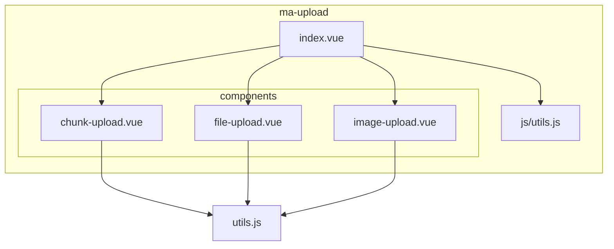
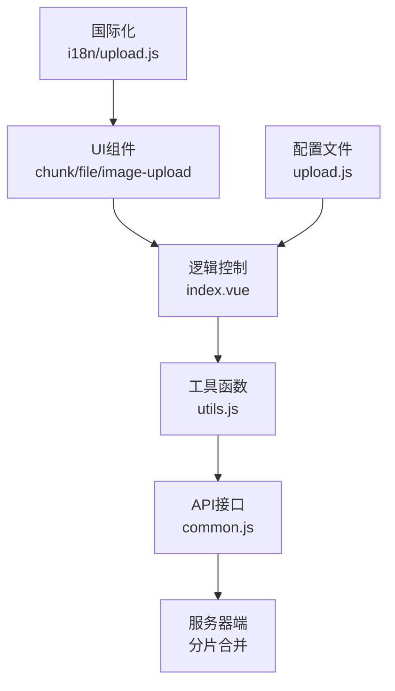
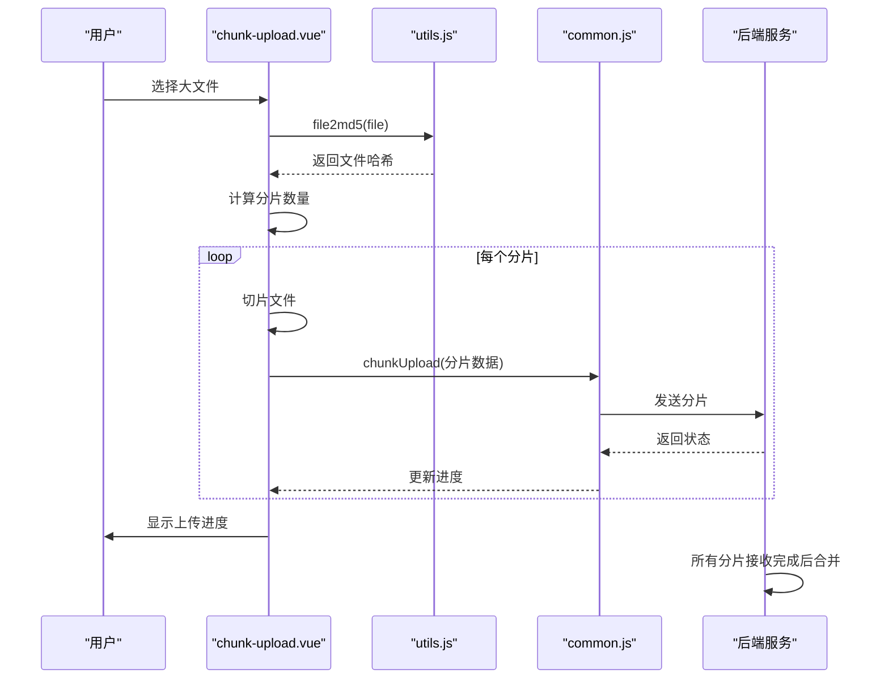
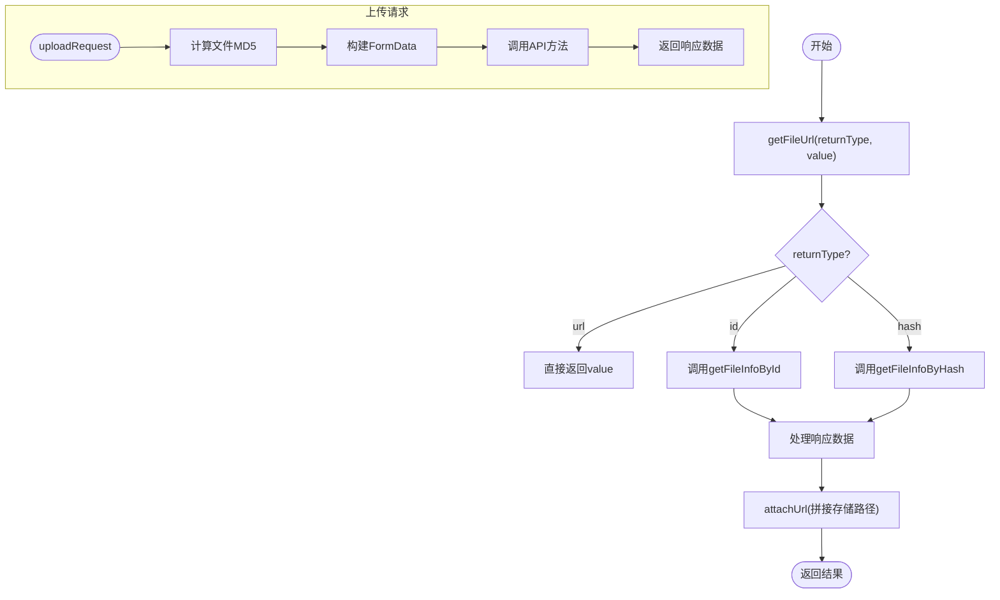
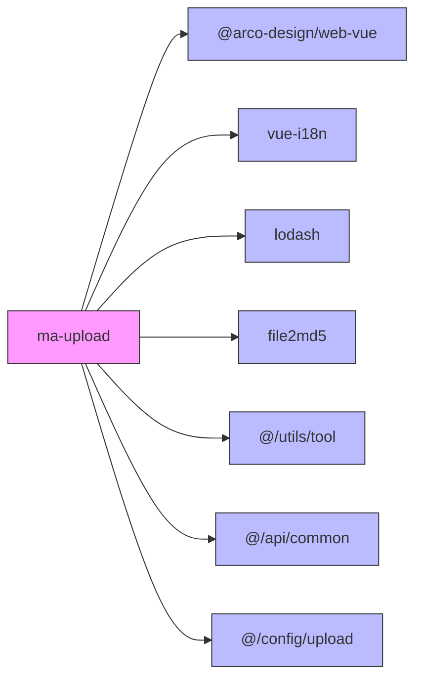

# ma-upload组件

<cite>
**本文档引用文件**  
- [index.vue](file://agx-admin/src/components/ma-upload/index.vue)
- [chunk-upload.vue](file://agx-admin/src/components/ma-upload/components/chunk-upload.vue)
- [file-upload.vue](file://agx-admin/src/components/ma-upload/components/file-upload.vue)
- [image-upload.vue](file://agx-admin/src/components/ma-upload/components/image-upload.vue)
- [utils.js](file://agx-admin/src/components/ma-upload/js/utils.js)
- [upload.js](file://agx-admin/src/config/upload.js)
- [common.js](file://agx-admin/src/api/common.js)
- [form-upload.vue](file://agx-admin/src/components/ma-form/formItem/form-upload.vue)
- [userCenter/index.vue](file://agx-admin/src/views/userCenter/index.vue)
- [ma-resource/index.vue](file://agx-admin/src/components/ma-resource/index.vue)
- [zh_CN/upload.js](file://agx-admin/src/i18n/zh_CN/upload.js)
</cite>

## 目录
1. [简介](#简介)
2. [项目结构](#项目结构)
3. [核心组件](#核心组件)
4. [架构概述](#架构概述)
5. [详细组件分析](#详细组件分析)
6. [依赖分析](#依赖分析)
7. [性能考虑](#性能考虑)
8. [故障排除指南](#故障排除指南)
9. [结论](#结论)

## 简介
ma-upload组件是MineAdmin框架中用于文件上传的核心组件，支持分片上传、断点续传和大文件处理能力。该组件通过chunk-upload.vue实现文件切片、哈希计算、并行上传与失败重试机制，同时提供file-upload和image-upload两种适配策略以满足不同场景需求。文档将深入解析上传进度监控、服务器端合并逻辑、MD5校验等关键技术点，并结合附件管理、头像上传等实际功能展示集成方式。

## 项目结构
ma-upload组件位于`agx-admin/src/components/ma-upload`目录下，包含多个子组件和工具文件，整体结构清晰且模块化。

**Diagram sources**  
- [index.vue](file://agx-admin/src/components/ma-upload/index.vue)
- [chunk-upload.vue](file://agx-admin/src/components/ma-upload/components/chunk-upload.vue)
- [file-upload.vue](file://agx-admin/src/components/ma-upload/components/file-upload.vue)
- [image-upload.vue](file://agx-admin/src/components/ma-upload/components/image-upload.vue)
- [utils.js](file://agx-admin/src/components/ma-upload/js/utils.js)

**Section sources**  
- [index.vue](file://agx-admin/src/components/ma-upload/index.vue)

## 核心组件
ma-upload组件由三个主要子组件构成：chunk-upload.vue（分片上传）、file-upload.vue（普通文件上传）和image-upload.vue（图片上传），并通过index.vue统一调度。组件支持多种上传模式、文件类型校验、上传进度显示及失败重试机制，适用于大文件上传和高并发场景。

**Section sources**  
- [index.vue](file://agx-admin/src/components/ma-upload/index.vue)
- [chunk-upload.vue](file://agx-admin/src/components/ma-upload/components/chunk-upload.vue)
- [file-upload.vue](file://agx-admin/src/components/ma-upload/components/file-upload.vue)
- [image-upload.vue](file://agx-admin/src/components/ma-upload/components/image-upload.vue)

## 架构概述
ma-upload组件采用分层架构设计，上层为UI组件，中层为逻辑控制，底层为工具函数和API调用。通过provide/inject机制传递配置信息，确保组件间通信高效可靠。

**Diagram sources**  
- [index.vue](file://agx-admin/src/components/ma-upload/index.vue)
- [utils.js](file://agx-admin/src/components/ma-upload/js/utils.js)
- [common.js](file://agx-admin/src/api/common.js)
- [upload.js](file://agx-admin/src/config/upload.js)
- [zh_CN/upload.js](file://agx-admin/src/i18n/zh_CN/upload.js)

## 详细组件分析

### 分片上传组件分析
chunk-upload.vue实现了完整的分片上传流程，包括文件切片、MD5哈希计算、分片上传、进度更新和最终合并。

#### 分片上传流程

**Diagram sources**  
- [chunk-upload.vue](file://agx-admin/src/components/ma-upload/components/chunk-upload.vue)
- [utils.js](file://agx-admin/src/components/ma-upload/js/utils.js)
- [common.js](file://agx-admin/src/api/common.js)

**Section sources**  
- [chunk-upload.vue](file://agx-admin/src/components/ma-upload/components/chunk-upload.vue)

### 文件上传与图片上传适配策略
file-upload.vue和image-upload.vue分别针对普通文件和图片上传场景进行了优化适配。

#### 适配策略对比
| 特性 | file-upload.vue | image-upload.vue |
|------|----------------|------------------|
| 接受类型 | config.accept | .jpg,jpeg,.gif,.png,.svg,.bpm |
| 文件大小限制 | config.size | config.size |
| 多文件支持 | config.multiple | config.multiple |
| 显示样式 | 列表形式 | 缩略图网格 |
| 圆角支持 | 无 | config.rounded |

**Diagram sources**  
- [file-upload.vue](file://agx-admin/src/components/ma-upload/components/file-upload.vue)
- [image-upload.vue](file://agx-admin/src/components/ma-upload/components/image-upload.vue)

**Section sources**  
- [file-upload.vue](file://agx-admin/src/components/ma-upload/components/file-upload.vue)
- [image-upload.vue](file://agx-admin/src/components/ma-upload/components/image-upload.vue)

### 底层工具函数分析
utils.js提供了文件上传所需的核心工具函数，包括文件URL获取和上传请求封装。

#### 工具函数调用流程

**Diagram sources**  
- [utils.js](file://agx-admin/src/components/ma-upload/js/utils.js)
- [common.js](file://agx-admin/src/api/common.js)

**Section sources**  
- [utils.js](file://agx-admin/src/components/ma-upload/js/utils.js)

## 依赖分析
ma-upload组件依赖多个外部模块和配置文件，形成完整的上传生态系统。

**Diagram sources**  
- [chunk-upload.vue](file://agx-admin/src/components/ma-upload/components/chunk-upload.vue)
- [file-upload.vue](file://agx-admin/src/components/ma-upload/components/file-upload.vue)
- [image-upload.vue](file://agx-admin/src/components/ma-upload/components/image-upload.vue)
- [utils.js](file://agx-admin/src/components/ma-upload/js/utils.js)

**Section sources**  
- [chunk-upload.vue](file://agx-admin/src/components/ma-upload/components/chunk-upload.vue)
- [file-upload.vue](file://agx-admin/src/components/ma-upload/components/file-upload.vue)
- [image-upload.vue](file://agx-admin/src/components/ma-upload/components/image-upload.vue)
- [utils.js](file://agx-admin/src/components/ma-upload/js/utils.js)

## 性能考虑
ma-upload组件在设计时充分考虑了性能优化，特别是在大文件处理方面。

- **分片大小配置**：可通过`chunkSize`属性调整，默认1MB
- **并发控制**：目前为串行上传，可通过改造实现并行上传
- **内存占用**：使用File.slice()进行切片，避免全文件加载
- **哈希计算**：使用file2md5库进行MD5计算，保证唯一性
- **进度更新**：使用throttle节流避免频繁渲染

对于超大文件（>1GB），建议：
1. 增加分片大小至5-10MB减少请求数量
2. 实现断点续传状态持久化
3. 添加上传暂停/恢复功能
4. 优化服务器端合并策略

## 故障排除指南
### 常见问题及解决方案

| 问题现象 | 可能原因 | 解决方案 |
|---------|--------|--------|
| 获取文件类型失败 | 浏览器无法识别文件MIME类型 | 检查文件扩展名，确保正确 |
| 文件哈希计算失败 | file2md5库加载异常 | 检查依赖安装，确认版本兼容 |
| 上传进度卡住 | 网络中断或服务器超时 | 检查网络连接，调整timeout配置 |
| 分片上传失败 | 服务器未正确处理分片 | 确认后端支持分片上传接口 |
| 文件无法预览 | URL拼接错误 | 检查storageMode配置是否正确 |

### 错误处理机制
组件内置了完善的错误处理机制：
- 前端：使用Message组件显示用户友好提示
- 日志：控制台输出详细错误信息
- 验证：对returnType等关键参数进行合法性校验
- 重试：上传失败后可重新选择文件上传

**Section sources**  
- [chunk-upload.vue](file://agx-admin/src/components/ma-upload/components/chunk-upload.vue)
- [zh_CN/upload.js](file://agx-admin/src/i18n/zh_CN/upload.js)

## 结论
ma-upload组件是一个功能完备、架构清晰的文件上传解决方案，特别适合需要处理大文件的Web应用。通过分片上传机制有效解决了大文件传输的网络稳定性问题，结合MD5校验确保了数据完整性。组件提供了灵活的配置选项和良好的用户体验，支持多种存储模式和返回类型。对于开发者而言，组件结构清晰，易于扩展和定制，是MineAdmin框架中不可或缺的重要组成部分。