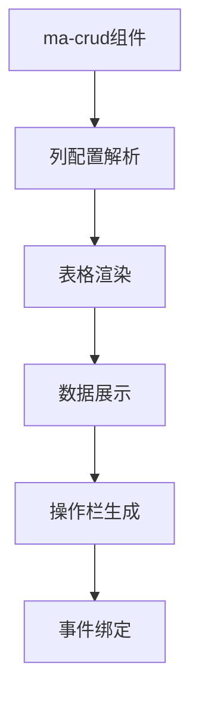
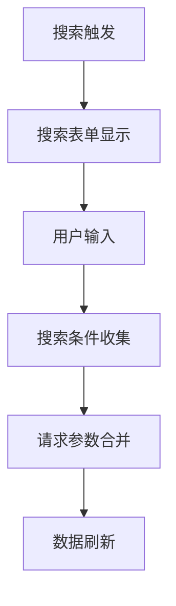
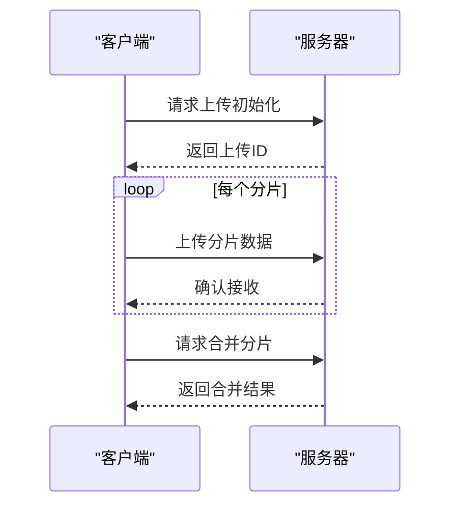

# 组件体系

<cite>
**本文档引用的文件**
- [ma-crud/index.vue](file://agx-admin/src/components/ma-crud/index.vue)
- [ma-form/index.vue](file://agx-admin/src/components/ma-form/index.vue)
- [ma-upload/index.vue](file://agx-admin/src/components/ma-upload/index.vue)
- [ma-charts/index.vue](file://agx-admin/src/components/ma-charts/index.vue)
- [ma-editor/index.vue](file://agx-admin/src/components/ma-editor/index.vue)
- [ma-crud/components/column.vue](file://agx-admin/src/components/ma-crud/components/column.vue)
- [ma-crud/components/search.vue](file://agx-admin/src/components/ma-crud/components/search.vue)
- [ma-form/js/columnService.js](file://agx-admin/src/components/ma-form/js/columnService.js)
- [ma-upload/components/chunk-upload.vue](file://agx-admin/src/components/ma-upload/components/chunk-upload.vue)
- [config/crud.js](file://agx-admin/src/config/crud.js)
- [config/upload.js](file://agx-admin/src/config/upload.js)
</cite>

## 目录
1. [简介](#简介)
2. [核心组件分析](#核心组件分析)
3. [ma-crud组件详解](#ma-crud组件详解)
4. [ma-form组件详解](#ma-form组件详解)
5. [ma-upload组件详解](#ma-upload组件详解)
6. [ma-charts组件详解](#ma-charts组件详解)
7. [ma-editor组件详解](#ma-editor组件详解)
8. [组件组合模式](#组件组合模式)
9. [性能优化建议](#性能优化建议)
10. [扩展与自定义](#扩展与自定义)

## 简介
agx-admin中的UI组件库提供了一套完整的解决方案，用于快速构建现代化的Web管理后台。该组件体系以ma-crud、ma-form等核心组件为基础，通过灵活的配置实现了数据展示、表单生成、文件上传等功能。组件设计遵循模块化原则，支持通过column配置实现动态数据展示，为开发者提供了高度可定制的界面构建能力。

## 核心组件分析
agx-admin的UI组件库由多个核心组件构成，这些组件通过合理的架构设计实现了高内聚、低耦合的特性。ma-crud组件负责数据表格的展示与操作，ma-form组件用于表单的动态生成，ma-upload组件处理文件上传功能，ma-charts组件提供数据可视化能力，ma-editor组件支持富文本编辑。这些组件通过统一的配置规范和事件机制相互协作，形成了完整的前端解决方案。

**组件来源**
- [ma-crud/index.vue](file://agx-admin/src/components/ma-crud/index.vue)
- [ma-form/index.vue](file://agx-admin/src/components/ma-form/index.vue)
- [ma-upload/index.vue](file://agx-admin/src/components/ma-upload/index.vue)
- [ma-charts/index.vue](file://agx-admin/src/components/ma-charts/index.vue)
- [ma-editor/index.vue](file://agx-admin/src/components/ma-editor/index.vue)

## ma-crud组件详解
ma-crud组件是agx-admin中用于实现数据表格展示的核心组件，它提供了表格渲染、搜索表单、批量操作等完整功能。该组件通过column配置实现了动态数据展示，支持灵活的列定义和数据处理。

### 表格渲染与列配置
ma-crud组件通过column配置实现动态数据展示，每个列配置包含标题、数据索引、宽度等属性。组件支持嵌套列、固定列、排序等功能，并通过dict配置实现字典值的翻译和标签化显示。



**图表来源**
- [ma-crud/index.vue](file://agx-admin/src/components/ma-crud/index.vue)
- [ma-crud/components/column.vue](file://agx-admin/src/components/ma-crud/components/column.vue)

### 搜索表单与过滤
ma-crud组件内置了搜索表单功能，通过在column配置中设置search属性为true来启用搜索。搜索表单支持多种输入类型，包括输入框、选择器、日期选择器等，并能根据配置自动生成相应的搜索控件。



**图表来源**
- [ma-crud/index.vue](file://agx-admin/src/components/ma-crud/index.vue)
- [ma-crud/components/search.vue](file://agx-admin/src/components/ma-crud/components/search.vue)

### 批量操作与上下文菜单
ma-crud组件支持批量删除、恢复等操作，通过rowSelection配置启用行选择功能。组件还提供了上下文菜单支持，允许用户通过右键点击行记录来执行特定操作。

**组件来源**
- [ma-crud/index.vue](file://agx-admin/src/components/ma-crud/index.vue)

## ma-form组件详解
ma-form组件是agx-admin中用于动态表单生成的核心组件，它通过column配置实现了各种表单项的集成和验证逻辑。

### 表单生成机制
ma-form组件通过解析column配置中的formType属性来确定表单项类型，并动态渲染相应的表单组件。组件支持多种表单项，包括输入框、选择器、上传控件等，并通过统一的接口进行数据绑定和事件处理。

```mermaid
classDiagram
class MaForm {
+columns : Array
+options : Object
+form : Object
+init() : Promise
+validateForm() : Promise
+resetForm() : Promise
}
class ColumnService {
+columns : Array
+dicts : Object
+cascaders : Array
+get() : Object
+set() : void
+append() : boolean
}
MaForm --> ColumnService : "使用"
MaForm --> "form-item" : "包含"
```

**图表来源**
- [ma-form/index.vue](file://agx-admin/src/components/ma-form/index.vue)
- [ma-form/js/columnService.js](file://agx-admin/src/components/ma-form/js/columnService.js)

### 表单项集成与验证
ma-form组件支持多种表单项的集成，包括input、select、upload等。每个表单项都有对应的验证规则，通过rules配置实现表单验证。组件还支持联动控制，允许一个表单项的值影响其他表单项的显示状态。

**组件来源**
- [ma-form/index.vue](file://agx-admin/src/components/ma-form/index.vue)
- [ma-form/formItem](file://agx-admin/src/components/ma-form/formItem)

## ma-upload组件详解
ma-upload组件提供了文件上传功能，支持普通上传和分片上传两种模式。

### 分片上传功能
ma-upload组件通过chunk-upload组件实现了分片上传功能，将大文件分割成多个小块进行上传，提高了上传的稳定性和效率。分片上传支持断点续传，即使上传过程中断也能从断点继续上传。



**图表来源**
- [ma-upload/index.vue](file://agx-admin/src/components/ma-upload/index.vue)
- [ma-upload/components/chunk-upload.vue](file://agx-admin/src/components/ma-upload/components/chunk-upload.vue)

## ma-charts组件详解
ma-charts组件基于ECharts提供了数据可视化能力，支持各种图表类型的展示。

### 数据可视化能力
ma-charts组件通过封装ECharts，提供了简单易用的图表配置接口。开发者只需提供图表配置选项，即可生成相应的图表。组件支持主题切换，能根据系统模式自动调整图表样式。

**组件来源**
- [ma-charts/index.vue](file://agx-admin/src/components/ma-charts/index.vue)

## ma-editor组件详解
ma-editor组件提供了富文本编辑支持，基于TinyMCE实现了功能丰富的文本编辑器。

### 富文本编辑支持
ma-editor组件集成了TinyMCE编辑器，支持多种编辑功能，包括格式化、插入图片、插入链接等。组件还集成了资源选择器，允许用户从已上传的资源中选择图片插入到编辑器中。

**组件来源**
- [ma-editor/index.vue](file://agx-admin/src/components/ma-editor/index.vue)

## 组件组合模式
在实际应用中，这些组件通常以特定的模式组合使用，以实现完整的业务功能。

### 用户管理页面
用户管理页面通常使用ma-crud组件展示用户列表，配合ma-form组件实现用户信息的编辑和新增。搜索功能通过ma-crud的搜索表单实现，文件上传通过ma-upload组件完成。

### 系统设置页面
系统设置页面使用ma-form组件生成配置表单，通过column配置定义各种设置项。对于复杂的设置项，可以使用ma-crud组件进行列表管理。

**组件来源**
- [views/system/user/index.vue](file://agx-admin/src/views/system/user/index.vue)
- [views/setting/index.vue](file://agx-admin/src/views/setting/index.vue)

## 性能优化建议
为了确保组件在大规模数据下的性能表现，建议采取以下优化措施：

1. 对于大数据量的表格，启用虚拟滚动
2. 合理设置分页大小，避免一次性加载过多数据
3. 使用懒加载技术加载非关键组件
4. 对频繁更新的数据使用防抖和节流
5. 优化图片资源，使用适当的压缩格式

## 扩展与自定义
agx-admin的组件体系设计考虑了可扩展性，开发者可以通过以下方式扩展或修改组件行为：

1. 通过columnService类动态修改列配置
2. 使用provide/inject机制注入自定义服务
3. 通过slot机制自定义组件的特定部分
4. 继承基础组件创建自定义组件

**组件来源**
- [ma-form/js/columnService.js](file://agx-admin/src/components/ma-form/js/columnService.js)