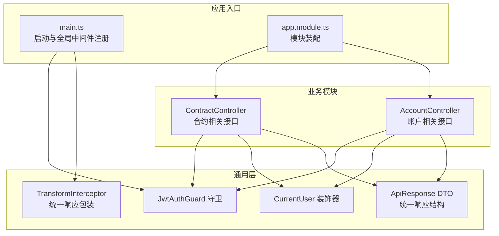
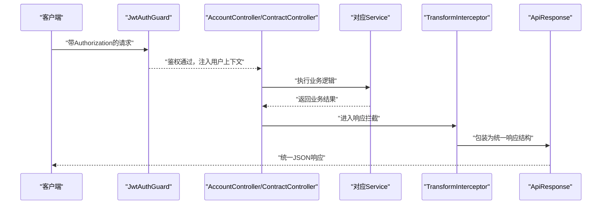
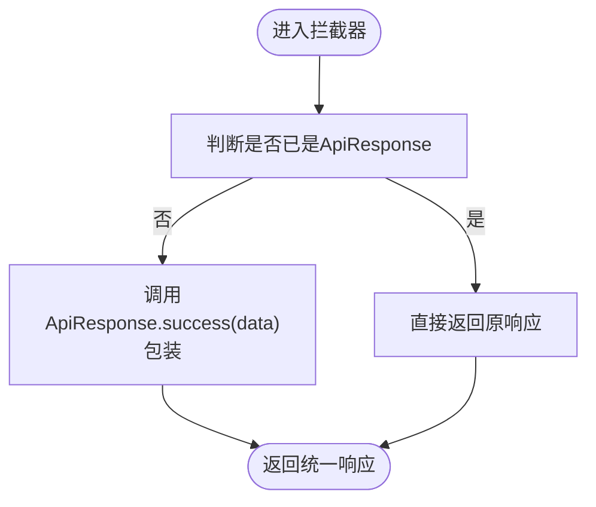
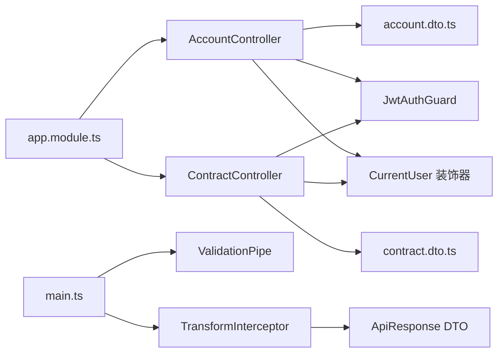

# API端点管理

<cite>
**本文引用的文件**
- [main.ts](file://agx-backend/src/main.ts)
- [app.module.ts](file://agx-backend/src/app.module.ts)
- [account.controller.ts](file://agx-backend/src/modules/account/account.controller.ts)
- [account.dto.ts](file://agx-backend/src/modules/account/account.dto.ts)
- [contract.controller.ts](file://agx-backend/src/modules/contract/contract.controller.ts)
- [contract.dto.ts](file://agx-backend/src/modules/contract/contract.dto.ts)
- [transform.interceptor.ts](file://agx-backend/src/common/interceptors/transform.interceptor.ts)
- [api-response.dto.ts](file://agx-backend/src/common/dto/api-response.dto.ts)
- [current-user.decorator.ts](file://agx-backend/src/common/decorators/current-user.decorator.ts)
- [jwt-auth.guard.ts](file://agx-backend/src/modules/auth/jwt-auth.guard.ts)
- [API_CONTRACT.md](file://agx-backend/API_CONTRACT.md)
</cite>

## 目录
1. [简介](#简介)
2. [项目结构](#项目结构)
3. [核心组件](#核心组件)
4. [架构总览](#架构总览)
5. [详细组件分析](#详细组件分析)
6. [依赖分析](#依赖分析)
7. [性能考虑](#性能考虑)
8. [故障排查指南](#故障排查指南)
9. [结论](#结论)
10. [附录](#附录)

## 简介
本文件聚焦于RESTful API的设计与实现，围绕AccountController与ContractController的HTTP方法与路由映射、DTO请求数据验证、全局输入校验ValidationPipe的作用、以及TransformInterceptor统一响应格式的机制展开。同时提供API路由树，帮助初学者快速定位端点，为高级开发者提供版本控制、速率限制与API文档生成（Swagger）的集成建议。

## 项目结构
后端采用NestJS框架，模块化组织业务功能。Account模块与Contract模块分别提供账户与合约相关接口；全局中间件负责统一响应格式、异常处理与输入校验；JWT守卫用于鉴权。

图表来源
- [main.ts](file://agx-backend/src/main.ts#L1-L39)
- [app.module.ts](file://agx-backend/src/app.module.ts#L1-L130)
- [transform.interceptor.ts](file://agx-backend/src/common/interceptors/transform.interceptor.ts#L1-L26)
- [api-response.dto.ts](file://agx-backend/src/common/dto/api-response.dto.ts#L1-L68)
- [current-user.decorator.ts](file://agx-backend/src/common/decorators/current-user.decorator.ts#L1-L17)
- [jwt-auth.guard.ts](file://agx-backend/src/modules/auth/jwt-auth.guard.ts#L1-L38)
- [account.controller.ts](file://agx-backend/src/modules/account/account.controller.ts#L1-L160)
- [contract.controller.ts](file://agx-backend/src/modules/contract/contract.controller.ts#L1-L44)

章节来源
- [main.ts](file://agx-backend/src/main.ts#L1-L39)
- [app.module.ts](file://agx-backend/src/app.module.ts#L1-L130)

## 核心组件
- AccountController：提供注册、登录、用户资料、余额、密码修改、KYC、充值/提现地址与历史、邀请列表与统计、公告等接口。
- ContractController：提供合约配置、下单、用户订单查询等接口。
- DTO：使用class-validator对请求参数进行声明式校验。
- ValidationPipe：全局开启transform与白名单策略，自动类型转换与字段清洗。
- TransformInterceptor：统一将控制器返回包装为ApiResponse结构。
- JwtAuthGuard：基于JWT的认证守卫，未通过时抛出业务异常。
- ApiResponse：统一响应结构与错误码映射。

章节来源
- [account.controller.ts](file://agx-backend/src/modules/account/account.controller.ts#L1-L160)
- [contract.controller.ts](file://agx-backend/src/modules/contract/contract.controller.ts#L1-L44)
- [account.dto.ts](file://agx-backend/src/modules/account/account.dto.ts#L1-L98)
- [contract.dto.ts](file://agx-backend/src/modules/contract/contract.dto.ts#L1-L16)
- [main.ts](file://agx-backend/src/main.ts#L1-L39)
- [transform.interceptor.ts](file://agx-backend/src/common/interceptors/transform.interceptor.ts#L1-L26)
- [api-response.dto.ts](file://agx-backend/src/common/dto/api-response.dto.ts#L1-L68)
- [jwt-auth.guard.ts](file://agx-backend/src/modules/auth/jwt-auth.guard.ts#L1-L38)

## 架构总览
下图展示从客户端到控制器、服务与数据库的整体调用链路，以及全局中间件对请求/响应的影响。

图表来源
- [jwt-auth.guard.ts](file://agx-backend/src/modules/auth/jwt-auth.guard.ts#L1-L38)
- [account.controller.ts](file://agx-backend/src/modules/account/account.controller.ts#L1-L160)
- [contract.controller.ts](file://agx-backend/src/modules/contract/contract.controller.ts#L1-L44)
- [transform.interceptor.ts](file://agx-backend/src/common/interceptors/transform.interceptor.ts#L1-L26)
- [api-response.dto.ts](file://agx-backend/src/common/dto/api-response.dto.ts#L1-L68)

## 详细组件分析

### AccountController 接口与路由映射
- 基础路径：/api/account
- 主要端点
  - POST /api/account/register
  - POST /api/account/login
  - GET /api/account/profile
  - GET /api/account/balance
  - POST /api/account/password
  - PUT /api/account/profile
  - POST /api/account/kyc
  - GET /api/account/kyc
  - GET /api/account/deposit/address
  - GET /api/account/deposit/history
  - POST /api/account/withdraw
  - GET /api/account/withdraw/history
  - GET /api/account/invites
  - GET /api/account/invite/stats
  - GET /api/account/notices

- 认证与授权
  - 多数端点使用JwtAuthGuard进行JWT鉴权。
  - CurrentUser装饰器从请求上下文中提取用户信息，支持按属性取值或完整用户对象。

- 请求参数与DTO
  - 使用class-validator对请求体/查询参数进行约束，如长度、正数、枚举、可选字段等。
  - 示例：RegisterDto/LoginDto/ChangePasswordDto/UpdateProfileDto/SubmitKycDto/WithdrawDto/GetDepositAddressDto。

- 响应格式
  - 所有控制器返回值由TransformInterceptor统一包装为ApiResponse结构。

章节来源
- [account.controller.ts](file://agx-backend/src/modules/account/account.controller.ts#L1-L160)
- [account.dto.ts](file://agx-backend/src/modules/account/account.dto.ts#L1-L98)
- [current-user.decorator.ts](file://agx-backend/src/common/decorators/current-user.decorator.ts#L1-L17)
- [jwt-auth.guard.ts](file://agx-backend/src/modules/auth/jwt-auth.guard.ts#L1-L38)
- [transform.interceptor.ts](file://agx-backend/src/common/interceptors/transform.interceptor.ts#L1-L26)
- [api-response.dto.ts](file://agx-backend/src/common/dto/api-response.dto.ts#L1-L68)

### ContractController 接口与路由映射
- 基础路径：/api/contract
- 主要端点
  - GET /api/contract/configs
  - POST /api/contract/order
  - GET /api/contract/orders

- 认证与授权
  - 下单与订单查询使用JwtAuthGuard进行JWT鉴权。
  - 使用CurrentUser装饰器获取当前用户ID。

- 请求参数与DTO
  - CreateOrderDto对configId/amount/direction进行数值与取值范围校验。

- 响应格式
  - 统一由TransformInterceptor包装为ApiResponse。

章节来源
- [contract.controller.ts](file://agx-backend/src/modules/contract/contract.controller.ts#L1-L44)
- [contract.dto.ts](file://agx-backend/src/modules/contract/contract.dto.ts#L1-L16)
- [current-user.decorator.ts](file://agx-backend/src/common/decorators/current-user.decorator.ts#L1-L17)
- [jwt-auth.guard.ts](file://agx-backend/src/modules/auth/jwt-auth.guard.ts#L1-L38)
- [transform.interceptor.ts](file://agx-backend/src/common/interceptors/transform.interceptor.ts#L1-L26)
- [api-response.dto.ts](file://agx-backend/src/common/dto/api-response.dto.ts#L1-L68)

### DTO与请求数据验证
- 使用class-validator注解对字段进行约束，包括字符串长度、正数、枚举、可选字段等。
- ValidationPipe在全局启用，具备以下特性：
  - transform: true，将请求参数进行隐式类型转换（如将字符串转为数字）。
  - whitelist: true，移除不在DTO中定义的字段，避免脏数据进入业务层。
  - forbidNonWhitelisted: false，允许非白名单字段但不进入业务层。
  - enableImplicitConversion: true，提升类型转换灵活性。

- 与控制器结合
  - 控制器方法参数直接使用DTO类型，Nest自动完成校验与转换。
  - 校验失败时抛出HTTP 400错误，由全局异常过滤器统一处理。

章节来源
- [account.dto.ts](file://agx-backend/src/modules/account/account.dto.ts#L1-L98)
- [contract.dto.ts](file://agx-backend/src/modules/contract/contract.dto.ts#L1-L16)
- [main.ts](file://agx-backend/src/main.ts#L1-L39)

### ValidationPipe 在全局输入校验中的作用
- 注册位置：在main.ts中通过useGlobalPipes启用ValidationPipe。
- 关键行为：
  - 自动类型转换：将字符串等输入转换为期望的数值/布尔等类型。
  - 白名单清理：仅保留DTO中定义的字段，防止多余字段污染业务逻辑。
  - 与class-validator配合：自动收集校验错误并返回标准化的HTTP 400响应。

章节来源
- [main.ts](file://agx-backend/src/main.ts#L1-L39)

### TransformInterceptor 如何统一响应格式
- 注册位置：在main.ts中通过useGlobalInterceptors启用TransformInterceptor。
- 工作原理：
  - 对每个控制器返回值进行包装，若已是ApiResponse则直接透传，否则调用ApiResponse.success(data)。
  - 统一响应结构包含code/msg/data，便于前端一致处理与错误提示。

图表来源
- [transform.interceptor.ts](file://agx-backend/src/common/interceptors/transform.interceptor.ts#L1-L26)
- [api-response.dto.ts](file://agx-backend/src/common/dto/api-response.dto.ts#L1-L68)

章节来源
- [transform.interceptor.ts](file://agx-backend/src/common/interceptors/transform.interceptor.ts#L1-L26)
- [api-response.dto.ts](file://agx-backend/src/common/dto/api-response.dto.ts#L1-L68)

### API路由树
- 根据控制器与路由装饰器整理的路由树如下：

```mermaid
graph TB
Root["基础路径 /api"]
subgraph "账户模块"
A1["/account/register"]
A2["/account/login"]
A3["/account/profile"]
A4["/account/balance"]
A5["/account/password"]
A6["/account/profile (PUT)"]
A7["/account/kyc (POST)"]
A8["/account/kyc (GET)"]
A9["/account/deposit/address (GET)"]
A10["/account/deposit/history (GET)"]
A11["/account/withdraw (POST)"]
A12["/account/withdraw/history (GET)"]
A13["/account/invites (GET)"]
A14["/account/invite/stats (GET)"]
A15["/account/notices (GET)"]
end
subgraph "合约模块"
C1["/contract/configs (GET)"]
C2["/contract/order (POST)"]
C3["/contract/orders (GET)"]
end
Root --> A1
Root --> A2
Root --> A3
Root --> A4
Root --> A5
Root --> A6
Root --> A7
Root --> A8
Root --> A9
Root --> A10
Root --> A11
Root --> A12
Root --> A13
Root --> A14
Root --> A15
Root --> C1
Root --> C2
Root --> C3
```

图表来源
- [account.controller.ts](file://agx-backend/src/modules/account/account.controller.ts#L1-L160)
- [contract.controller.ts](file://agx-backend/src/modules/contract/contract.controller.ts#L1-L44)

## 依赖分析
- 模块装配：app.module.ts导入AuthModule、AccountModule、ContractModule等业务模块，并注册TypeORM实体。
- 控制器依赖：AccountController/ContractController依赖各自的服务层；均使用JwtAuthGuard与CurrentUser装饰器。
- 全局中间件：main.ts注册ValidationPipe、异常过滤器与TransformInterceptor。
- DTO与校验：class-validator注解与ValidationPipe协同工作，确保请求数据一致性。

图表来源
- [app.module.ts](file://agx-backend/src/app.module.ts#L1-L130)
- [account.controller.ts](file://agx-backend/src/modules/account/account.controller.ts#L1-L160)
- [contract.controller.ts](file://agx-backend/src/modules/contract/contract.controller.ts#L1-L44)
- [account.dto.ts](file://agx-backend/src/modules/account/account.dto.ts#L1-L98)
- [contract.dto.ts](file://agx-backend/src/modules/contract/contract.dto.ts#L1-L16)
- [jwt-auth.guard.ts](file://agx-backend/src/modules/auth/jwt-auth.guard.ts#L1-L38)
- [current-user.decorator.ts](file://agx-backend/src/common/decorators/current-user.decorator.ts#L1-L17)
- [main.ts](file://agx-backend/src/main.ts#L1-L39)
- [transform.interceptor.ts](file://agx-backend/src/common/interceptors/transform.interceptor.ts#L1-L26)
- [api-response.dto.ts](file://agx-backend/src/common/dto/api-response.dto.ts#L1-L68)

章节来源
- [app.module.ts](file://agx-backend/src/app.module.ts#L1-L130)
- [main.ts](file://agx-backend/src/main.ts#L1-L39)

## 性能考虑
- 全局中间件的顺序与开销：ValidationPipe与TransformInterceptor均为轻量级操作，通常不会成为瓶颈；建议在高并发场景下关注数据库连接池与缓存命中率。
- DTO校验粒度：适度使用class-validator注解，避免过度复杂的校验规则导致CPU消耗增加。
- 响应包装：统一响应结构简单明了，对性能影响极小；建议保持该策略以减少前端适配成本。

## 故障排查指南
- 400 参数错误
  - 症状：请求参数不符合DTO约束。
  - 排查：检查对应DTO注解与ValidationPipe配置；确认请求体/查询参数类型与长度。
  - 参考：[account.dto.ts](file://agx-backend/src/modules/account/account.dto.ts#L1-L98)，[contract.dto.ts](file://agx-backend/src/modules/contract/contract.dto.ts#L1-L16)，[main.ts](file://agx-backend/src/main.ts#L1-L39)

- 401 未登录/Token过期
  - 症状：访问受保护接口时未携带或携带无效Token。
  - 排查：确认Authorization头格式与Token有效性；检查JwtAuthGuard与守卫实现。
  - 参考：[jwt-auth.guard.ts](file://agx-backend/src/modules/auth/jwt-auth.guard.ts#L1-L38)，[API_CONTRACT.md](file://agx-backend/API_CONTRACT.md#L1-L200)

- 500 服务器内部错误
  - 症状：业务异常未被捕获或未正确包装。
  - 排查：确认全局异常过滤器与TransformInterceptor是否生效；检查服务层抛出的异常类型。
  - 参考：[main.ts](file://agx-backend/src/main.ts#L1-L39)，[transform.interceptor.ts](file://agx-backend/src/common/interceptors/transform.interceptor.ts#L1-L26)

## 结论
本项目通过模块化控制器、声明式DTO校验、全局ValidationPipe与TransformInterceptor，实现了清晰、一致且易于维护的RESTful API体系。AccountController与ContractController覆盖了账户与合约的核心业务，配合JWT守卫与统一响应格式，为前后端协作提供了稳定的基础。

## 附录

### 初学者控制器开发规范
- 路由设计
  - 使用@Controller('api/模块')定义模块根路径，子路径使用相对路径。
  - 尽量遵循REST风格，GET/POST/PUT/DELETE语义明确。
- DTO编写
  - 为每个端点编写独立DTO，使用class-validator注解约束字段。
  - 明确必填/可选字段与取值范围，保证输入质量。
- 鉴权与上下文
  - 对需要登录的端点添加JwtAuthGuard。
  - 使用CurrentUser装饰器获取用户上下文，避免手动解析Token。
- 响应格式
  - 控制器返回业务数据，不要手写统一响应结构；交由TransformInterceptor处理。
- 错误处理
  - 业务异常尽量抛出可识别的错误类型，由全局异常过滤器统一转换为标准响应。

### 高级开发者：版本控制、速率限制与API文档生成（Swagger）

- 版本控制
  - 方案一：在路由前缀中加入版本号，如/api/v1/account。
  - 方案二：使用NestJS的版本化路由能力（需额外配置），将不同版本的控制器分离。
  - 建议：优先采用前缀版本化，便于迁移与向后兼容。

- 速率限制
  - 使用@nestjs/throttler或自定义限流中间件，在全局或特定路由上设置请求频率阈值。
  - 建议：对登录、注册等敏感接口设置更严格的限流策略。

- Swagger 文档生成
  - 安装@nestjs/swagger与swagger-ui-express。
  - 在main.ts中初始化Swagger文档，配置标题、描述、版本与安全方案。
  - 为控制器与DTO添加@ApiTags、@ApiOperation、@ApiProperty等装饰器，自动生成交互式文档。
  - 建议：将认证方式（Bearer Token）在Swagger中配置，便于联调测试。

- 与现有架构的集成要点
  - ValidationPipe与Swagger可共存；Swagger不影响DTO校验流程。
  - TransformInterceptor与Swagger互不冲突；Swagger展示的是最终响应结构。
  - JwtAuthGuard与Swagger的认证配置需保持一致，避免联调时出现401。