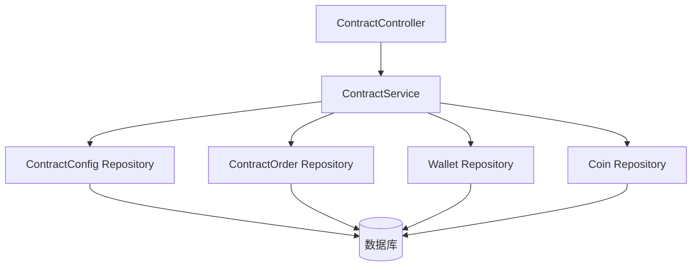
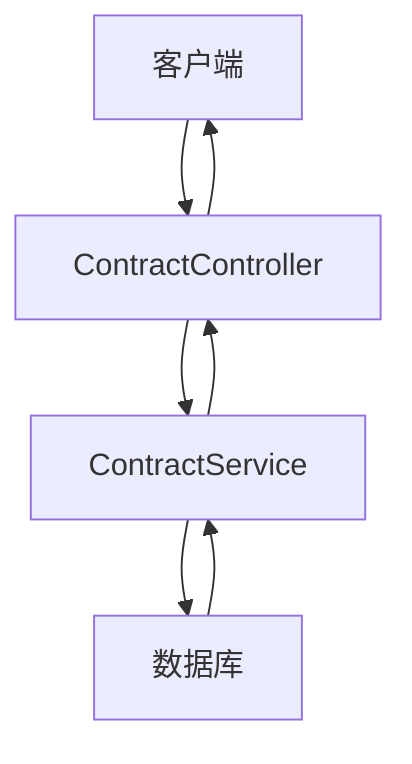
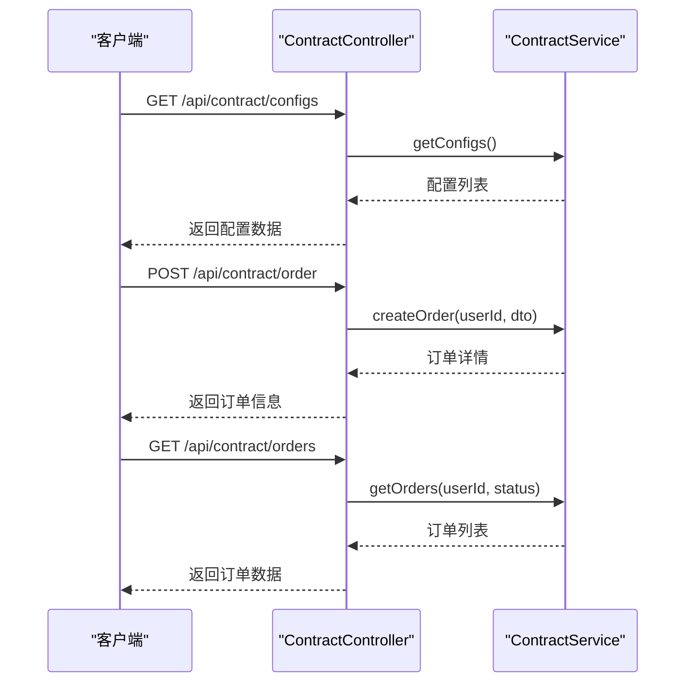
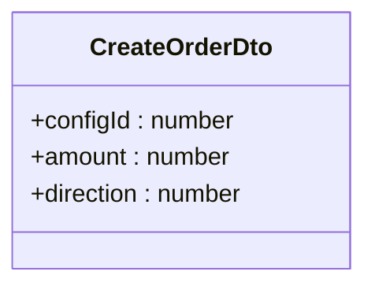
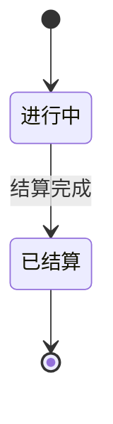
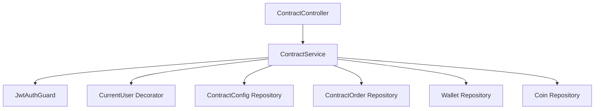

# 合约交易API

<cite>
**本文档引用文件**  
- [contract.controller.ts](file://agx-backend/src/modules/contract/contract.controller.ts)
- [contract.dto.ts](file://agx-backend/src/modules/contract/contract.dto.ts)
- [contract.service.ts](file://agx-backend/src/modules/contract/contract.service.ts)
- [contract-config.entity.ts](file://agx-backend/src/entities/contract-config.entity.ts)
- [contract-order.entity.ts](file://agx-backend/src/entities/contract-order.entity.ts)
- [wallet.entity.ts](file://agx-backend/src/entities/wallet.entity.ts)
- [user.entity.ts](file://agx-backend/src/entities/user.entity.ts)
- [API_CONTRACT.md](file://agx-backend/API_CONTRACT.md)
</cite>

## 目录
1. [简介](#简介)
2. [项目结构](#项目结构)
3. [核心组件](#核心组件)
4. [架构概述](#架构概述)
5. [详细组件分析](#详细组件分析)
6. [依赖分析](#依赖分析)
7. [性能考虑](#性能考虑)
8. [故障排除指南](#故障排除指南)
9. [结论](#结论)

## 简介
本文档详细介绍了AGX平台的合约交易API，聚焦于秒合约交易功能。API提供了获取合约配置、创建交易订单和查询用户订单的核心功能，支持高并发场景下的稳定交易处理。系统采用NestJS框架构建，结合TypeORM实现数据持久化，并通过JWT进行用户认证。API设计遵循RESTful原则，返回统一格式的JSON响应，便于前后端集成。

## 项目结构
合约交易功能位于`agx-backend/src/modules/contract`目录下，包含控制器、服务、DTO和实体等核心组件。该模块通过TypeORM与数据库交互，管理合约配置和订单生命周期。整体结构清晰，职责分离明确，便于维护和扩展。

**图表来源**  
- [contract.controller.ts](file://agx-backend/src/modules/contract/contract.controller.ts#L7-L43)
- [contract.service.ts](file://agx-backend/src/modules/contract/contract.service.ts#L11-L21)
- [contract.module.ts](file://agx-backend/src/modules/contract/contract.module.ts#L9-L10)

**章节来源**  
- [contract.controller.ts](file://agx-backend/src/modules/contract/contract.controller.ts#L1-L44)
- [contract.service.ts](file://agx-backend/src/modules/contract/contract.service.ts#L1-L282)

## 核心组件
合约交易系统的核心组件包括`ContractController`、`ContractService`和相关DTO与实体。`ContractController`负责处理HTTP请求，`ContractService`实现业务逻辑，而DTO和实体则定义了数据结构和验证规则。这些组件协同工作，确保交易流程的完整性和数据一致性。

**章节来源**  
- [contract.controller.ts](file://agx-backend/src/modules/contract/contract.controller.ts#L7-L43)
- [contract.service.ts](file://agx-backend/src/modules/contract/contract.service.ts#L10-L282)
- [contract.dto.ts](file://agx-backend/src/modules/contract/contract.dto.ts#L2-L14)

## 架构概述
系统采用典型的分层架构，包括控制器层、服务层和数据访问层。控制器层处理HTTP请求和响应，服务层实现核心业务逻辑，数据访问层通过TypeORM与数据库交互。这种分层设计提高了代码的可维护性和可测试性，同时支持高并发场景下的稳定运行。

**图表来源**  
- [contract.controller.ts](file://agx-backend/src/modules/contract/contract.controller.ts#L7-L43)
- [contract.service.ts](file://agx-backend/src/modules/contract/contract.service.ts#L10-L282)

## 详细组件分析

### 合约控制器分析
`ContractController`是合约交易功能的入口，提供三个主要端点：获取配置列表、创建订单和查询用户订单。控制器使用JWT认证保护敏感操作，确保只有授权用户才能进行交易。

#### API端点说明
| 端点 | HTTP方法 | 路径 | 认证 | 说明 |
|------|--------|------|------|------|
| 获取配置列表 | GET | /api/contract/configs | 不需要 | 获取所有启用的合约配置 |
| 创建订单 | POST | /api/contract/order | 需要 | 创建新的交易订单 |
| 查询用户订单 | GET | /api/contract/orders | 需要 | 查询当前用户的订单列表 |

**图表来源**  
- [contract.controller.ts](file://agx-backend/src/modules/contract/contract.controller.ts#L14-L42)

**章节来源**  
- [contract.controller.ts](file://agx-backend/src/modules/contract/contract.controller.ts#L7-L43)

### 创建订单DTO分析
`CreateOrderDto`定义了创建订单所需的参数和验证规则，确保输入数据的合法性和完整性。

#### 字段说明
| 字段 | 类型 | 必填 | 验证规则 | 说明 |
|------|------|------|--------|------|
| configId | number | 是 | 正整数 | 合约配置ID |
| amount | number | 是 | 正整数 | 下单金额 |
| direction | number | 是 | 1或2 | 交易方向：1=看涨，2=看跌 |

**图表来源**  
- [contract.dto.ts](file://agx-backend/src/modules/contract/contract.dto.ts#L3-L13)

**章节来源**  
- [contract.dto.ts](file://agx-backend/src/modules/contract/contract.dto.ts#L2-L14)

### 订单状态机分析
订单状态机管理订单的生命周期，从创建到结算的完整流程。状态转换确保了交易的原子性和一致性。

**图表来源**  
- [contract-order.entity.ts](file://agx-backend/src/entities/contract-order.entity.ts#L65-L67)

**章节来源**  
- [contract.service.ts](file://agx-backend/src/modules/contract/contract.service.ts#L164-L230)

## 依赖分析
合约交易模块依赖于多个核心组件，包括用户认证、钱包管理和数据库访问。这些依赖关系通过NestJS的依赖注入机制管理，确保组件间的松耦合和高内聚。

**图表来源**  
- [contract.controller.ts](file://agx-backend/src/modules/contract/contract.controller.ts#L4-L5)
- [contract.service.ts](file://agx-backend/src/modules/contract/contract.service.ts#L11-L21)

**章节来源**  
- [contract.controller.ts](file://agx-backend/src/modules/contract/contract.controller.ts#L1-L44)
- [contract.service.ts](file://agx-backend/src/modules/contract/contract.service.ts#L1-L282)

## 性能考虑
系统在设计时充分考虑了性能和并发控制，采用多种优化策略确保高负载下的稳定运行。

### 并发控制策略
1. **数据库事务**：使用TypeORM的QueryRunner管理事务，确保订单创建和余额扣减的原子性
2. **乐观锁**：通过版本控制防止并发更新冲突
3. **连接池**：利用TypeORM的连接池管理数据库连接，提高资源利用率

### 性能优化建议
1. **缓存配置**：将合约配置缓存在Redis中，减少数据库查询
2. **异步结算**：使用消息队列处理订单结算，避免阻塞主线程
3. **批量操作**：对批量查询和更新操作进行优化，减少数据库交互次数

**章节来源**  
- [contract.service.ts](file://agx-backend/src/modules/contract/contract.service.ts#L105-L158)

## 故障排除指南
本节提供常见问题的解决方案和调试建议。

### 常见错误码
| 错误码 | 说明 | 解决方案 |
|--------|------|--------|
| 4001 | 合约配置不存在 | 检查configId是否正确 |
| 4002 | 最小下单金额不足 | 确保金额大于最小限额 |
| 4003 | 最大下单金额超限 | 确保金额小于最大限额 |
| 4004 | AGX币种未配置 | 检查币种配置 |
| 4005 | AGX余额不足 | 充值或减少下单金额 |

**章节来源**  
- [contract.service.ts](file://agx-backend/src/modules/contract/contract.service.ts#L73-L100)

## 结论
本文档全面介绍了AGX平台的合约交易API，涵盖了从接口定义到实现细节的各个方面。系统设计合理，功能完整，能够支持高并发场景下的稳定交易处理。通过合理的架构设计和性能优化，系统具备良好的可扩展性和维护性，为用户提供安全可靠的交易体验。