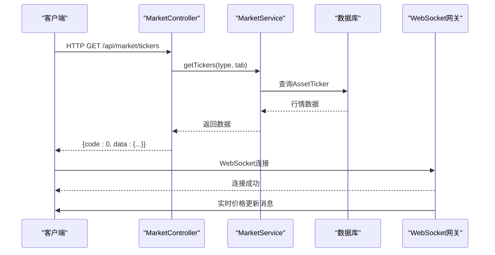
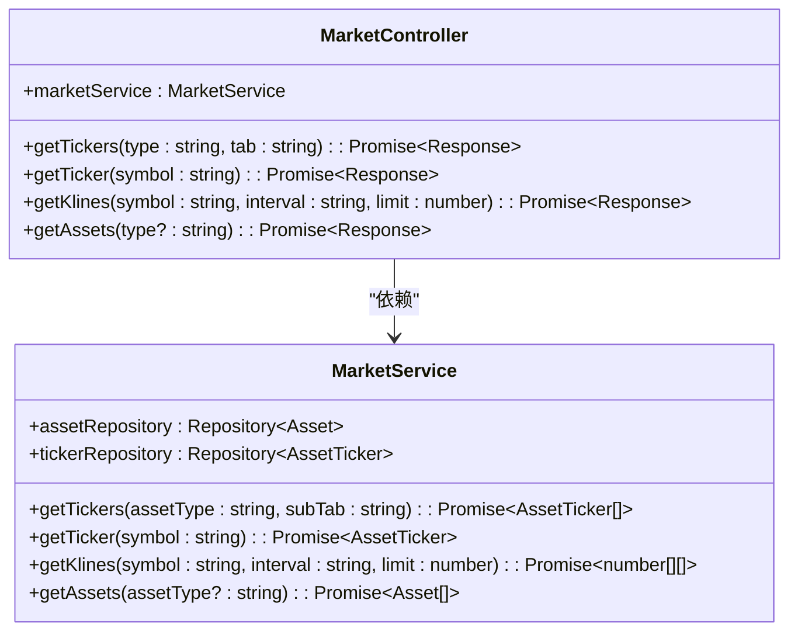
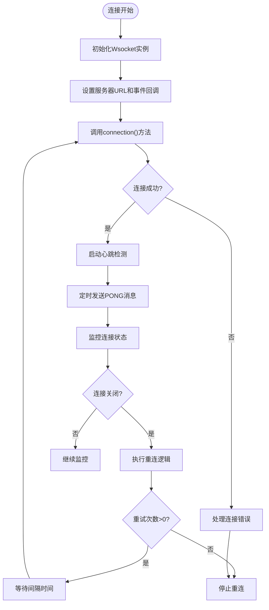
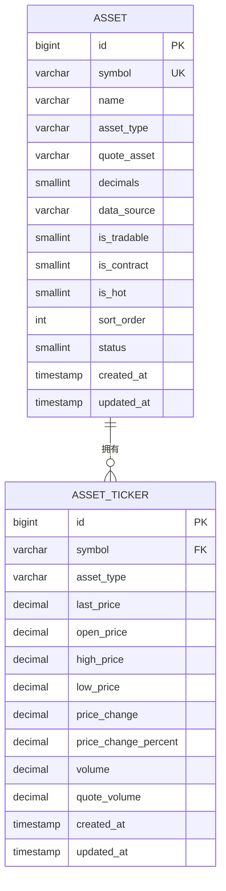
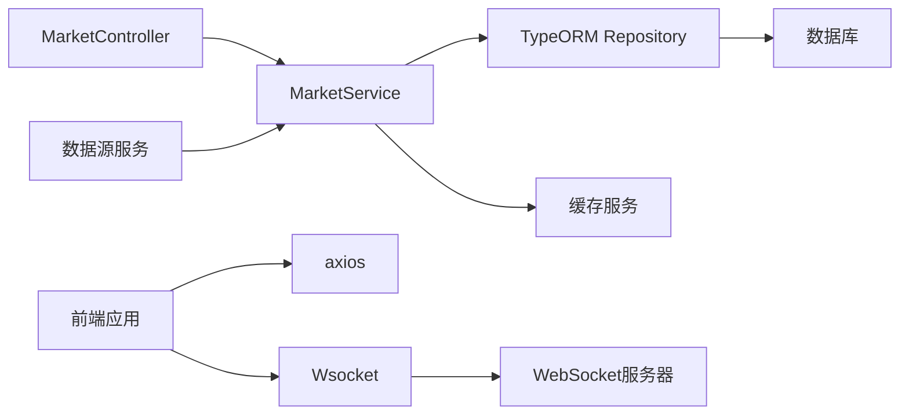

# 市场行情API

<cite>
**本文档引用的文件**  
- [market.controller.ts](file://agx-backend/src/modules/market/market.controller.ts)
- [market.service.ts](file://agx-backend/src/modules/market/market.service.ts)
- [market.module.ts](file://agx-backend/src/modules/market/market.module.ts)
- [asset.entity.ts](file://agx-backend/src/entities/asset.entity.ts)
- [asset-ticker.entity.ts](file://agx-backend/src/entities/asset-ticker.entity.ts)
- [Wsocket.js](file://agx-admin/src/utils/Wsocket.js)
- [message.js](file://agx-admin/src/ws-serve/message.js)
- [market.js](file://h5/src/api/market.js)
- [api.js](file://h5/src/utils/api.js)
- [marketForex.vue](file://agx-admin/src/views/agx/marketForex.vue)
</cite>

## 目录
1. [简介](#简介)
2. [项目结构](#项目结构)
3. [核心组件](#核心组件)
4. [架构概述](#架构概述)
5. [详细组件分析](#详细组件分析)
6. [依赖分析](#依赖分析)
7. [性能考虑](#性能考虑)
8. [故障排除指南](#故障排除指南)
9. [结论](#结论)

## 简介
本API文档详细介绍了市场行情服务，包括通过MarketController提供的RESTful端点和通过MarketGateway提供的WebSocket实时数据推送。文档涵盖了静态市场数据获取、实时价格更新、消息格式、订阅/取消订阅机制以及连接管理策略。为初学者提供WebSocket连接和消息处理的代码示例，为高级开发者探讨高并发场景下的消息广播性能优化方案。

## 项目结构
市场行情功能分布在后端和前端两个主要部分。后端实现位于`agx-backend/src/modules/market/`目录下，包含控制器、服务和实体定义。前端实现分布在`agx-admin`和`h5`两个项目中，分别用于管理后台和移动端应用。

```mermaid
graph TB
subgraph "后端服务"
A[MarketController] --> B[MarketService]
B --> C[Asset实体]
B --> D[AssetTicker实体]
end
subgraph "前端应用"
E[agx-admin] --> F[Wsocket工具]
G[h5] --> H[市场API]
end
A < --> |HTTP REST| I[客户端]
F < --> |WebSocket| J[消息服务器]
```

**图表来源**  
- [market.controller.ts](file://agx-backend/src/modules/market/market.controller.ts)
- [market.service.ts](file://agx-backend/src/modules/market/market.service.ts)
- [asset.entity.ts](file://agx-backend/src/entities/asset.entity.ts)
- [Wsocket.js](file://agx-admin/src/utils/Wsocket.js)

## 核心组件
市场行情系统由MarketController提供RESTful API，MarketService处理业务逻辑，Asset和AssetTicker实体管理数据结构。WebSocket通过Wsocket工具类实现客户端连接，支持实时行情数据推送。

**章节来源**  
- [market.controller.ts](file://agx-backend/src/modules/market/market.controller.ts#L1-L59)
- [market.service.ts](file://agx-backend/src/modules/market/market.service.ts#L1-L209)
- [asset.entity.ts](file://agx-backend/src/entities/asset.entity.ts#L1-L80)

## 架构概述
系统采用分层架构，前端通过HTTP请求获取静态市场数据，通过WebSocket连接接收实时价格更新。后端MarketService从数据库获取数据并提供给MarketController，同时通过WebSocket网关向订阅客户端推送更新。



**图表来源**  
- [market.controller.ts](file://agx-backend/src/modules/market/market.controller.ts#L8-L59)
- [market.service.ts](file://agx-backend/src/modules/market/market.service.ts#L10-L209)

## 详细组件分析

### MarketController分析
MarketController提供多个RESTful端点，支持获取行情列表、单个行情、K线数据和资产配置列表。所有端点遵循统一的响应格式，包含code、msg和data字段。



**图表来源**  
- [market.controller.ts](file://agx-backend/src/modules/market/market.controller.ts#L9-L59)
- [market.service.ts](file://agx-backend/src/modules/market/market.service.ts#L11-L209)

### WebSocket连接管理
WebSocket连接通过Wsocket工具类管理，支持自动重连、心跳检测和事件绑定。客户端可以订阅特定事件，接收服务器推送的消息。



**图表来源**  
- [Wsocket.js](file://agx-admin/src/utils/Wsocket.js#L6-L195)
- [message.js](file://agx-admin/src/ws-serve/message.js#L1-L42)

### 市场数据实体
系统定义了Asset和AssetTicker两个核心实体，分别表示资产配置和实时行情数据。Asset实体包含资产的基本信息和配置，AssetTicker实体缓存实时行情数据。



**图表来源**  
- [asset.entity.ts](file://agx-backend/src/entities/asset.entity.ts#L1-L80)
- [asset-ticker.entity.ts](file://agx-backend/src/entities/asset-ticker.entity.ts#L1-L66)

## 依赖分析
市场行情模块依赖TypeORM进行数据库操作，依赖WebSocket进行实时通信。前端应用依赖axios进行HTTP请求，依赖Wsocket进行WebSocket连接管理。



**图表来源**  
- [market.module.ts](file://agx-backend/src/modules/market/market.module.ts#L1-L14)
- [market.service.ts](file://agx-backend/src/modules/market/market.service.ts#L2-L209)

## 性能考虑
对于高并发场景，建议实现消息广播优化策略，包括：
- 使用Redis Pub/Sub进行消息分发
- 实现客户端消息过滤，减少网络传输
- 采用二进制协议替代JSON文本传输
- 实现连接池管理，避免频繁创建销毁连接
- 使用消息压缩减少带宽消耗

## 故障排除指南
常见问题及解决方案：
- WebSocket连接失败：检查服务器URL和网络连接，确认服务端口开放
- 消息接收延迟：检查心跳间隔设置，优化服务器消息处理逻辑
- 数据不一致：验证缓存更新机制，确保数据源同步
- 高并发性能下降：实施上述性能优化策略，监控系统资源使用

**章节来源**  
- [Wsocket.js](file://agx-admin/src/utils/Wsocket.js#L24-L39)
- [market.service.ts](file://agx-backend/src/modules/market/market.service.ts#L40-L65)

## 结论
市场行情API提供了完整的静态和实时数据服务，通过RESTful端点和WebSocket连接满足不同场景需求。系统设计考虑了可扩展性和性能优化，支持多种资产类型和高并发访问。建议在生产环境中实施完整的监控和告警机制，确保服务稳定可靠。