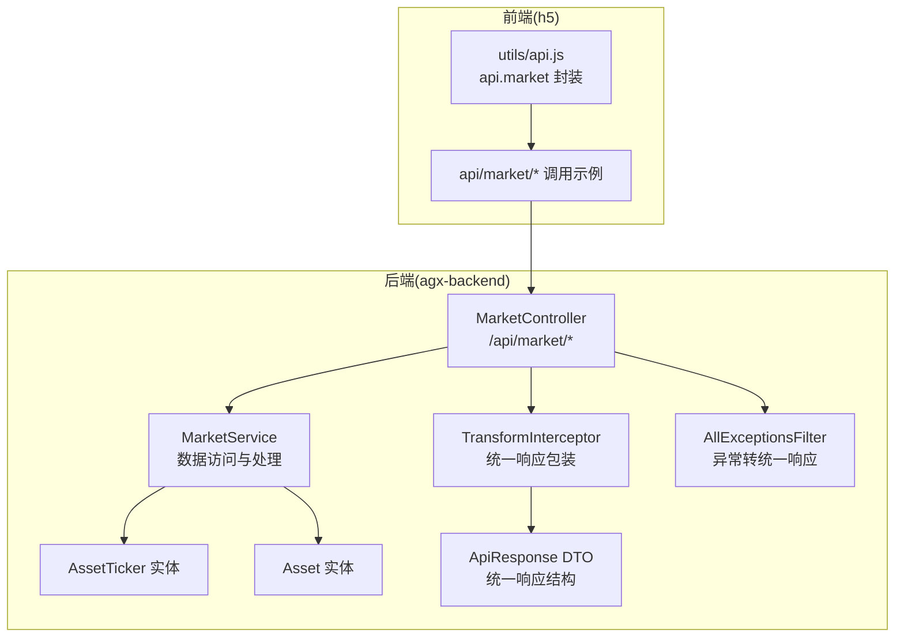
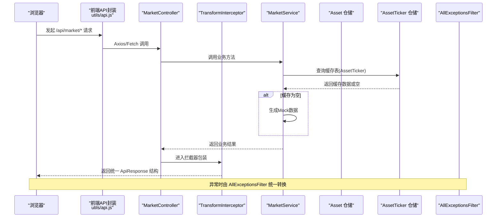
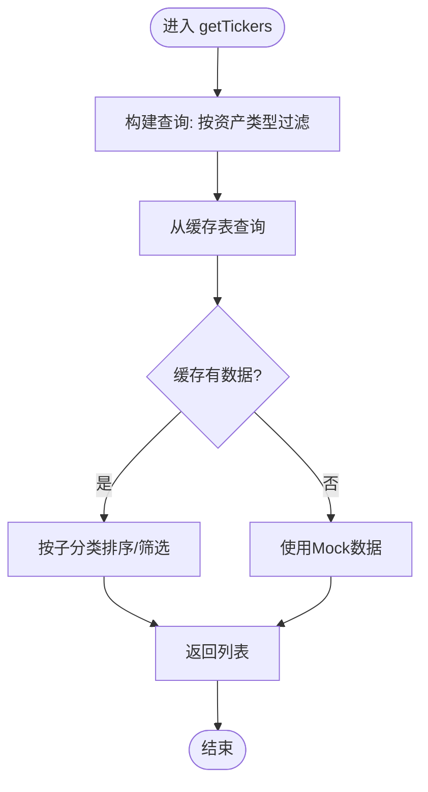
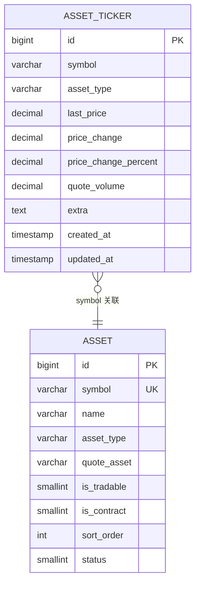
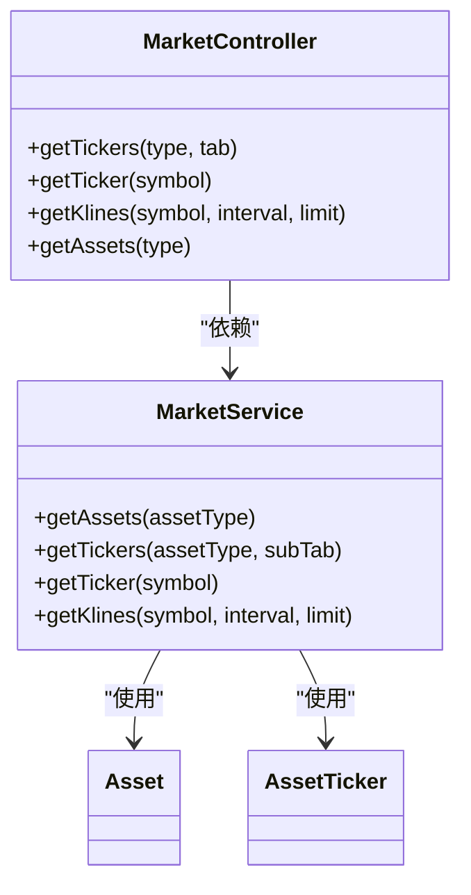

# 市场行情REST API

<cite>
**本文引用的文件**
- [market.controller.ts](file://agx-backend/src/modules/market/market.controller.ts)
- [market.service.ts](file://agx-backend/src/modules/market/market.service.ts)
- [asset-ticker.entity.ts](file://agx-backend/src/entities/asset-ticker.entity.ts)
- [asset.entity.ts](file://agx-backend/src/entities/asset.entity.ts)
- [transform.interceptor.ts](file://agx-backend/src/common/interceptors/transform.interceptor.ts)
- [api-response.dto.ts](file://agx-backend/src/common/dto/api-response.dto.ts)
- [all-exceptions.filter.ts](file://agx-backend/src/common/filters/all-exceptions.filter.ts)
- [api.js](file://h5/src/utils/api.js)
- [market.js](file://h5/src/api/market.js)
- [nginx.conf](file://h5/nginx.conf)
</cite>

## 目录
1. [简介](#简介)
2. [项目结构](#项目结构)
3. [核心组件](#核心组件)
4. [架构总览](#架构总览)
5. [详细组件分析](#详细组件分析)
6. [依赖关系分析](#依赖关系分析)
7. [性能考虑](#性能考虑)
8. [故障排查指南](#故障排查指南)
9. [结论](#结论)
10. [附录](#附录)

## 简介
本文件面向开发者，系统化梳理市场行情REST API，重点覆盖以下内容：
- MarketController中定义的HTTP端点、查询参数与统一响应格式
- MarketService的数据获取与处理流程，包括数据库交互与缓存策略
- 前端调用示例（Axios/Fetch），涵盖分页、过滤与错误处理
- 速率限制与认证策略说明
- 性能优化建议（缓存头、数据压缩）

## 项目结构
市场行情API位于后端模块“market”，通过NestJS控制器暴露HTTP端点；前端通过统一的API客户端封装调用。

图表来源
- [market.controller.ts](file://agx-backend/src/modules/market/market.controller.ts#L1-L58)
- [market.service.ts](file://agx-backend/src/modules/market/market.service.ts#L1-L209)
- [asset-ticker.entity.ts](file://agx-backend/src/entities/asset-ticker.entity.ts#L1-L66)
- [asset.entity.ts](file://agx-backend/src/entities/asset.entity.ts#L1-L80)
- [transform.interceptor.ts](file://agx-backend/src/common/interceptors/transform.interceptor.ts#L1-L25)
- [api-response.dto.ts](file://agx-backend/src/common/dto/api-response.dto.ts#L1-L68)
- [all-exceptions.filter.ts](file://agx-backend/src/common/filters/all-exceptions.filter.ts#L1-L46)
- [api.js](file://h5/src/utils/api.js#L104-L110)
- [market.js](file://h5/src/api/market.js#L1-L5)

章节来源
- [market.controller.ts](file://agx-backend/src/modules/market/market.controller.ts#L1-L58)
- [market.service.ts](file://agx-backend/src/modules/market/market.service.ts#L1-L209)
- [asset-ticker.entity.ts](file://agx-backend/src/entities/asset-ticker.entity.ts#L1-L66)
- [asset.entity.ts](file://agx-backend/src/entities/asset.entity.ts#L1-L80)
- [transform.interceptor.ts](file://agx-backend/src/common/interceptors/transform.interceptor.ts#L1-L25)
- [api-response.dto.ts](file://agx-backend/src/common/dto/api-response.dto.ts#L1-L68)
- [all-exceptions.filter.ts](file://agx-backend/src/common/filters/all-exceptions.filter.ts#L1-L46)
- [api.js](file://h5/src/utils/api.js#L104-L110)
- [market.js](file://h5/src/api/market.js#L1-L5)

## 核心组件
- MarketController：定义四个GET端点，分别用于获取行情列表、单个行情、K线数据与资产配置列表。
- MarketService：封装数据访问与处理逻辑，优先从数据库缓存表读取，空则回退到Mock数据；提供资产列表查询与K线生成。
- 统一响应与异常处理：TransformInterceptor将控制器返回包装为统一ApiResponse结构；AllExceptionsFilter将异常转换为统一错误响应。
- 前端API封装：h5侧通过utils/api.js导出行情模块封装，便于Axios/Fetch调用。

章节来源
- [market.controller.ts](file://agx-backend/src/modules/market/market.controller.ts#L1-L58)
- [market.service.ts](file://agx-backend/src/modules/market/market.service.ts#L1-L209)
- [transform.interceptor.ts](file://agx-backend/src/common/interceptors/transform.interceptor.ts#L1-L25)
- [api-response.dto.ts](file://agx-backend/src/common/dto/api-response.dto.ts#L1-L68)
- [all-exceptions.filter.ts](file://agx-backend/src/common/filters/all-exceptions.filter.ts#L1-L46)
- [api.js](file://h5/src/utils/api.js#L104-L110)

## 架构总览
下图展示从浏览器到后端控制器、服务层、实体层以及统一响应/异常处理的整体流程。

图表来源
- [market.controller.ts](file://agx-backend/src/modules/market/market.controller.ts#L1-L58)
- [market.service.ts](file://agx-backend/src/modules/market/market.service.ts#L1-L209)
- [asset-ticker.entity.ts](file://agx-backend/src/entities/asset-ticker.entity.ts#L1-L66)
- [asset.entity.ts](file://agx-backend/src/entities/asset.entity.ts#L1-L80)
- [transform.interceptor.ts](file://agx-backend/src/common/interceptors/transform.interceptor.ts#L1-L25)
- [all-exceptions.filter.ts](file://agx-backend/src/common/filters/all-exceptions.filter.ts#L1-L46)
- [api.js](file://h5/src/utils/api.js#L104-L110)

## 详细组件分析

### MarketController 端点定义与参数
- GET /api/market/tickers
  - 查询参数
    - type: 资产类型，默认值见控制器注释
    - tab: 子分类，支持 all、hot、gainers、losers、volume
  - 响应：统一 ApiResponse，data包含list数组
- GET /api/market/ticker/:symbol
  - 路径参数
    - symbol: 资产代码
  - 响应：统一 ApiResponse，data为单个行情对象
- GET /api/market/klines
  - 查询参数
    - symbol: 资产代码
    - interval: K线时间粒度，默认值见控制器注释
    - limit: K线数量，默认值见控制器注释
  - 响应：统一 ApiResponse，data包含klines二维数组
- GET /api/market/assets
  - 查询参数
    - type: 可选，资产类型
  - 响应：统一 ApiResponse，data包含list数组

章节来源
- [market.controller.ts](file://agx-backend/src/modules/market/market.controller.ts#L1-L58)

### MarketService 数据获取与处理
- getAssets(assetType?)
  - 从Asset表查询，按sortOrder升序，status=1
  - 可选按assetType过滤
- getTickers(assetType, subTab='all')
  - 从AssetTicker表按assetType查询
  - 若缓存为空，回退到Mock数据
  - 按subTab进行二次筛选与排序
- getTicker(symbol)
  - 从AssetTicker表按symbol查询
  - 若不存在，回退到Mock单条数据
- getKlines(symbol, interval='1h', limit=100)
  - 当前为Mock实现，返回固定长度K线数组
  - TODO：接入真实数据源

图表来源
- [market.service.ts](file://agx-backend/src/modules/market/market.service.ts#L1-L209)
- [asset-ticker.entity.ts](file://agx-backend/src/entities/asset-ticker.entity.ts#L1-L66)

章节来源
- [market.service.ts](file://agx-backend/src/modules/market/market.service.ts#L1-L209)
- [asset-ticker.entity.ts](file://agx-backend/src/entities/asset-ticker.entity.ts#L1-L66)
- [asset.entity.ts](file://agx-backend/src/entities/asset.entity.ts#L1-L80)

### 数据模型与索引
- AssetTicker（行情缓存表）
  - 字段要点：symbol、assetType、lastPrice、priceChange、priceChangePercent、quoteVolume、extra、createdAt/updatedAt
  - 索引：idx_symbol、idx_asset_type
- Asset（资产配置表）
  - 字段要点：symbol、name、assetType、quoteAsset、decimals、isTradable、isContract、isHot、sortOrder、status、extra
  - 索引：idx_symbol、idx_asset_type

图表来源
- [asset-ticker.entity.ts](file://agx-backend/src/entities/asset-ticker.entity.ts#L1-L66)
- [asset.entity.ts](file://agx-backend/src/entities/asset.entity.ts#L1-L80)

章节来源
- [asset-ticker.entity.ts](file://agx-backend/src/entities/asset-ticker.entity.ts#L1-L66)
- [asset.entity.ts](file://agx-backend/src/entities/asset.entity.ts#L1-L80)

### 统一响应与异常处理
- 统一响应结构
  - 成功：code=0，msg='ok'，data为业务数据
  - 失败：code为错误码，msg为错误信息
- 异常处理
  - 所有业务异常被转换为统一响应，HTTP状态码通常为200（业务错误语义化返回）
  - 未捕获异常会输出错误日志并返回通用错误信息

章节来源
- [api-response.dto.ts](file://agx-backend/src/common/dto/api-response.dto.ts#L1-L68)
- [transform.interceptor.ts](file://agx-backend/src/common/interceptors/transform.interceptor.ts#L1-L25)
- [all-exceptions.filter.ts](file://agx-backend/src/common/filters/all-exceptions.filter.ts#L1-L46)

### 前端调用示例（Axios/Fetch）
- Axios
  - 使用utils/api.js导出的apiClient封装，示例路径如下：
    - 获取行情列表：/api/market/tickers
    - 获取单个行情：/api/market/ticker/:symbol
    - 获取K线：/api/market/klines
    - 获取资产列表：/api/market/assets
- Fetch
  - 可参考Axios封装方式，自行构造fetch请求，注意处理统一响应结构

章节来源
- [api.js](file://h5/src/utils/api.js#L104-L110)
- [market.js](file://h5/src/api/market.js#L1-L5)

## 依赖关系分析
- 控制器依赖服务：MarketController依赖MarketService
- 服务依赖仓储：MarketService注入Asset与AssetTicker仓储
- 统一响应：TransformInterceptor自动包装控制器返回
- 异常处理：AllExceptionsFilter统一捕获异常并转换为统一响应

图表来源
- [market.controller.ts](file://agx-backend/src/modules/market/market.controller.ts#L1-L58)
- [market.service.ts](file://agx-backend/src/modules/market/market.service.ts#L1-L209)
- [asset.entity.ts](file://agx-backend/src/entities/asset.entity.ts#L1-L80)
- [asset-ticker.entity.ts](file://agx-backend/src/entities/asset-ticker.entity.ts#L1-L66)

章节来源
- [market.controller.ts](file://agx-backend/src/modules/market/market.controller.ts#L1-L58)
- [market.service.ts](file://agx-backend/src/modules/market/market.service.ts#L1-L209)
- [asset.entity.ts](file://agx-backend/src/entities/asset.entity.ts#L1-L80)
- [asset-ticker.entity.ts](file://agx-backend/src/entities/asset-ticker.entity.ts#L1-L66)

## 性能考虑
- 缓存策略
  - 缓存表：AssetTicker作为实时/历史行情缓存，优先命中缓存；缓存为空时回退Mock数据，降低数据库压力
  - 建议：在缓存表上建立合适索引（idx_symbol、idx_asset_type）以提升查询性能
- 响应包装与异常处理
  - 统一响应结构减少前端分支判断成本
  - 异常统一转换避免重复错误处理逻辑
- 前端缓存与压缩
  - Nginx已开启gzip压缩，有助于减小响应体积
  - 建议前端对静态资源设置长缓存头，对动态API根据场景设置合理的Cache-Control
- 数据压缩
  - 前端可结合gzip/br等传输层压缩，后端可考虑启用压缩中间件（如Express的compression）
- K线数据
  - 当前getKlines为Mock实现，建议后续接入真实数据源并增加分页/限流控制

章节来源
- [market.service.ts](file://agx-backend/src/modules/market/market.service.ts#L1-L209)
- [asset-ticker.entity.ts](file://agx-backend/src/entities/asset-ticker.entity.ts#L1-L66)
- [nginx.conf](file://h5/nginx.conf#L1-L34)

## 故障排查指南
- 常见问题
  - 参数错误：统一响应中的code可能为参数错误码，检查查询参数类型与默认值
  - 未登录/无权限：若涉及鉴权，需确认令牌有效性与权限范围
  - 业务异常：业务层抛出的异常会被统一转换为统一响应结构，查看msg定位问题
- 排查步骤
  - 检查控制器入参与默认值
  - 检查服务层缓存命中情况与Mock回退逻辑
  - 查看统一响应结构与异常过滤器输出
- 前端处理
  - Axios/Fetch需解析统一响应结构，区分code与data
  - 对业务错误与网络错误分别处理

章节来源
- [api-response.dto.ts](file://agx-backend/src/common/dto/api-response.dto.ts#L1-L68)
- [all-exceptions.filter.ts](file://agx-backend/src/common/filters/all-exceptions.filter.ts#L1-L46)
- [market.controller.ts](file://agx-backend/src/modules/market/market.controller.ts#L1-L58)

## 结论
- MarketController提供了清晰的市场行情API端点，参数与响应结构统一，便于前后端协作
- MarketService采用缓存优先策略，空则回退Mock，兼顾可用性与性能
- 统一响应与异常处理机制简化了前端错误处理，提升了稳定性
- 建议后续完善K线真实数据接入、增加速率限制与鉴权策略，并持续优化缓存与压缩策略

## 附录

### API端点一览与示例
- GET /api/market/tickers
  - 查询参数：type、tab
  - 示例：/api/market/tickers?type=crypto&tab=all
- GET /api/market/ticker/:symbol
  - 示例：/api/market/ticker/BTCUSDT
- GET /api/market/klines
  - 查询参数：symbol、interval、limit
  - 示例：/api/market/klines?symbol=BTCUSDT&interval=1h&limit=100
- GET /api/market/assets
  - 查询参数：type
  - 示例：/api/market/assets?type=crypto

章节来源
- [market.controller.ts](file://agx-backend/src/modules/market/market.controller.ts#L1-L58)
- [api.js](file://h5/src/utils/api.js#L104-L110)