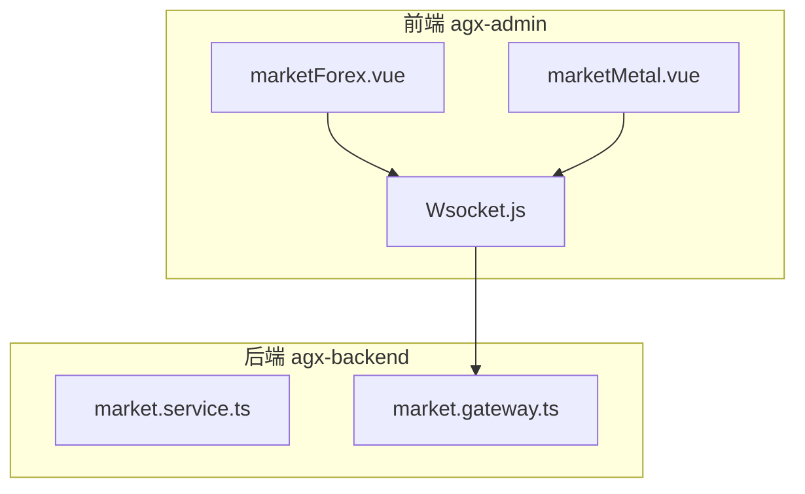
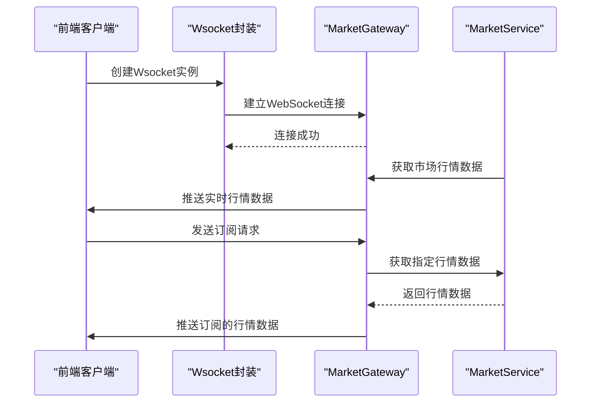
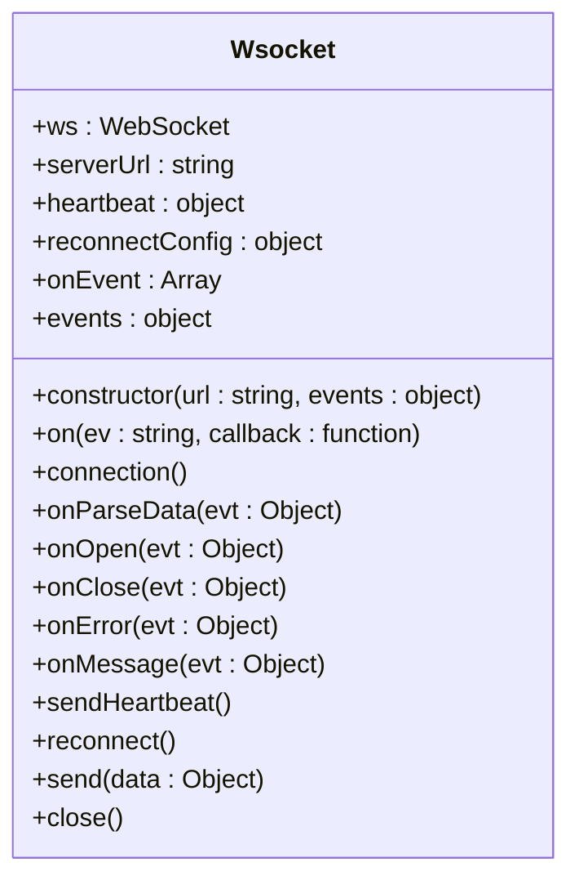
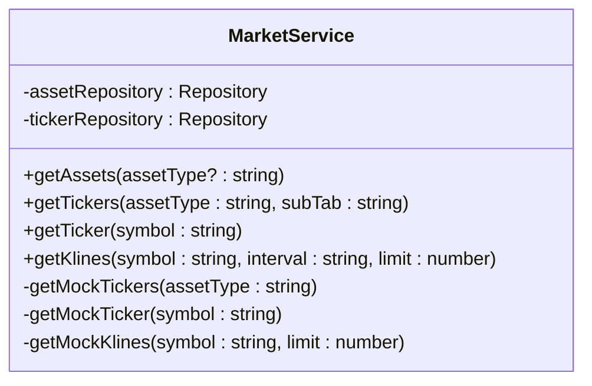
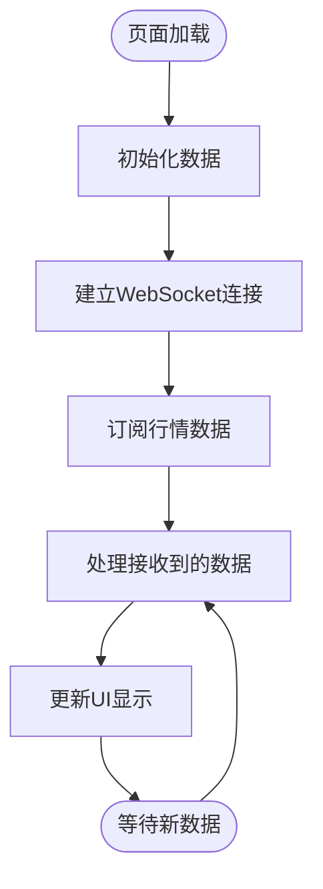
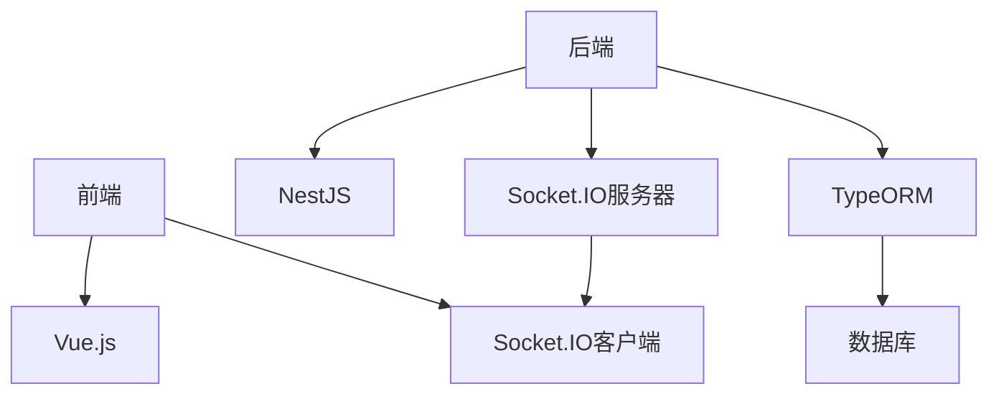

# 市场行情WebSocket实时通信

<cite>
**本文档引用文件**  
- [Wsocket.js](file://agx-admin/src/utils/Wsocket.js)
- [market.service.ts](file://agx-backend/src/modules/market/market.service.ts)
- [message.js](file://agx-admin/src/ws-serve/message.js)
- [marketForex.vue](file://agx-admin/src/views/agx/marketForex.vue)
- [marketMetal.vue](file://agx-admin/src/views/agx/marketMetal.vue)
</cite>

## 目录
1. [简介](#简介)
2. [项目结构](#项目结构)
3. [核心组件](#核心组件)
4. [架构概述](#架构概述)
5. [详细组件分析](#详细组件分析)
6. [依赖分析](#依赖分析)
7. [性能考虑](#性能考虑)
8. [故障排除指南](#故障排除指南)
9. [结论](#结论)

## 简介
本文档详细说明了市场行情WebSocket API的实现，重点介绍MarketGateway提供的实时通信功能。文档涵盖了WebSocket连接的建立过程、消息协议格式（包括订阅、取消订阅和数据推送消息类型）以及事件处理机制。同时解释了MarketService如何与MarketGateway协作，实现高效的消息广播和连接管理。为前端开发者提供使用Socket.IO客户端连接和处理实时行情数据的完整示例，包括错误重连和心跳检测。最后探讨在高并发场景下的性能优化策略，如频道分区、消息压缩和负载均衡。

## 项目结构
项目包含前后端两个主要部分，前端位于agx-admin目录，后端位于agx-backend目录。前端使用Vue.js框架，通过WebSocket与后端进行实时通信。后端使用NestJS框架，通过Socket.IO实现WebSocket服务。

**图示来源**  
- [Wsocket.js](file://agx-admin/src/utils/Wsocket.js)
- [market.service.ts](file://agx-backend/src/modules/market/market.service.ts)
- [marketForex.vue](file://agx-admin/src/views/agx/marketForex.vue)
- [marketMetal.vue](file://agx-admin/src/views/agx/marketMetal.vue)

**本节来源**  
- [Wsocket.js](file://agx-admin/src/utils/Wsocket.js)
- [market.service.ts](file://agx-backend/src/modules/market/market.service.ts)

## 核心组件
系统的核心组件包括前端的Wsocket封装类和后端的MarketGateway与MarketService。Wsocket类封装了WebSocket的连接、心跳、重连等基础功能。MarketService负责提供市场行情数据，而MarketGateway则负责通过WebSocket将这些数据实时推送给客户端。

**本节来源**  
- [Wsocket.js](file://agx-admin/src/utils/Wsocket.js)
- [market.service.ts](file://agx-backend/src/modules/market/market.service.ts)

## 架构概述
系统采用典型的客户端-服务器架构，前端通过WebSocket与后端建立持久连接，后端通过MarketGateway将市场行情数据实时推送给所有连接的客户端。MarketService负责从数据库或外部API获取市场行情数据，并将其提供给MarketGateway进行广播。

**图示来源**  
- [Wsocket.js](file://agx-admin/src/utils/Wsocket.js)
- [market.service.ts](file://agx-backend/src/modules/market/market.service.ts)

## 详细组件分析

### WebSocket客户端封装分析
前端的Wsocket类提供了完整的WebSocket连接管理功能，包括连接、心跳、重连和消息处理。

**图示来源**  
- [Wsocket.js](file://agx-admin/src/utils/Wsocket.js#L6-L194)

**本节来源**  
- [Wsocket.js](file://agx-admin/src/utils/Wsocket.js)

### 市场行情服务分析
MarketService提供了获取各种市场行情数据的功能，包括加密货币、外汇、股票、债券和贵金属等。

**图示来源**  
- [market.service.ts](file://agx-backend/src/modules/market/market.service.ts#L1-L208)

**本节来源**  
- [market.service.ts](file://agx-backend/src/modules/market/market.service.ts)

### 前端行情页面分析
前端的marketForex.vue和marketMetal.vue页面展示了如何使用WebSocket获取和显示实时行情数据。

**图示来源**  
- [marketForex.vue](file://agx-admin/src/views/agx/marketForex.vue)
- [marketMetal.vue](file://agx-admin/src/views/agx/marketMetal.vue)

**本节来源**  
- [marketForex.vue](file://agx-admin/src/views/agx/marketForex.vue)
- [marketMetal.vue](file://agx-admin/src/views/agx/marketMetal.vue)

## 依赖分析
系统的主要依赖包括前端的Vue.js框架和后端的NestJS框架。WebSocket通信依赖于Socket.IO库。市场行情数据依赖于数据库中的Asset和AssetTicker实体。

**图示来源**  
- [package.json](file://agx-backend/package.json)
- [package.json](file://agx-admin/package.json)

**本节来源**  
- [package.json](file://agx-backend/package.json)
- [package.json](file://agx-admin/package.json)

## 性能考虑
在高并发场景下，系统可以通过以下策略进行性能优化：
- 频道分区：将不同的行情数据分配到不同的频道，减少单个频道的消息量
- 消息压缩：对推送的消息进行压缩，减少网络传输量
- 负载均衡：使用多个WebSocket服务器实例，通过负载均衡分发连接
- 数据缓存：缓存频繁访问的行情数据，减少数据库查询
- 连接池：维护WebSocket连接池，减少连接建立的开销

## 故障排除指南
常见问题及解决方案：
- 连接失败：检查网络连接，确认WebSocket服务器地址和端口正确
- 心跳超时：调整心跳间隔，确保客户端和服务器的心跳配置匹配
- 消息丢失：检查消息序列化和反序列化过程，确保数据格式正确
- 性能下降：监控服务器资源使用情况，考虑增加服务器实例或优化代码

**本节来源**  
- [Wsocket.js](file://agx-admin/src/utils/Wsocket.js)
- [market.service.ts](file://agx-backend/src/modules/market/market.service.ts)

## 结论
本文档详细介绍了市场行情WebSocket API的实现，涵盖了从连接建立到数据推送的完整流程。通过Wsocket封装和MarketGateway的协作，系统能够高效地提供实时行情数据。前端页面展示了如何使用这些功能来构建用户友好的行情展示界面。在高并发场景下，通过合理的性能优化策略，系统能够稳定地处理大量客户端连接。