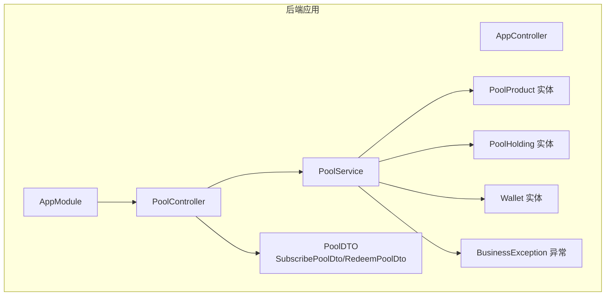
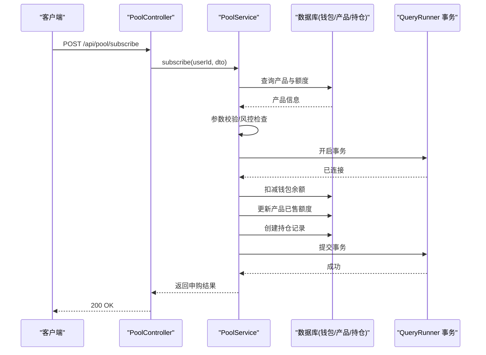
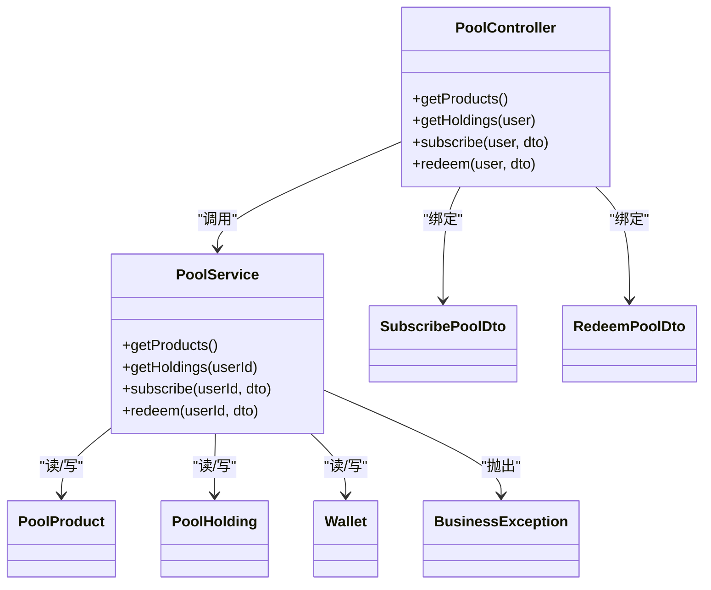
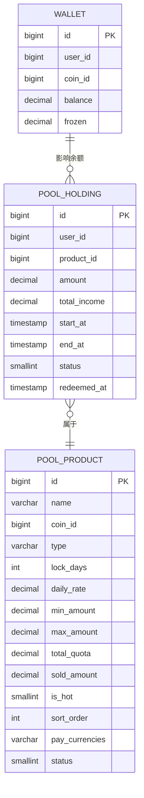

# 投资交易管理

<cite>
**本文引用的文件**
- [agx-backend/src/modules/pool/pool.controller.ts](file://agx-backend/src/modules/pool/pool.controller.ts)
- [agx-backend/src/modules/pool/pool.service.ts](file://agx-backend/src/modules/pool/pool.service.ts)
- [agx-backend/src/modules/pool/pool.dto.ts](file://agx-backend/src/modules/pool/pool.dto.ts)
- [agx-backend/src/entities/pool-product.entity.ts](file://agx-backend/src/entities/pool-product.entity.ts)
- [agx-backend/src/entities/pool-holding.entity.ts](file://agx-backend/src/entities/pool-holding.entity.ts)
- [agx-backend/src/entities/wallet.entity.ts](file://agx-backend/src/entities/wallet.entity.ts)
- [agx-backend/src/common/filters/business.exception.ts](file://agx-backend/src/common/filters/business.exception.ts)
- [agx-backend/src/app.module.ts](file://agx-backend/src/app.module.ts)
- [agx-backend/src/modules/contract/contract.dto.ts](file://agx-backend/src/modules/contract/contract.dto.ts)
- [agx-backend/src/modules/contract/contract.service.ts](file://agx-backend/src/modules/contract/contract.service.ts)
</cite>

## 目录
1. [简介](#简介)
2. [项目结构](#项目结构)
3. [核心组件](#核心组件)
4. [架构总览](#架构总览)
5. [详细组件分析](#详细组件分析)
6. [依赖分析](#依赖分析)
7. [性能考虑](#性能考虑)
8. [故障排查指南](#故障排查指南)
9. [结论](#结论)
10. [附录](#附录)

## 简介
本文件面向“投资交易管理”子系统，聚焦于用户投资下单与持仓管理能力，覆盖以下目标：
- 详述投资下单端点的请求参数校验、风控规则与事务处理机制
- 解释持仓记录的创建与更新流程，包括投资金额、份额计算与状态管理
- 为初学者提供投资交易入门指南（下单流程与状态查询）
- 为高级开发者探讨高并发请求处理策略、数据库事务管理与异常处理机制
- 结合PoolDTO中的数据传输对象定义，展示投资交易的数据流

## 项目结构
该系统采用 NestJS + TypeORM 的分层架构，核心围绕“矿池模块（Pool）”展开，并与“合约模块（Contract）”形成对比参考。数据库使用 PostgreSQL，实体定义清晰，服务层负责业务逻辑与事务控制。

图表来源
- [agx-backend/src/app.module.ts](file://agx-backend/src/app.module.ts#L69-L129)
- [agx-backend/src/modules/pool/pool.controller.ts](file://agx-backend/src/modules/pool/pool.controller.ts#L1-L52)
- [agx-backend/src/modules/pool/pool.service.ts](file://agx-backend/src/modules/pool/pool.service.ts#L1-L268)
- [agx-backend/src/modules/pool/pool.dto.ts](file://agx-backend/src/modules/pool/pool.dto.ts#L1-L19)
- [agx-backend/src/entities/pool-product.entity.ts](file://agx-backend/src/entities/pool-product.entity.ts#L1-L62)
- [agx-backend/src/entities/pool-holding.entity.ts](file://agx-backend/src/entities/pool-holding.entity.ts#L1-L60)
- [agx-backend/src/entities/wallet.entity.ts](file://agx-backend/src/entities/wallet.entity.ts#L1-L42)
- [agx-backend/src/common/filters/business.exception.ts](file://agx-backend/src/common/filters/business.exception.ts#L1-L60)

章节来源
- [agx-backend/src/app.module.ts](file://agx-backend/src/app.module.ts#L69-L129)

## 核心组件
- 控制器（PoolController）：暴露“获取产品列表、获取用户持仓、申购、赎回”四个端点；使用 JWT 守卫保护需鉴权的接口。
- 服务（PoolService）：实现业务逻辑与事务控制，包含参数校验、风控检查、钱包扣减/返还、产品额度更新、持仓记录创建/更新等。
- 数据传输对象（PoolDTO）：定义申购与赎回请求参数的校验规则。
- 实体（PoolProduct、PoolHolding、Wallet）：持久化模型，承载产品、持仓与钱包余额字段。
- 异常（BusinessException）：统一业务异常封装，便于前端识别与处理。

章节来源
- [agx-backend/src/modules/pool/pool.controller.ts](file://agx-backend/src/modules/pool/pool.controller.ts#L1-L52)
- [agx-backend/src/modules/pool/pool.service.ts](file://agx-backend/src/modules/pool/pool.service.ts#L1-L268)
- [agx-backend/src/modules/pool/pool.dto.ts](file://agx-backend/src/modules/pool/pool.dto.ts#L1-L19)
- [agx-backend/src/entities/pool-product.entity.ts](file://agx-backend/src/entities/pool-product.entity.ts#L1-L62)
- [agx-backend/src/entities/pool-holding.entity.ts](file://agx-backend/src/entities/pool-holding.entity.ts#L1-L60)
- [agx-backend/src/entities/wallet.entity.ts](file://agx-backend/src/entities/wallet.entity.ts#L1-L42)
- [agx-backend/src/common/filters/business.exception.ts](file://agx-backend/src/common/filters/business.exception.ts#L1-L60)

## 架构总览
下图展示了投资交易从请求到落库的关键交互路径，以及与钱包、产品表的关联。

图表来源
- [agx-backend/src/modules/pool/pool.controller.ts](file://agx-backend/src/modules/pool/pool.controller.ts#L28-L50)
- [agx-backend/src/modules/pool/pool.service.ts](file://agx-backend/src/modules/pool/pool.service.ts#L108-L194)
- [agx-backend/src/entities/wallet.entity.ts](file://agx-backend/src/entities/wallet.entity.ts#L1-L42)
- [agx-backend/src/entities/pool-product.entity.ts](file://agx-backend/src/entities/pool-product.entity.ts#L1-L62)
- [agx-backend/src/entities/pool-holding.entity.ts](file://agx-backend/src/entities/pool-holding.entity.ts#L1-L60)

## 详细组件分析

### 1) 请求参数验证与风控
- 参数校验由 DTO 完成，确保 productId、amount、holdingId 等字段为正数且满足最小值约束。
- 服务层在运行时进行更细粒度的风控检查：
  - 产品存在且状态为上架
  - 申购金额不得低于最小值，不得超过最大值（若设置）
  - 总额度剩余不足则拒绝
  - 用户钱包余额不足则拒绝
- 对赎回场景，额外检查产品类型与锁定期限，避免提前赎回。

章节来源
- [agx-backend/src/modules/pool/pool.dto.ts](file://agx-backend/src/modules/pool/pool.dto.ts#L1-L19)
- [agx-backend/src/modules/pool/pool.service.ts](file://agx-backend/src/modules/pool/pool.service.ts#L108-L194)
- [agx-backend/src/modules/pool/pool.service.ts](file://agx-backend/src/modules/pool/pool.service.ts#L196-L265)

### 2) 事务处理机制
- 使用 TypeORM 的 QueryRunner 在单次操作中开启事务，保证多步写入的一致性。
- 申购流程：扣减钱包余额 → 更新产品已售额度 → 创建持仓记录 → 提交事务。
- 赎回流程：返还本金+收益 → 更新持仓状态与实际收益 → 更新产品已售额度 → 提交事务。
- 发生异常时回滚事务并释放连接，避免脏数据。

章节来源
- [agx-backend/src/modules/pool/pool.service.ts](file://agx-backend/src/modules/pool/pool.service.ts#L146-L194)
- [agx-backend/src/modules/pool/pool.service.ts](file://agx-backend/src/modules/pool/pool.service.ts#L223-L265)

### 3) 持仓记录的创建与更新
- 创建：服务根据产品类型与锁定期限计算到期时间，初始化状态为“持仓中”，累计收益初始为 0。
- 更新：赎回时将状态置为“已赎回”，记录赎回时间，并更新实际累计收益。
- 查询：支持按用户与状态过滤，同时计算预计日/年收益与可赎回标识。

章节来源
- [agx-backend/src/entities/pool-holding.entity.ts](file://agx-backend/src/entities/pool-holding.entity.ts#L1-L60)
- [agx-backend/src/modules/pool/pool.service.ts](file://agx-backend/src/modules/pool/pool.service.ts#L55-L94)
- [agx-backend/src/modules/pool/pool.service.ts](file://agx-backend/src/modules/pool/pool.service.ts#L160-L194)
- [agx-backend/src/modules/pool/pool.service.ts](file://agx-backend/src/modules/pool/pool.service.ts#L223-L265)

### 4) 投资金额与份额计算
- 金额以高精度小数存储，避免浮点误差。
- 预计收益按“金额 × 日利率 × 天数”计算，年化收益为日收益乘以 365。
- 实际收益在赎回时按持有天数重新计算，确保准确结算。

章节来源
- [agx-backend/src/modules/pool/pool.service.ts](file://agx-backend/src/modules/pool/pool.service.ts#L96-L104)
- [agx-backend/src/modules/pool/pool.service.ts](file://agx-backend/src/modules/pool/pool.service.ts#L214-L221)

### 5) 端点与数据流（PoolDTO）
- 申购：POST /api/pool/subscribe
  - 请求体：productId、amount
  - 返回：holdingId、amount、起止时间、预计日/年收益
- 赎回：POST /api/pool/redeem
  - 请求体：holdingId
  - 返回：returnAmount、principal、income、日/年收益
- 产品列表：GET /api/pool/products
- 用户持仓：GET /api/pool/holdings（需 JWT）

章节来源
- [agx-backend/src/modules/pool/pool.controller.ts](file://agx-backend/src/modules/pool/pool.controller.ts#L1-L52)
- [agx-backend/src/modules/pool/pool.dto.ts](file://agx-backend/src/modules/pool/pool.dto.ts#L1-L19)

### 6) 入门指南（初学者）
- 下单流程
  1) 获取产品列表，确认产品类型、日利率、锁定期限与额度
  2) 准备足够余额，调用申购接口提交订单
  3) 查看持仓列表，确认状态与预计收益
- 状态查询
  - 活期产品可随时赎回；定期产品需到期后方可赎回
  - 可通过“用户持仓”接口查看可赎回标识与累计收益

章节来源
- [agx-backend/src/modules/pool/pool.controller.ts](file://agx-backend/src/modules/pool/pool.controller.ts#L14-L26)
- [agx-backend/src/modules/pool/pool.service.ts](file://agx-backend/src/modules/pool/pool.service.ts#L55-L94)

### 7) 高级主题（高级开发者）
- 高并发处理策略
  - 使用 QueryRunner 确保单笔交易原子性
  - 对热点产品与钱包读写加索引，减少锁竞争
  - 可引入队列异步处理收益结算（如赎回后的收益发放）
- 数据库事务管理
  - 严格区分“申购/赎回”两条路径，分别控制余额与额度变更
  - 异常时务必回滚并释放连接，避免资源泄漏
- 异常处理机制
  - 统一抛出 BusinessException，便于前端识别与提示
  - 错误码与消息分离，利于国际化与前端统一处理

章节来源
- [agx-backend/src/common/filters/business.exception.ts](file://agx-backend/src/common/filters/business.exception.ts#L1-L60)
- [agx-backend/src/modules/pool/pool.service.ts](file://agx-backend/src/modules/pool/pool.service.ts#L146-L194)
- [agx-backend/src/modules/pool/pool.service.ts](file://agx-backend/src/modules/pool/pool.service.ts#L223-L265)

### 8) 对比参考：合约下单（Contract）
- 合约下单同样采用 DTO 参数校验与事务处理，但涉及方向选择与到期结算的定时任务。
- 两者共同点：均使用 QueryRunner 管理事务，均对余额与限额进行风控检查。

章节来源
- [agx-backend/src/modules/contract/contract.dto.ts](file://agx-backend/src/modules/contract/contract.dto.ts#L1-L15)
- [agx-backend/src/modules/contract/contract.service.ts](file://agx-backend/src/modules/contract/contract.service.ts#L73-L116)
- [agx-backend/src/modules/contract/contract.service.ts](file://agx-backend/src/modules/contract/contract.service.ts#L138-L160)

## 依赖分析
- 控制器依赖服务，服务依赖实体与数据源（DataSource），控制器与 DTO 之间通过装饰器绑定。
- AppModule 集中配置 TypeORM，加载所有实体，确保服务层能访问对应仓库。

图表来源
- [agx-backend/src/modules/pool/pool.controller.ts](file://agx-backend/src/modules/pool/pool.controller.ts#L1-L52)
- [agx-backend/src/modules/pool/pool.service.ts](file://agx-backend/src/modules/pool/pool.service.ts#L1-L268)
- [agx-backend/src/modules/pool/pool.dto.ts](file://agx-backend/src/modules/pool/pool.dto.ts#L1-L19)
- [agx-backend/src/entities/pool-product.entity.ts](file://agx-backend/src/entities/pool-product.entity.ts#L1-L62)
- [agx-backend/src/entities/pool-holding.entity.ts](file://agx-backend/src/entities/pool-holding.entity.ts#L1-L60)
- [agx-backend/src/entities/wallet.entity.ts](file://agx-backend/src/entities/wallet.entity.ts#L1-L42)
- [agx-backend/src/common/filters/business.exception.ts](file://agx-backend/src/common/filters/business.exception.ts#L1-L60)

章节来源
- [agx-backend/src/app.module.ts](file://agx-backend/src/app.module.ts#L69-L129)

## 性能考虑
- 事务粒度：将“余额变更、额度更新、持仓创建/更新”放在同一事务内，降低锁竞争与一致性成本。
- 索引设计：实体中已为关键字段建立索引（如用户ID、产品ID、状态、类型），有助于查询与更新性能。
- 数值精度：使用高精度小数存储金额与收益，避免浮点误差导致的统计偏差。
- 并发控制：建议在热点产品申购/赎回处增加幂等与限流策略，防止超卖或超买。

[本节为通用性能建议，不直接分析具体文件]

## 故障排查指南
- 常见业务异常
  - 产品不存在或已下架
  - 申购金额小于最小值或大于最大值
  - 额度不足
  - 余额不足
  - 持仓不存在
  - 定期产品未到期不可赎回
- 排查步骤
  - 确认产品状态与额度剩余
  - 核对用户钱包余额与币种匹配
  - 检查锁定期限与产品类型
  - 观察事务是否成功提交，必要时查看数据库日志
- 异常处理
  - 统一捕获 BusinessException 并返回标准响应
  - 对数据库异常进行回滚与重试策略评估

章节来源
- [agx-backend/src/modules/pool/pool.service.ts](file://agx-backend/src/modules/pool/pool.service.ts#L108-L194)
- [agx-backend/src/modules/pool/pool.service.ts](file://agx-backend/src/modules/pool/pool.service.ts#L196-L265)
- [agx-backend/src/common/filters/business.exception.ts](file://agx-backend/src/common/filters/business.exception.ts#L1-L60)

## 结论
本系统通过清晰的 DTO 校验、严格的风控与严谨的事务处理，实现了稳健的投资下单与持仓管理。对于高并发场景，建议结合限流、队列与缓存策略进一步优化吞吐量与稳定性。同时，保持错误码与消息的统一规范，有助于提升用户体验与运维效率。

[本节为总结性内容，不直接分析具体文件]

## 附录

### A. 数据模型概览

图表来源
- [agx-backend/src/entities/pool-product.entity.ts](file://agx-backend/src/entities/pool-product.entity.ts#L1-L62)
- [agx-backend/src/entities/pool-holding.entity.ts](file://agx-backend/src/entities/pool-holding.entity.ts#L1-L60)
- [agx-backend/src/entities/wallet.entity.ts](file://agx-backend/src/entities/wallet.entity.ts#L1-L42)

### B. API 端点一览
- GET /api/pool/products
  - 功能：获取矿池产品列表
  - 权限：公开
- GET /api/pool/holdings
  - 功能：获取用户持仓
  - 权限：JWT
- POST /api/pool/subscribe
  - 功能：申购矿池
  - 权限：JWT
  - 请求体：productId、amount
- POST /api/pool/redeem
  - 功能：赎回矿池
  - 权限：JWT
  - 请求体：holdingId

章节来源
- [agx-backend/src/modules/pool/pool.controller.ts](file://agx-backend/src/modules/pool/pool.controller.ts#L14-L50)