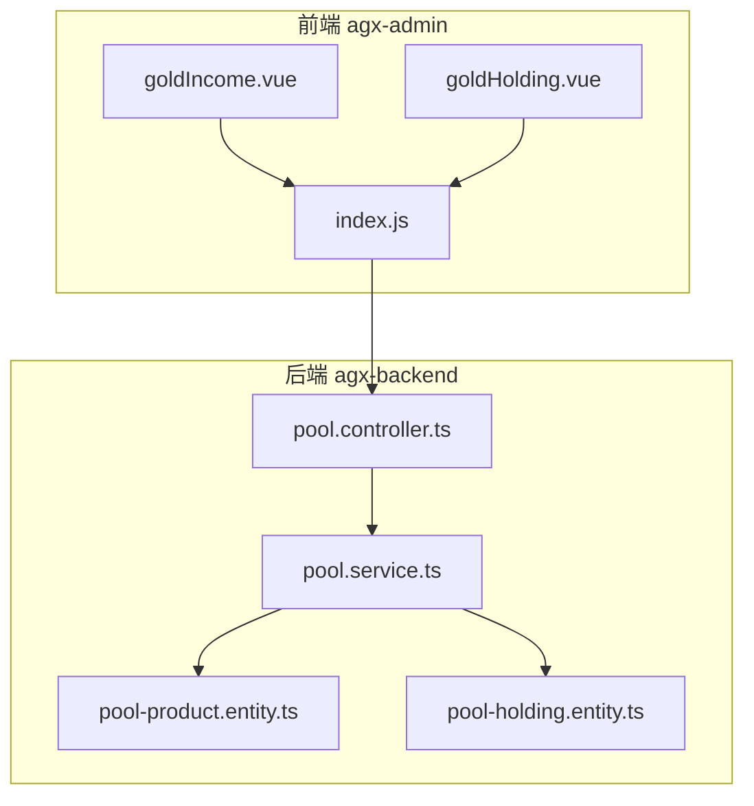
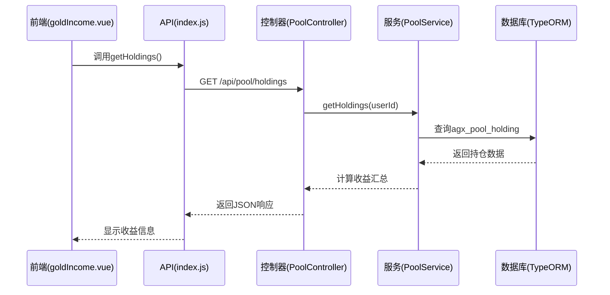
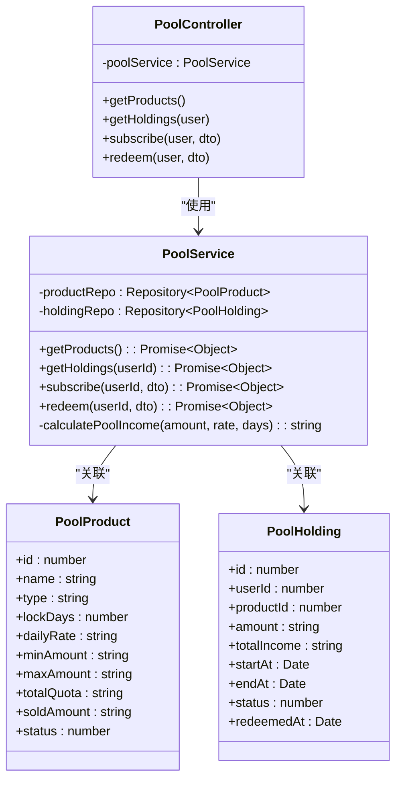
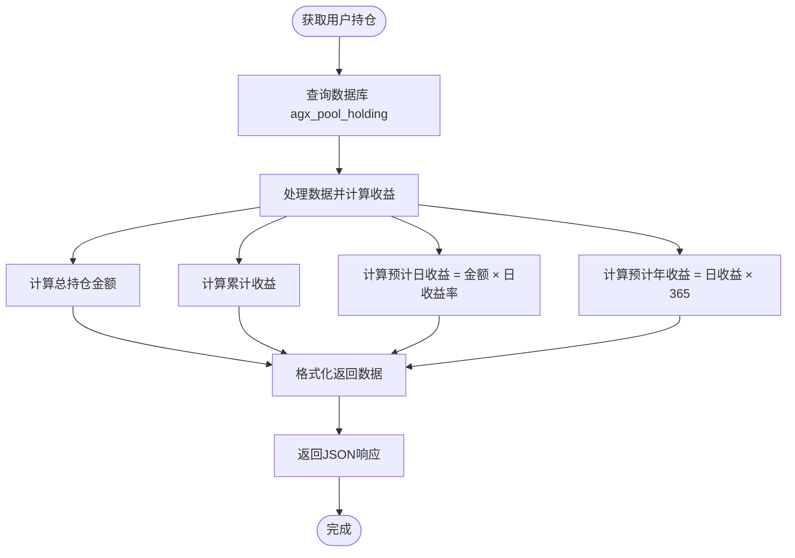
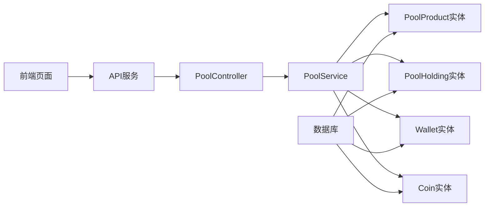

# 收益查询管理

<cite>
**本文档引用文件**  
- [pool.controller.ts](file://agx-backend/src/modules/pool/pool.controller.ts)
- [pool.service.ts](file://agx-backend/src/modules/pool/pool.service.ts)
- [pool-product.entity.ts](file://agx-backend/src/entities/pool-product.entity.ts)
- [pool-holding.entity.ts](file://agx-backend/src/entities/pool-holding.entity.ts)
- [goldIncome.vue](file://agx-admin/src/views/agx/goldIncome.vue)
- [goldHolding.vue](file://agx-admin/src/views/agx/goldHolding.vue)
- [index.js](file://agx-admin/src/api/agx/index.js)
</cite>

## 目录
1. [简介](#简介)
2. [项目结构](#项目结构)
3. [核心组件](#核心组件)
4. [架构概述](#架构概述)
5. [详细组件分析](#详细组件分析)
6. [依赖分析](#依赖分析)
7. [性能考虑](#性能考虑)
8. [故障排除指南](#故障排除指南)
9. [结论](#结论)

## 简介
本API文档聚焦于用户投资收益的计算与查询功能，涵盖实时收益计算、历史收益记录和收益分配状态。文档详细说明了收益查询端点的实现逻辑，包括收益计算算法（如日化收益率应用、复利计算和手续费扣除规则），并结合持仓实体中的字段定义，阐明收益相关数据的存储结构。为初学者提供收益查询的入门指南，同时为高级开发者探讨性能优化策略。

## 项目结构
项目分为前后端两个主要部分：`agx-backend` 提供RESTful API服务，`agx-admin` 为管理后台前端。收益查询功能主要集中在 `agx-backend/src/modules/pool` 模块中，涉及矿池产品、用户持仓及收益计算逻辑。

**图表来源**  
- [goldIncome.vue](file://agx-admin/src/views/agx/goldIncome.vue)
- [goldHolding.vue](file://agx-admin/src/views/agx/goldHolding.vue)
- [index.js](file://agx-admin/src/api/agx/index.js)
- [pool.controller.ts](file://agx-backend/src/modules/pool/pool.controller.ts)
- [pool.service.ts](file://agx-backend/src/modules/pool/pool.service.ts)

**章节来源**
- [pool.controller.ts](file://agx-backend/src/modules/pool/pool.controller.ts)
- [pool.service.ts](file://agx-backend/src/modules/pool/pool.service.ts)

## 核心组件
核心组件包括矿池产品管理、用户持仓查询、收益计算服务和前端展示页面。后端通过NestJS框架实现REST API，使用TypeORM进行数据库操作，前端使用Vue3 + Arco Design构建管理界面。

**章节来源**
- [pool.controller.ts](file://agx-backend/src/modules/pool/pool.controller.ts)
- [pool.service.ts](file://agx-backend/src/modules/pool/pool.service.ts)
- [goldIncome.vue](file://agx-admin/src/views/agx/goldIncome.vue)

## 架构概述
系统采用典型的前后端分离架构，前端通过HTTP请求调用后端API获取收益数据，后端负责业务逻辑处理和数据库交互。

**图表来源**  
- [pool.controller.ts](file://agx-backend/src/modules/pool/pool.controller.ts)
- [pool.service.ts](file://agx-backend/src/modules/pool/pool.service.ts)
- [goldIncome.vue](file://agx-admin/src/views/agx/goldIncome.vue)

## 详细组件分析

### 矿池收益查询分析
该功能实现了用户投资收益的完整生命周期管理，包括产品展示、持仓查询、申购赎回和收益计算。

#### 类图

**图表来源**  
- [pool-product.entity.ts](file://agx-backend/src/entities/pool-product.entity.ts)
- [pool-holding.entity.ts](file://agx-backend/src/entities/pool-holding.entity.ts)
- [pool.service.ts](file://agx-backend/src/modules/pool/pool.service.ts)
- [pool.controller.ts](file://agx-backend/src/modules/pool/pool.controller.ts)

#### 收益计算流程

**图表来源**  
- [pool.service.ts](file://agx-backend/src/modules/pool/pool.service.ts)

**章节来源**
- [pool.service.ts](file://agx-backend/src/modules/pool/pool.service.ts)
- [pool.controller.ts](file://agx-backend/src/modules/pool/pool.controller.ts)

### 收益查询入门指南
对于初学者，可以通过以下步骤获取个人收益数据：
1. 用户登录系统，获取JWT令牌
2. 调用 `/api/pool/holdings` 端点
3. 系统返回当前用户的持仓及收益信息
4. 前端页面展示总持仓、累计收益和各产品的详细收益情况

**章节来源**
- [goldIncome.vue](file://agx-admin/src/views/agx/goldIncome.vue)
- [goldHolding.vue](file://agx-admin/src/views/agx/goldHolding.vue)

## 依赖分析
系统依赖关系清晰，各组件耦合度适中。

**图表来源**  
- [pool.service.ts](file://agx-backend/src/modules/pool/pool.service.ts)
- [pool.controller.ts](file://agx-backend/src/modules/pool/pool.controller.ts)

**章节来源**
- [pool.service.ts](file://agx-backend/src/modules/pool/pool.service.ts)

## 性能考虑
针对收益查询功能，系统采用了以下性能优化策略：
- 使用数据库索引（如`idx_user_id`、`idx_status`）加速查询
- 通过事务处理保证申购/赎回操作的原子性
- 使用decimal.js库确保高精度的财务计算
- 前端采用分页加载避免大数据量传输

**章节来源**
- [pool.service.ts](file://agx-backend/src/modules/pool/pool.service.ts)

## 故障排除指南
常见问题及解决方案：
- **无法查询收益**：检查用户登录状态和JWT令牌有效性
- **收益计算异常**：验证日收益率格式和金额精度
- **赎回失败**：确认产品类型和到期时间是否满足赎回条件
- **数据不一致**：检查事务处理逻辑和数据库约束

**章节来源**
- [pool.service.ts](file://agx-backend/src/modules/pool/pool.service.ts)
- [pool.controller.ts](file://agx-backend/src/modules/pool/pool.controller.ts)

## 结论
收益查询管理系统实现了完整的投资收益计算与展示功能，具有良好的架构设计和可扩展性。通过清晰的API接口和稳健的业务逻辑，为用户提供准确的收益信息查询服务，同时为开发者提供了可维护的代码结构。