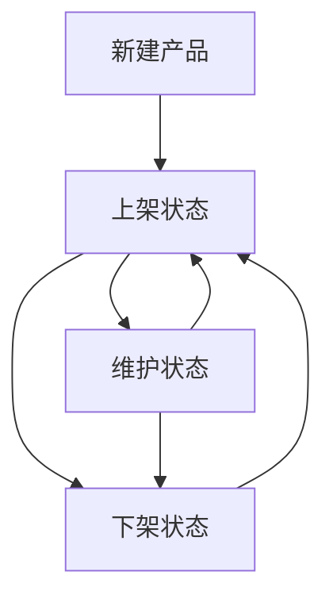
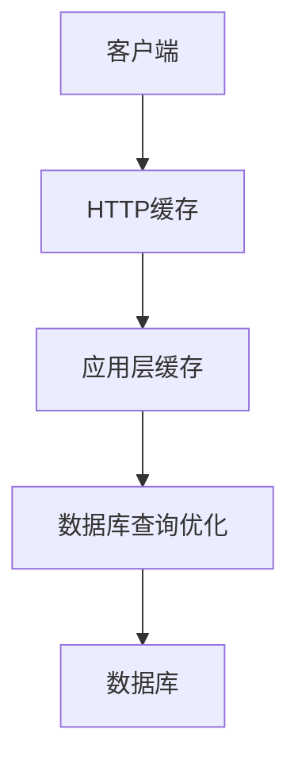
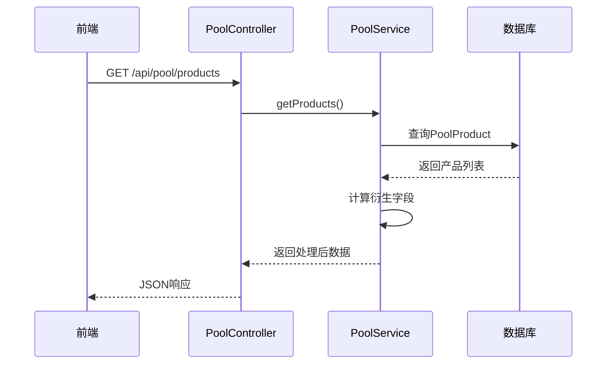

# 矿池产品管理

<cite>
**本文档引用文件**  
- [pool.controller.ts](file://agx-backend/src/modules/pool/pool.controller.ts)
- [pool.service.ts](file://agx-backend/src/modules/pool/pool.service.ts)
- [pool-product.entity.ts](file://agx-backend/src/entities/pool-product.entity.ts)
- [pool.dto.ts](file://agx-backend/src/modules/pool/pool.dto.ts)
- [pool.vue](file://agx-admin/src/views/agx/pool.vue)
- [index.js](file://agx-admin/src/api/agx/index.js)
</cite>

## 目录
1. [简介](#简介)
2. [核心功能概述](#核心功能概述)
3. [矿池产品列表接口](#矿池产品列表接口)
4. [矿池产品生命周期管理](#矿池产品生命周期管理)
5. [矿池产品配置入门指南](#矿池产品配置入门指南)
6. [缓存策略与性能优化](#缓存策略与性能优化)
7. [数据处理流程分析](#数据处理流程分析)
8. [错误处理与业务异常](#错误处理与业务异常)
9. [总结](#总结)

## 简介

矿池产品管理系统是数字资产增值服务的核心模块，提供活期与定期矿池产品的创建、查询和状态管理功能。系统通过RESTful API为前端应用提供数据支持，同时具备完整的管理后台用于产品配置和运营监控。本系统支持多币种投资、额度控制、收益计算等核心功能，满足用户多样化的理财需求。

## 核心功能概述

矿池产品管理模块主要包含三大核心功能：产品创建与配置、产品信息查询和产品状态管理。系统通过`PoolController`暴露REST API接口，由`PoolService`处理业务逻辑，数据持久化通过TypeORM与数据库交互。前端管理界面`pool.vue`提供可视化操作界面，支持产品增删改查和状态切换。

**本节来源**  
- [pool.controller.ts](file://agx-backend/src/modules/pool/pool.controller.ts#L7-L51)
- [pool.service.ts](file://agx-backend/src/modules/pool/pool.service.ts#L9-L267)
- [pool.vue](file://agx-admin/src/views/agx/pool.vue#L1-L341)

## 矿池产品列表接口

### 请求信息
- **端点**: `GET /api/pool/products`
- **认证**: 无需登录
- **用途**: 获取所有上架状态的矿池产品列表

### 响应模型
响应数据包含产品列表，每个产品包含以下字段：

| 字段 | 类型 | 描述 | 示例 |
|------|------|------|------|
| id | 整数 | 产品唯一标识 | 1 |
| name | 字符串 | 产品名称 | USDT活期宝 |
| type | 字符串 | 产品类型（flexible:活期, fixed:定期） | flexible |
| lockDays | 整数 | 锁定天数，0表示活期 | 0 |
| dailyRate | 字符串 | 日收益率 | 0.005 |
| annualRate | 字符串 | 年化收益率（自动计算） | 1.825% |
| minAmount | 字符串 | 最低申购金额 | 100 |
| maxAmount | 字符串 | 最高申购金额 | 10000 |
| totalQuota | 字符串 | 总额度 | 1000000 |
| soldAmount | 字符串 | 已售额度 | 850000 |
| remainQuota | 字符串 | 剩余额度（自动计算） | 150000 |
| isHot | 布尔值 | 是否为热门产品 | true |

### 示例响应
```json
{
  "list": [
    {
      "id": 1,
      "name": "USDT活期宝",
      "type": "flexible",
      "lockDays": 0,
      "dailyRate": "0.005",
      "annualRate": "1.825%",
      "minAmount": "100",
      "maxAmount": "10000",
      "totalQuota": "1000000",
      "soldAmount": "850000",
      "remainQuota": "150000",
      "isHot": true
    }
  ]
}
```

**本节来源**  
- [pool.controller.ts](file://agx-backend/src/modules/pool/pool.controller.ts#L14-L17)
- [pool.service.ts](file://agx-backend/src/modules/pool/pool.service.ts#L31-L52)
- [pool-product.entity.ts](file://agx-backend/src/entities/pool-product.entity.ts#L10-L61)

## 矿池产品生命周期管理

矿池产品通过状态字段实现完整的生命周期管理，状态转换遵循严格的业务规则。

### 状态定义
- **上架 (1)**: 产品对用户可见，可进行申购操作
- **下架 (0)**: 产品对用户不可见，不可申购
- **维护中**: 通过系统配置实现，限制特定操作

### 状态转换流程


### 状态管理规则
1. **上架条件**: 产品配置完整，通过审核
2. **下架条件**: 产品到期、额度售罄或运营决策
3. **维护状态**: 系统升级或风险控制需要
4. **状态切换**: 仅管理员可通过管理后台操作

### 管理后台操作
管理后台`pool.vue`提供直观的状态切换界面：
- 状态列显示"启用"/"禁用"标签
- 开关组件实现状态切换
- 搜索功能支持按状态筛选

**本节来源**  
- [pool-product.entity.ts](file://agx-backend/src/entities/pool-product.entity.ts#L52-L54)
- [pool.vue](file://agx-admin/src/views/agx/pool.vue#L70-L74)
- [index.js](file://agx-admin/src/api/agx/index.js#L72-L78)

## 矿池产品配置入门指南

### 基础配置步骤
1. **登录管理后台**: 使用管理员账号登录
2. **进入矿池管理**: 导航至"矿池管理"页面
3. **点击新增产品**: 点击"新增产品"按钮
4. **填写产品信息**: 在弹窗中填写各项配置
5. **保存配置**: 点击确定完成创建

### 必填字段说明
- **产品名称**: 显示给用户的名称，如"USDT活期宝"
- **币种ID**: 投资金币种的数据库ID
- **类型**: 选择"活期"或"定期"
- **日收益率**: 每日收益率，如0.5%输入为0.005
- **最小金额**: 用户单次申购最低金额
- **购买币种**: 支持的支付币种（USDT/CNY）

### 可选字段说明
- **最大金额**: 单用户最高申购额度
- **总额度**: 产品总发行额度
- **锁定天数**: 定期产品的锁定期（天）
- **热门标记**: 是否在首页显示HOT标签
- **排序权重**: 数值越大排序越靠前

### 配置验证
系统在保存时进行以下验证：
- 必填字段完整性检查
- 数值合理性验证
- 状态默认值设置（默认启用）

**本节来源**  
- [pool.vue](file://agx-admin/src/views/agx/pool.vue#L90-L175)
- [index.js](file://agx-admin/src/api/agx/index.js#L83-L88)
- [pool-product.entity.ts](file://agx-backend/src/entities/pool-product.entity.ts#L15-L54)

## 缓存策略与性能优化

### 缓存设计
系统采用多层缓存策略提升性能：



### 具体优化措施
1. **HTTP缓存**: 对`/api/pool/products`接口设置合理缓存头
2. **内存缓存**: 考虑使用Redis缓存热门产品列表
3. **数据库索引**: 在关键字段建立索引
4. **查询优化**: 使用`find`方法的`where`和`order`参数

### 数据库索引
```typescript
@Column({ type: 'varchar', length: 20, comment: '类型：flexible(活期) / fixed(定期)' })
@Index('idx_type')
type: string;

@Column({ type: 'smallint', default: 1, comment: '状态：0下架 1上架' })
@Index('idx_status')
status: number;
```

### 性能监控建议
- 监控接口响应时间
- 记录慢查询日志
- 定期分析数据库执行计划
- 设置缓存失效策略

**本节来源**  
- [pool.service.ts](file://agx-backend/src/modules/pool/pool.service.ts#L32-L35)
- [pool-product.entity.ts](file://agx-backend/src/entities/pool-product.entity.ts#L21-L23)
- [pool-product.entity.ts](file://agx-backend/src/entities/pool-product.entity.ts#L52-L54)

## 数据处理流程分析

### 产品数据获取流程


### 关键处理逻辑
1. **数据查询**: 从`agx_pool_product`表查询状态为1的产品
2. **数据转换**: 将数据库实体转换为DTO对象
3. **衍生计算**: 
   - 年化收益率 = 日收益率 × 365
   - 剩余额度 = 总额度 - 已售额度
4. **格式化输出**: 统一数据格式和单位

### 事务处理
申购和赎回操作使用数据库事务确保数据一致性：

```typescript
const queryRunner = this.dataSource.createQueryRunner();
await queryRunner.connect();
await queryRunner.startTransaction();
try {
  // 扣减余额
  // 更新已售额度  
  // 创建持仓
  await queryRunner.commitTransaction();
} catch (error) {
  await queryRunner.rollbackTransaction();
  throw error;
} finally {
  await queryRunner.release();
}
```

**本节来源**  
- [pool.controller.ts](file://agx-backend/src/modules/pool/pool.controller.ts#L14-L17)
- [pool.service.ts](file://agx-backend/src/modules/pool/pool.service.ts#L31-L52)
- [pool.service.ts](file://agx-backend/src/modules/pool/pool.service.ts#L146-L193)

## 错误处理与业务异常

### 常见错误码
| 错误码 | 错误信息 | 触发条件 |
|-------|--------|--------|
| 3001 | 矿池产品不存在或已下架 | 产品ID无效或状态为0 |
| 3002 | 最低申购[金额] | 申购金额小于minAmount |
| 3003 | 最高申购[金额] | 申购金额大于maxAmount |
| 3004 | 剩余额度不足 | 申购金额大于剩余额度 |
| 3005 | 余额不足 | 钱包余额不足 |
| 3006 | 持仓不存在 | 持仓ID无效 |
| 3007 | 定期产品未到期，无法赎回 | 固定期限产品未到期 |

### 异常处理机制
1. **参数验证**: 使用`class-validator`进行DTO验证
2. **业务验证**: 服务层进行业务规则检查
3. **事务回滚**: 操作失败时回滚数据库事务
4. **统一响应**: 通过`BusinessException`返回标准化错误

### 防御性编程
- 空值检查：确保关键对象不为空
- 边界检查：验证数值范围
- 状态检查：验证产品和持仓状态
- 权限检查：通过JWT验证用户身份

**本节来源**  
- [pool.service.ts](file://agx-backend/src/modules/pool/pool.service.ts#L113-L144)
- [pool.service.ts](file://agx-backend/src/modules/pool/pool.service.ts#L205-L212)
- [pool.dto.ts](file://agx-backend/src/modules/pool/pool.dto.ts#L1-L18)

## 总结

矿池产品管理系统提供了完整的数字资产管理解决方案，涵盖产品创建、查询、状态管理和交易处理等核心功能。系统采用清晰的分层架构，前端管理界面与后端API协同工作，为用户提供稳定可靠的理财服务。通过合理的缓存策略和事务处理机制，系统在保证数据一致性的同时提供了良好的性能表现。建议在生产环境中进一步优化缓存策略，增加监控告警，确保系统稳定运行。