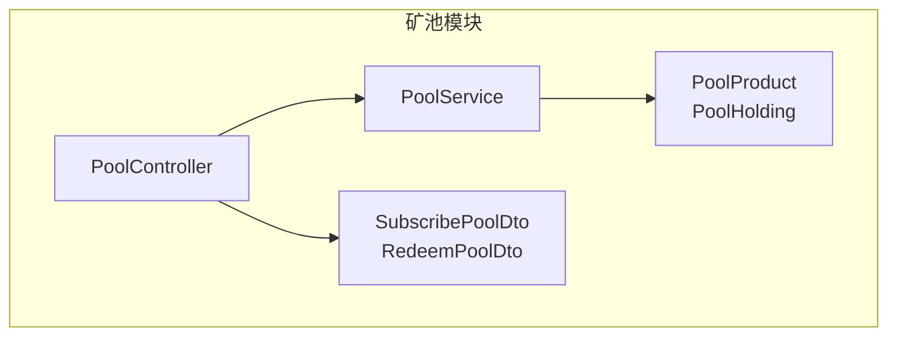
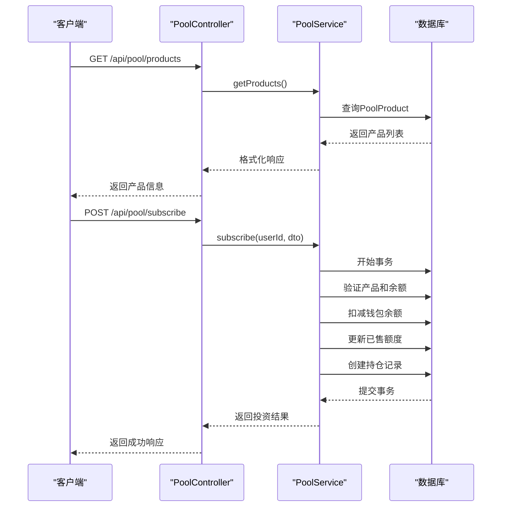
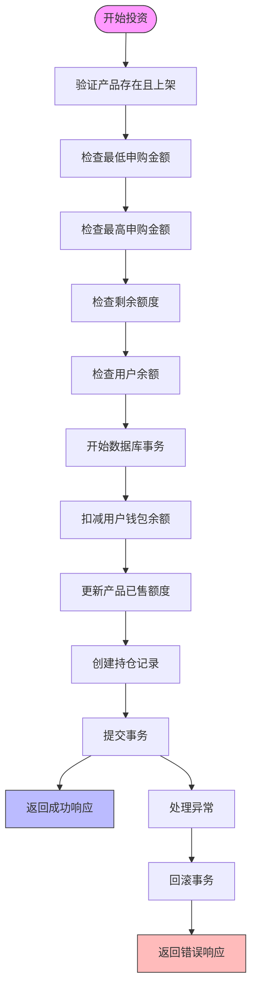
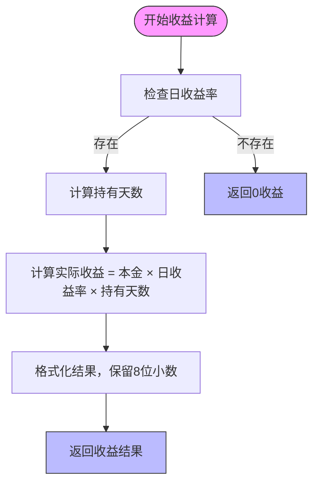
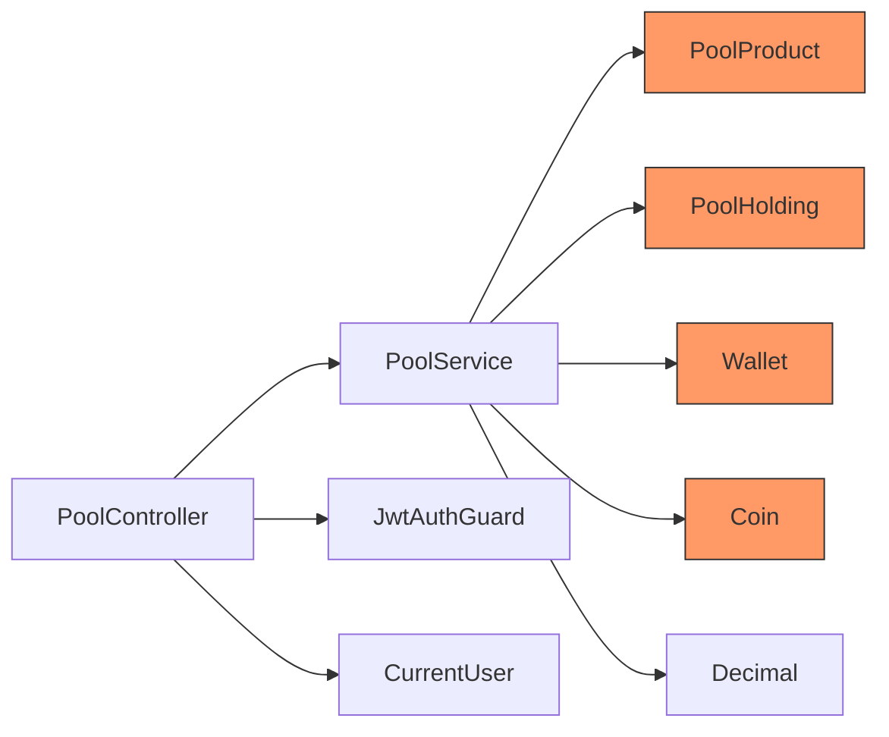

# 矿池投资API

<cite>
**本文档引用的文件**  
- [pool.controller.ts](file://agx-backend/src/modules/pool/pool.controller.ts)
- [pool.service.ts](file://agx-backend/src/modules/pool/pool.service.ts)
- [pool.dto.ts](file://agx-backend/src/modules/pool/pool.dto.ts)
- [pool-product.entity.ts](file://agx-backend/src/entities/pool-product.entity.ts)
- [pool-holding.entity.ts](file://agx-backend/src/entities/pool-holding.entity.ts)
- [wallet.entity.ts](file://agx-backend/src/entities/wallet.entity.ts)
- [coin.entity.ts](file://agx-backend/src/entities/coin.entity.ts)
- [business.exception.ts](file://agx-backend/src/common/filters/business.exception.ts)
</cite>

## 目录
1. [简介](#简介)
2. [项目结构](#项目结构)
3. [核心组件](#核心组件)
4. [架构概述](#架构概述)
5. [详细组件分析](#详细组件分析)
6. [依赖分析](#依赖分析)
7. [性能考虑](#性能考虑)
8. [故障排除指南](#故障排除指南)
9. [结论](#结论)

## 简介
本文档详细介绍了矿池投资API的功能，重点聚焦于`PoolController`中实现的矿池产品管理和用户投资功能。文档涵盖了获取矿池列表、投资下单、查询持仓和收益等核心端点的请求响应模型，深入解释了矿池的收益分配算法和投资规则。同时为初学者提供投资入门指南，为高级开发者探讨大规模投资请求处理和收益计算的性能优化策略。

## 项目结构
矿池投资功能位于`agx-backend/src/modules/pool/`目录下，采用NestJS模块化架构。该模块包含控制器、服务、数据传输对象（DTO）和实体，实现了完整的矿池投资生命周期管理。



**图示来源**  
- [pool.controller.ts](file://agx-backend/src/modules/pool/pool.controller.ts)
- [pool.service.ts](file://agx-backend/src/modules/pool/pool.service.ts)
- [pool.dto.ts](file://agx-backend/src/modules/pool/pool.dto.ts)
- [pool-product.entity.ts](file://agx-backend/src/entities/pool-product.entity.ts)
- [pool-holding.entity.ts](file://agx-backend/src/entities/pool-holding.entity.ts)

**本节来源**  
- [pool.controller.ts](file://agx-backend/src/modules/pool/pool.controller.ts)
- [pool.module.ts](file://agx-backend/src/modules/pool/pool.module.ts)

## 核心组件
核心组件包括`PoolController`、`PoolService`、`PoolProduct`和`PoolHolding`实体。`PoolController`暴露了获取产品列表、查询持仓、申购和赎回等RESTful API端点。`PoolService`实现了核心业务逻辑，包括投资规则验证、收益计算和数据库事务处理。`PoolProduct`实体定义了矿池产品的属性，而`PoolHolding`实体则记录了用户的持仓信息。

**本节来源**  
- [pool.controller.ts](file://agx-backend/src/modules/pool/pool.controller.ts#L7-L52)
- [pool.service.ts](file://agx-backend/src/modules/pool/pool.service.ts#L10-L268)
- [pool-product.entity.ts](file://agx-backend/src/entities/pool-product.entity.ts#L10-L62)

## 架构概述
系统采用典型的分层架构，由控制器层、服务层和数据访问层组成。控制器负责HTTP请求的路由和参数验证，服务层处理核心业务逻辑，数据访问层通过TypeORM与数据库交互。所有投资操作都使用数据库事务确保数据一致性。



**图示来源**  
- [pool.controller.ts](file://agx-backend/src/modules/pool/pool.controller.ts)
- [pool.service.ts](file://agx-backend/src/modules/pool/pool.service.ts)

## 详细组件分析

### PoolController分析
`PoolController`是矿池投资功能的入口点，实现了四个核心API端点。所有需要用户身份验证的端点都使用`JwtAuthGuard`保护，确保只有认证用户才能进行投资操作。

#### API端点定义
```mermaid
classDiagram
class PoolController {
+getProducts() Promise~{list : PoolProduct[]}~
+getHoldings(user : {id : number}) Promise~{totalAmount : string, list : Holding[]}~
+subscribe(user : {id : number}, dto : SubscribePoolDto) Promise~{holdingId : number, amount : string}~
+redeem(user : {id : number}, dto : RedeemPoolDto) Promise~{returnAmount : string, income : string}~
}
class SubscribePoolDto {
+productId : number
+amount : number
}
class RedeemPoolDto {
+holdingId : number
}
PoolController --> SubscribePoolDto : "使用"
PoolController --> RedeemPoolDto : "使用"
```

**图示来源**  
- [pool.controller.ts](file://agx-backend/src/modules/pool/pool.controller.ts#L7-L52)
- [pool.dto.ts](file://agx-backend/src/modules/pool/pool.dto.ts#L3-L18)

**本节来源**  
- [pool.controller.ts](file://agx-backend/src/modules/pool/pool.controller.ts#L7-L52)
- [pool.dto.ts](file://agx-backend/src/modules/pool/pool.dto.ts#L3-L18)

### PoolService分析
`PoolService`是核心业务逻辑的实现者，负责处理所有与矿池投资相关的复杂操作，包括投资规则验证、收益计算和数据库事务管理。

#### 投资流程逻辑


**图示来源**  
- [pool.service.ts](file://agx-backend/src/modules/pool/pool.service.ts#L108-L193)

**本节来源**  
- [pool.service.ts](file://agx-backend/src/modules/pool/pool.service.ts#L108-L193)

### 收益计算分析
收益计算是矿池投资的核心功能之一，系统采用精确的数学计算确保收益的准确性。

#### 收益计算算法


**图示来源**  
- [pool.service.ts](file://agx-backend/src/modules/pool/pool.service.ts#L99-L103)
- [pool.service.ts](file://agx-backend/src/modules/pool/pool.service.ts#L214-L221)

**本节来源**  
- [pool.service.ts](file://agx-backend/src/modules/pool/pool.service.ts#L99-L103)
- [pool.service.ts](file://agx-backend/src/modules/pool/pool.service.ts#L214-L221)

## 依赖分析
矿池投资模块依赖于多个核心组件和外部库，形成了一个完整的投资生态系统。



**图示来源**  
- [pool.module.ts](file://agx-backend/src/modules/pool/pool.module.ts#L7-L14)
- [pool.service.ts](file://agx-backend/src/modules/pool/pool.service.ts#L11-L21)

**本节来源**  
- [pool.module.ts](file://agx-backend/src/modules/pool/pool.module.ts#L7-L14)
- [pool.service.ts](file://agx-backend/src/modules/pool/pool.service.ts#L11-L21)

## 性能考虑
为了确保系统在高并发场景下的稳定性和性能，矿池投资模块采用了多种优化策略。

### 大规模投资请求处理
对于大规模投资请求，系统通过数据库事务和索引优化来确保数据一致性和查询性能。关键字段如`user_id`、`product_id`和`status`都建立了数据库索引，以加速查询操作。

### 收益计算性能优化
收益计算使用`decimal.js`库进行高精度数学运算，避免了浮点数计算的精度问题。同时，系统在返回响应时预计算了预计日收益和年收益，减少了客户端的计算负担。

**本节来源**  
- [pool.service.ts](file://agx-backend/src/modules/pool/pool.service.ts#L7-L8)
- [pool-holding.entity.ts](file://agx-backend/src/entities/pool-holding.entity.ts#L20-L21)
- [pool-holding.entity.ts](file://agx-backend/src/entities/pool-holding.entity.ts#L28-L29)
- [pool-holding.entity.ts](file://agx-backend/src/entities/pool-holding.entity.ts#L48-L49)

## 故障排除指南
本节分析了矿池投资模块中的错误处理机制，帮助开发者快速定位和解决问题。

### 常见错误代码
```mermaid
erDiagram
ERROR ||--o{ BUSINESS_EXCEPTION : "抛出"
BUSINESS_EXCEPTION {
int errorCode
string message
}
BUSINESS_EXCEPTION ||--o{ POOL_ERROR : "具体错误"
POOL_ERROR {
int 3001 : "矿池产品不存在或已下架"
int 3002 : "最低申购金额不足"
int 3003 : "超过最高申购金额"
int 3004 : "剩余额度不足"
int 3005 : "用户余额不足"
int 3006 : "持仓不存在"
int 3007 : "定期产品未到期，无法赎回"
}
```

**图示来源**  
- [business.exception.ts](file://agx-backend/src/common/filters/business.exception.ts#L7-L60)
- [pool.service.ts](file://agx-backend/src/modules/pool/pool.service.ts#L113-L134)
- [pool.service.ts](file://agx-backend/src/modules/pool/pool.service.ts#L205-L212)

**本节来源**  
- [business.exception.ts](file://agx-backend/src/common/filters/business.exception.ts#L7-L60)
- [pool.service.ts](file://agx-backend/src/modules/pool/pool.service.ts#L113-L134)
- [pool.service.ts](file://agx-backend/src/modules/pool/pool.service.ts#L205-L212)

## 结论
矿池投资API提供了一套完整、安全且高性能的投资管理功能。通过清晰的分层架构和严谨的业务逻辑，系统能够有效处理用户的矿池投资需求。对于初学者，系统提供了简单易用的API接口；对于高级开发者，系统的模块化设计和性能优化策略为大规模应用提供了坚实的基础。