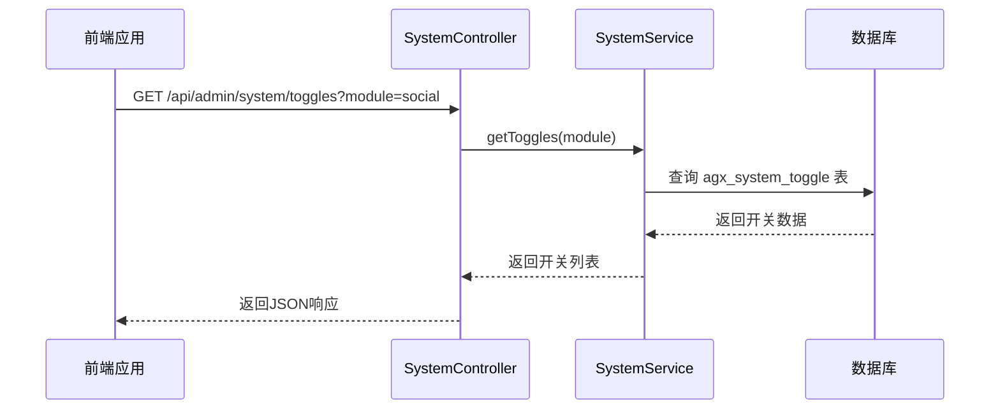
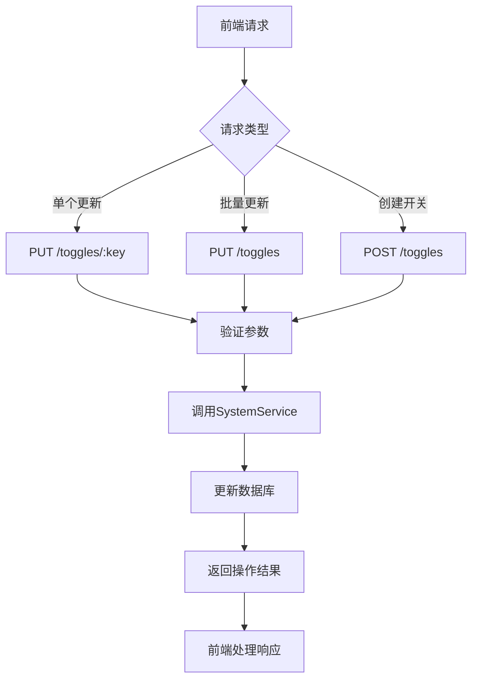
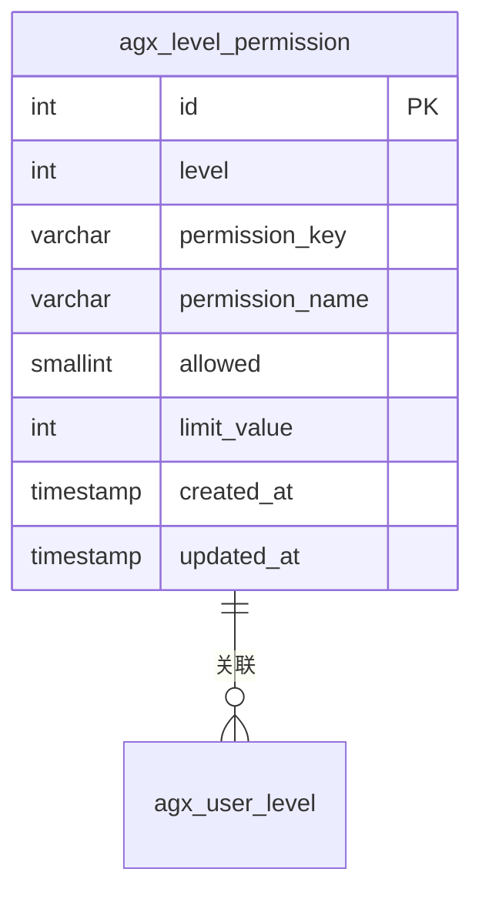
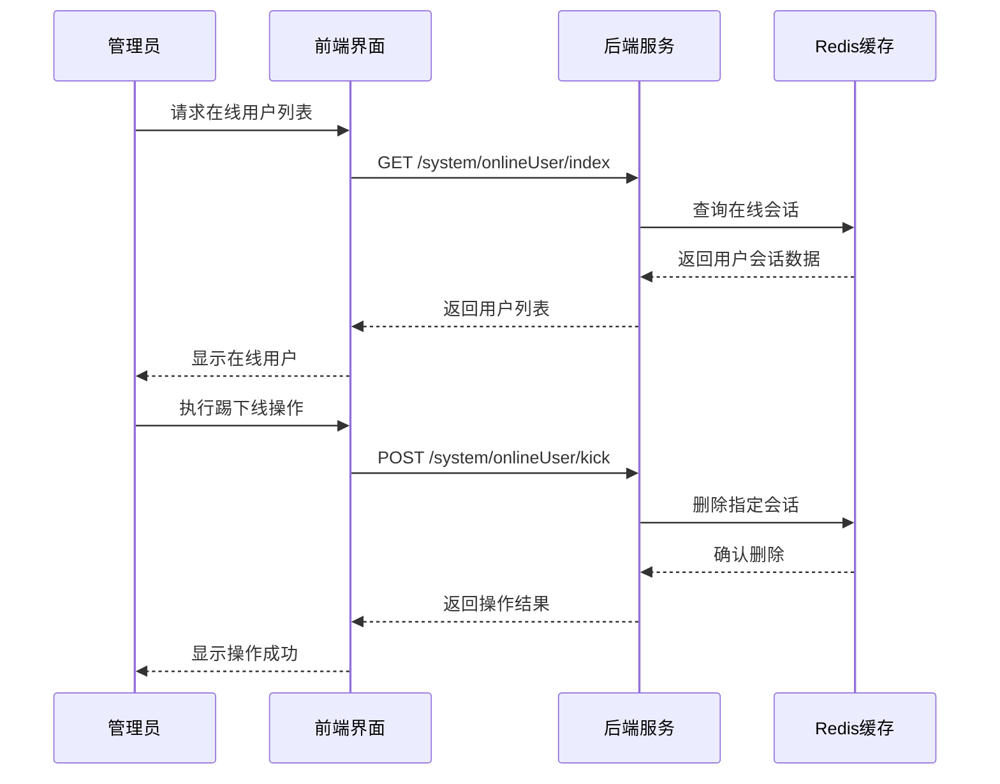
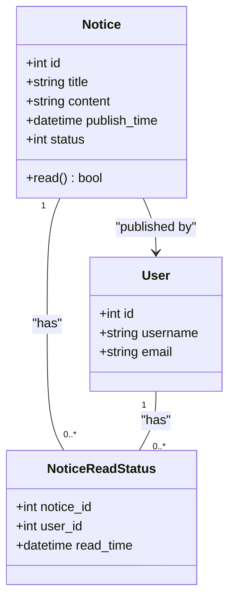
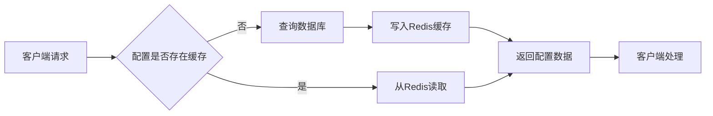

# 系统管理API

<cite>
**本文档引用文件**  
- [system.controller.ts](file://agx-backend/src/modules/system/system.controller.ts)
- [system.service.ts](file://agx-backend/src/modules/system/system.service.ts)
- [system-toggle.entity.ts](file://agx-backend/src/entities/system-toggle.entity.ts)
- [level-permission.entity.ts](file://agx-backend/src/entities/level-permission.entity.ts)
- [monitor.js](file://agx-admin/src/api/system/monitor.js)
- [notice.js](file://agx-admin/src/api/system/notice.js)
</cite>

## 目录
1. [简介](#简介)
2. [系统配置管理](#系统配置管理)
3. [系统监控功能](#系统监控功能)
4. [系统公告管理](#系统公告管理)
5. [高级功能与最佳实践](#高级功能与最佳实践)

## 简介
本API文档详细介绍了系统管理模块的核心功能，包括系统级配置、功能开关、权限矩阵、服务器监控和系统公告等关键接口。文档旨在为初学者提供清晰的使用指南，同时为高级开发者深入探讨系统配置的热更新机制和高可用性保障方案。

## 系统配置管理

### 功能开关管理
系统功能开关API允许管理员动态控制各个模块功能的开启与关闭，实现无需重启服务的实时配置更新。

#### 获取功能开关列表

**图示来源**  
- [system.controller.ts](file://agx-backend/src/modules/system/system.controller.ts#L13-L16)
- [system.service.ts](file://agx-backend/src/modules/system/system.service.ts#L18-L21)

#### 更新功能开关状态
支持单个开关更新、批量更新以及创建新开关，实现灵活的配置管理。

**图示来源**  
- [system.controller.ts](file://agx-backend/src/modules/system/system.controller.ts#L18-L44)
- [system.service.ts](file://agx-backend/src/modules/system/system.service.ts#L23-L38)

### 权限矩阵管理
系统提供基于用户等级的权限矩阵管理，支持细粒度的权限控制和限制值设置。

#### 权限矩阵数据结构

**图示来源**  
- [level-permission.entity.ts](file://agx-backend/src/entities/level-permission.entity.ts)
- [system.service.ts](file://agx-backend/src/modules/system/system.service.ts#L46-L83)

**本节来源**  
- [system.controller.ts](file://agx-backend/src/modules/system/system.controller.ts#L48-L76)
- [system.service.ts](file://agx-backend/src/modules/system/system.service.ts#L46-L112)

## 系统监控功能

### 服务器状态监控
提供全面的服务器运行状态监控，包括CPU、内存、磁盘和PHP环境等关键指标。

#### 服务器监控API接口
| 接口 | 方法 | 路径 | 描述 |
|------|------|------|------|
| 获取服务器信息 | GET | /system/server/monitor | 获取CPU、内存、磁盘等系统资源使用情况 |
| 获取缓存信息 | GET | /system/cache/monitor | 获取Redis缓存服务器状态 |
| 查看缓存内容 | POST | /system/cache/view | 根据key查看缓存具体内容 |
| 删除缓存 | DELETE | /system/cache/delete | 删除指定key的缓存 |
| 清空缓存 | DELETE | /system/cache/clear | 清空所有缓存 |

**本节来源**  
- [monitor.js](file://agx-admin/src/api/system/monitor.js)
- [system.controller.ts](file://agx-backend/src/modules/system/system.controller.ts)

### 在线用户管理
支持实时监控在线用户状态，并提供强制下线功能。

#### 在线用户操作流程

**图示来源**  
- [monitor.js](file://agx-admin/src/api/system/monitor.js#L21-L40)
- [system.controller.ts](file://agx-backend/src/modules/system/system.controller.ts)

## 系统公告管理

### 公告生命周期管理
系统公告支持完整的CRUD操作和回收站机制，确保数据安全。

#### 公告管理API
| 操作 | 方法 | 路径 | 参数 | 描述 |
|------|------|------|------|------|
| 获取公告列表 | GET | /system/notice/index | page, limit | 分页获取公告列表 |
| 添加公告 | POST | /system/notice/save | title, content | 创建新公告 |
| 更新公告 | PUT | /system/notice/update/:id | id, data | 修改现有公告 |
| 删除公告 | DELETE | /system/notice/delete | ids | 移动到回收站 |
| 恢复公告 | PUT | /system/notice/recovery | ids | 从回收站恢复 |
| 彻底删除 | DELETE | /system/notice/realDelete | ids | 永久删除公告 |

**本节来源**  
- [notice.js](file://agx-admin/src/api/system/notice.js)
- [system.controller.ts](file://agx-backend/src/modules/system/system.controller.ts)

### 公告读取状态跟踪
系统记录用户对公告的阅读状态，确保重要信息的有效传达。

**图示来源**  
- [notice.entity.ts](file://agx-backend/src/entities/notice.entity.ts)
- [notice.js](file://agx-admin/src/api/system/notice.js)

## 高级功能与最佳实践

### 动态配置加载机制
系统采用缓存策略优化配置读取性能，确保高并发场景下的响应速度。

#### 配置加载流程

**本节来源**  
- [system.service.ts](file://agx-backend/src/modules/system/system.service.ts)
- [config.entity.ts](file://agx-backend/src/entities/config.entity.ts)

### 热更新与高可用性
系统支持配置的热更新，无需重启服务即可生效，保障系统的持续可用性。

#### 热更新实现方案
1. **事件驱动机制**：当配置更新时，发布配置变更事件
2. **缓存失效策略**：自动清除相关缓存，确保数据一致性
3. **监控告警**：配置变更时记录操作日志并可选发送告警
4. **回滚机制**：支持配置版本管理，可快速回滚到历史版本

**本节来源**  
- [system.service.ts](file://agx-backend/src/modules/system/system.service.ts#L23-L43)
- [system.controller.ts](file://agx-backend/src/modules/system/system.controller.ts)